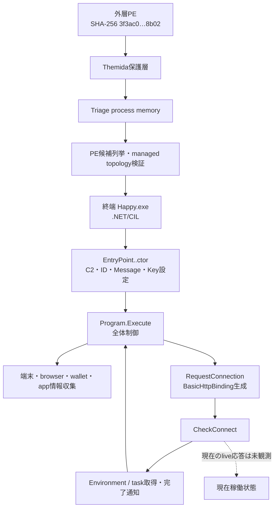
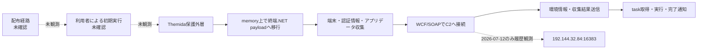
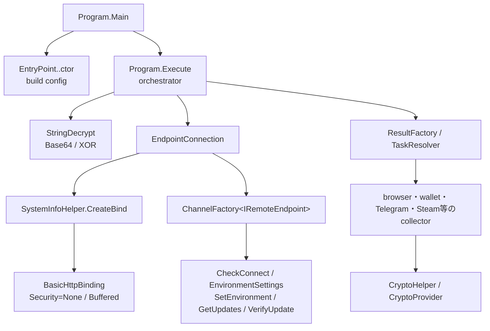

# RedLine Stealer 全体ロジック

## 実行フロー

共通phaseは`execution`、`configuration`、`discovery_and_collection`、`command_and_control`、`task_execution`である。外層から終端への移行はmemory artifactで確認し、終端内の関数関係はCIL callとfield dataflowで確認した。

## 感染チェーン

配布元、誘導手段、永続化は確認できていないため破線で表す。Triageで確認したHTTP 200通信は履歴観測であり、現在のlive C2確認とは分離する。

## モジュール関係

`Program.Execute`が通信と収集を結ぶ中心で、`EndpointConnection`がWCF境界、`TaskResolver`と各collectorが収集・task処理境界を形成する。

## 他のRedLineケースとの比較

| 比較軸 | 本ケース `3f3ac0…` | `7fc964fe…` | `7b2a28e…` |
|---|---|---|---|
| 外層・loader | Themida保護PE | .NET 6 bundle / `build_stub` | .NET 6 bundle / `build_stub` |
| 終端への遷移 | process memoryから`Happy.exe`を復元 | `explorer.exe`へのinjection | `explorer.exe`へのinjection |
| 終端identity | Assembly `Happy`、MVID固定、CIL semantic hashあり | native終端、size 307,712 bytesとして記録 | 同系bundle/injection型 |
| C2 transport | WCF BasicHttpBinding / SOAP 1.1 | TCP系、`195.177.94.16:1912` | TCP系、`94.154.32.144:1912` |
| C2 port | `16383` | `1912` | `1912` |
| 特徴的なコード軸 | `EntryPoint`設定、`Program.Execute`、`IRemoteEndpoint` | bundle展開・injection境界 | bundle展開・injection境界 |

本ケースは、同じRedLine分類でも外層、終端への遷移、通信実装が既存2ケースと大きく異なる。したがってhashやC2 portだけで同一campaign・operatorへ帰属せず、CIL fingerprint、build ID、protocol、配布証跡を追加比較する必要がある。

## 判定境界

- `terminal_payload_reached/recovered`: 確認済み。
- `terminal_family_confirmed`: CIL type/method topologyと収集・task処理から確認済み。
- `static_config/protocol_profile`: 確認済み。
- `historical_protocol_observed`: 2026-07-12のTriageで確認済み。
- `live_c2_verified`: 未確認。port openや保存response単体では確定しない。
