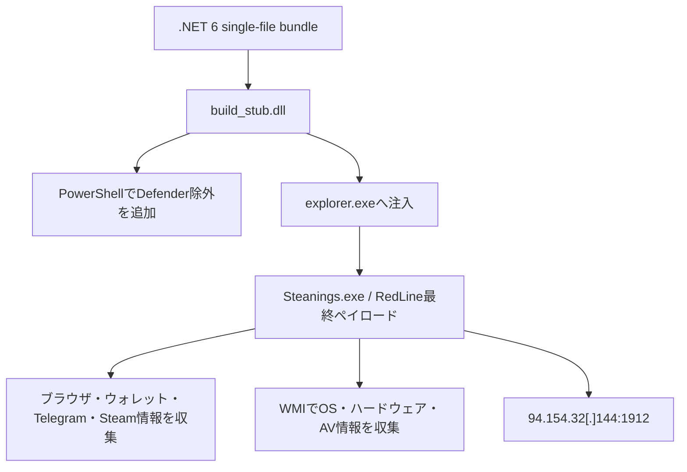

# RedLine Stealer ケース 7b2a28e5…

## 結論

従来は35MB超のサイズ制限で表層PEまでしか解析できていなかった。追加解析により、この検体は171エントリを持つ .NET 6 single-file bundle であり、`build_stub.dll` がローダー本体、公開サンドボックスの `Steanings.exe` が最終RedLineペイロードであることを確認した。

- 親検体: `7b2a28e5ecbdeb4e608026e8c548ef5f50e4aad5da5ae7bfcc5e9ee05e91e80a`（35517831 bytes）
- bundle内アプリ: `build_stub.dll` / `6a17823a8a47ceb941ee496aa53bb32ef4f3adb191e8a7bcf32fd66ae2c79b0c`（924,160 bytes）
- 公開サンドボックスの最終ペイロード: `482e9a1b214c6165e5d348c889592226e495dd934c12ce970de7a8d3dd5906d4`（307,712 bytes）
- メモリ再構築像: `ee70cc871d5d8476ca984925736d31fd583fea8c463e1ba28c33b34914703a69`（307,712 bytes）
- C2: `94.154.32[.]144:1912`
- 実行・外部通信: ローカルでは実施していない

## 感染・実行チェーン

## ローダー処理

bundleのアプリ層はPowerShellを非表示で起動し、一時ディレクトリと `powershell.exe`、`dllhost.exe`、`explorer.exe` をMicrosoft Defenderの除外へ追加する。その後、`explorer.exe` のメモリで最終ペイロードを実行する。

## 最終ペイロードの静的ロジック

- `DecryptBlob`、`RequestConnection`、`GetTokens`、`ReadMasterOfContext`、`CollectMemory`、`ChromeGetName`、`get_encrypted_key` を含む。
- Chromium系の `Login Data`、Cookies、`encrypted_value`、Local State鍵を処理する。
- Telegram、Steam `loginusers.vdf`、暗号資産ウォレット、ブラウザプロファイルを探索する。
- WMIからOS、CPU、GPU、メモリ、アンチウイルス情報を収集する。
- `api.ip.sb/ip` は外部IP確認用文字列であり、RedLine C2とは分離する。
- `217.65.2[.]14:3333` はブラウザ `--proxy-server=` 用の静的リテラルであり、主C2として扱わない。

## 復元上の注意

公開メモリ像ではCLRヘッダの一部が上書きされていた。新しい復元処理は元ファイルを変更せず、解析用メモリビューだけを修復してメタデータとCILを抽出する。これによりランタイムDLLを最終ペイロードと誤認する問題を解消した。