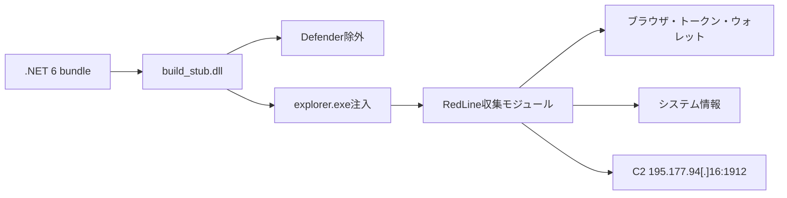

# 全体ロジックと比較

## 2ケースの共通点

- 171エントリの .NET 6 bundle と `build_stub.dll`。
- 同一形式のPowerShell Defender除外コマンド。
- `explorer.exe` 注入と307,712 byteの最終RedLine PE。
- 同じ収集メソッド名集合と `217.65.2[.]14:3333` プロキシ文字列。
- 主C2だけが異なる。

このため同一ビルダー／配布セットの可能性は高い。C2が異なるため同一運用者までは断定しない。