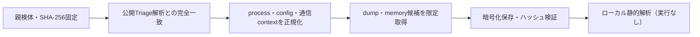

# Triage公開解析・後段取得証跡

## 完全ハッシュ一致

- [260819-zfzvkatajc](https://tria.ge/260819-zfzvkatajc): ファミリー候補 `未確定`、評価score `None`
- [260819-yymghsvxcy](https://tria.ge/260819-yymghsvxcy): ファミリー候補 `未確定`、評価score `None`

## プロセス・通信

- 観測process: `取得できず`
- raw commandは保存せず、command SHA-256と処理patternだけをJSONへ保持します。
- sandbox background trafficは`context_only`であり、C2へ自動昇格しません。

- 取得できませんでした。

## 後段取得物

- `4cee750b03162a7b73c1c4483f0a9e076ad966c091f80c5aacae70684a7379c9` / `memory_image` / 1232896 bytes / 親と同一: `false` / 静的解析: `partial`
- `43c0fc14c22cd06ba0a9c469f4280efa11c4d3e38c4d04221fcf05cd6f767389` / `memory_image` / 1232896 bytes / 親と同一: `false` / 静的解析: `partial`
- `a6edca17caf389e50c78b1d4c43d77d975a816c4021d91885f9d0f4724d5a920` / `memory_image` / 1232896 bytes / 親と同一: `false` / 静的解析: `partial`
- `9ad50e77b260631d56bbf756d2ab07c351a01075737ba2a430be3d066ced32d7` / `memory_image` / 1232896 bytes / 親と同一: `false` / 静的解析: `partial`
- `0afe8b5254c288e6d766b50f6d736cdb7533f06f8b7d685bc7830a2f8d9709c9` / `memory_image` / 1232896 bytes / 親と同一: `false` / 静的解析: `partial`
- `8e11475955e4799705e61ec39fa42bc984aa63999239109bf60824cd5b4bef5e` / `memory_image` / 1232896 bytes / 親と同一: `false` / 静的解析: `partial`

## 判定境界

Triage由来のfamily、process、config、通信は外部sandbox証跡です。Config extractorが返したendpointはC2候補として扱いますが、静的設定復元またはprocess帰属とprotocol応答が揃うまでは確認済みC2とはしません。取得成果物と検体は実行していません。
