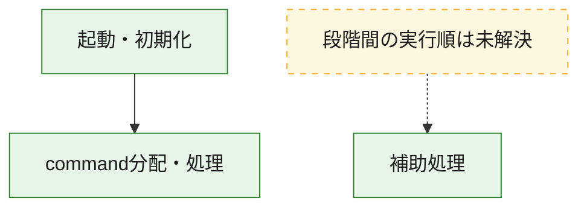
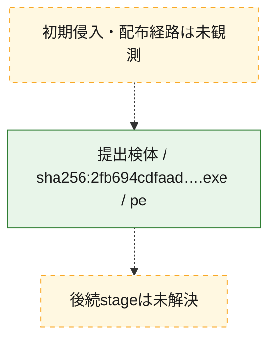
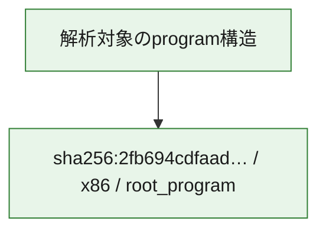

# 全体ロジック：2fb694cdfaad46ea8d5937291a33b33eae0083921151afb6362a252cec512837

代表関数の静的証跡から、起動・初期化、command分配・処理の処理群を確認しました。

## 読み方

- phaseの掲載順は解析上の整理順です。observed_call_edgesがない段階間の実行順を断定しません。
- 図の実線は静的に観測した関係、点線と黄色のノードは未観測・未解決の関係を示します。
- 図は静的な要約であり、動的実行を再現するものではありません。
- 詳細な関数解説とfingerprintは[STATIC-LOGIC.md](STATIC-LOGIC.md)を参照してください。

## 静的可視化

### 実行フロー

### 感染チェーン

### モジュール関係

## 処理段階

### 1. 起動・初期化

entry pointから初期化と後続処理への移行を確認します。
確度: `confirmed_static_function_evidence`

- `2fb694cdfaad46ea8d5937291a33b33eae0083921151afb6362a252cec512837:ghidra:14004c630` — 初期化と主要処理への分岐を行う入口関数です。 状態: `succeeded`、選定理由: `entry_point`, `meaningful_symbol_name`, `reviewed_call_centrality:22`, `role:entrypoint`

### 2. command分配・処理

受信commandやtaskの解釈、分配、個別handlerへの移行を確認します。
確度: `confirmed_static_function_evidence_with_limits`

- `2fb694cdfaad46ea8d5937291a33b33eae0083921151afb6362a252cec512837:ghidra:140072cb0` — commandの解釈、分配、または個別処理を担当する関数です。 状態: `limited_bad_instruction_or_flow`、選定理由: `meaningful_symbol_name`, `reviewed_call_centrality:1`, `role:command_dispatch_or_handler`

### 3. 補助処理

主要処理を支える一般内部関数またはlibrary処理を確認します。
確度: `confirmed_static_function_evidence`

- `2fb694cdfaad46ea8d5937291a33b33eae0083921151afb6362a252cec512837:ghidra:140001000` — 検体内部の一般処理を実装する関数です。 状態: `succeeded`、選定理由: `context_representative`, `reviewed_call_centrality:2`
- `2fb694cdfaad46ea8d5937291a33b33eae0083921151afb6362a252cec512837:ghidra:140001020` — 検体内部の一般処理を実装する関数です。 状態: `succeeded`、選定理由: `context_representative`, `reviewed_call_centrality:2`
- `2fb694cdfaad46ea8d5937291a33b33eae0083921151afb6362a252cec512837:ghidra:140001040` — 検体内部の一般処理を実装する関数です。 状態: `succeeded`、選定理由: `context_representative`, `reviewed_call_centrality:2`
- `2fb694cdfaad46ea8d5937291a33b33eae0083921151afb6362a252cec512837:ghidra:140001060` — 検体内部の一般処理を実装する関数です。 状態: `succeeded`、選定理由: `context_representative`, `reviewed_call_centrality:1`
- `2fb694cdfaad46ea8d5937291a33b33eae0083921151afb6362a252cec512837:ghidra:14000107c` — 検体内部の一般処理を実装する関数です。 状態: `succeeded`、選定理由: `context_representative`, `reviewed_call_centrality:2`
- `2fb694cdfaad46ea8d5937291a33b33eae0083921151afb6362a252cec512837:ghidra:140001098` — 検体内部の一般処理を実装する関数です。 状態: `succeeded`、選定理由: `context_representative`, `reviewed_call_centrality:2`
- `2fb694cdfaad46ea8d5937291a33b33eae0083921151afb6362a252cec512837:ghidra:1400010bc` — 検体内部の一般処理を実装する関数です。 状態: `succeeded`、選定理由: `context_representative`, `reviewed_call_centrality:2`
- `2fb694cdfaad46ea8d5937291a33b33eae0083921151afb6362a252cec512837:ghidra:1400010dc` — 検体内部の一般処理を実装する関数です。 状態: `succeeded`、選定理由: `context_representative`, `reviewed_call_centrality:2`
- `2fb694cdfaad46ea8d5937291a33b33eae0083921151afb6362a252cec512837:ghidra:1400010fc` — 検体内部の一般処理を実装する関数です。 状態: `succeeded`、選定理由: `context_representative`, `reviewed_call_centrality:2`
- `2fb694cdfaad46ea8d5937291a33b33eae0083921151afb6362a252cec512837:ghidra:140001120` — 検体内部の一般処理を実装する関数です。 状態: `succeeded`、選定理由: `context_representative`, `reviewed_call_centrality:2`
- `2fb694cdfaad46ea8d5937291a33b33eae0083921151afb6362a252cec512837:ghidra:140001140` — 検体内部の一般処理を実装する関数です。 状態: `succeeded`、選定理由: `context_representative`, `reviewed_call_centrality:2`
- `2fb694cdfaad46ea8d5937291a33b33eae0083921151afb6362a252cec512837:ghidra:140001164` — 検体内部の一般処理を実装する関数です。 状態: `succeeded`、選定理由: `context_representative`, `reviewed_call_centrality:2`
- `2fb694cdfaad46ea8d5937291a33b33eae0083921151afb6362a252cec512837:ghidra:140001184` — 検体内部の一般処理を実装する関数です。 状態: `succeeded`、選定理由: `context_representative`, `reviewed_call_centrality:2`
- `2fb694cdfaad46ea8d5937291a33b33eae0083921151afb6362a252cec512837:ghidra:1400011a4` — 検体内部の一般処理を実装する関数です。 状態: `succeeded`、選定理由: `context_representative`, `reviewed_call_centrality:2`
- `2fb694cdfaad46ea8d5937291a33b33eae0083921151afb6362a252cec512837:ghidra:1400011c8` — 検体内部の一般処理を実装する関数です。 状態: `succeeded`、選定理由: `context_representative`, `reviewed_call_centrality:2`
- `2fb694cdfaad46ea8d5937291a33b33eae0083921151afb6362a252cec512837:ghidra:1400011e8` — 検体内部の一般処理を実装する関数です。 状態: `succeeded`、選定理由: `context_representative`, `reviewed_call_centrality:2`
- `2fb694cdfaad46ea8d5937291a33b33eae0083921151afb6362a252cec512837:ghidra:14000120c` — 検体内部の一般処理を実装する関数です。 状態: `succeeded`、選定理由: `context_representative`, `reviewed_call_centrality:2`
- `2fb694cdfaad46ea8d5937291a33b33eae0083921151afb6362a252cec512837:ghidra:14000122c` — 検体内部の一般処理を実装する関数です。 状態: `succeeded`、選定理由: `context_representative`, `reviewed_call_centrality:2`
- `2fb694cdfaad46ea8d5937291a33b33eae0083921151afb6362a252cec512837:ghidra:14000124c` — 検体内部の一般処理を実装する関数です。 状態: `succeeded`、選定理由: `context_representative`, `reviewed_call_centrality:2`
- `2fb694cdfaad46ea8d5937291a33b33eae0083921151afb6362a252cec512837:ghidra:140001268` — 検体内部の一般処理を実装する関数です。 状態: `succeeded`、選定理由: `context_representative`, `reviewed_call_centrality:2`
- `2fb694cdfaad46ea8d5937291a33b33eae0083921151afb6362a252cec512837:ghidra:140001284` — 検体内部の一般処理を実装する関数です。 状態: `succeeded`、選定理由: `context_representative`, `reviewed_call_centrality:2`
- `2fb694cdfaad46ea8d5937291a33b33eae0083921151afb6362a252cec512837:ghidra:1400012c8` — 検体内部の一般処理を実装する関数です。 状態: `succeeded`、選定理由: `context_representative`, `reviewed_call_centrality:2`
- `2fb694cdfaad46ea8d5937291a33b33eae0083921151afb6362a252cec512837:ghidra:1400012ec` — 検体内部の一般処理を実装する関数です。 状態: `succeeded`、選定理由: `context_representative`, `reviewed_call_centrality:2`
- `2fb694cdfaad46ea8d5937291a33b33eae0083921151afb6362a252cec512837:ghidra:14000130c` — 検体内部の一般処理を実装する関数です。 状態: `succeeded`、選定理由: `context_representative`, `reviewed_call_centrality:2`
- `2fb694cdfaad46ea8d5937291a33b33eae0083921151afb6362a252cec512837:ghidra:14000132c` — 検体内部の一般処理を実装する関数です。 状態: `succeeded`、選定理由: `context_representative`, `reviewed_call_centrality:2`
- `2fb694cdfaad46ea8d5937291a33b33eae0083921151afb6362a252cec512837:ghidra:14000134c` — 検体内部の一般処理を実装する関数です。 状態: `succeeded`、選定理由: `context_representative`, `reviewed_call_centrality:2`
- `2fb694cdfaad46ea8d5937291a33b33eae0083921151afb6362a252cec512837:ghidra:14000136c` — 検体内部の一般処理を実装する関数です。 状態: `succeeded`、選定理由: `context_representative`, `reviewed_call_centrality:2`
- `2fb694cdfaad46ea8d5937291a33b33eae0083921151afb6362a252cec512837:ghidra:14000138c` — 検体内部の一般処理を実装する関数です。 状態: `succeeded`、選定理由: `context_representative`, `reviewed_call_centrality:2`
- `2fb694cdfaad46ea8d5937291a33b33eae0083921151afb6362a252cec512837:ghidra:1400013ac` — 検体内部の一般処理を実装する関数です。 状態: `succeeded`、選定理由: `context_representative`, `reviewed_call_centrality:2`
- `2fb694cdfaad46ea8d5937291a33b33eae0083921151afb6362a252cec512837:ghidra:140012e84` — 検体内部の一般処理を実装する関数です。 状態: `succeeded`、選定理由: `meaningful_symbol_name`

## 観測したcall関係

- `2fb694cdfaad46ea8d5937291a33b33eae0083921151afb6362a252cec512837:ghidra:14004c630` → `2fb694cdfaad46ea8d5937291a33b33eae0083921151afb6362a252cec512837:ghidra:140072cb0` （`startup` → `dispatch`）
- `ghidra-function:03c91c53da31b1e7f54b6f59` → `ghidra-function:5eb5497380ed548acd343eaf` （`unclassified` → `unclassified`）
- `ghidra-function:03c91c53da31b1e7f54b6f59` → `ghidra-function:c4b6991b41aefd15530953c0` （`unclassified` → `unclassified`）
- `ghidra-function:085d6753788dcb5aafb69c3e` → `ghidra-function:7e3c927815f4a79f298caece` （`unclassified` → `unclassified`）
- `ghidra-function:085d6753788dcb5aafb69c3e` → `ghidra-function:c4b6991b41aefd15530953c0` （`unclassified` → `unclassified`）
- `ghidra-function:22fb8ac540838f17ebce139b` → `ghidra-function:8ef941a1779d63a0df5277f4` （`unclassified` → `unclassified`）
- `ghidra-function:22fb8ac540838f17ebce139b` → `ghidra-function:c4b6991b41aefd15530953c0` （`unclassified` → `unclassified`）
- `ghidra-function:28ebd3e4ab63b0cfc4b71e5b` → `ghidra-function:5eb5497380ed548acd343eaf` （`unclassified` → `unclassified`）
- `ghidra-function:28ebd3e4ab63b0cfc4b71e5b` → `ghidra-function:c4b6991b41aefd15530953c0` （`unclassified` → `unclassified`）
- `ghidra-function:55e05d2d72b51dc0dddb066d` → `ghidra-function:8ef941a1779d63a0df5277f4` （`unclassified` → `unclassified`）
- `ghidra-function:55e05d2d72b51dc0dddb066d` → `ghidra-function:c4b6991b41aefd15530953c0` （`unclassified` → `unclassified`）
- `ghidra-function:5ff3521876c439d0e0db7bc8` → `ghidra-function:3bc1fea83c579b6644b7ad6d` （`unclassified` → `unclassified`）
- `ghidra-function:5ff3521876c439d0e0db7bc8` → `ghidra-function:c4b6991b41aefd15530953c0` （`unclassified` → `unclassified`）
- `ghidra-function:64924dca381fc96562d43901` → `ghidra-external:278e2e16b0a20abcf200e846` （`unclassified` → `unclassified`）
- `ghidra-function:64924dca381fc96562d43901` → `ghidra-external:43f03aa230f62d303eb605c2` （`unclassified` → `unclassified`）
- `ghidra-function:64924dca381fc96562d43901` → `ghidra-external:4d8d065d7e83a0cc3bdeb902` （`unclassified` → `unclassified`）
- `ghidra-function:64924dca381fc96562d43901` → `ghidra-external:695da1f5af22d513f685f2b1` （`unclassified` → `unclassified`）
- `ghidra-function:64924dca381fc96562d43901` → `ghidra-external:6bc5c45cd3c42f8f09c8455f` （`unclassified` → `unclassified`）
- `ghidra-function:64924dca381fc96562d43901` → `ghidra-external:d9cb43aef0e15697d59cac6c` （`unclassified` → `unclassified`）
- `ghidra-function:64924dca381fc96562d43901` → `ghidra-external:ecceacc1a3aa3d691f81a459` （`unclassified` → `unclassified`）
- `ghidra-function:64924dca381fc96562d43901` → `ghidra-function:1df18a92befdeb2a33c6b78d` （`unclassified` → `unclassified`）
- `ghidra-function:64924dca381fc96562d43901` → `ghidra-function:238cf04b30971087a1b655f1` （`unclassified` → `unclassified`）
- `ghidra-function:64924dca381fc96562d43901` → `ghidra-function:2bf3dbe59f5358e3bbb95c21` （`unclassified` → `unclassified`）
- `ghidra-function:64924dca381fc96562d43901` → `ghidra-function:3f308be69ffc1b8c29b7553d` （`unclassified` → `unclassified`）
- `ghidra-function:64924dca381fc96562d43901` → `ghidra-function:5ac7482dca0b4895bbe63250` （`unclassified` → `unclassified`）
- `ghidra-function:64924dca381fc96562d43901` → `ghidra-function:5c03299f0c8ae7f5c1618e3e` （`unclassified` → `unclassified`）
- `ghidra-function:64924dca381fc96562d43901` → `ghidra-function:5f08005fcc201f87d73cbd6f` （`unclassified` → `unclassified`）
- `ghidra-function:64924dca381fc96562d43901` → `ghidra-function:69b24ab5526c255f4af87b4a` （`unclassified` → `unclassified`）
- `ghidra-function:64924dca381fc96562d43901` → `ghidra-function:92c6ce45c93e030bfa787f56` （`unclassified` → `unclassified`）
- `ghidra-function:64924dca381fc96562d43901` → `ghidra-function:9693870ffb02dc6b925d80b3` （`unclassified` → `unclassified`）
- `ghidra-function:64924dca381fc96562d43901` → `ghidra-function:bd6323ea61192d7ffa4bc75e` （`unclassified` → `unclassified`）
- `ghidra-function:64924dca381fc96562d43901` → `ghidra-function:c499fe463e73e7cad3b90219` （`unclassified` → `unclassified`）
- `ghidra-function:64924dca381fc96562d43901` → `ghidra-function:d070d01562b7650ed58c79fe` （`unclassified` → `unclassified`）
- `ghidra-function:64924dca381fc96562d43901` → `ghidra-function:f0445c1b0f985c840f014311` （`unclassified` → `unclassified`）
- `ghidra-function:64924dca381fc96562d43901` → `ghidra-function:fc95f09a56d77d01d06f1857` （`unclassified` → `unclassified`）
- `ghidra-function:7e321137b842008bddf94969` → `ghidra-function:5eb5497380ed548acd343eaf` （`unclassified` → `unclassified`）
- `ghidra-function:7e321137b842008bddf94969` → `ghidra-function:c4b6991b41aefd15530953c0` （`unclassified` → `unclassified`）
- `ghidra-function:7ead0ff956f805d98e7c7bfc` → `ghidra-function:8ef941a1779d63a0df5277f4` （`unclassified` → `unclassified`）
- `ghidra-function:7ead0ff956f805d98e7c7bfc` → `ghidra-function:c4b6991b41aefd15530953c0` （`unclassified` → `unclassified`）
- `ghidra-function:8a7a9d2e1509390192567b9a` → `ghidra-function:7e3c927815f4a79f298caece` （`unclassified` → `unclassified`）
- `ghidra-function:8a7a9d2e1509390192567b9a` → `ghidra-function:c4b6991b41aefd15530953c0` （`unclassified` → `unclassified`）
- `ghidra-function:8d7e0b50a1caba7437f22944` → `ghidra-function:5eb5497380ed548acd343eaf` （`unclassified` → `unclassified`）
- `ghidra-function:8d7e0b50a1caba7437f22944` → `ghidra-function:c4b6991b41aefd15530953c0` （`unclassified` → `unclassified`）
- `ghidra-function:9170d8287c329b4a6d6a462c` → `ghidra-function:5eb5497380ed548acd343eaf` （`unclassified` → `unclassified`）
- `ghidra-function:9170d8287c329b4a6d6a462c` → `ghidra-function:c4b6991b41aefd15530953c0` （`unclassified` → `unclassified`）
- `ghidra-function:9b312dd77245e56de9baed83` → `ghidra-function:18eca8bba25760c05a593510` （`unclassified` → `unclassified`）
- `ghidra-function:9b312dd77245e56de9baed83` → `ghidra-function:c4b6991b41aefd15530953c0` （`unclassified` → `unclassified`）
- `ghidra-function:a675a2d6aa4ad1005bd7465b` → `ghidra-function:8ef941a1779d63a0df5277f4` （`unclassified` → `unclassified`）
- `ghidra-function:a675a2d6aa4ad1005bd7465b` → `ghidra-function:c4b6991b41aefd15530953c0` （`unclassified` → `unclassified`）
- `ghidra-function:af595fb229cc69820633ef0e` → `ghidra-function:5eb5497380ed548acd343eaf` （`unclassified` → `unclassified`）
- `ghidra-function:af595fb229cc69820633ef0e` → `ghidra-function:c4b6991b41aefd15530953c0` （`unclassified` → `unclassified`）
- `ghidra-function:b1937d70949bf5f11bd99986` → `ghidra-external:11cf68020b791314dcc4b2ec` （`unclassified` → `unclassified`）
- `ghidra-function:b41fe5c71de96c576bd584f8` → `ghidra-function:c4b6991b41aefd15530953c0` （`unclassified` → `unclassified`）
- `ghidra-function:b41fe5c71de96c576bd584f8` → `ghidra-function:f4ec53522da6906ea1518d0a` （`unclassified` → `unclassified`）
- `ghidra-function:bfaecf1c8ef52f7886b08ef3` → `ghidra-function:5eb5497380ed548acd343eaf` （`unclassified` → `unclassified`）
- `ghidra-function:bfaecf1c8ef52f7886b08ef3` → `ghidra-function:c4b6991b41aefd15530953c0` （`unclassified` → `unclassified`）
- `ghidra-function:c0bfc66a12d55ce5c0059234` → `ghidra-function:7e3c927815f4a79f298caece` （`unclassified` → `unclassified`）
- `ghidra-function:c0bfc66a12d55ce5c0059234` → `ghidra-function:c4b6991b41aefd15530953c0` （`unclassified` → `unclassified`）
- `ghidra-function:c3d4df06d604ba7e5cc92c5d` → `ghidra-function:7e3c927815f4a79f298caece` （`unclassified` → `unclassified`）
- `ghidra-function:c3d4df06d604ba7e5cc92c5d` → `ghidra-function:c4b6991b41aefd15530953c0` （`unclassified` → `unclassified`）
- `ghidra-function:c453368957adca66efca605b` → `ghidra-function:5eb5497380ed548acd343eaf` （`unclassified` → `unclassified`）
- `ghidra-function:c453368957adca66efca605b` → `ghidra-function:c4b6991b41aefd15530953c0` （`unclassified` → `unclassified`）
- `ghidra-function:c55a581df347b1672e6ce826` → `ghidra-function:5eb5497380ed548acd343eaf` （`unclassified` → `unclassified`）
- `ghidra-function:c55a581df347b1672e6ce826` → `ghidra-function:c4b6991b41aefd15530953c0` （`unclassified` → `unclassified`）
- `ghidra-function:c93be7676d59b755a81b5b84` → `ghidra-function:5eb5497380ed548acd343eaf` （`unclassified` → `unclassified`）
- `ghidra-function:c93be7676d59b755a81b5b84` → `ghidra-function:c4b6991b41aefd15530953c0` （`unclassified` → `unclassified`）
- `ghidra-function:c943c64820eb090cd92eecc2` → `ghidra-function:7cc8150e9b5edb4ab497a027` （`unclassified` → `unclassified`）
- `ghidra-function:c943c64820eb090cd92eecc2` → `ghidra-function:c4b6991b41aefd15530953c0` （`unclassified` → `unclassified`）
- `ghidra-function:cfb557bece07923031e32d66` → `ghidra-function:7e3c927815f4a79f298caece` （`unclassified` → `unclassified`）
- `ghidra-function:cfb557bece07923031e32d66` → `ghidra-function:c4b6991b41aefd15530953c0` （`unclassified` → `unclassified`）
- `ghidra-function:d069c06c2b66f2cd7568be8f` → `ghidra-function:7e3c927815f4a79f298caece` （`unclassified` → `unclassified`）
- `ghidra-function:d069c06c2b66f2cd7568be8f` → `ghidra-function:c4b6991b41aefd15530953c0` （`unclassified` → `unclassified`）
- `ghidra-function:d89b06744ddb652e4e4678f8` → `ghidra-function:5eb5497380ed548acd343eaf` （`unclassified` → `unclassified`）
- `ghidra-function:d89b06744ddb652e4e4678f8` → `ghidra-function:c4b6991b41aefd15530953c0` （`unclassified` → `unclassified`）
- `ghidra-function:dfb5443d6fdb4dcd86e1f758` → `ghidra-function:8ef941a1779d63a0df5277f4` （`unclassified` → `unclassified`）
- `ghidra-function:dfb5443d6fdb4dcd86e1f758` → `ghidra-function:c4b6991b41aefd15530953c0` （`unclassified` → `unclassified`）
- `ghidra-function:f2c1f5f3c350f0877b1add14` → `ghidra-function:5eb5497380ed548acd343eaf` （`unclassified` → `unclassified`）
- `ghidra-function:f2c1f5f3c350f0877b1add14` → `ghidra-function:c4b6991b41aefd15530953c0` （`unclassified` → `unclassified`）
- `ghidra-function:fe23b63ce60fcd5ca40e8e64` → `ghidra-function:7e3c927815f4a79f298caece` （`unclassified` → `unclassified`）
- `ghidra-function:fe23b63ce60fcd5ca40e8e64` → `ghidra-function:c4b6991b41aefd15530953c0` （`unclassified` → `unclassified`）

## 解析範囲と制約

- 選定外関数は全体inventoryへ残しますが、関数本体の個別解説対象にはしていません。
- indirect call、難読化、packer、VM、壊れたcontrol flowによりcall関係が欠落する場合があります。
- 文書は静的解析に基づき、検体実行や外部通信による動的確認は行っていません。
