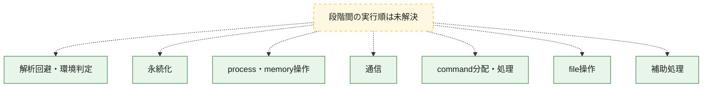
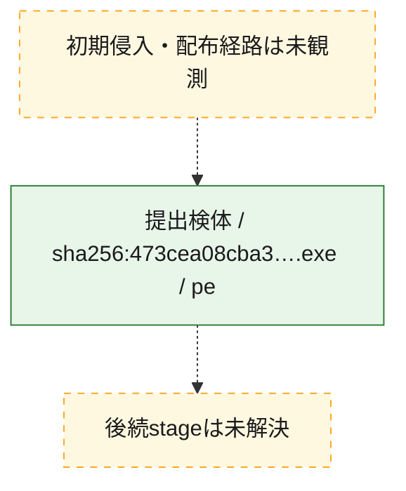
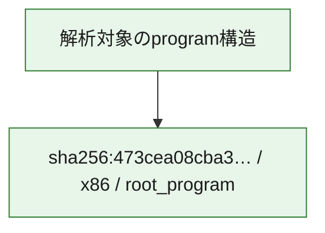

# 全体ロジック：473cea08cba37e918c9a48afa31645f0ec7fb92f25611053f108a1904c514e85

代表関数の静的証跡から、解析回避・環境判定、永続化、process・memory操作、通信、command分配・処理、file操作の処理群を確認しました。

## 読み方

- phaseの掲載順は解析上の整理順です。observed_call_edgesがない段階間の実行順を断定しません。
- 図の実線は静的に観測した関係、点線と黄色のノードは未観測・未解決の関係を示します。
- 図は静的な要約であり、動的実行を再現するものではありません。
- 詳細な関数解説とfingerprintは[STATIC-LOGIC.md](STATIC-LOGIC.md)を参照してください。

## 静的可視化

### 実行フロー

### 感染チェーン

### モジュール関係

## 処理段階

### 1. 解析回避・環境判定

debugger、sandbox、仮想環境、時間差などの判定を確認します。
確度: `confirmed_static_function_evidence`

- `473cea08cba37e918c9a48afa31645f0ec7fb92f25611053f108a1904c514e85:ghidra:00403e34` — debugger、仮想環境、sandbox、または時間差の確認に関係する関数です。 状態: `succeeded`、選定理由: `call_graph_centrality:in=0,out=14`, `large_function:instructions=140`, `reviewed_call_centrality:15`, `reviewed_call_centrality:19`, `role:anti_analysis`
- `473cea08cba37e918c9a48afa31645f0ec7fb92f25611053f108a1904c514e85:ghidra:00407822` — debugger、仮想環境、sandbox、または時間差の確認に関係する関数です。 状態: `succeeded`、選定理由: `call_graph_centrality:in=2,out=9`, `large_function:instructions=78`, `reviewed_call_centrality:11`, `reviewed_call_centrality:15`, `role:anti_analysis`
- `473cea08cba37e918c9a48afa31645f0ec7fb92f25611053f108a1904c514e85:ghidra:0040c2dc` — debugger、仮想環境、sandbox、または時間差の確認に関係する関数です。 状態: `succeeded`、選定理由: `call_graph_centrality:in=0,out=11`, `large_function:instructions=71`, `reviewed_call_centrality:11`, `reviewed_call_centrality:14`, `role:anti_analysis`
- `473cea08cba37e918c9a48afa31645f0ec7fb92f25611053f108a1904c514e85:ghidra:0040c4d9` — debugger、仮想環境、sandbox、または時間差の確認に関係する関数です。 状態: `succeeded`、選定理由: `call_graph_centrality:in=0,out=25`, `large_function:instructions=170`, `reviewed_call_centrality:25`, `reviewed_call_centrality:33`, `role:anti_analysis`

### 2. 永続化

自動起動や永続化に関係する設定変更を確認します。
確度: `confirmed_static_function_evidence`

- `473cea08cba37e918c9a48afa31645f0ec7fb92f25611053f108a1904c514e85:ghidra:004042cf` — 自動起動または永続化に関係する処理を含む関数です。 状態: `succeeded`、選定理由: `call_graph_centrality:in=2,out=1`, `reviewed_call_centrality:3`, `role:persistence`

### 3. process・memory操作

process、thread、module、memory操作と実行移行を確認します。
確度: `confirmed_static_function_evidence_with_limits`

- `473cea08cba37e918c9a48afa31645f0ec7fb92f25611053f108a1904c514e85:ghidra:004017eb` — process、thread、module、またはmemory操作に関係する関数です。 状態: `succeeded`、選定理由: `call_graph_centrality:in=0,out=21`, `large_function:instructions=149`, `reviewed_call_centrality:21`, `reviewed_call_centrality:26`, `role:process_or_memory_operation`
- `473cea08cba37e918c9a48afa31645f0ec7fb92f25611053f108a1904c514e85:ghidra:004048c8` — process、thread、module、またはmemory操作に関係する関数です。 状態: `succeeded`、選定理由: `call_graph_centrality:in=1,out=14`, `large_function:instructions=155`, `reviewed_call_centrality:15`, `reviewed_call_centrality:19`, `role:process_or_memory_operation`
- `473cea08cba37e918c9a48afa31645f0ec7fb92f25611053f108a1904c514e85:ghidra:00404c08` — process、thread、module、またはmemory操作に関係する関数です。 状態: `failed`、選定理由: `call_graph_centrality:in=2,out=8`, `reviewed_call_centrality:11`, `reviewed_call_centrality:13`, `role:process_or_memory_operation`
- `473cea08cba37e918c9a48afa31645f0ec7fb92f25611053f108a1904c514e85:ghidra:004056aa` — process、thread、module、またはmemory操作に関係する関数です。 状態: `succeeded`、選定理由: `call_graph_centrality:in=1,out=32`, `large_function:instructions=280`, `reviewed_call_centrality:34`, `reviewed_call_centrality:48`, `role:process_or_memory_operation`
- `473cea08cba37e918c9a48afa31645f0ec7fb92f25611053f108a1904c514e85:ghidra:0040bf36` — process、thread、module、またはmemory操作に関係する関数です。 状態: `succeeded`、選定理由: `call_graph_centrality:in=3,out=8`, `large_function:instructions=70`, `reviewed_call_centrality:11`, `reviewed_call_centrality:14`, `role:process_or_memory_operation`
- `473cea08cba37e918c9a48afa31645f0ec7fb92f25611053f108a1904c514e85:ghidra:0040c1a1` — process、thread、module、またはmemory操作に関係する関数です。 状態: `succeeded`、選定理由: `call_graph_centrality:in=2,out=9`, `large_function:instructions=108`, `reviewed_call_centrality:11`, `reviewed_call_centrality:19`, `role:process_or_memory_operation`
- `473cea08cba37e918c9a48afa31645f0ec7fb92f25611053f108a1904c514e85:ghidra:0040ca9f` — process、thread、module、またはmemory操作に関係する関数です。 状態: `succeeded`、選定理由: `call_graph_centrality:in=0,out=28`, `large_function:instructions=158`, `reviewed_call_centrality:29`, `reviewed_call_centrality:38`, `role:anti_analysis`, `role:process_or_memory_operation`

### 4. 通信

通信初期化、endpoint処理、送受信の役割を確認します。
確度: `confirmed_static_function_evidence`

- `473cea08cba37e918c9a48afa31645f0ec7fb92f25611053f108a1904c514e85:ghidra:00404257` — 通信初期化、送受信、またはendpoint処理に関係する関数です。 状態: `succeeded`、選定理由: `call_graph_centrality:in=22,out=3`, `reviewed_call_centrality:16`, `reviewed_call_centrality:26`, `role:network_communication`
- `473cea08cba37e918c9a48afa31645f0ec7fb92f25611053f108a1904c514e85:ghidra:004042f9` — 通信初期化、送受信、またはendpoint処理に関係する関数です。 状態: `succeeded`、選定理由: `call_graph_centrality:in=27,out=16`, `large_function:instructions=156`, `reviewed_call_centrality:42`, `reviewed_call_centrality:44`, `role:network_communication`
- `473cea08cba37e918c9a48afa31645f0ec7fb92f25611053f108a1904c514e85:ghidra:00404524` — 通信初期化、送受信、またはendpoint処理に関係する関数です。 状態: `succeeded`、選定理由: `call_graph_centrality:in=58,out=8`, `reviewed_call_centrality:42`, `reviewed_call_centrality:66`, `role:network_communication`
- `473cea08cba37e918c9a48afa31645f0ec7fb92f25611053f108a1904c514e85:ghidra:00404a9a` — 通信初期化、送受信、またはendpoint処理に関係する関数です。 状態: `succeeded`、選定理由: `call_graph_centrality:in=20,out=7`, `large_function:instructions=66`, `reviewed_call_centrality:26`, `reviewed_call_centrality:27`, `role:network_communication`
- `473cea08cba37e918c9a48afa31645f0ec7fb92f25611053f108a1904c514e85:ghidra:00407d53` — 通信初期化、送受信、またはendpoint処理に関係する関数です。 状態: `succeeded`、選定理由: `call_graph_centrality:in=0,out=19`, `large_function:instructions=226`, `reviewed_call_centrality:20`, `reviewed_call_centrality:27`, `role:network_communication`
- `473cea08cba37e918c9a48afa31645f0ec7fb92f25611053f108a1904c514e85:ghidra:00408905` — 通信初期化、送受信、またはendpoint処理に関係する関数です。 状態: `succeeded`、選定理由: `call_graph_centrality:in=1,out=22`, `large_function:instructions=173`, `reviewed_call_centrality:23`, `reviewed_call_centrality:30`, `role:file_operation`, `role:network_communication`
- `473cea08cba37e918c9a48afa31645f0ec7fb92f25611053f108a1904c514e85:ghidra:00408b44` — 通信初期化、送受信、またはendpoint処理に関係する関数です。 状態: `succeeded`、選定理由: `call_graph_centrality:in=1,out=20`, `large_function:instructions=133`, `reviewed_call_centrality:22`, `reviewed_call_centrality:29`, `role:file_operation`, `role:network_communication`
- `473cea08cba37e918c9a48afa31645f0ec7fb92f25611053f108a1904c514e85:ghidra:0040a37a` — 通信初期化、送受信、またはendpoint処理に関係する関数です。 状態: `succeeded`、選定理由: `call_graph_centrality:in=1,out=27`, `large_function:instructions=320`, `reviewed_call_centrality:31`, `reviewed_call_centrality:41`, `role:file_operation`, `role:network_communication`

### 5. command分配・処理

受信commandやtaskの解釈、分配、個別handlerへの移行を確認します。
確度: `confirmed_static_function_evidence`

- `473cea08cba37e918c9a48afa31645f0ec7fb92f25611053f108a1904c514e85:ghidra:004054a9` — commandの解釈、分配、または個別処理を担当する関数です。 状態: `succeeded`、選定理由: `call_graph_centrality:in=0,out=19`, `large_function:instructions=146`, `reviewed_call_centrality:19`, `reviewed_call_centrality:27`, `role:command_dispatch_or_handler`
- `473cea08cba37e918c9a48afa31645f0ec7fb92f25611053f108a1904c514e85:ghidra:00408097` — commandの解釈、分配、または個別処理を担当する関数です。 状態: `succeeded`、選定理由: `call_graph_centrality:in=1,out=20`, `large_function:instructions=122`, `reviewed_call_centrality:22`, `reviewed_call_centrality:30`, `role:command_dispatch_or_handler`
- `473cea08cba37e918c9a48afa31645f0ec7fb92f25611053f108a1904c514e85:ghidra:00408f8d` — commandの解釈、分配、または個別処理を担当する関数です。 状態: `succeeded`、選定理由: `call_graph_centrality:in=0,out=68`, `large_function:instructions=930`, `reviewed_call_centrality:70`, `reviewed_call_centrality:94`, `role:command_dispatch_or_handler`
- `473cea08cba37e918c9a48afa31645f0ec7fb92f25611053f108a1904c514e85:ghidra:0040c075` — commandの解釈、分配、または個別処理を担当する関数です。 状態: `succeeded`、選定理由: `call_graph_centrality:in=0,out=11`, `large_function:instructions=65`, `reviewed_call_centrality:11`, `reviewed_call_centrality:19`, `role:command_dispatch_or_handler`

### 6. file操作

fileやdirectoryの作成、読書き、削除を確認します。
確度: `confirmed_static_function_evidence`

- `473cea08cba37e918c9a48afa31645f0ec7fb92f25611053f108a1904c514e85:ghidra:004074e7` — fileまたはdirectoryの読書き・管理に関係する関数です。 状態: `succeeded`、選定理由: `call_graph_centrality:in=1,out=22`, `large_function:instructions=171`, `reviewed_call_centrality:23`, `reviewed_call_centrality:35`, `role:file_operation`
- `473cea08cba37e918c9a48afa31645f0ec7fb92f25611053f108a1904c514e85:ghidra:004087af` — fileまたはdirectoryの読書き・管理に関係する関数です。 状態: `succeeded`、選定理由: `call_graph_centrality:in=3,out=17`, `large_function:instructions=99`, `reviewed_call_centrality:20`, `reviewed_call_centrality:23`, `role:file_operation`
- `473cea08cba37e918c9a48afa31645f0ec7fb92f25611053f108a1904c514e85:ghidra:0040a025` — fileまたはdirectoryの読書き・管理に関係する関数です。 状態: `succeeded`、選定理由: `call_graph_centrality:in=2,out=23`, `large_function:instructions=177`, `reviewed_call_centrality:27`, `reviewed_call_centrality:33`, `role:file_operation`
- `473cea08cba37e918c9a48afa31645f0ec7fb92f25611053f108a1904c514e85:ghidra:0040b097` — fileまたはdirectoryの読書き・管理に関係する関数です。 状態: `succeeded`、選定理由: `call_graph_centrality:in=1,out=31`, `large_function:instructions=270`, `reviewed_call_centrality:33`, `reviewed_call_centrality:38`, `role:file_operation`
- `473cea08cba37e918c9a48afa31645f0ec7fb92f25611053f108a1904c514e85:ghidra:0040b495` — fileまたはdirectoryの読書き・管理に関係する関数です。 状態: `succeeded`、選定理由: `call_graph_centrality:in=2,out=25`, `large_function:instructions=200`, `reviewed_call_centrality:28`, `reviewed_call_centrality:33`, `role:file_operation`
- `473cea08cba37e918c9a48afa31645f0ec7fb92f25611053f108a1904c514e85:ghidra:0040db78` — fileまたはdirectoryの読書き・管理に関係する関数です。 状態: `succeeded`、選定理由: `call_graph_centrality:in=1,out=10`, `large_function:instructions=84`, `reviewed_call_centrality:11`, `reviewed_call_centrality:16`, `role:file_operation`
- `473cea08cba37e918c9a48afa31645f0ec7fb92f25611053f108a1904c514e85:ghidra:0040dc74` — fileまたはdirectoryの読書き・管理に関係する関数です。 状態: `succeeded`、選定理由: `call_graph_centrality:in=2,out=20`, `large_function:instructions=235`, `reviewed_call_centrality:22`, `reviewed_call_centrality:30`, `role:file_operation`

### 7. 補助処理

主要処理を支える一般内部関数またはlibrary処理を確認します。
確度: `confirmed_static_function_evidence`

- `473cea08cba37e918c9a48afa31645f0ec7fb92f25611053f108a1904c514e85:ghidra:0040203e` — 検体内部の一般処理を実装する関数です。 状態: `succeeded`、選定理由: `call_graph_centrality:in=84,out=3`, `reviewed_call_centrality:42`, `reviewed_call_centrality:87`

## 観測したcall関係

- 代表関数間で直接解決できた呼出関係はありません。

## 解析範囲と制約

- 選定外関数は全体inventoryへ残しますが、関数本体の個別解説対象にはしていません。
- indirect call、難読化、packer、VM、壊れたcontrol flowによりcall関係が欠落する場合があります。
- 文書は静的解析に基づき、検体実行や外部通信による動的確認は行っていません。
