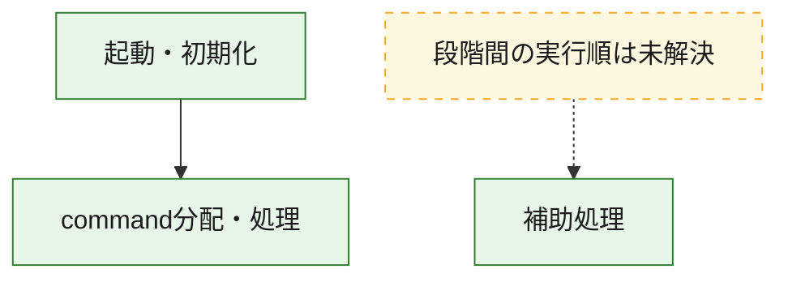
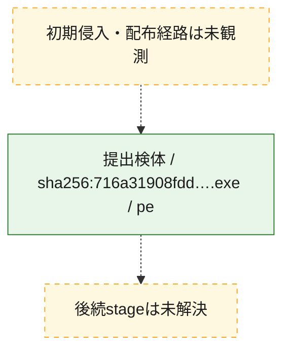
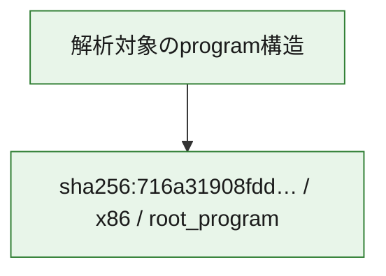

# 全体ロジック：716a31908fdd9f7fc83481bd49a272ba666fd970c0884800ecbdaeda6ea6a8ab

代表関数の静的証跡から、起動・初期化、command分配・処理の処理群を確認しました。

## 読み方

- phaseの掲載順は解析上の整理順です。observed_call_edgesがない段階間の実行順を断定しません。
- 図の実線は静的に観測した関係、点線と黄色のノードは未観測・未解決の関係を示します。
- 図は静的な要約であり、動的実行を再現するものではありません。
- 詳細な関数解説とfingerprintは[STATIC-LOGIC.md](STATIC-LOGIC.md)を参照してください。

## 静的可視化

### 実行フロー

### 感染チェーン

### モジュール関係

## 処理段階

### 1. 起動・初期化

entry pointから初期化と後続処理への移行を確認します。
確度: `confirmed_static_function_evidence`

- `716a31908fdd9f7fc83481bd49a272ba666fd970c0884800ecbdaeda6ea6a8ab:ghidra:14004c630` — 初期化と主要処理への分岐を行う入口関数です。 状態: `succeeded`、選定理由: `entry_point`, `meaningful_symbol_name`, `reviewed_call_centrality:22`, `role:entrypoint`

### 2. command分配・処理

受信commandやtaskの解釈、分配、個別handlerへの移行を確認します。
確度: `confirmed_static_function_evidence_with_limits`

- `716a31908fdd9f7fc83481bd49a272ba666fd970c0884800ecbdaeda6ea6a8ab:ghidra:140072cb0` — commandの解釈、分配、または個別処理を担当する関数です。 状態: `limited_bad_instruction_or_flow`、選定理由: `meaningful_symbol_name`, `reviewed_call_centrality:1`, `role:command_dispatch_or_handler`

### 3. 補助処理

主要処理を支える一般内部関数またはlibrary処理を確認します。
確度: `confirmed_static_function_evidence`

- `716a31908fdd9f7fc83481bd49a272ba666fd970c0884800ecbdaeda6ea6a8ab:ghidra:140001000` — 検体内部の一般処理を実装する関数です。 状態: `succeeded`、選定理由: `context_representative`, `reviewed_call_centrality:2`
- `716a31908fdd9f7fc83481bd49a272ba666fd970c0884800ecbdaeda6ea6a8ab:ghidra:140001020` — 検体内部の一般処理を実装する関数です。 状態: `succeeded`、選定理由: `context_representative`, `reviewed_call_centrality:2`
- `716a31908fdd9f7fc83481bd49a272ba666fd970c0884800ecbdaeda6ea6a8ab:ghidra:140001040` — 検体内部の一般処理を実装する関数です。 状態: `succeeded`、選定理由: `context_representative`, `reviewed_call_centrality:2`
- `716a31908fdd9f7fc83481bd49a272ba666fd970c0884800ecbdaeda6ea6a8ab:ghidra:140001060` — 検体内部の一般処理を実装する関数です。 状態: `succeeded`、選定理由: `context_representative`, `reviewed_call_centrality:1`
- `716a31908fdd9f7fc83481bd49a272ba666fd970c0884800ecbdaeda6ea6a8ab:ghidra:14000107c` — 検体内部の一般処理を実装する関数です。 状態: `succeeded`、選定理由: `context_representative`, `reviewed_call_centrality:2`
- `716a31908fdd9f7fc83481bd49a272ba666fd970c0884800ecbdaeda6ea6a8ab:ghidra:140001098` — 検体内部の一般処理を実装する関数です。 状態: `succeeded`、選定理由: `context_representative`, `reviewed_call_centrality:2`
- `716a31908fdd9f7fc83481bd49a272ba666fd970c0884800ecbdaeda6ea6a8ab:ghidra:1400010bc` — 検体内部の一般処理を実装する関数です。 状態: `succeeded`、選定理由: `context_representative`, `reviewed_call_centrality:2`
- `716a31908fdd9f7fc83481bd49a272ba666fd970c0884800ecbdaeda6ea6a8ab:ghidra:1400010dc` — 検体内部の一般処理を実装する関数です。 状態: `succeeded`、選定理由: `context_representative`, `reviewed_call_centrality:2`
- `716a31908fdd9f7fc83481bd49a272ba666fd970c0884800ecbdaeda6ea6a8ab:ghidra:1400010fc` — 検体内部の一般処理を実装する関数です。 状態: `succeeded`、選定理由: `context_representative`, `reviewed_call_centrality:2`
- `716a31908fdd9f7fc83481bd49a272ba666fd970c0884800ecbdaeda6ea6a8ab:ghidra:140001120` — 検体内部の一般処理を実装する関数です。 状態: `succeeded`、選定理由: `context_representative`, `reviewed_call_centrality:2`
- `716a31908fdd9f7fc83481bd49a272ba666fd970c0884800ecbdaeda6ea6a8ab:ghidra:140001140` — 検体内部の一般処理を実装する関数です。 状態: `succeeded`、選定理由: `context_representative`, `reviewed_call_centrality:2`
- `716a31908fdd9f7fc83481bd49a272ba666fd970c0884800ecbdaeda6ea6a8ab:ghidra:140001164` — 検体内部の一般処理を実装する関数です。 状態: `succeeded`、選定理由: `context_representative`, `reviewed_call_centrality:2`
- `716a31908fdd9f7fc83481bd49a272ba666fd970c0884800ecbdaeda6ea6a8ab:ghidra:140001184` — 検体内部の一般処理を実装する関数です。 状態: `succeeded`、選定理由: `context_representative`, `reviewed_call_centrality:2`
- `716a31908fdd9f7fc83481bd49a272ba666fd970c0884800ecbdaeda6ea6a8ab:ghidra:1400011a4` — 検体内部の一般処理を実装する関数です。 状態: `succeeded`、選定理由: `context_representative`, `reviewed_call_centrality:2`
- `716a31908fdd9f7fc83481bd49a272ba666fd970c0884800ecbdaeda6ea6a8ab:ghidra:1400011c8` — 検体内部の一般処理を実装する関数です。 状態: `succeeded`、選定理由: `context_representative`, `reviewed_call_centrality:2`
- `716a31908fdd9f7fc83481bd49a272ba666fd970c0884800ecbdaeda6ea6a8ab:ghidra:1400011e8` — 検体内部の一般処理を実装する関数です。 状態: `succeeded`、選定理由: `context_representative`, `reviewed_call_centrality:2`
- `716a31908fdd9f7fc83481bd49a272ba666fd970c0884800ecbdaeda6ea6a8ab:ghidra:14000120c` — 検体内部の一般処理を実装する関数です。 状態: `succeeded`、選定理由: `context_representative`, `reviewed_call_centrality:2`
- `716a31908fdd9f7fc83481bd49a272ba666fd970c0884800ecbdaeda6ea6a8ab:ghidra:14000122c` — 検体内部の一般処理を実装する関数です。 状態: `succeeded`、選定理由: `context_representative`, `reviewed_call_centrality:2`
- `716a31908fdd9f7fc83481bd49a272ba666fd970c0884800ecbdaeda6ea6a8ab:ghidra:14000124c` — 検体内部の一般処理を実装する関数です。 状態: `succeeded`、選定理由: `context_representative`, `reviewed_call_centrality:2`
- `716a31908fdd9f7fc83481bd49a272ba666fd970c0884800ecbdaeda6ea6a8ab:ghidra:140001268` — 検体内部の一般処理を実装する関数です。 状態: `succeeded`、選定理由: `context_representative`, `reviewed_call_centrality:2`
- `716a31908fdd9f7fc83481bd49a272ba666fd970c0884800ecbdaeda6ea6a8ab:ghidra:140001284` — 検体内部の一般処理を実装する関数です。 状態: `succeeded`、選定理由: `context_representative`, `reviewed_call_centrality:2`
- `716a31908fdd9f7fc83481bd49a272ba666fd970c0884800ecbdaeda6ea6a8ab:ghidra:1400012c8` — 検体内部の一般処理を実装する関数です。 状態: `succeeded`、選定理由: `context_representative`, `reviewed_call_centrality:2`
- `716a31908fdd9f7fc83481bd49a272ba666fd970c0884800ecbdaeda6ea6a8ab:ghidra:1400012ec` — 検体内部の一般処理を実装する関数です。 状態: `succeeded`、選定理由: `context_representative`, `reviewed_call_centrality:2`
- `716a31908fdd9f7fc83481bd49a272ba666fd970c0884800ecbdaeda6ea6a8ab:ghidra:14000130c` — 検体内部の一般処理を実装する関数です。 状態: `succeeded`、選定理由: `context_representative`, `reviewed_call_centrality:2`
- `716a31908fdd9f7fc83481bd49a272ba666fd970c0884800ecbdaeda6ea6a8ab:ghidra:14000132c` — 検体内部の一般処理を実装する関数です。 状態: `succeeded`、選定理由: `context_representative`, `reviewed_call_centrality:2`
- `716a31908fdd9f7fc83481bd49a272ba666fd970c0884800ecbdaeda6ea6a8ab:ghidra:14000134c` — 検体内部の一般処理を実装する関数です。 状態: `succeeded`、選定理由: `context_representative`, `reviewed_call_centrality:2`
- `716a31908fdd9f7fc83481bd49a272ba666fd970c0884800ecbdaeda6ea6a8ab:ghidra:14000136c` — 検体内部の一般処理を実装する関数です。 状態: `succeeded`、選定理由: `context_representative`, `reviewed_call_centrality:2`
- `716a31908fdd9f7fc83481bd49a272ba666fd970c0884800ecbdaeda6ea6a8ab:ghidra:14000138c` — 検体内部の一般処理を実装する関数です。 状態: `succeeded`、選定理由: `context_representative`, `reviewed_call_centrality:2`
- `716a31908fdd9f7fc83481bd49a272ba666fd970c0884800ecbdaeda6ea6a8ab:ghidra:1400013ac` — 検体内部の一般処理を実装する関数です。 状態: `succeeded`、選定理由: `context_representative`, `reviewed_call_centrality:2`
- `716a31908fdd9f7fc83481bd49a272ba666fd970c0884800ecbdaeda6ea6a8ab:ghidra:140012e84` — 検体内部の一般処理を実装する関数です。 状態: `succeeded`、選定理由: `meaningful_symbol_name`

## 観測したcall関係

- `716a31908fdd9f7fc83481bd49a272ba666fd970c0884800ecbdaeda6ea6a8ab:ghidra:14004c630` → `716a31908fdd9f7fc83481bd49a272ba666fd970c0884800ecbdaeda6ea6a8ab:ghidra:140072cb0` （`startup` → `dispatch`）
- `ghidra-function:030fd461fb6e79f63cf95fcf` → `ghidra-function:cc49c457ee0e9b3133f46aa2` （`unclassified` → `unclassified`）
- `ghidra-function:030fd461fb6e79f63cf95fcf` → `ghidra-function:fd81c9bb61290d0150fdadc4` （`unclassified` → `unclassified`）
- `ghidra-function:04b232a60f114e505f444a4d` → `ghidra-function:cc49c457ee0e9b3133f46aa2` （`unclassified` → `unclassified`）
- `ghidra-function:04b232a60f114e505f444a4d` → `ghidra-function:fd81c9bb61290d0150fdadc4` （`unclassified` → `unclassified`）
- `ghidra-function:138c54f7f2086f85310219f3` → `ghidra-function:cc49c457ee0e9b3133f46aa2` （`unclassified` → `unclassified`）
- `ghidra-function:138c54f7f2086f85310219f3` → `ghidra-function:fd81c9bb61290d0150fdadc4` （`unclassified` → `unclassified`）
- `ghidra-function:2ee535753d84645c324faf02` → `ghidra-function:380dfc3d4a4ce35cea9cce87` （`unclassified` → `unclassified`）
- `ghidra-function:2ee535753d84645c324faf02` → `ghidra-function:fd81c9bb61290d0150fdadc4` （`unclassified` → `unclassified`）
- `ghidra-function:32dfebb0d8be2b27c14a84dd` → `ghidra-external:1b485afce0c15eae8d1da5d4` （`unclassified` → `unclassified`）
- `ghidra-function:32dfebb0d8be2b27c14a84dd` → `ghidra-external:27f05a87b9874bc01a9f9fd9` （`unclassified` → `unclassified`）
- `ghidra-function:32dfebb0d8be2b27c14a84dd` → `ghidra-external:30d849d4a8d9315326b070fa` （`unclassified` → `unclassified`）
- `ghidra-function:32dfebb0d8be2b27c14a84dd` → `ghidra-external:a883a6bf6a03f97048d3bcc5` （`unclassified` → `unclassified`）
- `ghidra-function:32dfebb0d8be2b27c14a84dd` → `ghidra-external:c2bae092f07e1fd51f7de40a` （`unclassified` → `unclassified`）
- `ghidra-function:32dfebb0d8be2b27c14a84dd` → `ghidra-external:c618c5dd033aba55d963e304` （`unclassified` → `unclassified`）
- `ghidra-function:32dfebb0d8be2b27c14a84dd` → `ghidra-external:cd5fcc9efb4eb044d2e01003` （`unclassified` → `unclassified`）
- `ghidra-function:32dfebb0d8be2b27c14a84dd` → `ghidra-function:08a40b1ae960c35e3e9bba27` （`unclassified` → `unclassified`）
- `ghidra-function:32dfebb0d8be2b27c14a84dd` → `ghidra-function:2361e34c90ca4d47c71d9686` （`unclassified` → `unclassified`）
- `ghidra-function:32dfebb0d8be2b27c14a84dd` → `ghidra-function:2579d8650b1b4fddfac7e923` （`unclassified` → `unclassified`）
- `ghidra-function:32dfebb0d8be2b27c14a84dd` → `ghidra-function:5930541a43ccf90aafd016ba` （`unclassified` → `unclassified`）
- `ghidra-function:32dfebb0d8be2b27c14a84dd` → `ghidra-function:6068e97d23362d942ff832eb` （`unclassified` → `unclassified`）
- `ghidra-function:32dfebb0d8be2b27c14a84dd` → `ghidra-function:6dca539cd3659b27ec305d53` （`unclassified` → `unclassified`）
- `ghidra-function:32dfebb0d8be2b27c14a84dd` → `ghidra-function:78e50d123df05d131a12f23f` （`unclassified` → `unclassified`）
- `ghidra-function:32dfebb0d8be2b27c14a84dd` → `ghidra-function:80320668f209ed22295326ad` （`unclassified` → `unclassified`）
- `ghidra-function:32dfebb0d8be2b27c14a84dd` → `ghidra-function:95c8101b2b6e9b8bab27d16a` （`unclassified` → `unclassified`）
- `ghidra-function:32dfebb0d8be2b27c14a84dd` → `ghidra-function:9e289dc3f1bcb7d5874a149b` （`unclassified` → `unclassified`）
- `ghidra-function:32dfebb0d8be2b27c14a84dd` → `ghidra-function:b66fb6663915b4014deb1abb` （`unclassified` → `unclassified`）
- `ghidra-function:32dfebb0d8be2b27c14a84dd` → `ghidra-function:c5bf5366b155f895dd5e1e9a` （`unclassified` → `unclassified`）
- `ghidra-function:32dfebb0d8be2b27c14a84dd` → `ghidra-function:e7f162bede2cc12d54950338` （`unclassified` → `unclassified`）
- `ghidra-function:32dfebb0d8be2b27c14a84dd` → `ghidra-function:eb1b2f5a470815a7e5e58a74` （`unclassified` → `unclassified`）
- `ghidra-function:32dfebb0d8be2b27c14a84dd` → `ghidra-function:f0dfef7ab2fe8d813dc227d9` （`unclassified` → `unclassified`）
- `ghidra-function:3626bfd287856bf348f809c7` → `ghidra-function:cc49c457ee0e9b3133f46aa2` （`unclassified` → `unclassified`）
- `ghidra-function:3626bfd287856bf348f809c7` → `ghidra-function:fd81c9bb61290d0150fdadc4` （`unclassified` → `unclassified`）
- `ghidra-function:69f96e164d9e45c85bfc7a6a` → `ghidra-function:380dfc3d4a4ce35cea9cce87` （`unclassified` → `unclassified`）
- `ghidra-function:69f96e164d9e45c85bfc7a6a` → `ghidra-function:fd81c9bb61290d0150fdadc4` （`unclassified` → `unclassified`）
- `ghidra-function:6e23c007385918343c2ea1ba` → `ghidra-function:cc49c457ee0e9b3133f46aa2` （`unclassified` → `unclassified`）
- `ghidra-function:6e23c007385918343c2ea1ba` → `ghidra-function:fd81c9bb61290d0150fdadc4` （`unclassified` → `unclassified`）
- `ghidra-function:77eaae5ad7e0b6554924228d` → `ghidra-function:ba17ae9eb35fa498e2a6fc49` （`unclassified` → `unclassified`）
- `ghidra-function:77eaae5ad7e0b6554924228d` → `ghidra-function:fd81c9bb61290d0150fdadc4` （`unclassified` → `unclassified`）
- `ghidra-function:869d3bac908c941a1acb3272` → `ghidra-function:ba17ae9eb35fa498e2a6fc49` （`unclassified` → `unclassified`）
- `ghidra-function:869d3bac908c941a1acb3272` → `ghidra-function:fd81c9bb61290d0150fdadc4` （`unclassified` → `unclassified`）
- `ghidra-function:86d54a4f9491ff16783f48b2` → `ghidra-function:cc49c457ee0e9b3133f46aa2` （`unclassified` → `unclassified`）
- `ghidra-function:86d54a4f9491ff16783f48b2` → `ghidra-function:fd81c9bb61290d0150fdadc4` （`unclassified` → `unclassified`）
- `ghidra-function:8cfe9e6356a55b64a9a24eac` → `ghidra-function:ba17ae9eb35fa498e2a6fc49` （`unclassified` → `unclassified`）
- `ghidra-function:8cfe9e6356a55b64a9a24eac` → `ghidra-function:fd81c9bb61290d0150fdadc4` （`unclassified` → `unclassified`）
- `ghidra-function:94db292171d4837dcfcc9701` → `ghidra-function:cc49c457ee0e9b3133f46aa2` （`unclassified` → `unclassified`）
- `ghidra-function:94db292171d4837dcfcc9701` → `ghidra-function:fd81c9bb61290d0150fdadc4` （`unclassified` → `unclassified`）
- `ghidra-function:9d1649a7c43f88e907e80efa` → `ghidra-function:380dfc3d4a4ce35cea9cce87` （`unclassified` → `unclassified`）
- `ghidra-function:9d1649a7c43f88e907e80efa` → `ghidra-function:fd81c9bb61290d0150fdadc4` （`unclassified` → `unclassified`）
- `ghidra-function:a30846fdd18bdb830e8e4f74` → `ghidra-function:406d6e9265d7c446cd4c0219` （`unclassified` → `unclassified`）
- `ghidra-function:a30846fdd18bdb830e8e4f74` → `ghidra-function:fd81c9bb61290d0150fdadc4` （`unclassified` → `unclassified`）
- `ghidra-function:a7fe25cd2cb4cb9ebec5517f` → `ghidra-function:8a60c2da392fb4cd430b59ca` （`unclassified` → `unclassified`）
- `ghidra-function:a7fe25cd2cb4cb9ebec5517f` → `ghidra-function:fd81c9bb61290d0150fdadc4` （`unclassified` → `unclassified`）
- `ghidra-function:af6fdd54fc16682009ea3661` → `ghidra-function:cddf8f2723ac3805dcef231c` （`unclassified` → `unclassified`）
- `ghidra-function:af6fdd54fc16682009ea3661` → `ghidra-function:fd81c9bb61290d0150fdadc4` （`unclassified` → `unclassified`）
- `ghidra-function:b1e16461f00b0a8531691357` → `ghidra-function:cc49c457ee0e9b3133f46aa2` （`unclassified` → `unclassified`）
- `ghidra-function:b1e16461f00b0a8531691357` → `ghidra-function:fd81c9bb61290d0150fdadc4` （`unclassified` → `unclassified`）
- `ghidra-function:c93845fe52d97537cb02b496` → `ghidra-function:ba17ae9eb35fa498e2a6fc49` （`unclassified` → `unclassified`）
- `ghidra-function:c93845fe52d97537cb02b496` → `ghidra-function:fd81c9bb61290d0150fdadc4` （`unclassified` → `unclassified`）
- `ghidra-function:ce549e5a2da8bb9ba8bcaa31` → `ghidra-function:380dfc3d4a4ce35cea9cce87` （`unclassified` → `unclassified`）
- `ghidra-function:ce549e5a2da8bb9ba8bcaa31` → `ghidra-function:fd81c9bb61290d0150fdadc4` （`unclassified` → `unclassified`）
- `ghidra-function:d65d43815ce13898e9208136` → `ghidra-function:380dfc3d4a4ce35cea9cce87` （`unclassified` → `unclassified`）
- `ghidra-function:d65d43815ce13898e9208136` → `ghidra-function:fd81c9bb61290d0150fdadc4` （`unclassified` → `unclassified`）
- `ghidra-function:ddd38f66ac5bfe06493fb181` → `ghidra-function:ba17ae9eb35fa498e2a6fc49` （`unclassified` → `unclassified`）
- `ghidra-function:ddd38f66ac5bfe06493fb181` → `ghidra-function:fd81c9bb61290d0150fdadc4` （`unclassified` → `unclassified`）
- `ghidra-function:e2bad98987b3105aaf622c91` → `ghidra-external:f6a9fa15ac6572291e0f9c2c` （`unclassified` → `unclassified`）
- `ghidra-function:e6f2614eafb6b2c0ca2454f6` → `ghidra-function:4527a7e5e0a842afb2279f15` （`unclassified` → `unclassified`）
- `ghidra-function:e6f2614eafb6b2c0ca2454f6` → `ghidra-function:fd81c9bb61290d0150fdadc4` （`unclassified` → `unclassified`）
- `ghidra-function:e77bead6c24b45ac2ec85c75` → `ghidra-function:cc49c457ee0e9b3133f46aa2` （`unclassified` → `unclassified`）
- `ghidra-function:e77bead6c24b45ac2ec85c75` → `ghidra-function:fd81c9bb61290d0150fdadc4` （`unclassified` → `unclassified`）
- `ghidra-function:e9c1adcce026ef432e225957` → `ghidra-function:cc49c457ee0e9b3133f46aa2` （`unclassified` → `unclassified`）
- `ghidra-function:e9c1adcce026ef432e225957` → `ghidra-function:fd81c9bb61290d0150fdadc4` （`unclassified` → `unclassified`）
- `ghidra-function:f2774488566b05fa926292c1` → `ghidra-function:380dfc3d4a4ce35cea9cce87` （`unclassified` → `unclassified`）
- `ghidra-function:f2774488566b05fa926292c1` → `ghidra-function:fd81c9bb61290d0150fdadc4` （`unclassified` → `unclassified`）
- `ghidra-function:f43a380c6cb34d2178c4a996` → `ghidra-function:380dfc3d4a4ce35cea9cce87` （`unclassified` → `unclassified`）
- `ghidra-function:f43a380c6cb34d2178c4a996` → `ghidra-function:fd81c9bb61290d0150fdadc4` （`unclassified` → `unclassified`）
- `ghidra-function:fc7e72cc534f8bbfac10f8dd` → `ghidra-function:cc49c457ee0e9b3133f46aa2` （`unclassified` → `unclassified`）
- `ghidra-function:fc7e72cc534f8bbfac10f8dd` → `ghidra-function:fd81c9bb61290d0150fdadc4` （`unclassified` → `unclassified`）
- `ghidra-function:fd5771fda3ce0ca0e6499f91` → `ghidra-function:cc49c457ee0e9b3133f46aa2` （`unclassified` → `unclassified`）
- `ghidra-function:fd5771fda3ce0ca0e6499f91` → `ghidra-function:fd81c9bb61290d0150fdadc4` （`unclassified` → `unclassified`）

## 解析範囲と制約

- 選定外関数は全体inventoryへ残しますが、関数本体の個別解説対象にはしていません。
- indirect call、難読化、packer、VM、壊れたcontrol flowによりcall関係が欠落する場合があります。
- 文書は静的解析に基づき、検体実行や外部通信による動的確認は行っていません。
