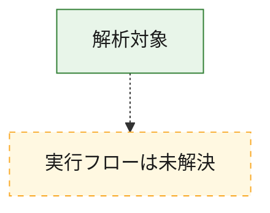
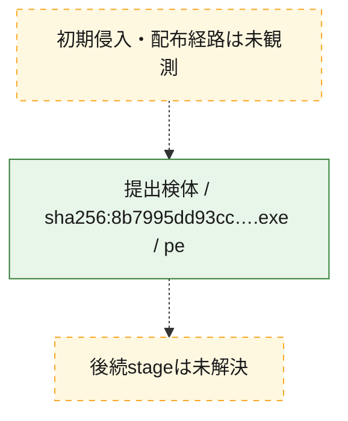
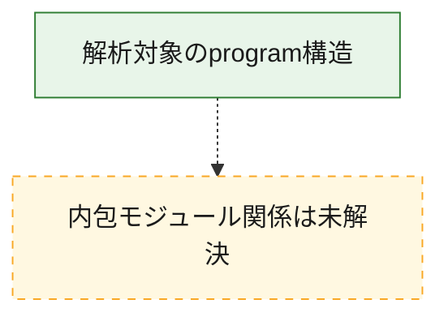

# 全体ロジック：8b7995dd93cc355f0a56eca0c4e7176d41f36a2573a62fa4bf62322086504379

全体ロジックを構成できませんでした。

## 読み方

- 処理順の根拠は未記録です。
- 図の実線は静的に観測した関係、点線と黄色のノードは未観測・未解決の関係を示します。
- 図は静的な要約であり、動的実行を再現するものではありません。
- 詳細な関数解説とfingerprintは[STATIC-LOGIC.md](STATIC-LOGIC.md)を参照してください。

## 静的可視化

### 実行フロー

### 感染チェーン

### モジュール関係

## 処理段階

- 処理段階は未解決です。

## 観測したcall関係

- 代表関数間で直接解決できた呼出関係はありません。

## 解析範囲と制約

- 関数境界、call graph、逆コンパイル結果はまだ記録されていません。
- binaryはGhidra MCP等による明示的な関数レビューが必要です。
