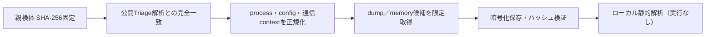

# Triage公開解析・後段取得証跡

## 完全ハッシュ一致

- [260805-wx3q1adn5t](https://tria.ge/260805-wx3q1adn5t): ファミリー候補 `remcos`、評価score `10`
- [260805-pwkepsxgqe](https://tria.ge/260805-pwkepsxgqe): ファミリー候補 `remcos`、評価score `10`
- [260801-mzb7dshe95](https://tria.ge/260801-mzb7dshe95): ファミリー候補 `remcos`、評価score `10`

## プロセス・通信

- 観測process: `2026-08-01_6ba3fe34b8f8d531b3d711ef8663de70_cobalt-strike_coinminer_icedid_njrat_remcos_vidar.exe, 64bit-remcos_a.exe, 64bit-remcosa.bin.exe`
- raw commandは保存せず、command SHA-256と処理patternだけをJSONへ保持しています。
- sandbox background trafficは`context_only`であり、C2へ自動昇格しません。

- `www.ikukuomaproject.com:2404`（sandbox config候補）
- `www.ikukuomaprojectbackup.com:2404`（sandbox config候補）
- `www.ikukuomaprojectbackup1.com:2404`（sandbox config候補）
- `www.ikukuomaprojectbackup2.com:2404`（sandbox config候補）

## 二段目成果物

- 取得できませんでした。

## 判定境界

Triage由来のfamily、process、config、通信は外部sandbox証跡です。config extractorが返したendpointはC2候補として扱えますが、
静的設定復元またはprocess帰属とprotocol応答が揃うまでは確認済みC2とはしません。取得成果物と検体は実行していません。
