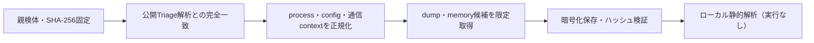

# Triage公開解析・後段取得証跡

## 完全ハッシュ一致

- [260826-qe1wssw1dt](https://tria.ge/260826-qe1wssw1dt): ファミリー候補 `未確定`、評価score `None`

## プロセス・通信

- 観測process: `取得できず`
- raw commandは保存せず、command SHA-256と処理patternだけをJSONへ保持します。
- sandbox background trafficは`context_only`であり、C2へ自動昇格しません。

- 取得できませんでした。

## 後段取得物

- `a066653583d5f51283580bf248af97d0f5d97732bbe463acb360eb460a0b7d2c` / `memory_image` / 241664 bytes / 親と同一: `false` / 静的解析: `partial`
- `c04b769cf39cfae4051793c4bab966a25b205d8dea1d340baa4a2ccb4db02240` / `memory_image` / 241664 bytes / 親と同一: `false` / 静的解析: `partial`
- `b7d05dc603589afde5df1a33bb69f956796a18c7e593adfd5126a593a5cfd689` / `memory_image` / 241664 bytes / 親と同一: `false` / 静的解析: `partial`
- `95f4a7834f3c48e202e695183ddf415e6d344dd0f2ab79435c5f1cf6a11885ed` / `memory_image` / 241664 bytes / 親と同一: `false` / 静的解析: `partial`

## 判定境界

Triage由来のfamily、process、config、通信は外部sandbox証跡です。Config extractorが返したendpointはC2候補として扱いますが、静的設定復元またはprocess帰属とprotocol応答が揃うまでは確認済みC2とはしません。取得成果物と検体は実行していません。
