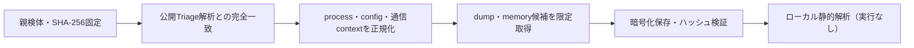

# Triage公開解析・後段取得証跡

## 完全ハッシュ一致

- [260924-wfwlcsssfx](https://tria.ge/260924-wfwlcsssfx): ファミリー候補 `未確定`、評価score `7`

## プロセス・通信

- 観測process: `AutoIt3.exe, at.exe, file.exe`
- raw commandは保存せず、command SHA-256と処理patternだけをJSONへ保持します。
- sandbox background trafficは`context_only`であり、C2へ自動昇格しません。

- 取得できませんでした。

## 後段取得物

- `c6d46745330deebe2d50846e0761cecf45e38630a86c0df32d33408464b09045` / `memory_image` / 2052096 bytes / 親と同一: `false` / 静的解析: `未実施`
- `204c1a7ce9c095a7f2c94e903b36bc0472cc62650618a6da475a1fe4cd1bb49e` / `memory_image` / 4096 bytes / 親と同一: `false` / 静的解析: `partial`
- `711c0396e298d17b744fca0338c6ac446e17433e3e26b168a53f0b5a39251752` / `memory_image` / 241664 bytes / 親と同一: `false` / 静的解析: `未実施`
- `9106c8143a9e2197b534378b6caa49f8c1e8caad9f4db0d636086f99f2f58efd` / `memory_image` / 241664 bytes / 親と同一: `false` / 静的解析: `未実施`
- `246537de1eaf21d305875550a6ae0dff9db89fbc41a037e4b7b26e1cc9aec4f5` / `memory_image` / 241664 bytes / 親と同一: `false` / 静的解析: `未実施`
- `a5bf32d357b4a04066f82e57305d5e60ef1ce0ff4e733e1298153844a5a81bcd` / `memory_image` / 241664 bytes / 親と同一: `false` / 静的解析: `未実施`
- `46e00092a314a76fcf1c79352f503f8225a839fa2315266c924070641ea6408e` / `memory_image` / 241664 bytes / 親と同一: `false` / 静的解析: `未実施`
- `db9a31ba19a50c87213c8357ce18ffbbda536f20da11a999dc7616d032803d7b` / `memory_image` / 241664 bytes / 親と同一: `false` / 静的解析: `未実施`

## 判定境界

Triage由来のfamily、process、config、通信は外部sandbox証跡です。Config extractorが返したendpointはC2候補として扱いますが、静的設定復元またはprocess帰属とprotocol応答が揃うまでは確認済みC2とはしません。取得成果物と検体は実行していません。
