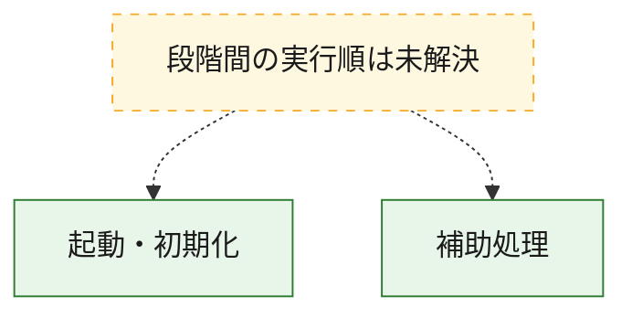
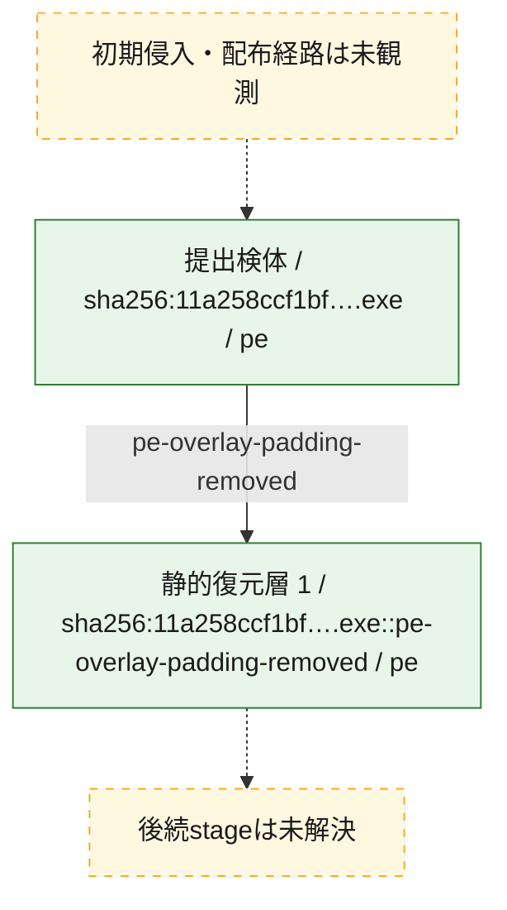
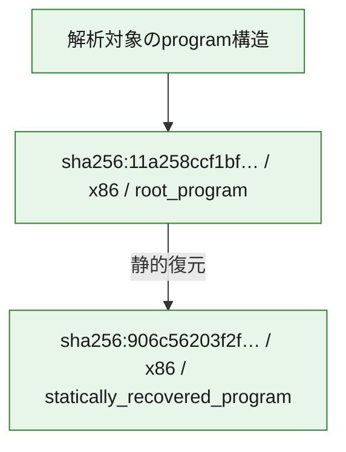

# 全体ロジック：11a258ccf1bf0cc0a8edfd2b5afda3e7bf6b1b4b25936ff32e7db5b48514b66b

代表関数の静的証跡から、起動・初期化の処理群を確認しました。

## 読み方

- phaseの掲載順は解析上の整理順です。observed_call_edgesがない段階間の実行順を断定しません。
- 図の実線は静的に観測した関係、点線と黄色のノードは未観測・未解決の関係を示します。
- 図は静的な要約であり、動的実行を再現するものではありません。
- 詳細な関数解説とfingerprintは[STATIC-LOGIC.md](STATIC-LOGIC.md)を参照してください。

## 静的可視化

### 実行フロー

### 感染チェーン

### モジュール関係

## 処理段階

### 1. 起動・初期化

entry pointから初期化と後続処理への移行を確認します。
確度: `confirmed_static_function_evidence`

- `906c56203f2f9808af02ae0dfe5c409947109118a38ef0113b8f076ebe2f4d8e:ghidra:14000ae70` — 初期化と主要処理への分岐を行う入口関数です。 状態: `succeeded`、選定理由: `entry_point`, `meaningful_symbol_name`, `reviewed_call_centrality:21`, `role:entrypoint`
- `11a258ccf1bf0cc0a8edfd2b5afda3e7bf6b1b4b25936ff32e7db5b48514b66b:ghidra:14000ae70` — 初期化と主要処理への分岐を行う入口関数です。 状態: `succeeded`、選定理由: `entry_point`, `meaningful_symbol_name`, `reviewed_call_centrality:21`, `role:entrypoint`

### 2. 補助処理

主要処理を支える一般内部関数またはlibrary処理を確認します。
確度: `confirmed_static_function_evidence_with_limits`

- `906c56203f2f9808af02ae0dfe5c409947109118a38ef0113b8f076ebe2f4d8e:ghidra:140001000` — 検体内部の一般処理を実装する関数です。 状態: `succeeded`、選定理由: `context_representative`, `reviewed_call_centrality:5`
- `906c56203f2f9808af02ae0dfe5c409947109118a38ef0113b8f076ebe2f4d8e:ghidra:140001080` — 検体内部の一般処理を実装する関数です。 状態: `succeeded`、選定理由: `context_representative`, `reviewed_call_centrality:3`
- `906c56203f2f9808af02ae0dfe5c409947109118a38ef0113b8f076ebe2f4d8e:ghidra:1400010b0` — 検体内部の一般処理を実装する関数です。 状態: `succeeded`、選定理由: `context_representative`, `reviewed_call_centrality:1`
- `906c56203f2f9808af02ae0dfe5c409947109118a38ef0113b8f076ebe2f4d8e:ghidra:140001110` — 検体内部の一般処理を実装する関数です。 状態: `succeeded`、選定理由: `context_representative`, `reviewed_call_centrality:2`
- `906c56203f2f9808af02ae0dfe5c409947109118a38ef0113b8f076ebe2f4d8e:ghidra:1400011b0` — 検体内部の一般処理を実装する関数です。 状態: `succeeded`、選定理由: `context_representative`, `reviewed_call_centrality:4`
- `906c56203f2f9808af02ae0dfe5c409947109118a38ef0113b8f076ebe2f4d8e:ghidra:1400011d0` — 検体内部の一般処理を実装する関数です。 状態: `succeeded`、選定理由: `context_representative`, `reviewed_call_centrality:1`
- `906c56203f2f9808af02ae0dfe5c409947109118a38ef0113b8f076ebe2f4d8e:ghidra:140001210` — 検体内部の一般処理を実装する関数です。 状態: `succeeded`、選定理由: `context_representative`, `reviewed_call_centrality:1`
- `906c56203f2f9808af02ae0dfe5c409947109118a38ef0113b8f076ebe2f4d8e:ghidra:140001250` — 検体内部の一般処理を実装する関数です。 状態: `succeeded`、選定理由: `context_representative`, `reviewed_call_centrality:3`
- `906c56203f2f9808af02ae0dfe5c409947109118a38ef0113b8f076ebe2f4d8e:ghidra:1400012a0` — 検体内部の一般処理を実装する関数です。 状態: `succeeded`、選定理由: `context_representative`, `reviewed_call_centrality:3`
- `906c56203f2f9808af02ae0dfe5c409947109118a38ef0113b8f076ebe2f4d8e:ghidra:1400012c0` — 検体内部の一般処理を実装する関数です。 状態: `succeeded`、選定理由: `context_representative`, `reviewed_call_centrality:1`
- `906c56203f2f9808af02ae0dfe5c409947109118a38ef0113b8f076ebe2f4d8e:ghidra:140001300` — 検体内部の一般処理を実装する関数です。 状態: `succeeded`、選定理由: `context_representative`, `reviewed_call_centrality:2`
- `906c56203f2f9808af02ae0dfe5c409947109118a38ef0113b8f076ebe2f4d8e:ghidra:140001320` — 検体内部の一般処理を実装する関数です。 状態: `succeeded`、選定理由: `context_representative`, `reviewed_call_centrality:1`
- `906c56203f2f9808af02ae0dfe5c409947109118a38ef0113b8f076ebe2f4d8e:ghidra:140001370` — 検体内部の一般処理を実装する関数です。 状態: `succeeded`、選定理由: `context_representative`
- `906c56203f2f9808af02ae0dfe5c409947109118a38ef0113b8f076ebe2f4d8e:ghidra:1400013f0` — 検体内部の一般処理を実装する関数です。 状態: `succeeded`、選定理由: `context_representative`, `reviewed_call_centrality:10`
- `906c56203f2f9808af02ae0dfe5c409947109118a38ef0113b8f076ebe2f4d8e:ghidra:140001690` — 検体内部の一般処理を実装する関数です。 状態: `succeeded`、選定理由: `context_representative`, `reviewed_call_centrality:2`
- `906c56203f2f9808af02ae0dfe5c409947109118a38ef0113b8f076ebe2f4d8e:ghidra:1400016e0` — 検体内部の一般処理を実装する関数です。 状態: `succeeded`、選定理由: `context_representative`, `reviewed_call_centrality:1`
- `906c56203f2f9808af02ae0dfe5c409947109118a38ef0113b8f076ebe2f4d8e:ghidra:140001740` — 検体内部の一般処理を実装する関数です。 状態: `succeeded`、選定理由: `context_representative`, `reviewed_call_centrality:1`
- `906c56203f2f9808af02ae0dfe5c409947109118a38ef0113b8f076ebe2f4d8e:ghidra:1400017a0` — 検体内部の一般処理を実装する関数です。 状態: `succeeded`、選定理由: `context_representative`, `reviewed_call_centrality:3`
- `906c56203f2f9808af02ae0dfe5c409947109118a38ef0113b8f076ebe2f4d8e:ghidra:140001830` — 検体内部の一般処理を実装する関数です。 状態: `succeeded`、選定理由: `context_representative`, `reviewed_call_centrality:1`
- `906c56203f2f9808af02ae0dfe5c409947109118a38ef0113b8f076ebe2f4d8e:ghidra:140001860` — 検体内部の一般処理を実装する関数です。 状態: `succeeded`、選定理由: `context_representative`, `reviewed_call_centrality:1`
- `906c56203f2f9808af02ae0dfe5c409947109118a38ef0113b8f076ebe2f4d8e:ghidra:1400018b0` — 検体内部の一般処理を実装する関数です。 状態: `limited_bad_instruction_or_flow`、選定理由: `context_representative`
- `906c56203f2f9808af02ae0dfe5c409947109118a38ef0113b8f076ebe2f4d8e:ghidra:1400018f0` — 検体内部の一般処理を実装する関数です。 状態: `succeeded`、選定理由: `context_representative`, `reviewed_call_centrality:9`
- `906c56203f2f9808af02ae0dfe5c409947109118a38ef0113b8f076ebe2f4d8e:ghidra:140001a90` — 検体内部の一般処理を実装する関数です。 状態: `succeeded`、選定理由: `context_representative`, `reviewed_call_centrality:1`
- `906c56203f2f9808af02ae0dfe5c409947109118a38ef0113b8f076ebe2f4d8e:ghidra:140001af0` — 検体内部の一般処理を実装する関数です。 状態: `succeeded`、選定理由: `context_representative`, `reviewed_call_centrality:1`
- `906c56203f2f9808af02ae0dfe5c409947109118a38ef0113b8f076ebe2f4d8e:ghidra:140001b50` — 検体内部の一般処理を実装する関数です。 状態: `succeeded`、選定理由: `context_representative`, `reviewed_call_centrality:1`
- `906c56203f2f9808af02ae0dfe5c409947109118a38ef0113b8f076ebe2f4d8e:ghidra:140001b70` — 検体内部の一般処理を実装する関数です。 状態: `succeeded`、選定理由: `context_representative`, `reviewed_call_centrality:1`
- `906c56203f2f9808af02ae0dfe5c409947109118a38ef0113b8f076ebe2f4d8e:ghidra:140001b90` — 検体内部の一般処理を実装する関数です。 状態: `succeeded`、選定理由: `context_representative`, `reviewed_call_centrality:2`
- `906c56203f2f9808af02ae0dfe5c409947109118a38ef0113b8f076ebe2f4d8e:ghidra:140001c00` — 検体内部の一般処理を実装する関数です。 状態: `succeeded`、選定理由: `context_representative`, `reviewed_call_centrality:5`
- `906c56203f2f9808af02ae0dfe5c409947109118a38ef0113b8f076ebe2f4d8e:ghidra:140001cd0` — 検体内部の一般処理を実装する関数です。 状態: `succeeded`、選定理由: `context_representative`, `reviewed_call_centrality:1`
- `906c56203f2f9808af02ae0dfe5c409947109118a38ef0113b8f076ebe2f4d8e:ghidra:140001d30` — 検体内部の一般処理を実装する関数です。 状態: `succeeded`、選定理由: `context_representative`, `reviewed_call_centrality:2`
- `906c56203f2f9808af02ae0dfe5c409947109118a38ef0113b8f076ebe2f4d8e:ghidra:1400072e0` — 検体内部の一般処理を実装する関数です。 状態: `succeeded`、選定理由: `meaningful_symbol_name`
- `11a258ccf1bf0cc0a8edfd2b5afda3e7bf6b1b4b25936ff32e7db5b48514b66b:ghidra:140001000` — 検体内部の一般処理を実装する関数です。 状態: `succeeded`、選定理由: `context_representative`, `reviewed_call_centrality:5`
- `11a258ccf1bf0cc0a8edfd2b5afda3e7bf6b1b4b25936ff32e7db5b48514b66b:ghidra:140001080` — 検体内部の一般処理を実装する関数です。 状態: `succeeded`、選定理由: `context_representative`, `reviewed_call_centrality:3`
- `11a258ccf1bf0cc0a8edfd2b5afda3e7bf6b1b4b25936ff32e7db5b48514b66b:ghidra:1400010b0` — 検体内部の一般処理を実装する関数です。 状態: `succeeded`、選定理由: `context_representative`, `reviewed_call_centrality:1`
- `11a258ccf1bf0cc0a8edfd2b5afda3e7bf6b1b4b25936ff32e7db5b48514b66b:ghidra:140001110` — 検体内部の一般処理を実装する関数です。 状態: `succeeded`、選定理由: `context_representative`, `reviewed_call_centrality:2`
- `11a258ccf1bf0cc0a8edfd2b5afda3e7bf6b1b4b25936ff32e7db5b48514b66b:ghidra:1400011b0` — 検体内部の一般処理を実装する関数です。 状態: `succeeded`、選定理由: `context_representative`, `reviewed_call_centrality:4`
- `11a258ccf1bf0cc0a8edfd2b5afda3e7bf6b1b4b25936ff32e7db5b48514b66b:ghidra:1400011d0` — 検体内部の一般処理を実装する関数です。 状態: `succeeded`、選定理由: `context_representative`, `reviewed_call_centrality:1`
- `11a258ccf1bf0cc0a8edfd2b5afda3e7bf6b1b4b25936ff32e7db5b48514b66b:ghidra:140001210` — 検体内部の一般処理を実装する関数です。 状態: `succeeded`、選定理由: `context_representative`, `reviewed_call_centrality:1`
- `11a258ccf1bf0cc0a8edfd2b5afda3e7bf6b1b4b25936ff32e7db5b48514b66b:ghidra:140001250` — 検体内部の一般処理を実装する関数です。 状態: `succeeded`、選定理由: `context_representative`, `reviewed_call_centrality:3`
- `11a258ccf1bf0cc0a8edfd2b5afda3e7bf6b1b4b25936ff32e7db5b48514b66b:ghidra:1400012a0` — 検体内部の一般処理を実装する関数です。 状態: `succeeded`、選定理由: `context_representative`, `reviewed_call_centrality:3`
- `11a258ccf1bf0cc0a8edfd2b5afda3e7bf6b1b4b25936ff32e7db5b48514b66b:ghidra:1400012c0` — 検体内部の一般処理を実装する関数です。 状態: `succeeded`、選定理由: `context_representative`, `reviewed_call_centrality:1`
- `11a258ccf1bf0cc0a8edfd2b5afda3e7bf6b1b4b25936ff32e7db5b48514b66b:ghidra:140001300` — 検体内部の一般処理を実装する関数です。 状態: `succeeded`、選定理由: `context_representative`, `reviewed_call_centrality:2`
- `11a258ccf1bf0cc0a8edfd2b5afda3e7bf6b1b4b25936ff32e7db5b48514b66b:ghidra:140001320` — 検体内部の一般処理を実装する関数です。 状態: `succeeded`、選定理由: `context_representative`, `reviewed_call_centrality:1`
- `11a258ccf1bf0cc0a8edfd2b5afda3e7bf6b1b4b25936ff32e7db5b48514b66b:ghidra:140001370` — 検体内部の一般処理を実装する関数です。 状態: `succeeded`、選定理由: `context_representative`
- `11a258ccf1bf0cc0a8edfd2b5afda3e7bf6b1b4b25936ff32e7db5b48514b66b:ghidra:1400013f0` — 検体内部の一般処理を実装する関数です。 状態: `succeeded`、選定理由: `context_representative`, `reviewed_call_centrality:10`
- `11a258ccf1bf0cc0a8edfd2b5afda3e7bf6b1b4b25936ff32e7db5b48514b66b:ghidra:140001690` — 検体内部の一般処理を実装する関数です。 状態: `succeeded`、選定理由: `context_representative`, `reviewed_call_centrality:2`
- `11a258ccf1bf0cc0a8edfd2b5afda3e7bf6b1b4b25936ff32e7db5b48514b66b:ghidra:1400016e0` — 検体内部の一般処理を実装する関数です。 状態: `succeeded`、選定理由: `context_representative`, `reviewed_call_centrality:1`
- `11a258ccf1bf0cc0a8edfd2b5afda3e7bf6b1b4b25936ff32e7db5b48514b66b:ghidra:140001740` — 検体内部の一般処理を実装する関数です。 状態: `succeeded`、選定理由: `context_representative`, `reviewed_call_centrality:1`
- `11a258ccf1bf0cc0a8edfd2b5afda3e7bf6b1b4b25936ff32e7db5b48514b66b:ghidra:1400017a0` — 検体内部の一般処理を実装する関数です。 状態: `succeeded`、選定理由: `context_representative`, `reviewed_call_centrality:3`
- `11a258ccf1bf0cc0a8edfd2b5afda3e7bf6b1b4b25936ff32e7db5b48514b66b:ghidra:140001830` — 検体内部の一般処理を実装する関数です。 状態: `succeeded`、選定理由: `context_representative`, `reviewed_call_centrality:1`
- `11a258ccf1bf0cc0a8edfd2b5afda3e7bf6b1b4b25936ff32e7db5b48514b66b:ghidra:140001860` — 検体内部の一般処理を実装する関数です。 状態: `succeeded`、選定理由: `context_representative`, `reviewed_call_centrality:1`
- `11a258ccf1bf0cc0a8edfd2b5afda3e7bf6b1b4b25936ff32e7db5b48514b66b:ghidra:1400018b0` — 検体内部の一般処理を実装する関数です。 状態: `limited_bad_instruction_or_flow`、選定理由: `context_representative`
- `11a258ccf1bf0cc0a8edfd2b5afda3e7bf6b1b4b25936ff32e7db5b48514b66b:ghidra:1400018f0` — 検体内部の一般処理を実装する関数です。 状態: `succeeded`、選定理由: `context_representative`, `reviewed_call_centrality:9`
- `11a258ccf1bf0cc0a8edfd2b5afda3e7bf6b1b4b25936ff32e7db5b48514b66b:ghidra:140001a90` — 検体内部の一般処理を実装する関数です。 状態: `succeeded`、選定理由: `context_representative`, `reviewed_call_centrality:1`
- `11a258ccf1bf0cc0a8edfd2b5afda3e7bf6b1b4b25936ff32e7db5b48514b66b:ghidra:140001af0` — 検体内部の一般処理を実装する関数です。 状態: `succeeded`、選定理由: `context_representative`, `reviewed_call_centrality:1`
- `11a258ccf1bf0cc0a8edfd2b5afda3e7bf6b1b4b25936ff32e7db5b48514b66b:ghidra:140001b50` — 検体内部の一般処理を実装する関数です。 状態: `succeeded`、選定理由: `context_representative`, `reviewed_call_centrality:1`
- `11a258ccf1bf0cc0a8edfd2b5afda3e7bf6b1b4b25936ff32e7db5b48514b66b:ghidra:140001b70` — 検体内部の一般処理を実装する関数です。 状態: `succeeded`、選定理由: `context_representative`, `reviewed_call_centrality:1`
- `11a258ccf1bf0cc0a8edfd2b5afda3e7bf6b1b4b25936ff32e7db5b48514b66b:ghidra:140001b90` — 検体内部の一般処理を実装する関数です。 状態: `succeeded`、選定理由: `context_representative`, `reviewed_call_centrality:2`
- `11a258ccf1bf0cc0a8edfd2b5afda3e7bf6b1b4b25936ff32e7db5b48514b66b:ghidra:140001c00` — 検体内部の一般処理を実装する関数です。 状態: `succeeded`、選定理由: `context_representative`, `reviewed_call_centrality:5`
- `11a258ccf1bf0cc0a8edfd2b5afda3e7bf6b1b4b25936ff32e7db5b48514b66b:ghidra:140001cd0` — 検体内部の一般処理を実装する関数です。 状態: `succeeded`、選定理由: `context_representative`, `reviewed_call_centrality:1`
- `11a258ccf1bf0cc0a8edfd2b5afda3e7bf6b1b4b25936ff32e7db5b48514b66b:ghidra:140001d30` — 検体内部の一般処理を実装する関数です。 状態: `succeeded`、選定理由: `context_representative`, `reviewed_call_centrality:2`
- `11a258ccf1bf0cc0a8edfd2b5afda3e7bf6b1b4b25936ff32e7db5b48514b66b:ghidra:1400072e0` — 検体内部の一般処理を実装する関数です。 状態: `succeeded`、選定理由: `meaningful_symbol_name`

## 観測したcall関係

- 代表関数間で直接解決できた呼出関係はありません。

## 解析範囲と制約

- 選定外関数は全体inventoryへ残しますが、関数本体の個別解説対象にはしていません。
- indirect call、難読化、packer、VM、壊れたcontrol flowによりcall関係が欠落する場合があります。
- 文書は静的解析に基づき、検体実行や外部通信による動的確認は行っていません。
