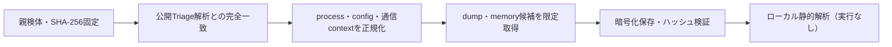

# Triage公開解析・後段取得証跡

## 完全ハッシュ一致

- [260822-aj5sjsej7s](https://tria.ge/260822-aj5sjsej7s): ファミリー候補 `未確定`、評価score `None`
- [260821-3pd61adp6w](https://tria.ge/260821-3pd61adp6w): ファミリー候補 `未確定`、評価score `None`

## プロセス・通信

- 観測process: `取得できず`
- raw commandは保存せず、command SHA-256と処理patternだけをJSONへ保持します。
- sandbox background trafficは`context_only`であり、C2へ自動昇格しません。

- 取得できませんでした。

## 後段取得物

- `e3b5c430a1424a589c5edf6dfbde8dece5768233f46cea1a41a9dc614152e490` / `memory_image` / 237568 bytes / 親と同一: `false` / 静的解析: `partial`
- `a1555b55b25df2415b64ccc5d6d0660b8d99360cf74fdf448411441a02be029e` / `memory_image` / 237568 bytes / 親と同一: `false` / 静的解析: `partial`
- `cf43c3b60ac6967e57e908edf9d7f7c580a9eaba45fed910b2a0ab4155a94516` / `memory_image` / 237568 bytes / 親と同一: `false` / 静的解析: `partial`
- `fe1212cb651329eb04ac9e64b83cf03ec2f28726afe5b3e1cec07d7fc47079fc` / `memory_image` / 237568 bytes / 親と同一: `false` / 静的解析: `partial`
- `c54d1f49a015d1f25f576c69ffdac861f4a49148a5a73410f141307241a44b77` / `memory_image` / 237568 bytes / 親と同一: `false` / 静的解析: `partial`
- `4612f228808b0b45224c14aa2db5190befe24249b8279c183552d0b04ac01d2d` / `memory_image` / 237568 bytes / 親と同一: `false` / 静的解析: `partial`
- `f60093638a02a050929efc18f1741d79fe0fb6370949cfc441bbe87529eee9d9` / `memory_image` / 237568 bytes / 親と同一: `false` / 静的解析: `partial`
- `6d77d46586b5dbe2cd6866d112c1c6175d659e48d88695d6c1e478d4371591b0` / `memory_image` / 237568 bytes / 親と同一: `false` / 静的解析: `partial`
- `f4f92a333ff9c87da9d243632c754fe0a40071f20817109c3ce6b2c3e4905f41` / `memory_image` / 237568 bytes / 親と同一: `false` / 静的解析: `partial`
- `8263a178b6dc0af57735f0ecaf406d316f405616b37fe5f719fb00ebc14921f2` / `memory_image` / 237568 bytes / 親と同一: `false` / 静的解析: `partial`
- `7b3d24fa4de894991129432d6ffba5d1c17bb6c3f45fac2731c0706b8ac18eec` / `memory_image` / 237568 bytes / 親と同一: `false` / 静的解析: `partial`
- `b1dc8ba5324a8e2c375cb4e034e12b69f785b5357093d81c042870ae80398c5d` / `memory_image` / 237568 bytes / 親と同一: `false` / 静的解析: `partial`

## 判定境界

Triage由来のfamily、process、config、通信は外部sandbox証跡です。Config extractorが返したendpointはC2候補として扱いますが、静的設定復元またはprocess帰属とprotocol応答が揃うまでは確認済みC2とはしません。取得成果物と検体は実行していません。
