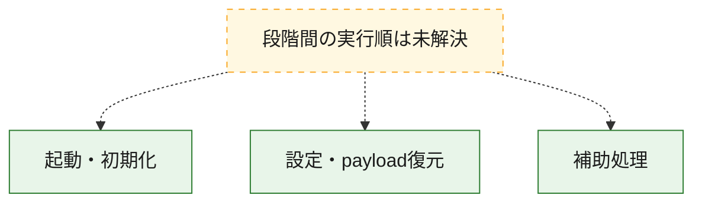
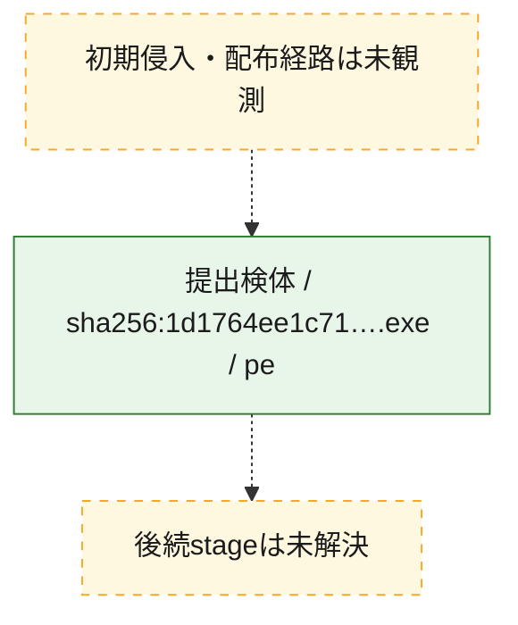
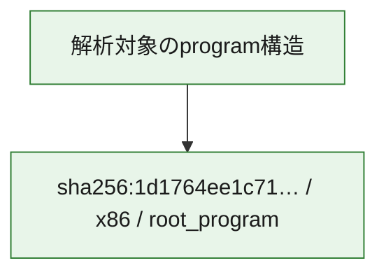

# 全体ロジック：1d1764ee1c71dd5da7339e1ac13b84fc6d041782ba66cd310bf268184fb43951

代表関数の静的証跡から、起動・初期化、設定・payload復元の処理群を確認しました。

## 読み方

- phaseの掲載順は解析上の整理順です。observed_call_edgesがない段階間の実行順を断定しません。
- 図の実線は静的に観測した関係、点線と黄色のノードは未観測・未解決の関係を示します。
- 図は静的な要約であり、動的実行を再現するものではありません。
- 詳細な関数解説とfingerprintは[STATIC-LOGIC.md](STATIC-LOGIC.md)を参照してください。

## 静的可視化

### 実行フロー

### 感染チェーン

### モジュール関係

## 処理段階

### 1. 起動・初期化

entry pointから初期化と後続処理への移行を確認します。
確度: `confirmed_static_function_evidence`

- `1d1764ee1c71dd5da7339e1ac13b84fc6d041782ba66cd310bf268184fb43951:ghidra:1400020a0` — 初期化と主要処理への分岐を行う入口関数です。 状態: `succeeded`、選定理由: `call_graph_centrality:in=0,out=8`, `entry_point`, `large_function:instructions=69`, `meaningful_symbol_name`, `reviewed_call_centrality:9`, `role:entrypoint`

### 2. 設定・payload復元

設定、resource、payload、暗号化データの復元・変換を確認します。
確度: `confirmed_static_function_evidence_with_limits`

- `1d1764ee1c71dd5da7339e1ac13b84fc6d041782ba66cd310bf268184fb43951:ghidra:14001e800` — 設定、resource、payloadなどの解析・変換を行う関数です。 状態: `failed`、選定理由: `call_graph_centrality:in=0,out=23`, `large_function:instructions=3017`, `reviewed_call_centrality:23`, `reviewed_call_centrality:27`, `role:config_or_data_transform`

### 3. 補助処理

主要処理を支える一般内部関数またはlibrary処理を確認します。
確度: `confirmed_static_function_evidence_with_limits`

- `1d1764ee1c71dd5da7339e1ac13b84fc6d041782ba66cd310bf268184fb43951:ghidra:140001040` — 検体内部の一般処理を実装する関数です。 状態: `succeeded`、選定理由: `call_graph_centrality:in=3,out=2`, `large_function:instructions=661`, `reviewed_call_centrality:5`
- `1d1764ee1c71dd5da7339e1ac13b84fc6d041782ba66cd310bf268184fb43951:ghidra:1400021d0` — 検体内部の一般処理を実装する関数です。 状態: `succeeded`、選定理由: `call_graph_centrality:in=1,out=5`, `large_function:instructions=536`, `reviewed_call_centrality:6`, `reviewed_call_centrality:7`
- `1d1764ee1c71dd5da7339e1ac13b84fc6d041782ba66cd310bf268184fb43951:ghidra:1400029d0` — 検体内部の一般処理を実装する関数です。 状態: `succeeded`、選定理由: `call_graph_centrality:in=1,out=3`, `large_function:instructions=470`, `reviewed_call_centrality:4`, `reviewed_call_centrality:5`
- `1d1764ee1c71dd5da7339e1ac13b84fc6d041782ba66cd310bf268184fb43951:ghidra:140003a90` — 検体内部の一般処理を実装する関数です。 状態: `succeeded`、選定理由: `call_graph_centrality:in=6,out=11`, `large_function:instructions=252`, `reviewed_call_centrality:17`, `reviewed_call_centrality:19`
- `1d1764ee1c71dd5da7339e1ac13b84fc6d041782ba66cd310bf268184fb43951:ghidra:1400040c0` — 検体内部の一般処理を実装する関数です。 状態: `succeeded`、選定理由: `call_graph_centrality:in=3,out=1`, `large_function:instructions=426`, `reviewed_call_centrality:4`, `reviewed_call_centrality:5`
- `1d1764ee1c71dd5da7339e1ac13b84fc6d041782ba66cd310bf268184fb43951:ghidra:1400056a0` — 検体内部の一般処理を実装する関数です。 状態: `succeeded`、選定理由: `call_graph_centrality:in=2,out=5`, `large_function:instructions=378`, `reviewed_call_centrality:7`, `reviewed_call_centrality:8`
- `1d1764ee1c71dd5da7339e1ac13b84fc6d041782ba66cd310bf268184fb43951:ghidra:140005cb0` — 検体内部の一般処理を実装する関数です。 状態: `succeeded`、選定理由: `call_graph_centrality:in=1,out=8`, `large_function:instructions=296`, `reviewed_call_centrality:10`, `reviewed_call_centrality:9`
- `1d1764ee1c71dd5da7339e1ac13b84fc6d041782ba66cd310bf268184fb43951:ghidra:140007a70` — 検体内部の一般処理を実装する関数です。 状態: `succeeded`、選定理由: `call_graph_centrality:in=0,out=38`, `large_function:instructions=451`, `reviewed_call_centrality:38`
- `1d1764ee1c71dd5da7339e1ac13b84fc6d041782ba66cd310bf268184fb43951:ghidra:140008320` — 検体内部の一般処理を実装する関数です。 状態: `succeeded`、選定理由: `call_graph_centrality:in=1,out=35`, `large_function:instructions=525`, `reviewed_call_centrality:36`, `reviewed_call_centrality:40`
- `1d1764ee1c71dd5da7339e1ac13b84fc6d041782ba66cd310bf268184fb43951:ghidra:140008bf0` — 検体内部の一般処理を実装する関数です。 状態: `succeeded`、選定理由: `call_graph_centrality:in=1,out=17`, `large_function:instructions=239`, `reviewed_call_centrality:18`
- `1d1764ee1c71dd5da7339e1ac13b84fc6d041782ba66cd310bf268184fb43951:ghidra:140008f80` — 検体内部の一般処理を実装する関数です。 状態: `succeeded`、選定理由: `call_graph_centrality:in=1,out=39`, `large_function:instructions=805`, `reviewed_call_centrality:40`, `reviewed_call_centrality:43`
- `1d1764ee1c71dd5da7339e1ac13b84fc6d041782ba66cd310bf268184fb43951:ghidra:140009d30` — 検体内部の一般処理を実装する関数です。 状態: `failed`、選定理由: `call_graph_centrality:in=1,out=23`, `large_function:instructions=588`, `reviewed_call_centrality:24`
- `1d1764ee1c71dd5da7339e1ac13b84fc6d041782ba66cd310bf268184fb43951:ghidra:14000a590` — 検体内部の一般処理を実装する関数です。 状態: `succeeded`、選定理由: `call_graph_centrality:in=1,out=20`, `large_function:instructions=377`, `reviewed_call_centrality:21`, `reviewed_call_centrality:23`
- `1d1764ee1c71dd5da7339e1ac13b84fc6d041782ba66cd310bf268184fb43951:ghidra:14000b3d0` — 検体内部の一般処理を実装する関数です。 状態: `succeeded`、選定理由: `call_graph_centrality:in=15,out=0`, `reviewed_call_centrality:15`
- `1d1764ee1c71dd5da7339e1ac13b84fc6d041782ba66cd310bf268184fb43951:ghidra:14000b3e0` — 検体内部の一般処理を実装する関数です。 状態: `succeeded`、選定理由: `call_graph_centrality:in=3,out=13`, `large_function:instructions=713`, `reviewed_call_centrality:16`, `reviewed_call_centrality:17`
- `1d1764ee1c71dd5da7339e1ac13b84fc6d041782ba66cd310bf268184fb43951:ghidra:140010060` — 検体内部の一般処理を実装する関数です。 状態: `limited_bad_instruction_or_flow`、選定理由: `call_graph_centrality:in=1,out=26`, `large_function:instructions=1083`, `reviewed_call_centrality:27`, `reviewed_call_centrality:37`
- `1d1764ee1c71dd5da7339e1ac13b84fc6d041782ba66cd310bf268184fb43951:ghidra:140012c80` — 検体内部の一般処理を実装する関数です。 状態: `limited_bad_instruction_or_flow`、選定理由: `call_graph_centrality:in=0,out=8`, `large_function:instructions=616`, `reviewed_call_centrality:8`
- `1d1764ee1c71dd5da7339e1ac13b84fc6d041782ba66cd310bf268184fb43951:ghidra:140014f20` — 検体内部の一般処理を実装する関数です。 状態: `succeeded`、選定理由: `call_graph_centrality:in=3,out=10`, `large_function:instructions=400`, `reviewed_call_centrality:13`, `reviewed_call_centrality:14`
- `1d1764ee1c71dd5da7339e1ac13b84fc6d041782ba66cd310bf268184fb43951:ghidra:140016ed0` — 検体内部の一般処理を実装する関数です。 状態: `succeeded`、選定理由: `call_graph_centrality:in=1,out=11`, `large_function:instructions=951`, `reviewed_call_centrality:12`, `reviewed_call_centrality:15`
- `1d1764ee1c71dd5da7339e1ac13b84fc6d041782ba66cd310bf268184fb43951:ghidra:14001ba50` — 検体内部の一般処理を実装する関数です。 状態: `succeeded`、選定理由: `call_graph_centrality:in=1,out=5`, `large_function:instructions=368`, `reviewed_call_centrality:6`, `reviewed_call_centrality:7`
- `1d1764ee1c71dd5da7339e1ac13b84fc6d041782ba66cd310bf268184fb43951:ghidra:14001c060` — 検体内部の一般処理を実装する関数です。 状態: `succeeded`、選定理由: `call_graph_centrality:in=1,out=15`, `large_function:instructions=357`, `reviewed_call_centrality:17`
- `1d1764ee1c71dd5da7339e1ac13b84fc6d041782ba66cd310bf268184fb43951:ghidra:140025340` — 検体内部の一般処理を実装する関数です。 状態: `failed`、選定理由: `call_graph_centrality:in=1,out=7`, `large_function:instructions=636`, `reviewed_call_centrality:8`
- `1d1764ee1c71dd5da7339e1ac13b84fc6d041782ba66cd310bf268184fb43951:ghidra:140026d80` — 検体内部の一般処理を実装する関数です。 状態: `succeeded`、選定理由: `call_graph_centrality:in=1,out=10`, `large_function:instructions=108`, `reviewed_call_centrality:11`
- `1d1764ee1c71dd5da7339e1ac13b84fc6d041782ba66cd310bf268184fb43951:ghidra:140026f30` — 検体内部の一般処理を実装する関数です。 状態: `limited_bad_instruction_or_flow`、選定理由: `call_graph_centrality:in=1,out=31`, `large_function:instructions=795`, `reviewed_call_centrality:32`, `reviewed_call_centrality:45`
- `1d1764ee1c71dd5da7339e1ac13b84fc6d041782ba66cd310bf268184fb43951:ghidra:1400290a0` — 検体内部の一般処理を実装する関数です。 状態: `succeeded`、選定理由: `call_graph_centrality:in=1,out=11`, `large_function:instructions=202`, `reviewed_call_centrality:12`, `reviewed_call_centrality:14`
- `1d1764ee1c71dd5da7339e1ac13b84fc6d041782ba66cd310bf268184fb43951:ghidra:14002af20` — 検体内部の一般処理を実装する関数です。 状態: `limited_bad_instruction_or_flow`、選定理由: `call_graph_centrality:in=34,out=2`, `reviewed_call_centrality:36`
- `1d1764ee1c71dd5da7339e1ac13b84fc6d041782ba66cd310bf268184fb43951:ghidra:14002af60` — 検体内部の一般処理を実装する関数です。 状態: `limited_bad_instruction_or_flow`、選定理由: `call_graph_centrality:in=22,out=2`, `reviewed_call_centrality:24`
- `1d1764ee1c71dd5da7339e1ac13b84fc6d041782ba66cd310bf268184fb43951:ghidra:14002c070` — 検体内部の一般処理を実装する関数です。 状態: `succeeded`、選定理由: `call_graph_centrality:in=31,out=0`, `reviewed_call_centrality:31`, `reviewed_call_centrality:32`
- `1d1764ee1c71dd5da7339e1ac13b84fc6d041782ba66cd310bf268184fb43951:ghidra:14002ccd0` — 検体内部の一般処理を実装する関数です。 状態: `limited_bad_instruction_or_flow`、選定理由: `call_graph_centrality:in=10,out=0`, `large_function:instructions=160`, `reviewed_call_centrality:10`
- `1d1764ee1c71dd5da7339e1ac13b84fc6d041782ba66cd310bf268184fb43951:ghidra:14002ee60` — 検体内部の一般処理を実装する関数です。 状態: `succeeded`、選定理由: `call_graph_centrality:in=8,out=3`, `large_function:instructions=154`, `reviewed_call_centrality:11`, `reviewed_call_centrality:14`

## 観測したcall関係

- 代表関数間で直接解決できた呼出関係はありません。

## 解析範囲と制約

- 選定外関数は全体inventoryへ残しますが、関数本体の個別解説対象にはしていません。
- indirect call、難読化、packer、VM、壊れたcontrol flowによりcall関係が欠落する場合があります。
- 文書は静的解析に基づき、検体実行や外部通信による動的確認は行っていません。
