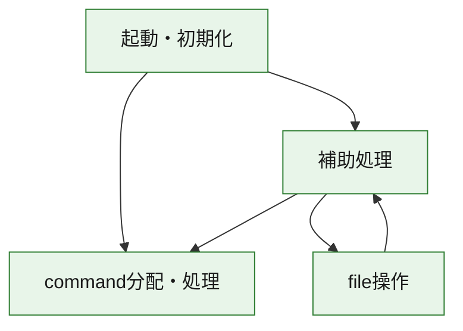
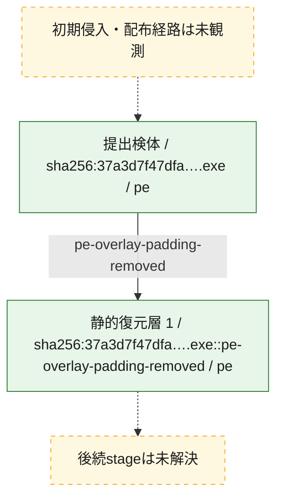
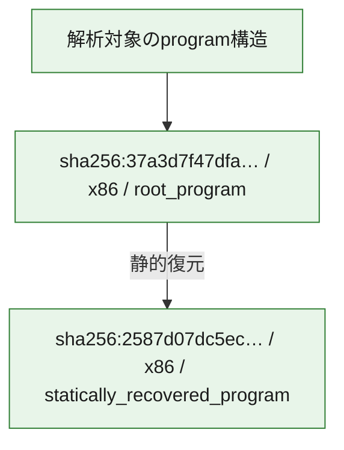

# 全体ロジック：37a3d7f47dfaff63354658895d972008f6f5020c4b0936b49d76afdf1f2ad3c8

代表関数の静的証跡から、起動・初期化、command分配・処理、file操作の処理群を確認しました。

## 読み方

- phaseの掲載順は解析上の整理順です。observed_call_edgesがない段階間の実行順を断定しません。
- 図の実線は静的に観測した関係、点線と黄色のノードは未観測・未解決の関係を示します。
- 図は静的な要約であり、動的実行を再現するものではありません。
- 詳細な関数解説とfingerprintは[STATIC-LOGIC.md](STATIC-LOGIC.md)を参照してください。

## 静的可視化

### 実行フロー

### 感染チェーン

### モジュール関係

## 処理段階

### 1. 起動・初期化

entry pointから初期化と後続処理への移行を確認します。
確度: `confirmed_static_function_evidence`

- `2587d07dc5ece3ce2a7d3d9146dae43baf6138ec921036c3a17b8419f0d34206:ghidra:140003fb0` — 初期化と主要処理への分岐を行う入口関数です。 状態: `succeeded`、選定理由: `entry_point`, `meaningful_symbol_name`, `reviewed_call_centrality:21`, `role:entrypoint`
- `37a3d7f47dfaff63354658895d972008f6f5020c4b0936b49d76afdf1f2ad3c8:ghidra:140003fb0` — 初期化と主要処理への分岐を行う入口関数です。 状態: `succeeded`、選定理由: `entry_point`, `meaningful_symbol_name`, `reviewed_call_centrality:21`, `role:entrypoint`

### 2. command分配・処理

受信commandやtaskの解釈、分配、個別handlerへの移行を確認します。
確度: `confirmed_static_function_evidence_with_limits`

- `2587d07dc5ece3ce2a7d3d9146dae43baf6138ec921036c3a17b8419f0d34206:ghidra:140012540` — commandの解釈、分配、または個別処理を担当する関数です。 状態: `limited_bad_instruction_or_flow`、選定理由: `meaningful_symbol_name`, `reviewed_call_centrality:2`, `role:command_dispatch_or_handler`
- `37a3d7f47dfaff63354658895d972008f6f5020c4b0936b49d76afdf1f2ad3c8:ghidra:140012540` — commandの解釈、分配、または個別処理を担当する関数です。 状態: `limited_bad_instruction_or_flow`、選定理由: `meaningful_symbol_name`, `reviewed_call_centrality:2`, `role:command_dispatch_or_handler`

### 3. file操作

fileやdirectoryの作成、読書き、削除を確認します。
確度: `confirmed_static_function_evidence`

- `2587d07dc5ece3ce2a7d3d9146dae43baf6138ec921036c3a17b8419f0d34206:ghidra:140001be0` — fileまたはdirectoryの読書き・管理に関係する関数です。 状態: `succeeded`、選定理由: `context_representative`, `reviewed_call_centrality:29`, `role:file_operation`
- `37a3d7f47dfaff63354658895d972008f6f5020c4b0936b49d76afdf1f2ad3c8:ghidra:140001be0` — fileまたはdirectoryの読書き・管理に関係する関数です。 状態: `succeeded`、選定理由: `context_representative`, `reviewed_call_centrality:29`, `role:file_operation`

### 4. 補助処理

主要処理を支える一般内部関数またはlibrary処理を確認します。
確度: `confirmed_static_function_evidence`

- `2587d07dc5ece3ce2a7d3d9146dae43baf6138ec921036c3a17b8419f0d34206:ghidra:140001010` — 検体内部の一般処理を実装する関数です。 状態: `succeeded`、選定理由: `context_representative`, `reviewed_call_centrality:1`
- `2587d07dc5ece3ce2a7d3d9146dae43baf6138ec921036c3a17b8419f0d34206:ghidra:140001070` — 検体内部の一般処理を実装する関数です。 状態: `succeeded`、選定理由: `context_representative`, `reviewed_call_centrality:2`
- `2587d07dc5ece3ce2a7d3d9146dae43baf6138ec921036c3a17b8419f0d34206:ghidra:140001110` — 検体内部の一般処理を実装する関数です。 状態: `succeeded`、選定理由: `context_representative`, `reviewed_call_centrality:8`
- `2587d07dc5ece3ce2a7d3d9146dae43baf6138ec921036c3a17b8419f0d34206:ghidra:140001130` — 検体内部の一般処理を実装する関数です。 状態: `succeeded`、選定理由: `context_representative`, `reviewed_call_centrality:1`
- `2587d07dc5ece3ce2a7d3d9146dae43baf6138ec921036c3a17b8419f0d34206:ghidra:140001170` — 検体内部の一般処理を実装する関数です。 状態: `succeeded`、選定理由: `context_representative`, `reviewed_call_centrality:1`
- `2587d07dc5ece3ce2a7d3d9146dae43baf6138ec921036c3a17b8419f0d34206:ghidra:1400011b0` — 検体内部の一般処理を実装する関数です。 状態: `succeeded`、選定理由: `context_representative`, `reviewed_call_centrality:5`
- `2587d07dc5ece3ce2a7d3d9146dae43baf6138ec921036c3a17b8419f0d34206:ghidra:1400011d0` — 検体内部の一般処理を実装する関数です。 状態: `succeeded`、選定理由: `context_representative`, `reviewed_call_centrality:2`
- `2587d07dc5ece3ce2a7d3d9146dae43baf6138ec921036c3a17b8419f0d34206:ghidra:1400011f0` — 検体内部の一般処理を実装する関数です。 状態: `succeeded`、選定理由: `context_representative`, `reviewed_call_centrality:7`
- `2587d07dc5ece3ce2a7d3d9146dae43baf6138ec921036c3a17b8419f0d34206:ghidra:140001310` — 検体内部の一般処理を実装する関数です。 状態: `succeeded`、選定理由: `context_representative`, `reviewed_call_centrality:7`
- `2587d07dc5ece3ce2a7d3d9146dae43baf6138ec921036c3a17b8419f0d34206:ghidra:1400014b0` — 検体内部の一般処理を実装する関数です。 状態: `succeeded`、選定理由: `context_representative`, `reviewed_call_centrality:7`
- `2587d07dc5ece3ce2a7d3d9146dae43baf6138ec921036c3a17b8419f0d34206:ghidra:140001670` — 検体内部の一般処理を実装する関数です。 状態: `succeeded`、選定理由: `context_representative`, `reviewed_call_centrality:7`
- `2587d07dc5ece3ce2a7d3d9146dae43baf6138ec921036c3a17b8419f0d34206:ghidra:140001780` — 検体内部の一般処理を実装する関数です。 状態: `succeeded`、選定理由: `context_representative`, `reviewed_call_centrality:8`
- `2587d07dc5ece3ce2a7d3d9146dae43baf6138ec921036c3a17b8419f0d34206:ghidra:1400018c0` — 検体内部の一般処理を実装する関数です。 状態: `succeeded`、選定理由: `context_representative`, `reviewed_call_centrality:9`
- `2587d07dc5ece3ce2a7d3d9146dae43baf6138ec921036c3a17b8419f0d34206:ghidra:140001bd0` — 検体内部の一般処理を実装する関数です。 状態: `succeeded`、選定理由: `context_representative`
- `2587d07dc5ece3ce2a7d3d9146dae43baf6138ec921036c3a17b8419f0d34206:ghidra:140001ea0` — 検体内部の一般処理を実装する関数です。 状態: `succeeded`、選定理由: `context_representative`, `reviewed_call_centrality:23`
- `2587d07dc5ece3ce2a7d3d9146dae43baf6138ec921036c3a17b8419f0d34206:ghidra:140002120` — 検体内部の一般処理を実装する関数です。 状態: `succeeded`、選定理由: `context_representative`, `reviewed_call_centrality:2`
- `2587d07dc5ece3ce2a7d3d9146dae43baf6138ec921036c3a17b8419f0d34206:ghidra:140002180` — 検体内部の一般処理を実装する関数です。 状態: `succeeded`、選定理由: `context_representative`, `reviewed_call_centrality:6`
- `2587d07dc5ece3ce2a7d3d9146dae43baf6138ec921036c3a17b8419f0d34206:ghidra:140002340` — 検体内部の一般処理を実装する関数です。 状態: `succeeded`、選定理由: `context_representative`, `reviewed_call_centrality:3`
- `2587d07dc5ece3ce2a7d3d9146dae43baf6138ec921036c3a17b8419f0d34206:ghidra:1400023b0` — 検体内部の一般処理を実装する関数です。 状態: `succeeded`、選定理由: `context_representative`, `reviewed_call_centrality:5`
- `2587d07dc5ece3ce2a7d3d9146dae43baf6138ec921036c3a17b8419f0d34206:ghidra:1400024b0` — 検体内部の一般処理を実装する関数です。 状態: `succeeded`、選定理由: `context_representative`, `reviewed_call_centrality:8`
- `2587d07dc5ece3ce2a7d3d9146dae43baf6138ec921036c3a17b8419f0d34206:ghidra:140002830` — 検体内部の一般処理を実装する関数です。 状態: `succeeded`、選定理由: `context_representative`, `reviewed_call_centrality:2`
- `2587d07dc5ece3ce2a7d3d9146dae43baf6138ec921036c3a17b8419f0d34206:ghidra:140002860` — 検体内部の一般処理を実装する関数です。 状態: `succeeded`、選定理由: `context_representative`, `reviewed_call_centrality:7`
- `2587d07dc5ece3ce2a7d3d9146dae43baf6138ec921036c3a17b8419f0d34206:ghidra:140002ac0` — 検体内部の一般処理を実装する関数です。 状態: `succeeded`、選定理由: `context_representative`, `reviewed_call_centrality:4`
- `2587d07dc5ece3ce2a7d3d9146dae43baf6138ec921036c3a17b8419f0d34206:ghidra:140002ae0` — 検体内部の一般処理を実装する関数です。 状態: `succeeded`、選定理由: `context_representative`, `reviewed_call_centrality:4`
- `2587d07dc5ece3ce2a7d3d9146dae43baf6138ec921036c3a17b8419f0d34206:ghidra:140002bd0` — 検体内部の一般処理を実装する関数です。 状態: `succeeded`、選定理由: `context_representative`, `reviewed_call_centrality:8`
- `2587d07dc5ece3ce2a7d3d9146dae43baf6138ec921036c3a17b8419f0d34206:ghidra:140002e00` — 検体内部の一般処理を実装する関数です。 状態: `succeeded`、選定理由: `context_representative`, `reviewed_call_centrality:7`
- `2587d07dc5ece3ce2a7d3d9146dae43baf6138ec921036c3a17b8419f0d34206:ghidra:140002f60` — 検体内部の一般処理を実装する関数です。 状態: `succeeded`、選定理由: `context_representative`, `reviewed_call_centrality:10`
- `2587d07dc5ece3ce2a7d3d9146dae43baf6138ec921036c3a17b8419f0d34206:ghidra:140003160` — 検体内部の一般処理を実装する関数です。 状態: `succeeded`、選定理由: `context_representative`, `reviewed_call_centrality:1`
- `2587d07dc5ece3ce2a7d3d9146dae43baf6138ec921036c3a17b8419f0d34206:ghidra:140004040` — 検体内部の一般処理を実装する関数です。 状態: `succeeded`、選定理由: `meaningful_symbol_name`
- `37a3d7f47dfaff63354658895d972008f6f5020c4b0936b49d76afdf1f2ad3c8:ghidra:140001010` — 検体内部の一般処理を実装する関数です。 状態: `succeeded`、選定理由: `context_representative`, `reviewed_call_centrality:1`
- `37a3d7f47dfaff63354658895d972008f6f5020c4b0936b49d76afdf1f2ad3c8:ghidra:140001070` — 検体内部の一般処理を実装する関数です。 状態: `succeeded`、選定理由: `context_representative`, `reviewed_call_centrality:2`
- `37a3d7f47dfaff63354658895d972008f6f5020c4b0936b49d76afdf1f2ad3c8:ghidra:140001110` — 検体内部の一般処理を実装する関数です。 状態: `succeeded`、選定理由: `context_representative`, `reviewed_call_centrality:8`
- `37a3d7f47dfaff63354658895d972008f6f5020c4b0936b49d76afdf1f2ad3c8:ghidra:140001130` — 検体内部の一般処理を実装する関数です。 状態: `succeeded`、選定理由: `context_representative`, `reviewed_call_centrality:1`
- `37a3d7f47dfaff63354658895d972008f6f5020c4b0936b49d76afdf1f2ad3c8:ghidra:140001170` — 検体内部の一般処理を実装する関数です。 状態: `succeeded`、選定理由: `context_representative`, `reviewed_call_centrality:1`
- `37a3d7f47dfaff63354658895d972008f6f5020c4b0936b49d76afdf1f2ad3c8:ghidra:1400011b0` — 検体内部の一般処理を実装する関数です。 状態: `succeeded`、選定理由: `context_representative`, `reviewed_call_centrality:5`
- `37a3d7f47dfaff63354658895d972008f6f5020c4b0936b49d76afdf1f2ad3c8:ghidra:1400011d0` — 検体内部の一般処理を実装する関数です。 状態: `succeeded`、選定理由: `context_representative`, `reviewed_call_centrality:2`
- `37a3d7f47dfaff63354658895d972008f6f5020c4b0936b49d76afdf1f2ad3c8:ghidra:1400011f0` — 検体内部の一般処理を実装する関数です。 状態: `succeeded`、選定理由: `context_representative`, `reviewed_call_centrality:7`
- `37a3d7f47dfaff63354658895d972008f6f5020c4b0936b49d76afdf1f2ad3c8:ghidra:140001310` — 検体内部の一般処理を実装する関数です。 状態: `succeeded`、選定理由: `context_representative`, `reviewed_call_centrality:7`
- `37a3d7f47dfaff63354658895d972008f6f5020c4b0936b49d76afdf1f2ad3c8:ghidra:1400014b0` — 検体内部の一般処理を実装する関数です。 状態: `succeeded`、選定理由: `context_representative`, `reviewed_call_centrality:7`
- `37a3d7f47dfaff63354658895d972008f6f5020c4b0936b49d76afdf1f2ad3c8:ghidra:140001670` — 検体内部の一般処理を実装する関数です。 状態: `succeeded`、選定理由: `context_representative`, `reviewed_call_centrality:7`
- `37a3d7f47dfaff63354658895d972008f6f5020c4b0936b49d76afdf1f2ad3c8:ghidra:140001780` — 検体内部の一般処理を実装する関数です。 状態: `succeeded`、選定理由: `context_representative`, `reviewed_call_centrality:8`
- `37a3d7f47dfaff63354658895d972008f6f5020c4b0936b49d76afdf1f2ad3c8:ghidra:1400018c0` — 検体内部の一般処理を実装する関数です。 状態: `succeeded`、選定理由: `context_representative`, `reviewed_call_centrality:9`
- `37a3d7f47dfaff63354658895d972008f6f5020c4b0936b49d76afdf1f2ad3c8:ghidra:140001bd0` — 検体内部の一般処理を実装する関数です。 状態: `succeeded`、選定理由: `context_representative`
- `37a3d7f47dfaff63354658895d972008f6f5020c4b0936b49d76afdf1f2ad3c8:ghidra:140001ea0` — 検体内部の一般処理を実装する関数です。 状態: `succeeded`、選定理由: `context_representative`, `reviewed_call_centrality:23`
- `37a3d7f47dfaff63354658895d972008f6f5020c4b0936b49d76afdf1f2ad3c8:ghidra:140002120` — 検体内部の一般処理を実装する関数です。 状態: `succeeded`、選定理由: `context_representative`, `reviewed_call_centrality:2`
- `37a3d7f47dfaff63354658895d972008f6f5020c4b0936b49d76afdf1f2ad3c8:ghidra:140002180` — 検体内部の一般処理を実装する関数です。 状態: `succeeded`、選定理由: `context_representative`, `reviewed_call_centrality:6`
- `37a3d7f47dfaff63354658895d972008f6f5020c4b0936b49d76afdf1f2ad3c8:ghidra:140002340` — 検体内部の一般処理を実装する関数です。 状態: `succeeded`、選定理由: `context_representative`, `reviewed_call_centrality:3`
- `37a3d7f47dfaff63354658895d972008f6f5020c4b0936b49d76afdf1f2ad3c8:ghidra:1400023b0` — 検体内部の一般処理を実装する関数です。 状態: `succeeded`、選定理由: `context_representative`, `reviewed_call_centrality:5`
- `37a3d7f47dfaff63354658895d972008f6f5020c4b0936b49d76afdf1f2ad3c8:ghidra:1400024b0` — 検体内部の一般処理を実装する関数です。 状態: `succeeded`、選定理由: `context_representative`, `reviewed_call_centrality:8`
- `37a3d7f47dfaff63354658895d972008f6f5020c4b0936b49d76afdf1f2ad3c8:ghidra:140002830` — 検体内部の一般処理を実装する関数です。 状態: `succeeded`、選定理由: `context_representative`, `reviewed_call_centrality:2`
- `37a3d7f47dfaff63354658895d972008f6f5020c4b0936b49d76afdf1f2ad3c8:ghidra:140002860` — 検体内部の一般処理を実装する関数です。 状態: `succeeded`、選定理由: `context_representative`, `reviewed_call_centrality:7`
- `37a3d7f47dfaff63354658895d972008f6f5020c4b0936b49d76afdf1f2ad3c8:ghidra:140002ac0` — 検体内部の一般処理を実装する関数です。 状態: `succeeded`、選定理由: `context_representative`, `reviewed_call_centrality:4`
- `37a3d7f47dfaff63354658895d972008f6f5020c4b0936b49d76afdf1f2ad3c8:ghidra:140002ae0` — 検体内部の一般処理を実装する関数です。 状態: `succeeded`、選定理由: `context_representative`, `reviewed_call_centrality:4`
- `37a3d7f47dfaff63354658895d972008f6f5020c4b0936b49d76afdf1f2ad3c8:ghidra:140002bd0` — 検体内部の一般処理を実装する関数です。 状態: `succeeded`、選定理由: `context_representative`, `reviewed_call_centrality:8`
- `37a3d7f47dfaff63354658895d972008f6f5020c4b0936b49d76afdf1f2ad3c8:ghidra:140002e00` — 検体内部の一般処理を実装する関数です。 状態: `succeeded`、選定理由: `context_representative`, `reviewed_call_centrality:7`
- `37a3d7f47dfaff63354658895d972008f6f5020c4b0936b49d76afdf1f2ad3c8:ghidra:140002f60` — 検体内部の一般処理を実装する関数です。 状態: `succeeded`、選定理由: `context_representative`, `reviewed_call_centrality:10`
- `37a3d7f47dfaff63354658895d972008f6f5020c4b0936b49d76afdf1f2ad3c8:ghidra:140003160` — 検体内部の一般処理を実装する関数です。 状態: `succeeded`、選定理由: `context_representative`, `reviewed_call_centrality:1`
- `37a3d7f47dfaff63354658895d972008f6f5020c4b0936b49d76afdf1f2ad3c8:ghidra:140004040` — 検体内部の一般処理を実装する関数です。 状態: `succeeded`、選定理由: `meaningful_symbol_name`

## 観測したcall関係

- `2587d07dc5ece3ce2a7d3d9146dae43baf6138ec921036c3a17b8419f0d34206:ghidra:1400011f0` → `2587d07dc5ece3ce2a7d3d9146dae43baf6138ec921036c3a17b8419f0d34206:ghidra:140002180` （`support` → `support`）
- `2587d07dc5ece3ce2a7d3d9146dae43baf6138ec921036c3a17b8419f0d34206:ghidra:140001310` → `2587d07dc5ece3ce2a7d3d9146dae43baf6138ec921036c3a17b8419f0d34206:ghidra:140002180` （`support` → `support`）
- `2587d07dc5ece3ce2a7d3d9146dae43baf6138ec921036c3a17b8419f0d34206:ghidra:1400014b0` → `2587d07dc5ece3ce2a7d3d9146dae43baf6138ec921036c3a17b8419f0d34206:ghidra:140002180` （`support` → `support`）
- `2587d07dc5ece3ce2a7d3d9146dae43baf6138ec921036c3a17b8419f0d34206:ghidra:140001670` → `2587d07dc5ece3ce2a7d3d9146dae43baf6138ec921036c3a17b8419f0d34206:ghidra:140002180` （`support` → `support`）
- `2587d07dc5ece3ce2a7d3d9146dae43baf6138ec921036c3a17b8419f0d34206:ghidra:140001780` → `2587d07dc5ece3ce2a7d3d9146dae43baf6138ec921036c3a17b8419f0d34206:ghidra:140002180` （`support` → `support`）
- `2587d07dc5ece3ce2a7d3d9146dae43baf6138ec921036c3a17b8419f0d34206:ghidra:1400018c0` → `2587d07dc5ece3ce2a7d3d9146dae43baf6138ec921036c3a17b8419f0d34206:ghidra:140002860` （`support` → `support`）
- `2587d07dc5ece3ce2a7d3d9146dae43baf6138ec921036c3a17b8419f0d34206:ghidra:140001be0` → `2587d07dc5ece3ce2a7d3d9146dae43baf6138ec921036c3a17b8419f0d34206:ghidra:1400024b0` （`file_activity` → `support`）
- `2587d07dc5ece3ce2a7d3d9146dae43baf6138ec921036c3a17b8419f0d34206:ghidra:140001ea0` → `2587d07dc5ece3ce2a7d3d9146dae43baf6138ec921036c3a17b8419f0d34206:ghidra:1400018c0` （`support` → `support`）
- `2587d07dc5ece3ce2a7d3d9146dae43baf6138ec921036c3a17b8419f0d34206:ghidra:140001ea0` → `2587d07dc5ece3ce2a7d3d9146dae43baf6138ec921036c3a17b8419f0d34206:ghidra:140001be0` （`support` → `file_activity`）
- `2587d07dc5ece3ce2a7d3d9146dae43baf6138ec921036c3a17b8419f0d34206:ghidra:1400023b0` → `2587d07dc5ece3ce2a7d3d9146dae43baf6138ec921036c3a17b8419f0d34206:ghidra:140001110` （`support` → `support`）
- `2587d07dc5ece3ce2a7d3d9146dae43baf6138ec921036c3a17b8419f0d34206:ghidra:1400023b0` → `2587d07dc5ece3ce2a7d3d9146dae43baf6138ec921036c3a17b8419f0d34206:ghidra:1400011b0` （`support` → `support`）
- `2587d07dc5ece3ce2a7d3d9146dae43baf6138ec921036c3a17b8419f0d34206:ghidra:1400024b0` → `2587d07dc5ece3ce2a7d3d9146dae43baf6138ec921036c3a17b8419f0d34206:ghidra:140001110` （`support` → `support`）
- `2587d07dc5ece3ce2a7d3d9146dae43baf6138ec921036c3a17b8419f0d34206:ghidra:1400024b0` → `2587d07dc5ece3ce2a7d3d9146dae43baf6138ec921036c3a17b8419f0d34206:ghidra:140002ac0` （`support` → `support`）
- `2587d07dc5ece3ce2a7d3d9146dae43baf6138ec921036c3a17b8419f0d34206:ghidra:140002860` → `2587d07dc5ece3ce2a7d3d9146dae43baf6138ec921036c3a17b8419f0d34206:ghidra:140001110` （`support` → `support`）
- `2587d07dc5ece3ce2a7d3d9146dae43baf6138ec921036c3a17b8419f0d34206:ghidra:140002860` → `2587d07dc5ece3ce2a7d3d9146dae43baf6138ec921036c3a17b8419f0d34206:ghidra:140002ac0` （`support` → `support`）
- `2587d07dc5ece3ce2a7d3d9146dae43baf6138ec921036c3a17b8419f0d34206:ghidra:140002ae0` → `2587d07dc5ece3ce2a7d3d9146dae43baf6138ec921036c3a17b8419f0d34206:ghidra:140002bd0` （`support` → `support`）
- `2587d07dc5ece3ce2a7d3d9146dae43baf6138ec921036c3a17b8419f0d34206:ghidra:140002bd0` → `2587d07dc5ece3ce2a7d3d9146dae43baf6138ec921036c3a17b8419f0d34206:ghidra:140001110` （`support` → `support`）
- `2587d07dc5ece3ce2a7d3d9146dae43baf6138ec921036c3a17b8419f0d34206:ghidra:140002bd0` → `2587d07dc5ece3ce2a7d3d9146dae43baf6138ec921036c3a17b8419f0d34206:ghidra:1400011b0` （`support` → `support`）
- `2587d07dc5ece3ce2a7d3d9146dae43baf6138ec921036c3a17b8419f0d34206:ghidra:140002e00` → `2587d07dc5ece3ce2a7d3d9146dae43baf6138ec921036c3a17b8419f0d34206:ghidra:140001110` （`support` → `support`）
- `2587d07dc5ece3ce2a7d3d9146dae43baf6138ec921036c3a17b8419f0d34206:ghidra:140002e00` → `2587d07dc5ece3ce2a7d3d9146dae43baf6138ec921036c3a17b8419f0d34206:ghidra:1400011b0` （`support` → `support`）
- `2587d07dc5ece3ce2a7d3d9146dae43baf6138ec921036c3a17b8419f0d34206:ghidra:140002f60` → `2587d07dc5ece3ce2a7d3d9146dae43baf6138ec921036c3a17b8419f0d34206:ghidra:140002340` （`support` → `support`）
- `2587d07dc5ece3ce2a7d3d9146dae43baf6138ec921036c3a17b8419f0d34206:ghidra:140002f60` → `2587d07dc5ece3ce2a7d3d9146dae43baf6138ec921036c3a17b8419f0d34206:ghidra:140002ae0` （`support` → `support`）
- `2587d07dc5ece3ce2a7d3d9146dae43baf6138ec921036c3a17b8419f0d34206:ghidra:140002f60` → `2587d07dc5ece3ce2a7d3d9146dae43baf6138ec921036c3a17b8419f0d34206:ghidra:140002e00` （`support` → `support`）
- `2587d07dc5ece3ce2a7d3d9146dae43baf6138ec921036c3a17b8419f0d34206:ghidra:140002f60` → `2587d07dc5ece3ce2a7d3d9146dae43baf6138ec921036c3a17b8419f0d34206:ghidra:140012540` （`support` → `dispatch`）
- `2587d07dc5ece3ce2a7d3d9146dae43baf6138ec921036c3a17b8419f0d34206:ghidra:140003fb0` → `2587d07dc5ece3ce2a7d3d9146dae43baf6138ec921036c3a17b8419f0d34206:ghidra:140001ea0` （`startup` → `support`）
- `2587d07dc5ece3ce2a7d3d9146dae43baf6138ec921036c3a17b8419f0d34206:ghidra:140003fb0` → `2587d07dc5ece3ce2a7d3d9146dae43baf6138ec921036c3a17b8419f0d34206:ghidra:140012540` （`startup` → `dispatch`）
- `37a3d7f47dfaff63354658895d972008f6f5020c4b0936b49d76afdf1f2ad3c8:ghidra:1400011f0` → `37a3d7f47dfaff63354658895d972008f6f5020c4b0936b49d76afdf1f2ad3c8:ghidra:140002180` （`support` → `support`）
- `37a3d7f47dfaff63354658895d972008f6f5020c4b0936b49d76afdf1f2ad3c8:ghidra:140001310` → `37a3d7f47dfaff63354658895d972008f6f5020c4b0936b49d76afdf1f2ad3c8:ghidra:140002180` （`support` → `support`）
- `37a3d7f47dfaff63354658895d972008f6f5020c4b0936b49d76afdf1f2ad3c8:ghidra:1400014b0` → `37a3d7f47dfaff63354658895d972008f6f5020c4b0936b49d76afdf1f2ad3c8:ghidra:140002180` （`support` → `support`）
- `37a3d7f47dfaff63354658895d972008f6f5020c4b0936b49d76afdf1f2ad3c8:ghidra:140001670` → `37a3d7f47dfaff63354658895d972008f6f5020c4b0936b49d76afdf1f2ad3c8:ghidra:140002180` （`support` → `support`）
- `37a3d7f47dfaff63354658895d972008f6f5020c4b0936b49d76afdf1f2ad3c8:ghidra:140001780` → `37a3d7f47dfaff63354658895d972008f6f5020c4b0936b49d76afdf1f2ad3c8:ghidra:140002180` （`support` → `support`）
- `37a3d7f47dfaff63354658895d972008f6f5020c4b0936b49d76afdf1f2ad3c8:ghidra:1400018c0` → `37a3d7f47dfaff63354658895d972008f6f5020c4b0936b49d76afdf1f2ad3c8:ghidra:140002860` （`support` → `support`）
- `37a3d7f47dfaff63354658895d972008f6f5020c4b0936b49d76afdf1f2ad3c8:ghidra:140001be0` → `37a3d7f47dfaff63354658895d972008f6f5020c4b0936b49d76afdf1f2ad3c8:ghidra:1400024b0` （`file_activity` → `support`）
- `37a3d7f47dfaff63354658895d972008f6f5020c4b0936b49d76afdf1f2ad3c8:ghidra:140001ea0` → `37a3d7f47dfaff63354658895d972008f6f5020c4b0936b49d76afdf1f2ad3c8:ghidra:1400018c0` （`support` → `support`）
- `37a3d7f47dfaff63354658895d972008f6f5020c4b0936b49d76afdf1f2ad3c8:ghidra:140001ea0` → `37a3d7f47dfaff63354658895d972008f6f5020c4b0936b49d76afdf1f2ad3c8:ghidra:140001be0` （`support` → `file_activity`）
- `37a3d7f47dfaff63354658895d972008f6f5020c4b0936b49d76afdf1f2ad3c8:ghidra:1400023b0` → `37a3d7f47dfaff63354658895d972008f6f5020c4b0936b49d76afdf1f2ad3c8:ghidra:140001110` （`support` → `support`）
- `37a3d7f47dfaff63354658895d972008f6f5020c4b0936b49d76afdf1f2ad3c8:ghidra:1400023b0` → `37a3d7f47dfaff63354658895d972008f6f5020c4b0936b49d76afdf1f2ad3c8:ghidra:1400011b0` （`support` → `support`）
- `37a3d7f47dfaff63354658895d972008f6f5020c4b0936b49d76afdf1f2ad3c8:ghidra:1400024b0` → `37a3d7f47dfaff63354658895d972008f6f5020c4b0936b49d76afdf1f2ad3c8:ghidra:140001110` （`support` → `support`）
- `37a3d7f47dfaff63354658895d972008f6f5020c4b0936b49d76afdf1f2ad3c8:ghidra:1400024b0` → `37a3d7f47dfaff63354658895d972008f6f5020c4b0936b49d76afdf1f2ad3c8:ghidra:140002ac0` （`support` → `support`）
- `37a3d7f47dfaff63354658895d972008f6f5020c4b0936b49d76afdf1f2ad3c8:ghidra:140002860` → `37a3d7f47dfaff63354658895d972008f6f5020c4b0936b49d76afdf1f2ad3c8:ghidra:140001110` （`support` → `support`）
- `37a3d7f47dfaff63354658895d972008f6f5020c4b0936b49d76afdf1f2ad3c8:ghidra:140002860` → `37a3d7f47dfaff63354658895d972008f6f5020c4b0936b49d76afdf1f2ad3c8:ghidra:140002ac0` （`support` → `support`）
- `37a3d7f47dfaff63354658895d972008f6f5020c4b0936b49d76afdf1f2ad3c8:ghidra:140002ae0` → `37a3d7f47dfaff63354658895d972008f6f5020c4b0936b49d76afdf1f2ad3c8:ghidra:140002bd0` （`support` → `support`）
- `37a3d7f47dfaff63354658895d972008f6f5020c4b0936b49d76afdf1f2ad3c8:ghidra:140002bd0` → `37a3d7f47dfaff63354658895d972008f6f5020c4b0936b49d76afdf1f2ad3c8:ghidra:140001110` （`support` → `support`）
- `37a3d7f47dfaff63354658895d972008f6f5020c4b0936b49d76afdf1f2ad3c8:ghidra:140002bd0` → `37a3d7f47dfaff63354658895d972008f6f5020c4b0936b49d76afdf1f2ad3c8:ghidra:1400011b0` （`support` → `support`）
- `37a3d7f47dfaff63354658895d972008f6f5020c4b0936b49d76afdf1f2ad3c8:ghidra:140002e00` → `37a3d7f47dfaff63354658895d972008f6f5020c4b0936b49d76afdf1f2ad3c8:ghidra:140001110` （`support` → `support`）
- `37a3d7f47dfaff63354658895d972008f6f5020c4b0936b49d76afdf1f2ad3c8:ghidra:140002e00` → `37a3d7f47dfaff63354658895d972008f6f5020c4b0936b49d76afdf1f2ad3c8:ghidra:1400011b0` （`support` → `support`）
- `37a3d7f47dfaff63354658895d972008f6f5020c4b0936b49d76afdf1f2ad3c8:ghidra:140002f60` → `37a3d7f47dfaff63354658895d972008f6f5020c4b0936b49d76afdf1f2ad3c8:ghidra:140002340` （`support` → `support`）
- `37a3d7f47dfaff63354658895d972008f6f5020c4b0936b49d76afdf1f2ad3c8:ghidra:140002f60` → `37a3d7f47dfaff63354658895d972008f6f5020c4b0936b49d76afdf1f2ad3c8:ghidra:140002ae0` （`support` → `support`）
- `37a3d7f47dfaff63354658895d972008f6f5020c4b0936b49d76afdf1f2ad3c8:ghidra:140002f60` → `37a3d7f47dfaff63354658895d972008f6f5020c4b0936b49d76afdf1f2ad3c8:ghidra:140002e00` （`support` → `support`）
- `37a3d7f47dfaff63354658895d972008f6f5020c4b0936b49d76afdf1f2ad3c8:ghidra:140002f60` → `37a3d7f47dfaff63354658895d972008f6f5020c4b0936b49d76afdf1f2ad3c8:ghidra:140012540` （`support` → `dispatch`）
- `37a3d7f47dfaff63354658895d972008f6f5020c4b0936b49d76afdf1f2ad3c8:ghidra:140003fb0` → `37a3d7f47dfaff63354658895d972008f6f5020c4b0936b49d76afdf1f2ad3c8:ghidra:140001ea0` （`startup` → `support`）
- `37a3d7f47dfaff63354658895d972008f6f5020c4b0936b49d76afdf1f2ad3c8:ghidra:140003fb0` → `37a3d7f47dfaff63354658895d972008f6f5020c4b0936b49d76afdf1f2ad3c8:ghidra:140012540` （`startup` → `dispatch`）
- `ghidra-function:03b6f787458709460e3c65d8` → `ghidra-external:08d88e37e66c7ed7e76d4b93` （`unclassified` → `unclassified`）
- `ghidra-function:03b6f787458709460e3c65d8` → `ghidra-external:6c3eab3e9fbecd4721ac3c63` （`unclassified` → `unclassified`）
- `ghidra-function:03b6f787458709460e3c65d8` → `ghidra-external:8ff562be35a717e48b2efb1f` （`unclassified` → `unclassified`）
- `ghidra-function:03b6f787458709460e3c65d8` → `ghidra-external:9852ed2a41d3d115c1fab8f6` （`unclassified` → `unclassified`）
- `ghidra-function:03b6f787458709460e3c65d8` → `ghidra-external:cd017860e3d40897405f8e43` （`unclassified` → `unclassified`）
- `ghidra-function:03b6f787458709460e3c65d8` → `ghidra-external:d0628518093c4813ab37e253` （`unclassified` → `unclassified`）
- `ghidra-function:03b6f787458709460e3c65d8` → `ghidra-function:094c8c92041c2a127a9ac253` （`unclassified` → `unclassified`）
- `ghidra-function:03b6f787458709460e3c65d8` → `ghidra-function:396658518d1561160f64e2c5` （`unclassified` → `unclassified`）
- `ghidra-function:03b6f787458709460e3c65d8` → `ghidra-function:3fce0cfb949be5834d585040` （`unclassified` → `unclassified`）
- `ghidra-function:03b6f787458709460e3c65d8` → `ghidra-function:4635394aef3c3ee36a23e62a` （`unclassified` → `unclassified`）
- `ghidra-function:03b6f787458709460e3c65d8` → `ghidra-function:814c96bdf79e7c22dc305695` （`unclassified` → `unclassified`）
- `ghidra-function:03b6f787458709460e3c65d8` → `ghidra-function:9d1b6e3b111c22e662467b20` （`unclassified` → `unclassified`）
- `ghidra-function:03b6f787458709460e3c65d8` → `ghidra-function:a42d2906fdbbcbec5ac14b2b` （`unclassified` → `unclassified`）
- `ghidra-function:03b6f787458709460e3c65d8` → `ghidra-function:a8a0681d8292f9caf4b99ac7` （`unclassified` → `unclassified`）
- `ghidra-function:03b6f787458709460e3c65d8` → `ghidra-function:ba98b64c94c3d929df86f37b` （`unclassified` → `unclassified`）
- `ghidra-function:03b6f787458709460e3c65d8` → `ghidra-function:efcaaa54489193fd90f5e96c` （`unclassified` → `unclassified`）
- `ghidra-function:03b6f787458709460e3c65d8` → `ghidra-function:fa47f76dd7b7d8bde90e1d15` （`unclassified` → `unclassified`）
- `ghidra-function:06b7730a8dcf12431837b91c` → `ghidra-external:2a54013ce43d9ec859acb2e1` （`unclassified` → `unclassified`）
- `ghidra-function:06b7730a8dcf12431837b91c` → `ghidra-external:42d27ed6f39c5334b55ce5ad` （`unclassified` → `unclassified`）
- `ghidra-function:06b7730a8dcf12431837b91c` → `ghidra-external:60b68829c9c4c2f45949ffb2` （`unclassified` → `unclassified`）
- `ghidra-function:06b7730a8dcf12431837b91c` → `ghidra-external:787d2f016c8d115813a46f46` （`unclassified` → `unclassified`）
- `ghidra-function:06b7730a8dcf12431837b91c` → `ghidra-external:aae2f6e53d08650be4ec4a88` （`unclassified` → `unclassified`）
- `ghidra-function:06b7730a8dcf12431837b91c` → `ghidra-external:af4a832c002bc41d5bfba80b` （`unclassified` → `unclassified`）
- `ghidra-function:06b7730a8dcf12431837b91c` → `ghidra-function:37d6225f1b1bbb21102d691c` （`unclassified` → `unclassified`）
- `ghidra-function:06b7730a8dcf12431837b91c` → `ghidra-function:3e845a8e85bcbb885eabb372` （`unclassified` → `unclassified`）
- `ghidra-function:06b7730a8dcf12431837b91c` → `ghidra-function:419784f495c24f3de02421e5` （`unclassified` → `unclassified`）
- `ghidra-function:06b7730a8dcf12431837b91c` → `ghidra-function:569986c1d5bcdbe50dae7d43` （`unclassified` → `unclassified`）
- `ghidra-function:06b7730a8dcf12431837b91c` → `ghidra-function:7be7be2e4b0bed4811b58272` （`unclassified` → `unclassified`）
- `ghidra-function:06b7730a8dcf12431837b91c` → `ghidra-function:82bbd605cf375073b2240ed2` （`unclassified` → `unclassified`）
- `ghidra-function:06b7730a8dcf12431837b91c` → `ghidra-function:cd4ef759a9dc2d7bdae42829` （`unclassified` → `unclassified`）
- `ghidra-function:06b7730a8dcf12431837b91c` → `ghidra-function:db484c46a846ef9f26e66760` （`unclassified` → `unclassified`）
- `ghidra-function:06b7730a8dcf12431837b91c` → `ghidra-function:e6570f84b4ba311e944a7ef5` （`unclassified` → `unclassified`）
- `ghidra-function:06b7730a8dcf12431837b91c` → `ghidra-function:ed1b82f8237742d989c325d1` （`unclassified` → `unclassified`）
- `ghidra-function:06b7730a8dcf12431837b91c` → `ghidra-function:ef0f6b8aec7cb1b34fb22b3e` （`unclassified` → `unclassified`）
- `ghidra-function:0a804b8dbb1ac9f4db2b4725` → `ghidra-external:4de30da9061c5c8dd1c1befd` （`unclassified` → `unclassified`）
- `ghidra-function:0a804b8dbb1ac9f4db2b4725` → `ghidra-external:8ff562be35a717e48b2efb1f` （`unclassified` → `unclassified`）
- `ghidra-function:0a804b8dbb1ac9f4db2b4725` → `ghidra-external:d0628518093c4813ab37e253` （`unclassified` → `unclassified`）
- `ghidra-function:0a804b8dbb1ac9f4db2b4725` → `ghidra-function:3438b5690eb771060e527d13` （`unclassified` → `unclassified`）
- `ghidra-function:0a804b8dbb1ac9f4db2b4725` → `ghidra-function:4635394aef3c3ee36a23e62a` （`unclassified` → `unclassified`）
- `ghidra-function:0a804b8dbb1ac9f4db2b4725` → `ghidra-function:5b083c717ba850a7605337fa` （`unclassified` → `unclassified`）
- `ghidra-function:0a804b8dbb1ac9f4db2b4725` → `ghidra-function:93457242031aedeba3d6537a` （`unclassified` → `unclassified`）
- `ghidra-function:0a804b8dbb1ac9f4db2b4725` → `ghidra-function:a9a0a4df9412e610983f6a4a` （`unclassified` → `unclassified`）
- `ghidra-function:0a804b8dbb1ac9f4db2b4725` → `ghidra-function:bf6a29e7036629020e3c5cd6` （`unclassified` → `unclassified`）
- `ghidra-function:0a804b8dbb1ac9f4db2b4725` → `ghidra-function:e09985442d76fc61ba8f1ae2` （`unclassified` → `unclassified`）
- `ghidra-function:0b90522aa7e7d3933c343972` → `ghidra-external:2a54013ce43d9ec859acb2e1` （`unclassified` → `unclassified`）
- `ghidra-function:0b90522aa7e7d3933c343972` → `ghidra-function:37d6225f1b1bbb21102d691c` （`unclassified` → `unclassified`）
- `ghidra-function:0b90522aa7e7d3933c343972` → `ghidra-function:3e53ee6accefd94b490d39e8` （`unclassified` → `unclassified`）
- `ghidra-function:0b90522aa7e7d3933c343972` → `ghidra-function:a0fb31ed80d6a38ffc2f7941` （`unclassified` → `unclassified`）
- `ghidra-function:0b90522aa7e7d3933c343972` → `ghidra-function:a2e9fb43089a1e743ec28daf` （`unclassified` → `unclassified`）
- `ghidra-function:1b5e84021fd71c55c70f6d81` → `ghidra-external:2a54013ce43d9ec859acb2e1` （`unclassified` → `unclassified`）
- `ghidra-function:1b5e84021fd71c55c70f6d81` → `ghidra-external:845b04d5e2fbc59cc5f0d8c0` （`unclassified` → `unclassified`）
- `ghidra-function:1b5e84021fd71c55c70f6d81` → `ghidra-external:af4a832c002bc41d5bfba80b` （`unclassified` → `unclassified`）
- `ghidra-function:1b5e84021fd71c55c70f6d81` → `ghidra-function:37d6225f1b1bbb21102d691c` （`unclassified` → `unclassified`）
- `ghidra-function:1b5e84021fd71c55c70f6d81` → `ghidra-function:3e53ee6accefd94b490d39e8` （`unclassified` → `unclassified`）
- `ghidra-function:1b5e84021fd71c55c70f6d81` → `ghidra-function:a0fb31ed80d6a38ffc2f7941` （`unclassified` → `unclassified`）
- `ghidra-function:1b5e84021fd71c55c70f6d81` → `ghidra-function:a2e9fb43089a1e743ec28daf` （`unclassified` → `unclassified`）
- `ghidra-function:1bbc797ea15baf58da80c2ff` → `ghidra-external:2a54013ce43d9ec859acb2e1` （`unclassified` → `unclassified`）
- `ghidra-function:1bbc797ea15baf58da80c2ff` → `ghidra-external:845b04d5e2fbc59cc5f0d8c0` （`unclassified` → `unclassified`）
- `ghidra-function:1bbc797ea15baf58da80c2ff` → `ghidra-function:37d6225f1b1bbb21102d691c` （`unclassified` → `unclassified`）
- `ghidra-function:1bbc797ea15baf58da80c2ff` → `ghidra-function:3e53ee6accefd94b490d39e8` （`unclassified` → `unclassified`）
- `ghidra-function:1bbc797ea15baf58da80c2ff` → `ghidra-function:a0fb31ed80d6a38ffc2f7941` （`unclassified` → `unclassified`）
- `ghidra-function:1bbc797ea15baf58da80c2ff` → `ghidra-function:a2e9fb43089a1e743ec28daf` （`unclassified` → `unclassified`）
- `ghidra-function:1ebd2f6b3f84c40f22c58316` → `ghidra-function:5b083c717ba850a7605337fa` （`unclassified` → `unclassified`）
- `ghidra-function:248226bb105390d2a29c35e9` → `ghidra-function:0923b969b8dd3e0d9b26a46a` （`unclassified` → `unclassified`）
- `ghidra-function:248226bb105390d2a29c35e9` → `ghidra-function:3c09d2ef061c699d7a19e133` （`unclassified` → `unclassified`）
- `ghidra-function:248226bb105390d2a29c35e9` → `ghidra-function:569986c1d5bcdbe50dae7d43` （`unclassified` → `unclassified`）
- `ghidra-function:248226bb105390d2a29c35e9` → `ghidra-function:59bba6aa19dc2849f92ef789` （`unclassified` → `unclassified`）
- `ghidra-function:248226bb105390d2a29c35e9` → `ghidra-function:65ab96fe95ae86f2788d40fc` （`unclassified` → `unclassified`）
- `ghidra-function:248226bb105390d2a29c35e9` → `ghidra-function:efa52e575ff79fbb9ad8bc62` （`unclassified` → `unclassified`）
- `ghidra-function:303b5c092b3171d633061647` → `ghidra-external:8ff562be35a717e48b2efb1f` （`unclassified` → `unclassified`）
- `ghidra-function:303b5c092b3171d633061647` → `ghidra-external:d0628518093c4813ab37e253` （`unclassified` → `unclassified`）
- `ghidra-function:303b5c092b3171d633061647` → `ghidra-function:3fce0cfb949be5834d585040` （`unclassified` → `unclassified`）
- `ghidra-function:303b5c092b3171d633061647` → `ghidra-function:955d55b649033df00156b44f` （`unclassified` → `unclassified`）
- `ghidra-function:303b5c092b3171d633061647` → `ghidra-function:960847dbbcaf66a7b454f55d` （`unclassified` → `unclassified`）
- `ghidra-function:303b5c092b3171d633061647` → `ghidra-function:fbb966190f0546ca86ccc340` （`unclassified` → `unclassified`）
- `ghidra-function:3239d6b9553e38bea3a9b368` → `ghidra-external:2a54013ce43d9ec859acb2e1` （`unclassified` → `unclassified`）
- `ghidra-function:3239d6b9553e38bea3a9b368` → `ghidra-function:2cf2c1d3f25aab5b0a04b25f` （`unclassified` → `unclassified`）
- `ghidra-function:36381515f00899d1b094a521` → `ghidra-function:0eeba011d1f8e5853e8c1f5a` （`unclassified` → `unclassified`）
- `ghidra-function:3a687b6c66091adbd1d1e603` → `ghidra-external:f84ebd28e0a9129c7af9c5a6` （`unclassified` → `unclassified`）
- `ghidra-function:3a687b6c66091adbd1d1e603` → `ghidra-function:167a19ca1c53bc7e8bf14aa1` （`unclassified` → `unclassified`）
- `ghidra-function:3a687b6c66091adbd1d1e603` → `ghidra-function:332b68d9f6dacde9415a9232` （`unclassified` → `unclassified`）
- `ghidra-function:3a687b6c66091adbd1d1e603` → `ghidra-function:4635394aef3c3ee36a23e62a` （`unclassified` → `unclassified`）
- `ghidra-function:3a687b6c66091adbd1d1e603` → `ghidra-function:558c6b6c145975ab312dbadb` （`unclassified` → `unclassified`）
- `ghidra-function:3a687b6c66091adbd1d1e603` → `ghidra-function:aa25f069accc44a4610ef569` （`unclassified` → `unclassified`）
- `ghidra-function:3a687b6c66091adbd1d1e603` → `ghidra-function:e34b8a936f97d6d64edd2068` （`unclassified` → `unclassified`）
- `ghidra-function:3e53ee6accefd94b490d39e8` → `ghidra-external:2a54013ce43d9ec859acb2e1` （`unclassified` → `unclassified`）
- `ghidra-function:3e53ee6accefd94b490d39e8` → `ghidra-external:d794fdeb8f309c10d8b5a31d` （`unclassified` → `unclassified`）
- `ghidra-function:3e53ee6accefd94b490d39e8` → `ghidra-function:53ee550d08426a32052a2984` （`unclassified` → `unclassified`）
- `ghidra-function:4ef42671637b7f17f24bfedc` → `ghidra-external:2a54013ce43d9ec859acb2e1` （`unclassified` → `unclassified`）
- `ghidra-function:4ef42671637b7f17f24bfedc` → `ghidra-external:af4a832c002bc41d5bfba80b` （`unclassified` → `unclassified`）
- `ghidra-function:5469755561ddce0750347056` → `ghidra-function:0923b969b8dd3e0d9b26a46a` （`unclassified` → `unclassified`）
- `ghidra-function:5469755561ddce0750347056` → `ghidra-function:3c09d2ef061c699d7a19e133` （`unclassified` → `unclassified`）
- `ghidra-function:5469755561ddce0750347056` → `ghidra-function:569986c1d5bcdbe50dae7d43` （`unclassified` → `unclassified`）
- `ghidra-function:5469755561ddce0750347056` → `ghidra-function:59bba6aa19dc2849f92ef789` （`unclassified` → `unclassified`）
- `ghidra-function:5469755561ddce0750347056` → `ghidra-function:65ab96fe95ae86f2788d40fc` （`unclassified` → `unclassified`）
- `ghidra-function:5469755561ddce0750347056` → `ghidra-function:efa52e575ff79fbb9ad8bc62` （`unclassified` → `unclassified`）
- `ghidra-function:5d36d4093831b7bc279f28f7` → `ghidra-external:2a54013ce43d9ec859acb2e1` （`unclassified` → `unclassified`）
- `ghidra-function:5d36d4093831b7bc279f28f7` → `ghidra-external:af4a832c002bc41d5bfba80b` （`unclassified` → `unclassified`）
- `ghidra-function:6571afa6c517a4c6e6d81fd5` → `ghidra-external:79a558170bb0a7bb2342cec7` （`unclassified` → `unclassified`）
- `ghidra-function:6571afa6c517a4c6e6d81fd5` → `ghidra-function:0923b969b8dd3e0d9b26a46a` （`unclassified` → `unclassified`）
- `ghidra-function:6571afa6c517a4c6e6d81fd5` → `ghidra-function:3c09d2ef061c699d7a19e133` （`unclassified` → `unclassified`）
- `ghidra-function:6571afa6c517a4c6e6d81fd5` → `ghidra-function:569986c1d5bcdbe50dae7d43` （`unclassified` → `unclassified`）
- `ghidra-function:6571afa6c517a4c6e6d81fd5` → `ghidra-function:59bba6aa19dc2849f92ef789` （`unclassified` → `unclassified`）
- `ghidra-function:6571afa6c517a4c6e6d81fd5` → `ghidra-function:65ab96fe95ae86f2788d40fc` （`unclassified` → `unclassified`）
- `ghidra-function:6571afa6c517a4c6e6d81fd5` → `ghidra-function:efa52e575ff79fbb9ad8bc62` （`unclassified` → `unclassified`）
- `ghidra-function:65ab96fe95ae86f2788d40fc` → `ghidra-external:fdd3a9dbfc30310496a71b1c` （`unclassified` → `unclassified`）
- `ghidra-function:6bbad01047d088a74906cc7a` → `ghidra-external:2a54013ce43d9ec859acb2e1` （`unclassified` → `unclassified`）
- `ghidra-function:6bbad01047d088a74906cc7a` → `ghidra-external:af4a832c002bc41d5bfba80b` （`unclassified` → `unclassified`）
- `ghidra-function:6bbad01047d088a74906cc7a` → `ghidra-function:2cf2c1d3f25aab5b0a04b25f` （`unclassified` → `unclassified`）
- `ghidra-function:6bbad01047d088a74906cc7a` → `ghidra-function:37d6225f1b1bbb21102d691c` （`unclassified` → `unclassified`）
- `ghidra-function:6bbad01047d088a74906cc7a` → `ghidra-function:3e53ee6accefd94b490d39e8` （`unclassified` → `unclassified`）
- `ghidra-function:6bbad01047d088a74906cc7a` → `ghidra-function:ecc0a87d0b213a9d5356ff51` （`unclassified` → `unclassified`）
- `ghidra-function:77d8a1b50c80b9bd889d082a` → `ghidra-external:8ff562be35a717e48b2efb1f` （`unclassified` → `unclassified`）
- `ghidra-function:77d8a1b50c80b9bd889d082a` → `ghidra-function:3fce0cfb949be5834d585040` （`unclassified` → `unclassified`）
- `ghidra-function:77d8a1b50c80b9bd889d082a` → `ghidra-function:960847dbbcaf66a7b454f55d` （`unclassified` → `unclassified`）
- `ghidra-function:77d8a1b50c80b9bd889d082a` → `ghidra-function:bf6a29e7036629020e3c5cd6` （`unclassified` → `unclassified`）
- `ghidra-function:77d8a1b50c80b9bd889d082a` → `ghidra-function:db9b49b1e5c1e699aba772cd` （`unclassified` → `unclassified`）
- `ghidra-function:7be7be2e4b0bed4811b58272` → `ghidra-external:2a54013ce43d9ec859acb2e1` （`unclassified` → `unclassified`）
- `ghidra-function:7be7be2e4b0bed4811b58272` → `ghidra-external:79a558170bb0a7bb2342cec7` （`unclassified` → `unclassified`）
- `ghidra-function:7be7be2e4b0bed4811b58272` → `ghidra-external:af4a832c002bc41d5bfba80b` （`unclassified` → `unclassified`）
- `ghidra-function:7be7be2e4b0bed4811b58272` → `ghidra-function:1d6950821e2960801365df5e` （`unclassified` → `unclassified`）
- `ghidra-function:7be7be2e4b0bed4811b58272` → `ghidra-function:36a297be0f04795d3793429d` （`unclassified` → `unclassified`）
- `ghidra-function:7be7be2e4b0bed4811b58272` → `ghidra-function:3d53bcc7ee0c701cf3cc8f3c` （`unclassified` → `unclassified`）
- `ghidra-function:7be7be2e4b0bed4811b58272` → `ghidra-function:569986c1d5bcdbe50dae7d43` （`unclassified` → `unclassified`）
- `ghidra-function:7be7be2e4b0bed4811b58272` → `ghidra-function:56e35e8de944087f8db4b346` （`unclassified` → `unclassified`）
- `ghidra-function:7be7be2e4b0bed4811b58272` → `ghidra-function:6b2444033c9df96c3ba7db9f` （`unclassified` → `unclassified`）
- `ghidra-function:7be7be2e4b0bed4811b58272` → `ghidra-function:9ca689b628b80a44db8a17d3` （`unclassified` → `unclassified`）
- `ghidra-function:7be7be2e4b0bed4811b58272` → `ghidra-function:a2e9fb43089a1e743ec28daf` （`unclassified` → `unclassified`）
- `ghidra-function:7be7be2e4b0bed4811b58272` → `ghidra-function:b49062ae68637be7e6017b3d` （`unclassified` → `unclassified`）
- `ghidra-function:7be7be2e4b0bed4811b58272` → `ghidra-function:c4854ee9ddccf1abc69e54c1` （`unclassified` → `unclassified`）
- `ghidra-function:7be7be2e4b0bed4811b58272` → `ghidra-function:c583bdbb1fce86bb32b28067` （`unclassified` → `unclassified`）
- `ghidra-function:7be7be2e4b0bed4811b58272` → `ghidra-function:cce0a8f45d4037c81363e138` （`unclassified` → `unclassified`）
- `ghidra-function:7be7be2e4b0bed4811b58272` → `ghidra-function:d55509abfccd3edf02f67574` （`unclassified` → `unclassified`）
- `ghidra-function:7be7be2e4b0bed4811b58272` → `ghidra-function:e10e355d78ef219a71894b8e` （`unclassified` → `unclassified`）
- `ghidra-function:7c7988cf554f06764cc211e7` → `ghidra-function:0eeba011d1f8e5853e8c1f5a` （`unclassified` → `unclassified`）
- `ghidra-function:7ecd6aeca2872f12ada060ae` → `ghidra-external:4de30da9061c5c8dd1c1befd` （`unclassified` → `unclassified`）
- `ghidra-function:7ecd6aeca2872f12ada060ae` → `ghidra-external:8ff562be35a717e48b2efb1f` （`unclassified` → `unclassified`）
- `ghidra-function:7ecd6aeca2872f12ada060ae` → `ghidra-external:d0628518093c4813ab37e253` （`unclassified` → `unclassified`）
- `ghidra-function:7ecd6aeca2872f12ada060ae` → `ghidra-function:3fce0cfb949be5834d585040` （`unclassified` → `unclassified`）
- `ghidra-function:7ecd6aeca2872f12ada060ae` → `ghidra-function:960847dbbcaf66a7b454f55d` （`unclassified` → `unclassified`）
- `ghidra-function:7ecd6aeca2872f12ada060ae` → `ghidra-function:bf6a29e7036629020e3c5cd6` （`unclassified` → `unclassified`）
- `ghidra-function:7ecd6aeca2872f12ada060ae` → `ghidra-function:db9b49b1e5c1e699aba772cd` （`unclassified` → `unclassified`）
- `ghidra-function:8438bcb5215a2011e07c884c` → `ghidra-external:8ff562be35a717e48b2efb1f` （`unclassified` → `unclassified`）
- `ghidra-function:8438bcb5215a2011e07c884c` → `ghidra-external:d0628518093c4813ab37e253` （`unclassified` → `unclassified`）
- `ghidra-function:8438bcb5215a2011e07c884c` → `ghidra-function:1e370967ac19005f5a7be7c0` （`unclassified` → `unclassified`）
- `ghidra-function:8438bcb5215a2011e07c884c` → `ghidra-function:3fce0cfb949be5834d585040` （`unclassified` → `unclassified`）
- `ghidra-function:8438bcb5215a2011e07c884c` → `ghidra-function:960847dbbcaf66a7b454f55d` （`unclassified` → `unclassified`）
- `ghidra-function:8438bcb5215a2011e07c884c` → `ghidra-function:bf6a29e7036629020e3c5cd6` （`unclassified` → `unclassified`）
- 残り172件は`static-logic.json`に記録しています。

## 解析範囲と制約

- 選定外関数は全体inventoryへ残しますが、関数本体の個別解説対象にはしていません。
- indirect call、難読化、packer、VM、壊れたcontrol flowによりcall関係が欠落する場合があります。
- 文書は静的解析に基づき、検体実行や外部通信による動的確認は行っていません。
