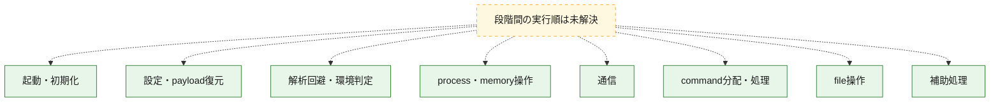
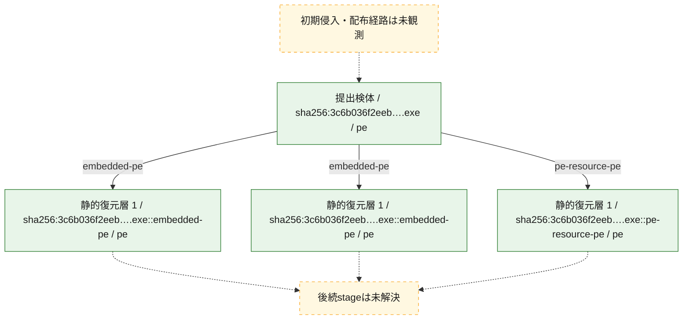
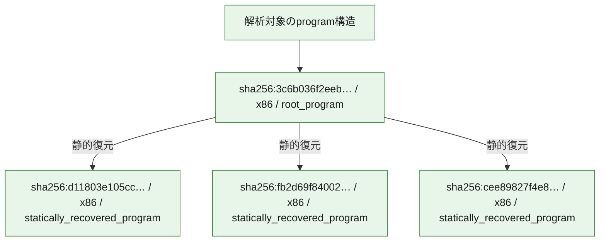

# 全体ロジック：3c6b036f2eebc124c17db51960d9f6c9b39e236e9a33d5ac0c3a3a2cabe36833

代表関数の静的証跡から、起動・初期化、設定・payload復元、解析回避・環境判定、process・memory操作、通信、command分配・処理、file操作の処理群を確認しました。

## 読み方

- phaseの掲載順は解析上の整理順です。observed_call_edgesがない段階間の実行順を断定しません。
- 図の実線は静的に観測した関係、点線と黄色のノードは未観測・未解決の関係を示します。
- 図は静的な要約であり、動的実行を再現するものではありません。
- 詳細な関数解説とfingerprintは[STATIC-LOGIC.md](STATIC-LOGIC.md)を参照してください。

## 静的可視化

### 実行フロー

### 感染チェーン

### モジュール関係

## 処理段階

### 1. 起動・初期化

entry pointから初期化と後続処理への移行を確認します。
確度: `confirmed_static_function_evidence`

- `d11803e105cc9d62e9f0dd25f572454ca203c3fb1de819d7d17ad6a6b6ad45df:ghidra:140006710` — 初期化と主要処理への分岐を行う入口関数です。 状態: `succeeded`、選定理由: `entry_point`, `meaningful_symbol_name`, `reviewed_call_centrality:1`, `role:entrypoint`
- `3c6b036f2eebc124c17db51960d9f6c9b39e236e9a33d5ac0c3a3a2cabe36833:ghidra:14000ea24` — 初期化と主要処理への分岐を行う入口関数です。 状態: `succeeded`、選定理由: `entry_point`, `meaningful_symbol_name`, `reviewed_call_centrality:22`, `role:entrypoint`

### 2. 設定・payload復元

設定、resource、payload、暗号化データの復元・変換を確認します。
確度: `confirmed_static_function_evidence`

- `d11803e105cc9d62e9f0dd25f572454ca203c3fb1de819d7d17ad6a6b6ad45df:ghidra:140003b80` — 設定、resource、payloadなどの解析・変換を行う関数です。 状態: `succeeded`、選定理由: `context_representative`, `reviewed_call_centrality:27`, `role:config_or_data_transform`
- `d11803e105cc9d62e9f0dd25f572454ca203c3fb1de819d7d17ad6a6b6ad45df:ghidra:140005e60` — 暗号、hash、encoding、または復号処理に関係する関数です。 状態: `succeeded`、選定理由: `context_representative`, `reviewed_call_centrality:11`, `role:cryptographic_transform`
- `cee89827f4e8e7e32ec9f0b484586283cd7e345bfa06f458ce631d4fa9c098bc:ghidra:140001b00` — 設定、resource、payloadなどの解析・変換を行う関数です。 状態: `succeeded`、選定理由: `context_representative`, `reviewed_call_centrality:25`, `role:config_or_data_transform`
- `3c6b036f2eebc124c17db51960d9f6c9b39e236e9a33d5ac0c3a3a2cabe36833:ghidra:140001ce0` — 設定、resource、payloadなどの解析・変換を行う関数です。 状態: `succeeded`、選定理由: `context_representative`, `reviewed_call_centrality:31`, `role:config_or_data_transform`

### 3. 解析回避・環境判定

debugger、sandbox、仮想環境、時間差などの判定を確認します。
確度: `confirmed_static_function_evidence`

- `d11803e105cc9d62e9f0dd25f572454ca203c3fb1de819d7d17ad6a6b6ad45df:ghidra:140006740` — debugger、仮想環境、sandbox、または時間差の確認に関係する関数です。 状態: `succeeded`、選定理由: `context_representative`, `reviewed_call_centrality:23`, `role:anti_analysis`
- `cee89827f4e8e7e32ec9f0b484586283cd7e345bfa06f458ce631d4fa9c098bc:ghidra:1400010c0` — debugger、仮想環境、sandbox、または時間差の確認に関係する関数です。 状態: `succeeded`、選定理由: `context_representative`, `reviewed_call_centrality:24`, `role:anti_analysis`

### 4. process・memory操作

process、thread、module、memory操作と実行移行を確認します。
確度: `confirmed_static_function_evidence`

- `d11803e105cc9d62e9f0dd25f572454ca203c3fb1de819d7d17ad6a6b6ad45df:ghidra:140001010` — process、thread、module、またはmemory操作に関係する関数です。 状態: `succeeded`、選定理由: `context_representative`, `reviewed_call_centrality:78`, `role:process_or_memory_operation`
- `d11803e105cc9d62e9f0dd25f572454ca203c3fb1de819d7d17ad6a6b6ad45df:ghidra:140004350` — process、thread、module、またはmemory操作に関係する関数です。 状態: `succeeded`、選定理由: `context_representative`, `reviewed_call_centrality:9`, `role:process_or_memory_operation`
- `d11803e105cc9d62e9f0dd25f572454ca203c3fb1de819d7d17ad6a6b6ad45df:ghidra:1400043e0` — process、thread、module、またはmemory操作に関係する関数です。 状態: `succeeded`、選定理由: `context_representative`, `reviewed_call_centrality:15`, `role:process_or_memory_operation`
- `3c6b036f2eebc124c17db51960d9f6c9b39e236e9a33d5ac0c3a3a2cabe36833:ghidra:1400019b0` — process、thread、module、またはmemory操作に関係する関数です。 状態: `succeeded`、選定理由: `context_representative`, `reviewed_call_centrality:18`, `role:process_or_memory_operation`
- `3c6b036f2eebc124c17db51960d9f6c9b39e236e9a33d5ac0c3a3a2cabe36833:ghidra:140001bf0` — process、thread、module、またはmemory操作に関係する関数です。 状態: `succeeded`、選定理由: `context_representative`, `reviewed_call_centrality:9`, `role:process_or_memory_operation`

### 5. 通信

通信初期化、endpoint処理、送受信の役割を確認します。
確度: `confirmed_static_function_evidence`

- `d11803e105cc9d62e9f0dd25f572454ca203c3fb1de819d7d17ad6a6b6ad45df:ghidra:140004750` — 通信初期化、送受信、またはendpoint処理に関係する関数です。 状態: `succeeded`、選定理由: `context_representative`, `reviewed_call_centrality:29`, `role:network_communication`

### 6. command分配・処理

受信commandやtaskの解釈、分配、個別handlerへの移行を確認します。
確度: `confirmed_static_function_evidence`

- `cee89827f4e8e7e32ec9f0b484586283cd7e345bfa06f458ce631d4fa9c098bc:ghidra:140002300` — commandの解釈、分配、または個別処理を担当する関数です。 状態: `succeeded`、選定理由: `context_representative`, `reviewed_call_centrality:17`, `role:command_dispatch_or_handler`
- `3c6b036f2eebc124c17db51960d9f6c9b39e236e9a33d5ac0c3a3a2cabe36833:ghidra:140002170` — commandの解釈、分配、または個別処理を担当する関数です。 状態: `succeeded`、選定理由: `context_representative`, `reviewed_call_centrality:33`, `role:command_dispatch_or_handler`

### 7. file操作

fileやdirectoryの作成、読書き、削除を確認します。
確度: `confirmed_static_function_evidence`

- `d11803e105cc9d62e9f0dd25f572454ca203c3fb1de819d7d17ad6a6b6ad45df:ghidra:140004c60` — fileまたはdirectoryの読書き・管理に関係する関数です。 状態: `succeeded`、選定理由: `context_representative`, `reviewed_call_centrality:8`, `role:file_operation`
- `d11803e105cc9d62e9f0dd25f572454ca203c3fb1de819d7d17ad6a6b6ad45df:ghidra:140005ef0` — fileまたはdirectoryの読書き・管理に関係する関数です。 状態: `succeeded`、選定理由: `context_representative`, `reviewed_call_centrality:11`, `role:file_operation`
- `cee89827f4e8e7e32ec9f0b484586283cd7e345bfa06f458ce631d4fa9c098bc:ghidra:1400020e0` — fileまたはdirectoryの読書き・管理に関係する関数です。 状態: `succeeded`、選定理由: `context_representative`, `reviewed_call_centrality:16`, `role:file_operation`
- `3c6b036f2eebc124c17db51960d9f6c9b39e236e9a33d5ac0c3a3a2cabe36833:ghidra:140001080` — fileまたはdirectoryの読書き・管理に関係する関数です。 状態: `succeeded`、選定理由: `context_representative`, `reviewed_call_centrality:28`, `role:file_operation`

### 8. 補助処理

主要処理を支える一般内部関数またはlibrary処理を確認します。
確度: `confirmed_static_function_evidence`

- `d11803e105cc9d62e9f0dd25f572454ca203c3fb1de819d7d17ad6a6b6ad45df:ghidra:140001000` — 検体内部の一般処理を実装する関数です。 状態: `succeeded`、選定理由: `context_representative`
- `d11803e105cc9d62e9f0dd25f572454ca203c3fb1de819d7d17ad6a6b6ad45df:ghidra:140003740` — 検体内部の一般処理を実装する関数です。 状態: `succeeded`、選定理由: `context_representative`, `reviewed_call_centrality:1`
- `d11803e105cc9d62e9f0dd25f572454ca203c3fb1de819d7d17ad6a6b6ad45df:ghidra:1400037b0` — 検体内部の一般処理を実装する関数です。 状態: `succeeded`、選定理由: `context_representative`, `reviewed_call_centrality:1`
- `d11803e105cc9d62e9f0dd25f572454ca203c3fb1de819d7d17ad6a6b6ad45df:ghidra:140003820` — 検体内部の一般処理を実装する関数です。 状態: `succeeded`、選定理由: `context_representative`, `reviewed_call_centrality:1`
- `d11803e105cc9d62e9f0dd25f572454ca203c3fb1de819d7d17ad6a6b6ad45df:ghidra:1400038b0` — 検体内部の一般処理を実装する関数です。 状態: `succeeded`、選定理由: `context_representative`, `reviewed_call_centrality:1`
- `d11803e105cc9d62e9f0dd25f572454ca203c3fb1de819d7d17ad6a6b6ad45df:ghidra:140003920` — 検体内部の一般処理を実装する関数です。 状態: `succeeded`、選定理由: `context_representative`, `reviewed_call_centrality:1`
- `d11803e105cc9d62e9f0dd25f572454ca203c3fb1de819d7d17ad6a6b6ad45df:ghidra:1400039a0` — 検体内部の一般処理を実装する関数です。 状態: `succeeded`、選定理由: `context_representative`, `reviewed_call_centrality:1`
- `d11803e105cc9d62e9f0dd25f572454ca203c3fb1de819d7d17ad6a6b6ad45df:ghidra:1400039f0` — 検体内部の一般処理を実装する関数です。 状態: `succeeded`、選定理由: `context_representative`, `reviewed_call_centrality:1`
- `d11803e105cc9d62e9f0dd25f572454ca203c3fb1de819d7d17ad6a6b6ad45df:ghidra:140003a50` — 検体内部の一般処理を実装する関数です。 状態: `succeeded`、選定理由: `context_representative`, `reviewed_call_centrality:6`
- `d11803e105cc9d62e9f0dd25f572454ca203c3fb1de819d7d17ad6a6b6ad45df:ghidra:140003ff0` — 検体内部の一般処理を実装する関数です。 状態: `succeeded`、選定理由: `context_representative`, `reviewed_call_centrality:15`
- `d11803e105cc9d62e9f0dd25f572454ca203c3fb1de819d7d17ad6a6b6ad45df:ghidra:1400042a0` — 検体内部の一般処理を実装する関数です。 状態: `succeeded`、選定理由: `context_representative`, `reviewed_call_centrality:7`
- `d11803e105cc9d62e9f0dd25f572454ca203c3fb1de819d7d17ad6a6b6ad45df:ghidra:140004520` — 検体内部の一般処理を実装する関数です。 状態: `succeeded`、選定理由: `context_representative`, `reviewed_call_centrality:4`
- `d11803e105cc9d62e9f0dd25f572454ca203c3fb1de819d7d17ad6a6b6ad45df:ghidra:1400045a0` — 検体内部の一般処理を実装する関数です。 状態: `succeeded`、選定理由: `context_representative`, `reviewed_call_centrality:9`
- `d11803e105cc9d62e9f0dd25f572454ca203c3fb1de819d7d17ad6a6b6ad45df:ghidra:1400046f0` — 検体内部の一般処理を実装する関数です。 状態: `succeeded`、選定理由: `context_representative`, `reviewed_call_centrality:5`
- `d11803e105cc9d62e9f0dd25f572454ca203c3fb1de819d7d17ad6a6b6ad45df:ghidra:140004b40` — 検体内部の一般処理を実装する関数です。 状態: `succeeded`、選定理由: `context_representative`, `reviewed_call_centrality:11`
- `d11803e105cc9d62e9f0dd25f572454ca203c3fb1de819d7d17ad6a6b6ad45df:ghidra:140004cf0` — 検体内部の一般処理を実装する関数です。 状態: `succeeded`、選定理由: `context_representative`, `reviewed_call_centrality:17`
- `d11803e105cc9d62e9f0dd25f572454ca203c3fb1de819d7d17ad6a6b6ad45df:ghidra:1400053a0` — 検体内部の一般処理を実装する関数です。 状態: `succeeded`、選定理由: `context_representative`, `reviewed_call_centrality:2`
- `d11803e105cc9d62e9f0dd25f572454ca203c3fb1de819d7d17ad6a6b6ad45df:ghidra:140006070` — 検体内部の一般処理を実装する関数です。 状態: `succeeded`、選定理由: `context_representative`, `reviewed_call_centrality:1`
- `d11803e105cc9d62e9f0dd25f572454ca203c3fb1de819d7d17ad6a6b6ad45df:ghidra:1400065b0` — 検体内部の一般処理を実装する関数です。 状態: `succeeded`、選定理由: `context_representative`, `reviewed_call_centrality:8`
- `d11803e105cc9d62e9f0dd25f572454ca203c3fb1de819d7d17ad6a6b6ad45df:ghidra:1400066b0` — 検体内部の一般処理を実装する関数です。 状態: `succeeded`、選定理由: `context_representative`, `reviewed_call_centrality:3`
- `d11803e105cc9d62e9f0dd25f572454ca203c3fb1de819d7d17ad6a6b6ad45df:ghidra:1400069b0` — compiler生成処理または汎用library処理とみられる関数です。 状態: `succeeded`、選定理由: `entry_point`, `meaningful_symbol_name`, `reviewed_call_centrality:4`
- `d11803e105cc9d62e9f0dd25f572454ca203c3fb1de819d7d17ad6a6b6ad45df:ghidra:140006a30` — compiler生成処理または汎用library処理とみられる関数です。 状態: `succeeded`、選定理由: `entry_point`, `meaningful_symbol_name`, `reviewed_call_centrality:14`
- `fb2d69f840026a562629d757095c968b5748daaf1d08fad14414a8ef79de319e:ghidra:140001000` — 検体内部の一般処理を実装する関数です。 状態: `succeeded`、選定理由: `context_representative`, `reviewed_call_centrality:4`
- `fb2d69f840026a562629d757095c968b5748daaf1d08fad14414a8ef79de319e:ghidra:140001090` — 検体内部の一般処理を実装する関数です。 状態: `succeeded`、選定理由: `context_representative`, `reviewed_call_centrality:6`
- `fb2d69f840026a562629d757095c968b5748daaf1d08fad14414a8ef79de319e:ghidra:1400010f0` — 検体内部の一般処理を実装する関数です。 状態: `succeeded`、選定理由: `context_representative`, `reviewed_call_centrality:4`
- `fb2d69f840026a562629d757095c968b5748daaf1d08fad14414a8ef79de319e:ghidra:140001160` — 検体内部の一般処理を実装する関数です。 状態: `succeeded`、選定理由: `context_representative`
- `fb2d69f840026a562629d757095c968b5748daaf1d08fad14414a8ef79de319e:ghidra:140001190` — 検体内部の一般処理を実装する関数です。 状態: `succeeded`、選定理由: `context_representative`, `reviewed_call_centrality:4`
- `fb2d69f840026a562629d757095c968b5748daaf1d08fad14414a8ef79de319e:ghidra:1400011c0` — 検体内部の一般処理を実装する関数です。 状態: `succeeded`、選定理由: `context_representative`, `reviewed_call_centrality:5`
- `fb2d69f840026a562629d757095c968b5748daaf1d08fad14414a8ef79de319e:ghidra:140001230` — 検体内部の一般処理を実装する関数です。 状態: `succeeded`、選定理由: `context_representative`, `reviewed_call_centrality:4`
- `fb2d69f840026a562629d757095c968b5748daaf1d08fad14414a8ef79de319e:ghidra:140001290` — 検体内部の一般処理を実装する関数です。 状態: `succeeded`、選定理由: `context_representative`, `reviewed_call_centrality:6`
- `fb2d69f840026a562629d757095c968b5748daaf1d08fad14414a8ef79de319e:ghidra:140001310` — 検体内部の一般処理を実装する関数です。 状態: `succeeded`、選定理由: `context_representative`, `reviewed_call_centrality:29`
- `fb2d69f840026a562629d757095c968b5748daaf1d08fad14414a8ef79de319e:ghidra:1400015a0` — 検体内部の一般処理を実装する関数です。 状態: `succeeded`、選定理由: `context_representative`, `reviewed_call_centrality:25`
- `fb2d69f840026a562629d757095c968b5748daaf1d08fad14414a8ef79de319e:ghidra:140001690` — 検体内部の一般処理を実装する関数です。 状態: `succeeded`、選定理由: `context_representative`, `reviewed_call_centrality:16`
- `fb2d69f840026a562629d757095c968b5748daaf1d08fad14414a8ef79de319e:ghidra:1400017e0` — 検体内部の一般処理を実装する関数です。 状態: `succeeded`、選定理由: `context_representative`, `reviewed_call_centrality:22`
- `fb2d69f840026a562629d757095c968b5748daaf1d08fad14414a8ef79de319e:ghidra:140001960` — 検体内部の一般処理を実装する関数です。 状態: `succeeded`、選定理由: `context_representative`, `reviewed_call_centrality:10`
- `fb2d69f840026a562629d757095c968b5748daaf1d08fad14414a8ef79de319e:ghidra:140001b20` — 検体内部の一般処理を実装する関数です。 状態: `succeeded`、選定理由: `context_representative`, `reviewed_call_centrality:22`
- `fb2d69f840026a562629d757095c968b5748daaf1d08fad14414a8ef79de319e:ghidra:140001d20` — 検体内部の一般処理を実装する関数です。 状態: `succeeded`、選定理由: `context_representative`, `reviewed_call_centrality:11`
- `fb2d69f840026a562629d757095c968b5748daaf1d08fad14414a8ef79de319e:ghidra:140001e70` — 検体内部の一般処理を実装する関数です。 状態: `succeeded`、選定理由: `context_representative`, `reviewed_call_centrality:22`
- `fb2d69f840026a562629d757095c968b5748daaf1d08fad14414a8ef79de319e:ghidra:1400020b0` — 検体内部の一般処理を実装する関数です。 状態: `succeeded`、選定理由: `context_representative`, `reviewed_call_centrality:18`
- `fb2d69f840026a562629d757095c968b5748daaf1d08fad14414a8ef79de319e:ghidra:1400022d0` — 検体内部の一般処理を実装する関数です。 状態: `succeeded`、選定理由: `context_representative`, `reviewed_call_centrality:9`
- `fb2d69f840026a562629d757095c968b5748daaf1d08fad14414a8ef79de319e:ghidra:140002320` — 検体内部の一般処理を実装する関数です。 状態: `succeeded`、選定理由: `context_representative`, `reviewed_call_centrality:11`
- `fb2d69f840026a562629d757095c968b5748daaf1d08fad14414a8ef79de319e:ghidra:1400024d0` — 検体内部の一般処理を実装する関数です。 状態: `succeeded`、選定理由: `context_representative`, `reviewed_call_centrality:42`
- `fb2d69f840026a562629d757095c968b5748daaf1d08fad14414a8ef79de319e:ghidra:1400030a0` — 検体内部の一般処理を実装する関数です。 状態: `succeeded`、選定理由: `context_representative`, `reviewed_call_centrality:4`
- `fb2d69f840026a562629d757095c968b5748daaf1d08fad14414a8ef79de319e:ghidra:140003120` — 検体内部の一般処理を実装する関数です。 状態: `succeeded`、選定理由: `context_representative`, `reviewed_call_centrality:14`
- `fb2d69f840026a562629d757095c968b5748daaf1d08fad14414a8ef79de319e:ghidra:1400032a0` — 検体内部の一般処理を実装する関数です。 状態: `succeeded`、選定理由: `context_representative`, `reviewed_call_centrality:14`
- `fb2d69f840026a562629d757095c968b5748daaf1d08fad14414a8ef79de319e:ghidra:140003470` — 検体内部の一般処理を実装する関数です。 状態: `succeeded`、選定理由: `context_representative`, `reviewed_call_centrality:21`
- `fb2d69f840026a562629d757095c968b5748daaf1d08fad14414a8ef79de319e:ghidra:140003630` — 検体内部の一般処理を実装する関数です。 状態: `succeeded`、選定理由: `context_representative`, `reviewed_call_centrality:6`
- `fb2d69f840026a562629d757095c968b5748daaf1d08fad14414a8ef79de319e:ghidra:1400036c0` — 検体内部の一般処理を実装する関数です。 状態: `succeeded`、選定理由: `context_representative`, `reviewed_call_centrality:3`
- `fb2d69f840026a562629d757095c968b5748daaf1d08fad14414a8ef79de319e:ghidra:140003700` — 検体内部の一般処理を実装する関数です。 状態: `succeeded`、選定理由: `context_representative`, `reviewed_call_centrality:49`
- `fb2d69f840026a562629d757095c968b5748daaf1d08fad14414a8ef79de319e:ghidra:1400042f0` — 検体内部の一般処理を実装する関数です。 状態: `succeeded`、選定理由: `context_representative`, `reviewed_call_centrality:7`
- `fb2d69f840026a562629d757095c968b5748daaf1d08fad14414a8ef79de319e:ghidra:140004510` — 検体内部の一般処理を実装する関数です。 状態: `succeeded`、選定理由: `context_representative`, `reviewed_call_centrality:2`
- `fb2d69f840026a562629d757095c968b5748daaf1d08fad14414a8ef79de319e:ghidra:140004550` — 検体内部の一般処理を実装する関数です。 状態: `succeeded`、選定理由: `context_representative`, `reviewed_call_centrality:1`
- `fb2d69f840026a562629d757095c968b5748daaf1d08fad14414a8ef79de319e:ghidra:1400045a0` — 検体内部の一般処理を実装する関数です。 状態: `succeeded`、選定理由: `context_representative`, `reviewed_call_centrality:31`
- `fb2d69f840026a562629d757095c968b5748daaf1d08fad14414a8ef79de319e:ghidra:140004b50` — 検体内部の一般処理を実装する関数です。 状態: `succeeded`、選定理由: `context_representative`, `reviewed_call_centrality:10`
- `cee89827f4e8e7e32ec9f0b484586283cd7e345bfa06f458ce631d4fa9c098bc:ghidra:140001000` — 検体内部の一般処理を実装する関数です。 状態: `succeeded`、選定理由: `context_representative`, `reviewed_call_centrality:1`
- `cee89827f4e8e7e32ec9f0b484586283cd7e345bfa06f458ce631d4fa9c098bc:ghidra:140001020` — 検体内部の一般処理を実装する関数です。 状態: `succeeded`、選定理由: `context_representative`, `reviewed_call_centrality:1`
- `cee89827f4e8e7e32ec9f0b484586283cd7e345bfa06f458ce631d4fa9c098bc:ghidra:140001040` — 検体内部の一般処理を実装する関数です。 状態: `succeeded`、選定理由: `context_representative`, `reviewed_call_centrality:1`
- `cee89827f4e8e7e32ec9f0b484586283cd7e345bfa06f458ce631d4fa9c098bc:ghidra:140001058` — 検体内部の一般処理を実装する関数です。 状態: `succeeded`、選定理由: `context_representative`, `reviewed_call_centrality:2`
- `cee89827f4e8e7e32ec9f0b484586283cd7e345bfa06f458ce631d4fa9c098bc:ghidra:14000109c` — 検体内部の一般処理を実装する関数です。 状態: `succeeded`、選定理由: `context_representative`, `reviewed_call_centrality:2`
- `cee89827f4e8e7e32ec9f0b484586283cd7e345bfa06f458ce631d4fa9c098bc:ghidra:1400018e0` — 検体内部の一般処理を実装する関数です。 状態: `succeeded`、選定理由: `context_representative`, `reviewed_call_centrality:20`
- `cee89827f4e8e7e32ec9f0b484586283cd7e345bfa06f458ce631d4fa9c098bc:ghidra:1400026b0` — 検体内部の一般処理を実装する関数です。 状態: `succeeded`、選定理由: `context_representative`, `reviewed_call_centrality:2`
- `cee89827f4e8e7e32ec9f0b484586283cd7e345bfa06f458ce631d4fa9c098bc:ghidra:140002700` — 検体内部の一般処理を実装する関数です。 状態: `succeeded`、選定理由: `context_representative`, `reviewed_call_centrality:2`
- `cee89827f4e8e7e32ec9f0b484586283cd7e345bfa06f458ce631d4fa9c098bc:ghidra:140002740` — 検体内部の一般処理を実装する関数です。 状態: `succeeded`、選定理由: `context_representative`, `reviewed_call_centrality:4`
- `cee89827f4e8e7e32ec9f0b484586283cd7e345bfa06f458ce631d4fa9c098bc:ghidra:140002780` — 検体内部の一般処理を実装する関数です。 状態: `succeeded`、選定理由: `context_representative`, `reviewed_call_centrality:6`
- `cee89827f4e8e7e32ec9f0b484586283cd7e345bfa06f458ce631d4fa9c098bc:ghidra:140002830` — 検体内部の一般処理を実装する関数です。 状態: `succeeded`、選定理由: `context_representative`, `reviewed_call_centrality:1`
- `cee89827f4e8e7e32ec9f0b484586283cd7e345bfa06f458ce631d4fa9c098bc:ghidra:140002860` — 検体内部の一般処理を実装する関数です。 状態: `succeeded`、選定理由: `context_representative`, `reviewed_call_centrality:8`
- `cee89827f4e8e7e32ec9f0b484586283cd7e345bfa06f458ce631d4fa9c098bc:ghidra:140002940` — 検体内部の一般処理を実装する関数です。 状態: `succeeded`、選定理由: `context_representative`, `reviewed_call_centrality:15`
- `cee89827f4e8e7e32ec9f0b484586283cd7e345bfa06f458ce631d4fa9c098bc:ghidra:140002ca0` — 検体内部の一般処理を実装する関数です。 状態: `succeeded`、選定理由: `context_representative`, `reviewed_call_centrality:4`
- `cee89827f4e8e7e32ec9f0b484586283cd7e345bfa06f458ce631d4fa9c098bc:ghidra:140002cf0` — 検体内部の一般処理を実装する関数です。 状態: `succeeded`、選定理由: `context_representative`, `reviewed_call_centrality:2`
- `cee89827f4e8e7e32ec9f0b484586283cd7e345bfa06f458ce631d4fa9c098bc:ghidra:140002d40` — 検体内部の一般処理を実装する関数です。 状態: `succeeded`、選定理由: `context_representative`, `reviewed_call_centrality:7`
- `cee89827f4e8e7e32ec9f0b484586283cd7e345bfa06f458ce631d4fa9c098bc:ghidra:140002da0` — 検体内部の一般処理を実装する関数です。 状態: `succeeded`、選定理由: `context_representative`, `reviewed_call_centrality:8`
- `cee89827f4e8e7e32ec9f0b484586283cd7e345bfa06f458ce631d4fa9c098bc:ghidra:140002e70` — 検体内部の一般処理を実装する関数です。 状態: `succeeded`、選定理由: `context_representative`, `reviewed_call_centrality:6`
- `cee89827f4e8e7e32ec9f0b484586283cd7e345bfa06f458ce631d4fa9c098bc:ghidra:140002ed0` — 検体内部の一般処理を実装する関数です。 状態: `succeeded`、選定理由: `context_representative`, `reviewed_call_centrality:9`
- `cee89827f4e8e7e32ec9f0b484586283cd7e345bfa06f458ce631d4fa9c098bc:ghidra:140002fb0` — 検体内部の一般処理を実装する関数です。 状態: `succeeded`、選定理由: `context_representative`, `reviewed_call_centrality:2`
- `cee89827f4e8e7e32ec9f0b484586283cd7e345bfa06f458ce631d4fa9c098bc:ghidra:140002ff0` — 検体内部の一般処理を実装する関数です。 状態: `succeeded`、選定理由: `context_representative`, `reviewed_call_centrality:2`
- `cee89827f4e8e7e32ec9f0b484586283cd7e345bfa06f458ce631d4fa9c098bc:ghidra:140003020` — 検体内部の一般処理を実装する関数です。 状態: `succeeded`、選定理由: `context_representative`, `reviewed_call_centrality:2`
- `cee89827f4e8e7e32ec9f0b484586283cd7e345bfa06f458ce631d4fa9c098bc:ghidra:140003050` — 検体内部の一般処理を実装する関数です。 状態: `succeeded`、選定理由: `context_representative`, `reviewed_call_centrality:2`
- `cee89827f4e8e7e32ec9f0b484586283cd7e345bfa06f458ce631d4fa9c098bc:ghidra:1400030b0` — 検体内部の一般処理を実装する関数です。 状態: `succeeded`、選定理由: `context_representative`, `reviewed_call_centrality:2`
- `cee89827f4e8e7e32ec9f0b484586283cd7e345bfa06f458ce631d4fa9c098bc:ghidra:140003110` — 検体内部の一般処理を実装する関数です。 状態: `succeeded`、選定理由: `context_representative`, `reviewed_call_centrality:4`
- `cee89827f4e8e7e32ec9f0b484586283cd7e345bfa06f458ce631d4fa9c098bc:ghidra:1400031b0` — 検体内部の一般処理を実装する関数です。 状態: `succeeded`、選定理由: `context_representative`
- `cee89827f4e8e7e32ec9f0b484586283cd7e345bfa06f458ce631d4fa9c098bc:ghidra:1400031d0` — 検体内部の一般処理を実装する関数です。 状態: `succeeded`、選定理由: `context_representative`, `reviewed_call_centrality:12`
- `cee89827f4e8e7e32ec9f0b484586283cd7e345bfa06f458ce631d4fa9c098bc:ghidra:140003390` — 検体内部の一般処理を実装する関数です。 状態: `succeeded`、選定理由: `context_representative`, `reviewed_call_centrality:11`
- `3c6b036f2eebc124c17db51960d9f6c9b39e236e9a33d5ac0c3a3a2cabe36833:ghidra:140001000` — 検体内部の一般処理を実装する関数です。 状態: `succeeded`、選定理由: `context_representative`, `reviewed_call_centrality:1`
- `3c6b036f2eebc124c17db51960d9f6c9b39e236e9a33d5ac0c3a3a2cabe36833:ghidra:140001018` — 検体内部の一般処理を実装する関数です。 状態: `succeeded`、選定理由: `context_representative`, `reviewed_call_centrality:2`
- `3c6b036f2eebc124c17db51960d9f6c9b39e236e9a33d5ac0c3a3a2cabe36833:ghidra:14000105c` — 検体内部の一般処理を実装する関数です。 状態: `succeeded`、選定理由: `context_representative`, `reviewed_call_centrality:2`
- `3c6b036f2eebc124c17db51960d9f6c9b39e236e9a33d5ac0c3a3a2cabe36833:ghidra:1400017e0` — 検体内部の一般処理を実装する関数です。 状態: `succeeded`、選定理由: `context_representative`, `reviewed_call_centrality:4`
- `3c6b036f2eebc124c17db51960d9f6c9b39e236e9a33d5ac0c3a3a2cabe36833:ghidra:140001ca0` — 検体内部の一般処理を実装する関数です。 状態: `succeeded`、選定理由: `context_representative`, `reviewed_call_centrality:3`
- `3c6b036f2eebc124c17db51960d9f6c9b39e236e9a33d5ac0c3a3a2cabe36833:ghidra:140002900` — 検体内部の一般処理を実装する関数です。 状態: `succeeded`、選定理由: `context_representative`, `reviewed_call_centrality:2`
- `3c6b036f2eebc124c17db51960d9f6c9b39e236e9a33d5ac0c3a3a2cabe36833:ghidra:140002950` — 検体内部の一般処理を実装する関数です。 状態: `succeeded`、選定理由: `context_representative`, `reviewed_call_centrality:2`
- `3c6b036f2eebc124c17db51960d9f6c9b39e236e9a33d5ac0c3a3a2cabe36833:ghidra:140002990` — 検体内部の一般処理を実装する関数です。 状態: `succeeded`、選定理由: `context_representative`, `reviewed_call_centrality:5`
- `3c6b036f2eebc124c17db51960d9f6c9b39e236e9a33d5ac0c3a3a2cabe36833:ghidra:1400029d0` — 検体内部の一般処理を実装する関数です。 状態: `succeeded`、選定理由: `context_representative`, `reviewed_call_centrality:6`
- `3c6b036f2eebc124c17db51960d9f6c9b39e236e9a33d5ac0c3a3a2cabe36833:ghidra:140002a80` — 検体内部の一般処理を実装する関数です。 状態: `succeeded`、選定理由: `context_representative`, `reviewed_call_centrality:8`
- `3c6b036f2eebc124c17db51960d9f6c9b39e236e9a33d5ac0c3a3a2cabe36833:ghidra:140002b60` — 検体内部の一般処理を実装する関数です。 状態: `succeeded`、選定理由: `context_representative`, `reviewed_call_centrality:1`
- `3c6b036f2eebc124c17db51960d9f6c9b39e236e9a33d5ac0c3a3a2cabe36833:ghidra:140002b90` — 検体内部の一般処理を実装する関数です。 状態: `succeeded`、選定理由: `context_representative`, `reviewed_call_centrality:8`
- `3c6b036f2eebc124c17db51960d9f6c9b39e236e9a33d5ac0c3a3a2cabe36833:ghidra:140002c70` — 検体内部の一般処理を実装する関数です。 状態: `succeeded`、選定理由: `context_representative`, `reviewed_call_centrality:14`
- `3c6b036f2eebc124c17db51960d9f6c9b39e236e9a33d5ac0c3a3a2cabe36833:ghidra:140002fc0` — 検体内部の一般処理を実装する関数です。 状態: `succeeded`、選定理由: `context_representative`, `reviewed_call_centrality:2`
- `3c6b036f2eebc124c17db51960d9f6c9b39e236e9a33d5ac0c3a3a2cabe36833:ghidra:140003010` — 検体内部の一般処理を実装する関数です。 状態: `succeeded`、選定理由: `context_representative`, `reviewed_call_centrality:6`
- `3c6b036f2eebc124c17db51960d9f6c9b39e236e9a33d5ac0c3a3a2cabe36833:ghidra:140003070` — 検体内部の一般処理を実装する関数です。 状態: `succeeded`、選定理由: `context_representative`, `reviewed_call_centrality:6`
- `3c6b036f2eebc124c17db51960d9f6c9b39e236e9a33d5ac0c3a3a2cabe36833:ghidra:1400030d0` — 検体内部の一般処理を実装する関数です。 状態: `succeeded`、選定理由: `context_representative`, `reviewed_call_centrality:9`
- `3c6b036f2eebc124c17db51960d9f6c9b39e236e9a33d5ac0c3a3a2cabe36833:ghidra:1400031a0` — 検体内部の一般処理を実装する関数です。 状態: `succeeded`、選定理由: `context_representative`, `reviewed_call_centrality:4`
- `3c6b036f2eebc124c17db51960d9f6c9b39e236e9a33d5ac0c3a3a2cabe36833:ghidra:140003200` — 検体内部の一般処理を実装する関数です。 状態: `succeeded`、選定理由: `context_representative`, `reviewed_call_centrality:8`
- `3c6b036f2eebc124c17db51960d9f6c9b39e236e9a33d5ac0c3a3a2cabe36833:ghidra:1400032e0` — 検体内部の一般処理を実装する関数です。 状態: `succeeded`、選定理由: `context_representative`, `reviewed_call_centrality:2`
- `3c6b036f2eebc124c17db51960d9f6c9b39e236e9a33d5ac0c3a3a2cabe36833:ghidra:140003320` — 検体内部の一般処理を実装する関数です。 状態: `succeeded`、選定理由: `context_representative`, `reviewed_call_centrality:2`
- `3c6b036f2eebc124c17db51960d9f6c9b39e236e9a33d5ac0c3a3a2cabe36833:ghidra:140003350` — 検体内部の一般処理を実装する関数です。 状態: `succeeded`、選定理由: `context_representative`, `reviewed_call_centrality:2`
- `3c6b036f2eebc124c17db51960d9f6c9b39e236e9a33d5ac0c3a3a2cabe36833:ghidra:140003380` — 検体内部の一般処理を実装する関数です。 状態: `succeeded`、選定理由: `context_representative`, `reviewed_call_centrality:1`
- `3c6b036f2eebc124c17db51960d9f6c9b39e236e9a33d5ac0c3a3a2cabe36833:ghidra:1400033e0` — 検体内部の一般処理を実装する関数です。 状態: `succeeded`、選定理由: `context_representative`, `reviewed_call_centrality:1`
- `3c6b036f2eebc124c17db51960d9f6c9b39e236e9a33d5ac0c3a3a2cabe36833:ghidra:140003440` — 検体内部の一般処理を実装する関数です。 状態: `succeeded`、選定理由: `context_representative`, `reviewed_call_centrality:4`
- `3c6b036f2eebc124c17db51960d9f6c9b39e236e9a33d5ac0c3a3a2cabe36833:ghidra:14000ef10` — 検体内部の一般処理を実装する関数です。 状態: `succeeded`、選定理由: `meaningful_symbol_name`

## 観測したcall関係

- 代表関数間で直接解決できた呼出関係はありません。

## 解析範囲と制約

- 選定外関数は全体inventoryへ残しますが、関数本体の個別解説対象にはしていません。
- indirect call、難読化、packer、VM、壊れたcontrol flowによりcall関係が欠落する場合があります。
- 文書は静的解析に基づき、検体実行や外部通信による動的確認は行っていません。
