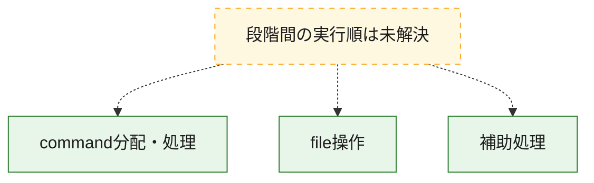
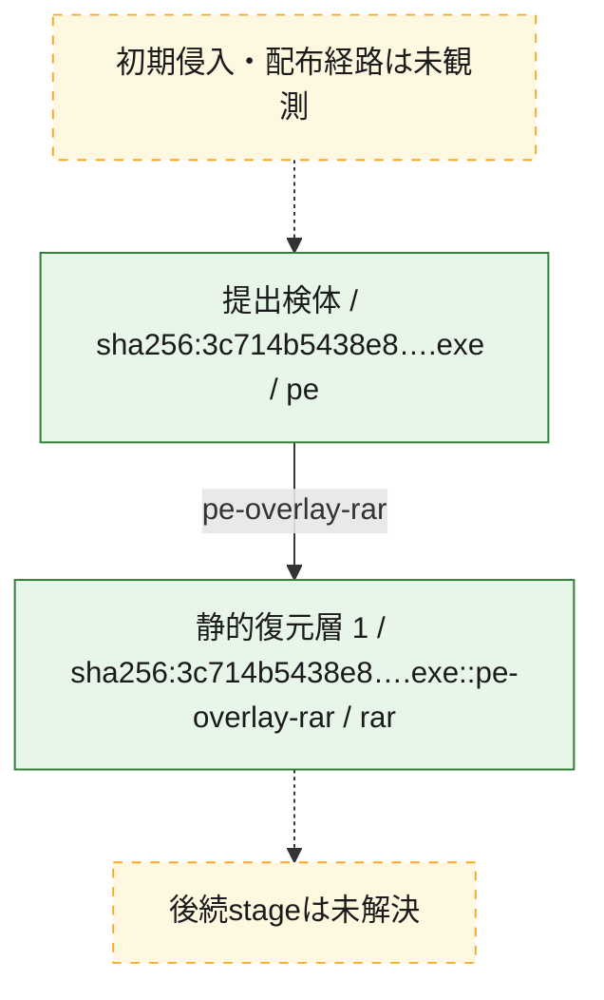
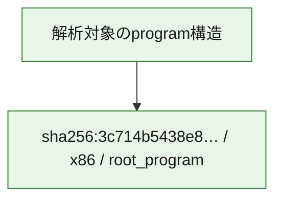

# 全体ロジック：3c714b5438e80e0458bfaf9523cc2d7116afa71ef76d9f25a94e3464c044b471

代表関数の静的証跡から、command分配・処理、file操作の処理群を確認しました。

## 読み方

- phaseの掲載順は解析上の整理順です。observed_call_edgesがない段階間の実行順を断定しません。
- 図の実線は静的に観測した関係、点線と黄色のノードは未観測・未解決の関係を示します。
- 図は静的な要約であり、動的実行を再現するものではありません。
- 詳細な関数解説とfingerprintは[STATIC-LOGIC.md](STATIC-LOGIC.md)を参照してください。

## 静的可視化

### 実行フロー

### 感染チェーン

### モジュール関係

## 処理段階

### 1. command分配・処理

受信commandやtaskの解釈、分配、個別handlerへの移行を確認します。
確度: `confirmed_static_function_evidence`

- `3c714b5438e80e0458bfaf9523cc2d7116afa71ef76d9f25a94e3464c044b471:ghidra:140001df0` — commandの解釈、分配、または個別処理を担当する関数です。 状態: `succeeded`、選定理由: `context_representative`, `reviewed_call_centrality:7`, `role:command_dispatch_or_handler`

### 2. file操作

fileやdirectoryの作成、読書き、削除を確認します。
確度: `confirmed_static_function_evidence`

- `3c714b5438e80e0458bfaf9523cc2d7116afa71ef76d9f25a94e3464c044b471:ghidra:140001a14` — fileまたはdirectoryの読書き・管理に関係する関数です。 状態: `succeeded`、選定理由: `context_representative`, `reviewed_call_centrality:22`, `role:file_operation`

### 3. 補助処理

主要処理を支える一般内部関数またはlibrary処理を確認します。
確度: `confirmed_static_function_evidence`

- `3c714b5438e80e0458bfaf9523cc2d7116afa71ef76d9f25a94e3464c044b471:ghidra:140001000` — 検体内部の一般処理を実装する関数です。 状態: `succeeded`、選定理由: `context_representative`
- `3c714b5438e80e0458bfaf9523cc2d7116afa71ef76d9f25a94e3464c044b471:ghidra:140001010` — 検体内部の一般処理を実装する関数です。 状態: `succeeded`、選定理由: `context_representative`
- `3c714b5438e80e0458bfaf9523cc2d7116afa71ef76d9f25a94e3464c044b471:ghidra:140001020` — 検体内部の一般処理を実装する関数です。 状態: `succeeded`、選定理由: `context_representative`, `reviewed_call_centrality:2`
- `3c714b5438e80e0458bfaf9523cc2d7116afa71ef76d9f25a94e3464c044b471:ghidra:140001040` — 検体内部の一般処理を実装する関数です。 状態: `succeeded`、選定理由: `context_representative`, `reviewed_call_centrality:1`
- `3c714b5438e80e0458bfaf9523cc2d7116afa71ef76d9f25a94e3464c044b471:ghidra:140001050` — 検体内部の一般処理を実装する関数です。 状態: `succeeded`、選定理由: `context_representative`, `reviewed_call_centrality:1`
- `3c714b5438e80e0458bfaf9523cc2d7116afa71ef76d9f25a94e3464c044b471:ghidra:140001070` — 検体内部の一般処理を実装する関数です。 状態: `succeeded`、選定理由: `context_representative`, `reviewed_call_centrality:5`
- `3c714b5438e80e0458bfaf9523cc2d7116afa71ef76d9f25a94e3464c044b471:ghidra:140001080` — 検体内部の一般処理を実装する関数です。 状態: `succeeded`、選定理由: `context_representative`, `reviewed_call_centrality:1`
- `3c714b5438e80e0458bfaf9523cc2d7116afa71ef76d9f25a94e3464c044b471:ghidra:140001090` — 検体内部の一般処理を実装する関数です。 状態: `succeeded`、選定理由: `context_representative`, `reviewed_call_centrality:1`
- `3c714b5438e80e0458bfaf9523cc2d7116afa71ef76d9f25a94e3464c044b471:ghidra:1400010a0` — 検体内部の一般処理を実装する関数です。 状態: `succeeded`、選定理由: `context_representative`, `reviewed_call_centrality:2`
- `3c714b5438e80e0458bfaf9523cc2d7116afa71ef76d9f25a94e3464c044b471:ghidra:1400010c0` — 検体内部の一般処理を実装する関数です。 状態: `succeeded`、選定理由: `context_representative`, `reviewed_call_centrality:1`
- `3c714b5438e80e0458bfaf9523cc2d7116afa71ef76d9f25a94e3464c044b471:ghidra:1400010d0` — 検体内部の一般処理を実装する関数です。 状態: `succeeded`、選定理由: `context_representative`, `reviewed_call_centrality:1`
- `3c714b5438e80e0458bfaf9523cc2d7116afa71ef76d9f25a94e3464c044b471:ghidra:1400010e0` — 検体内部の一般処理を実装する関数です。 状態: `succeeded`、選定理由: `context_representative`, `reviewed_call_centrality:1`
- `3c714b5438e80e0458bfaf9523cc2d7116afa71ef76d9f25a94e3464c044b471:ghidra:1400010f0` — 検体内部の一般処理を実装する関数です。 状態: `succeeded`、選定理由: `context_representative`, `reviewed_call_centrality:2`
- `3c714b5438e80e0458bfaf9523cc2d7116afa71ef76d9f25a94e3464c044b471:ghidra:140001110` — 検体内部の一般処理を実装する関数です。 状態: `succeeded`、選定理由: `context_representative`, `reviewed_call_centrality:1`
- `3c714b5438e80e0458bfaf9523cc2d7116afa71ef76d9f25a94e3464c044b471:ghidra:140001120` — 検体内部の一般処理を実装する関数です。 状態: `succeeded`、選定理由: `context_representative`, `reviewed_call_centrality:1`
- `3c714b5438e80e0458bfaf9523cc2d7116afa71ef76d9f25a94e3464c044b471:ghidra:140001130` — 検体内部の一般処理を実装する関数です。 状態: `succeeded`、選定理由: `context_representative`, `reviewed_call_centrality:1`
- `3c714b5438e80e0458bfaf9523cc2d7116afa71ef76d9f25a94e3464c044b471:ghidra:140001140` — 検体内部の一般処理を実装する関数です。 状態: `succeeded`、選定理由: `context_representative`, `reviewed_call_centrality:2`
- `3c714b5438e80e0458bfaf9523cc2d7116afa71ef76d9f25a94e3464c044b471:ghidra:140001160` — 検体内部の一般処理を実装する関数です。 状態: `succeeded`、選定理由: `context_representative`, `reviewed_call_centrality:4`
- `3c714b5438e80e0458bfaf9523cc2d7116afa71ef76d9f25a94e3464c044b471:ghidra:1400011dc` — 検体内部の一般処理を実装する関数です。 状態: `succeeded`、選定理由: `context_representative`, `reviewed_call_centrality:3`
- `3c714b5438e80e0458bfaf9523cc2d7116afa71ef76d9f25a94e3464c044b471:ghidra:140001278` — 検体内部の一般処理を実装する関数です。 状態: `succeeded`、選定理由: `context_representative`, `reviewed_call_centrality:9`
- `3c714b5438e80e0458bfaf9523cc2d7116afa71ef76d9f25a94e3464c044b471:ghidra:1400012c8` — 検体内部の一般処理を実装する関数です。 状態: `succeeded`、選定理由: `context_representative`, `reviewed_call_centrality:7`
- `3c714b5438e80e0458bfaf9523cc2d7116afa71ef76d9f25a94e3464c044b471:ghidra:1400013cc` — 検体内部の一般処理を実装する関数です。 状態: `succeeded`、選定理由: `context_representative`, `reviewed_call_centrality:6`
- `3c714b5438e80e0458bfaf9523cc2d7116afa71ef76d9f25a94e3464c044b471:ghidra:140001454` — 検体内部の一般処理を実装する関数です。 状態: `succeeded`、選定理由: `context_representative`, `reviewed_call_centrality:2`
- `3c714b5438e80e0458bfaf9523cc2d7116afa71ef76d9f25a94e3464c044b471:ghidra:140001484` — 検体内部の一般処理を実装する関数です。 状態: `succeeded`、選定理由: `context_representative`, `reviewed_call_centrality:8`
- `3c714b5438e80e0458bfaf9523cc2d7116afa71ef76d9f25a94e3464c044b471:ghidra:1400015d0` — 検体内部の一般処理を実装する関数です。 状態: `succeeded`、選定理由: `context_representative`, `reviewed_call_centrality:8`
- `3c714b5438e80e0458bfaf9523cc2d7116afa71ef76d9f25a94e3464c044b471:ghidra:140001768` — 検体内部の一般処理を実装する関数です。 状態: `succeeded`、選定理由: `context_representative`, `reviewed_call_centrality:9`
- `3c714b5438e80e0458bfaf9523cc2d7116afa71ef76d9f25a94e3464c044b471:ghidra:1400018dc` — 検体内部の一般処理を実装する関数です。 状態: `succeeded`、選定理由: `context_representative`, `reviewed_call_centrality:1`
- `3c714b5438e80e0458bfaf9523cc2d7116afa71ef76d9f25a94e3464c044b471:ghidra:140001918` — 検体内部の一般処理を実装する関数です。 状態: `succeeded`、選定理由: `context_representative`, `reviewed_call_centrality:1`
- `3c714b5438e80e0458bfaf9523cc2d7116afa71ef76d9f25a94e3464c044b471:ghidra:140001978` — 検体内部の一般処理を実装する関数です。 状態: `succeeded`、選定理由: `context_representative`, `reviewed_call_centrality:1`
- `3c714b5438e80e0458bfaf9523cc2d7116afa71ef76d9f25a94e3464c044b471:ghidra:1400019d0` — 検体内部の一般処理を実装する関数です。 状態: `succeeded`、選定理由: `context_representative`, `reviewed_call_centrality:2`

## 観測したcall関係

- 代表関数間で直接解決できた呼出関係はありません。

## 解析範囲と制約

- 選定外関数は全体inventoryへ残しますが、関数本体の個別解説対象にはしていません。
- indirect call、難読化、packer、VM、壊れたcontrol flowによりcall関係が欠落する場合があります。
- 文書は静的解析に基づき、検体実行や外部通信による動的確認は行っていません。
