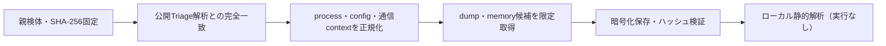

# Triage公開解析・後段取得証跡

## 完全ハッシュ一致

- [260807-xtx7sahf76](https://tria.ge/260807-xtx7sahf76): ファミリー候補 `未確定`、評価score `None`
- [260807-xkvejabj6t](https://tria.ge/260807-xkvejabj6t): ファミリー候補 `未確定`、評価score `None`
- [260807-tzfcdahj7v](https://tria.ge/260807-tzfcdahj7v): ファミリー候補 `未確定`、評価score `None`

## プロセス・通信

- 観測process: `取得できず`
- raw commandは保存せず、command SHA-256と処理patternだけをJSONへ保持します。
- sandbox background trafficは`context_only`であり、C2へ自動昇格しません。

- 取得できませんでした。

## 後段取得物

- `ffbd51d01ca6d62a7351bf57e32b7e2b9aaded686be1fc03450e34c9ec08f237` / `memory_image` / 237568 bytes / 親と同一: `false` / 静的解析: `未実施`
- `0df54874205a0cc963f56dfc6816871331a1df3a11d2fa08de6c28f7bd6c8a6a` / `memory_image` / 237568 bytes / 親と同一: `false` / 静的解析: `未実施`
- `760dfeb30e85e1388c637067e371b24026ee9306c43435902c36d6d93b57ac0d` / `memory_image` / 237568 bytes / 親と同一: `false` / 静的解析: `未実施`

## 判定境界

Triage由来のfamily、process、config、通信は外部sandbox証跡です。Config extractorが返したendpointはC2候補として扱いますが、静的設定復元またはprocess帰属とprotocol応答が揃うまでは確認済みC2とはしません。取得成果物と検体は実行していません。
