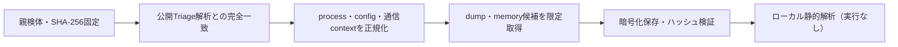

# Triage公開解析・後段取得証跡

## 完全ハッシュ一致

- [260923-va6zgaff25](https://tria.ge/260923-va6zgaff25): ファミリー候補 `donutloader, remus_stealer`、評価score `10`
- [260923-qx3hcat17q](https://tria.ge/260923-qx3hcat17q): ファミリー候補 `remus_stealer`、評価score `10`

## プロセス・通信

- 観測process: `rundll32.exe`
- raw commandは保存せず、command SHA-256と処理patternだけをJSONへ保持します。
- sandbox background trafficは`context_only`であり、C2へ自動昇格しません。

- `http://carogra.biz:4219/`（sandbox config候補）
- `http://prochr.top:6290/`（sandbox config候補）
- `http://tzpx.courses:4437/`（sandbox config候補）

## 後段取得物

- `9181eab49acbce5eb226b3f4ad20fd9521d007761548d292ff880def9d0aa0c4` / `memory_image` / 3805184 bytes / 親と同一: `false` / 静的解析: `未実施`

## 判定境界

Triage由来のfamily、process、config、通信は外部sandbox証跡です。Config extractorが返したendpointはC2候補として扱いますが、静的設定復元またはprocess帰属とprotocol応答が揃うまでは確認済みC2とはしません。取得成果物と検体は実行していません。
