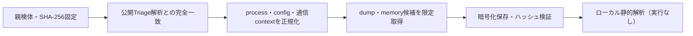

# Triage公開解析・後段取得証跡

## 完全ハッシュ一致

- [260810-wgh2nahf48](https://tria.ge/260810-wgh2nahf48): ファミリー候補 `未確定`、評価score `None`

## プロセス・通信

- 観測process: `取得できず`
- raw commandは保存せず、command SHA-256と処理patternだけをJSONへ保持します。
- sandbox background trafficは`context_only`であり、C2へ自動昇格しません。

- 取得できませんでした。

## 後段取得物

- `f58c83cc65a3b4f0dc9364e211e5fb0023608344ee70a21b84670587a4adcc37` / `memory_image` / 241664 bytes / 親と同一: `false` / 静的解析: `partial`

## 判定境界

Triage由来のfamily、process、config、通信は外部sandbox証跡です。Config extractorが返したendpointはC2候補として扱いますが、静的設定復元またはprocess帰属とprotocol応答が揃うまでは確認済みC2とはしません。取得成果物と検体は実行していません。
