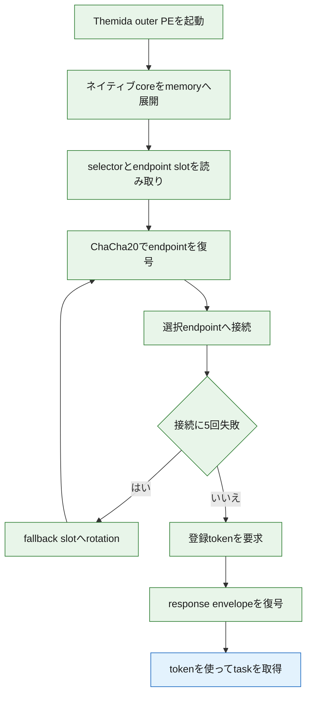
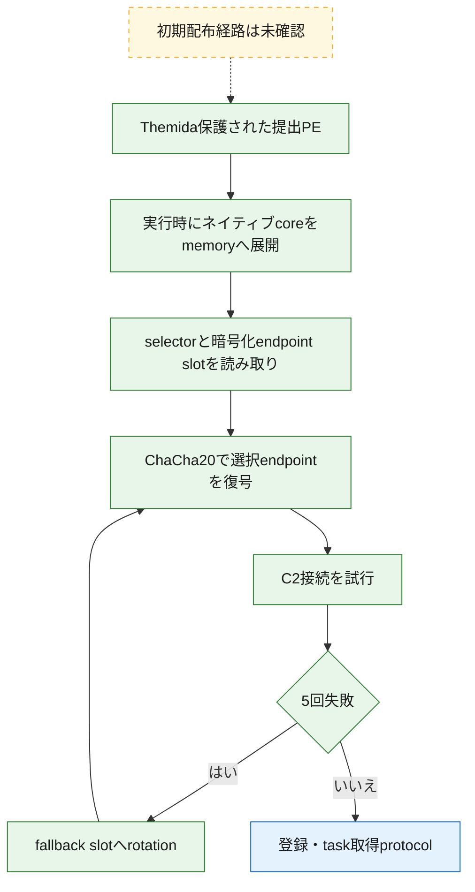
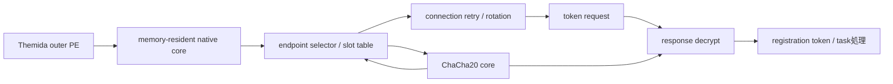

# 全体ロジック：843eec789f90f15c13e6905f36f54c32a0dbf767d9715aef1387d232aa11ab93

## 要約

Themida保護された提出PEからは関数本体を回収できませんでしたが、完全ハッシュ一致Triageの後期process dumpから実行時展開済みネイティブcoreを復元しました。静的解析でendpoint slot復号、選択、5回失敗後のrotation、C2 response復号を確認し、既存Remus protocol証拠と突合して受動C2判定sequenceを作成しました。

## 実行フロー

## 感染チェーン

緑は復元memory imageの静的根拠、青は静的response復号と完全ハッシュ一致sandbox／既存protocol解析を合わせた段階、黄は未確認です。

## モジュール関係

## 処理段階

### 1. outer PEとmemory core

提出PEの`.themida`はRawSize 0、VirtualSize 6963200 bytesで、静的fileだけでは実体を得られません。後期dumpから`expanded_memory_sections`方式でmemory-only領域を回収し、350関数を認識できる復元PEを作成しました。

### 2. endpoint設定復号

Original ChaCha20の64-bit counter／64-bit nonce modelを使い、連続する64-byte slotをslot indexと同じ初期counterで復号します。slot 0はsentinel、slot 1と2は実endpointです。最初の非URI slotで列挙を停止します。

### 3. 選択とrotation

保存selector `0x17`を`0x16`でXORしてindex 1を得ます。接続処理は同一slotで5回失敗するとselectorを更新し、次slotを復号して再試行します。

### 4. 登録とtask取得

受動C2判定では、登録の`tag/exp/hwid`、登録応答のHTTP 201と`access_token/vm/ss`、task取得の`access_token/step=1`、task応答の`type/name/data`をsequenceとして扱います。wire fieldは完全ハッシュ一致sandboxと既存Remus protocol解析による相関証拠です。

### 5. response復号

server responseは32-byte key、8-byte nonce、ciphertextのenvelopeで、ciphertext offsetは40 bytesです。clientはcounter 0でChaCha20復号します。暗号値そのものを公開せず、この構造と復号後JSON schemaをC2判定へ利用します。

## 解決済みと未解決

- 解決済み: terminal memory core、selected／fallback C2、slot selector、rotation、response envelope、代表6関数。
- 未解決: 当該sample固有の`exp`、正確なversion、初期配布経路、全344選定外関数の役割。
- 能動probe: `exp`、review済みHTTP Host、選択endpointと直接対応するpinned IPが揃わないためblockedです。
