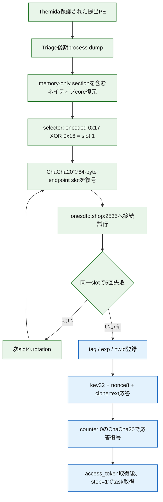

# RemusStealerケース 843eec789f90f15c13e6905f36f54c32a0dbf767d9715aef1387d232aa11ab93

## 概要

- 正規分類: `remusstealer`
- 分類根拠: MalwareBazaar報告、完全ハッシュ一致Triage 2件、復元したネイティブcoreの設定・通信ロジック
- 初回観測: `2026-08-05 17:20:31`
- 元ファイル名: `file`
- 提出検体SHA-256: `843eec789f90f15c13e6905f36f54c32a0dbf767d9715aef1387d232aa11ab93`
- 形式: 64-bit PE、Themida保護
- 検体実行: なし
- 検体由来C2への接続: なし
- ケース全体の状態: `partial`（終端gapは解消、C2 protocolのactive／live確認は未完了）

後期process dumpからThemidaの実行時展開済みネイティブcoreを復元し、これまで未解決だったterminal payload gapを閉じました。復元PEでは350関数を認識し、C2設定復号、endpoint rotation、request、response復号に関係する代表6関数を逆コンパイルしました。

終端payload／configのgapは解消しましたが、tagは未reviewの候補であり、検体固有`exp`、review済みHTTP Host、pinned IP、同一検体・同一flowをfield単位で結合する証拠manifestが不足しています。このため、能動C2 protocol確認とlive確認は未完了で、ケース全体は`complete`ではなく`partial`です。詳細なphase状態と次の最小手順は[C2解析契約](c2-analysis.json)に記録しています。

## 主要な結論

- `expanded_memory_sections`方式でmemory-onlyの`.themida`を含むPEを復元しました。
- 静的設定から選択中C2 `onesdto.shop:2535` とfallback `slyfogx.shop:5776` を確認しました。
- slot 0の`http://none`は通信先ではなくsentinelです。
- selectorは保存値`0x17`を`0x16`でXORし、slot 1を選択します。
- C2接続は同一slotで5回失敗すると次slotへrotationします。
- 32桁hexのtag`844bd1dce6c8ac2a8b8a026e61811dac`を候補として抽出しましたが、能動profileへ使うreviewは未完了です。
- `exp`とfield-level証拠manifestを復元できていないため、当該検体向けの能動端末登録profileはfail-closedで生成を停止しています。他検体の`tag`や`exp`は継承していません。

## 観測した特徴的な挙動

- ChaCha20で暗号化されたC2 endpointを復元し、selectorが選んだslotを接続先として使用します。
- 同一endpointへの接続試行が5回失敗すると、selectorを更新して次のslotへrotationします。
- C2応答は32-byte key、8-byte nonce、ciphertextのenvelopeとして処理し、復号後のtokenで`step=1`のtaskを取得します。

## 実行・通信フロー

緑は復元PEの静的解析で確認した処理、青は静的な応答復号ロジックと完全ハッシュ一致sandbox／既存Remus protocol解析を突合した通信段階です。詳細な根拠と安全境界は[terminal memory recovery](REMUS-TERMINAL-RECOVERY.md)を参照してください。

## C2判定への反映

ケース全体のC2完了判定は[c2-analysis.json](c2-analysis.json)で管理しています。静的sequenceは復元済みですが、能動C2判定とlive確認は`blocked`／`pending`です。

[remus-c2-profile.json](remus-c2-profile.json)に受動判定用の通信sequenceを記録しました。

- 登録: `tag`、`exp`、`hwid`
- 登録応答: HTTP `201`、復号後JSONの`access_token`、`vm`、`ss`
- task取得: `access_token`、`step=1`
- task応答: HTTP `201`、復号後JSONの`type`、`name`、`data`
- 応答envelope: 32-byte key、8-byte nonce、ciphertext

tagのreview、`exp`、HTTP Host、pinned IP、SHA-256固定したfield-level証拠manifestのいずれかが欠ける状態では能動probeを許可せず、中央profile registryにも追加していません。完全ハッシュ一致sandbox／PCAPで観測された`154.12.237.176:2535`とHTTP Host `microsoft.com`は外部証拠として区別し、静的設定そのものとは扱っていません。

## 関連成果物

- [terminal memory recoveryの詳細](REMUS-TERMINAL-RECOVERY.md)
- [静的設定の機械可読結果](remus-memory-config.json)
- [C2判定profile](remus-c2-profile.json)
- [C2解析契約と追加解析queue](c2-analysis.json)
- [代表関数の静的ロジック](STATIC-LOGIC.md)
- [全体ロジックとモジュール関係](OVERALL-LOGIC.md)
- [Triage取得・相関証跡](TRIAGE.md)
- [IOC一覧](IOC-LIST.md)
- [正規化解析データ](analysis.json)

## 制約

- ローカルで検体、dump、復元PEを実行またはemulateしていません。
- 検体由来C2、配布先、dead-drop resolverへ接続していません。
- Triage APIへの通信は、完全ハッシュ一致解析のreview済みartifact GETだけです。
- 実行時UUID／tokenの値、ChaCha20 key／nonceの値、生の逆コンパイル本文は公開していません。
- tag候補のreview、`exp`、field-level証拠manifest、正確なversion、全収集moduleの網羅的な関数対応は未解決です。
