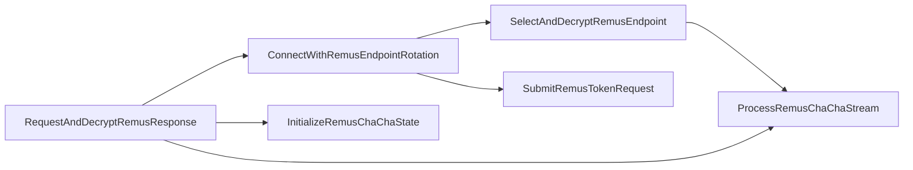
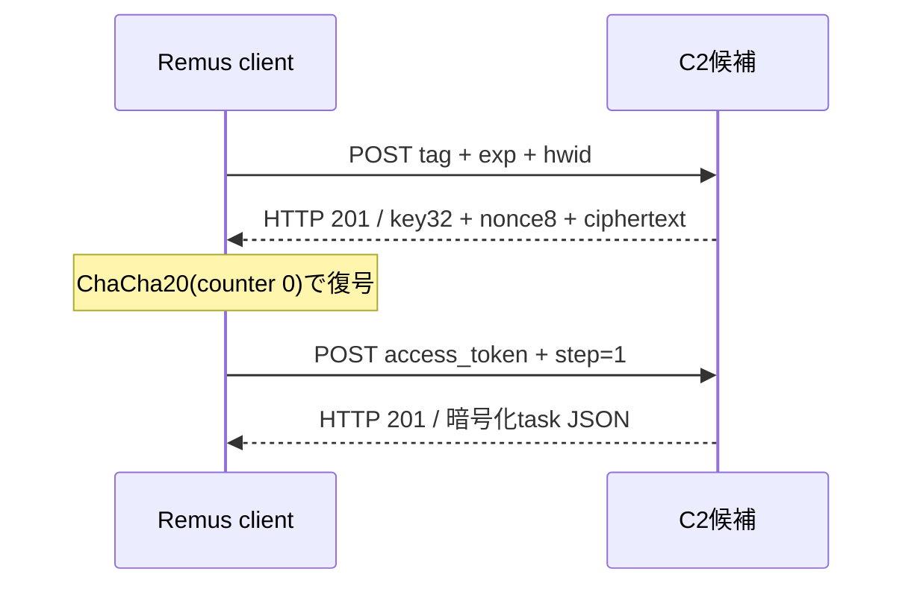

# RemusStealer終端メモリ復元

## 結論

完全ハッシュ一致Triage解析から追加取得した後期process dumpを静的に解析し、Themidaが実行時に展開したネイティブcoreとC2設定を復元しました。提出PEだけではGhidraが関数を認識できなかったgapは、このmemory image recoveryで解消しています。

## 対象と復元結果

| 項目 | 値 |
|---|---|
| 親検体SHA-256 | `843eec789f90f15c13e6905f36f54c32a0dbf767d9715aef1387d232aa11ab93` |
| 解析に使用した後期dump SHA-256 | `bfe4f4c4a579b05fb1175e96674bb849e1cc635c7246d5ec50111c5f1b2aad69` |
| 後期dump size | `11747328` bytes |
| 復元方式 | `expanded_memory_sections` |
| 復元PE SHA-256 | `0fbd56aca3de7bf2b504be5faf53486b9d2e041c213427bab58697c359937ab4` |
| 復元PE size | `11730944` bytes |
| MZ候補 | 84件 |
| 有効PE | 1件 |
| 棄却した偽MZ候補 | 83件 |
| 回収したmemory-only領域 | `.themida` |

process dump内のすべての`MZ`を候補として検証し、PE header、section境界、image sizeを満たした1件だけを復元しました。RawSizeが0だった`.themida`もVirtualSizeに基づいて回収し、memory layoutをfile layoutへ再構築しています。

## 静的メモリ復元

実parser出力を秘密値除外後に[remus-memory-config.json](remus-memory-config.json)へ保存しています。復元できた設定は次のとおりです。

| slot | 復号結果 | 判定 | 根拠 |
|---:|---|---|---|
| 0 | `http://none` | sentinel、通信IOCではない | ChaCha20復号、連続64-byte slot構造 |
| 1 | `http://onesdto.shop:2535` | 選択中C2 | selector `0x17 XOR 0x16 = 1` |
| 2 | `http://slyfogx.shop:5776` | fallback C2 | slot配列とrotationロジック |

- 静的keyの配置: RVA `0x304e0`。値は非公開で、SHA-256だけを機械可読結果に保持しています。
- 暗号化slotの開始: RVA `0x30510`、1 slot `64` bytes。
- selectorの配置: RVA `0x33018`。
- 実行時ChaCha stateの配置: RVA `0x382c8`。nonce値は非公開です。
- 選択endpoint bufferの配置: RVA `0x38310`。値そのものは静的slot復号結果としてのみ公開しています。
- 実行時UUID／tokenの配置: RVA `0x382a0`。値は非公開で、存在、形式、SHA-256だけを保持しています。
- tag候補: `844bd1dce6c8ac2a8b8a026e61811dac`、RVA `0x31aec`、確度high。
- `exp`: 未復元。10進値は静的configに存在せず、実行時epochで生成される可能性があります。

tagは、同一の静的config領域に存在する一意な32桁hexであり、ChaCha20 config構造の検証と別Remus検体での同型構造との照合により高確度候補としました。`exp`がないため、tag単独で能動登録へ使用しません。

## Ghidraによる代表関数解析

明示的program selector `/Malware/RemusStealer/20260809/843eec/terminal-memory/pe_0001_0fbd56aca3de7bf2.bin`を指定してGhidra MCPで解析しました。350関数のinventoryから通信・暗号処理に関係する6関数を選定し、6件すべての逆コンパイルに成功しました。

| address | 関数名 | 想定input | output／副作用 | 解説 |
|---|---|---|---|---|
| `0x140003dd0` | `InitializeRemusChaChaState` | state、32-byte key、8-byte nonce、64-bit counter | ChaCha state初期化 | 標準定数、key、counter、nonceをstateへ配置します。 |
| `0x140003fb0` | `ProcessRemusChaChaStream` | state、input、output、length | XOR結果、counter更新 | 20-round ChaCha20を64-byte block単位で処理します。 |
| `0x140005bb0` | `SelectAndDecryptRemusEndpoint` | global selector、暗号化slot配列 | 選択endpoint buffer更新 | selectorを`0x16`でXORし、対象64-byte slotを復号します。 |
| `0x1400055c0` | `ConnectWithRemusEndpointRotation` | endpoint state、接続処理context | 成否、slot更新 | 同一slotで5回失敗するとselectorを更新して次slotへ移ります。 |
| `0x1400060d0` | `SubmitRemusTokenRequest` | runtime token、request parameter | request結果 | tokenを含むrequestを組み立てて送信処理へ渡します。 |
| `0x1400075f0` | `RequestAndDecryptRemusResponse` | request context、暗号化response | 復号済みbuffer | 接続後、先頭32-byte keyと続く8-byte nonceで残りをChaCha20復号します。 |

### 観測したcall関係

`RequestAndDecryptRemusResponse`はresponse先頭40 bytesをkey 32 bytesとnonce 8 bytesとして扱い、ciphertextをoffset 40からcounter 0で復号します。この構造は既存のRemus受動／能動C2 detectorのresponse envelopeと一致します。

## C2判定ロジックへの反映

受動判定では、フォームfield sequence、HTTP 201、response envelope、復号後JSON fieldを組み合わせます。能動判定は、当該sample固有の`tag`、`exp`、review済みpinned IPが揃う場合だけ合成端末登録と`step=1` task取得を行う設計です。本ケースは`exp`未復元のためblockedです。

完全ハッシュ一致sandbox／PCAPで観測された`154.12.237.176:2535`とHTTP Host `microsoft.com`は外部証拠です。静的設定で確認したdomain／portとは分離して記録し、IPの現所有者や現在の稼働を本解析から断定していません。

## 安全境界

- ローカルで検体、dump、復元PEを実行またはemulateしていません。
- C2候補への接続、端末登録、task取得は行っていません。
- 外部通信はTriage APIによるreview済みartifact GETだけです。
- runtime UUID／token、ChaCha20 key／nonce、生の逆コンパイル本文は公開していません。
- 別検体の`tag`、`exp`、C2 profileを当該sampleへ流用していません。
