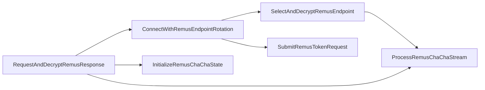

# 静的ロジック解析：843eec789f90f15c13e6905f36f54c32a0dbf767d9715aef1387d232aa11ab93

## 解析状態

- 状態: `terminal_memory_image_recovered_static_analysis_complete`
- Ghidra program: 2（提出PEと復元PE）
- 復元PEの関数inventory: 350
- 代表関数: 6
- 逆コンパイル試行／成功: 6／6
- 制約付き／失敗: 0
- 選定外関数: 344
- 観測した代表関数間call edge: 6

提出PEはThemida保護により関数本体を認識できませんでした。後期process dumpからmemory-only sectionを含むPEを復元し、明示的program selector `/Malware/RemusStealer/20260809/843eec/terminal-memory/pe_0001_0fbd56aca3de7bf2.bin`を指定してGhidra MCPで解析しました。

## 重要関数

### `InitializeRemusChaChaState` — `0x140003dd0`

- 入力: state、32-byte key、8-byte nonce、64-bit counter
- output: 初期化済みChaCha state
- ロジック: 標準定数4 words、key 8 words、64-bit counter、8-byte nonceをstateへ配置します。
- 選定理由: endpoint設定とC2応答の両方で使う暗号primitiveの初期化点です。

### `ProcessRemusChaChaStream` — `0x140003fb0`

- 入力: state、input、output、length
- output: XOR済みbuffer、更新済み64-bit counter
- ロジック: 10 double-round、計20 roundのChaCha20を64-byte block単位で処理します。
- 選定理由: 静的slot復号とresponse復号を結ぶ中心関数です。

### `SelectAndDecryptRemusEndpoint` — `0x140005bb0`

- input: global selector、暗号化64-byte slot配列
- output: 選択endpoint buffer
- ロジック: selectorを`0x16`でXORし、indexが3未満なら `slot_base + index * 64` をChaCha20で復号します。
- 本検体: encoded `0x17`からslot 1を選択します。

### `ConnectWithRemusEndpointRotation` — `0x1400055c0`

- input: endpoint state、接続処理context
- output: 接続成否、selector更新
- ロジック: 現在slotへ接続を試み、5回失敗するとselectorを更新し、次のendpoint slotを復号して再試行します。
- 選定理由: selected／fallbackの役割をコード上で確定する関数です。

### `SubmitRemusTokenRequest` — `0x1400060d0`

- 入力: runtime token、request parameter
- output: request処理結果
- ロジック: runtime tokenが存在する場合にrequest bufferを構築し、送信処理へ渡します。
- 注意: `tag/exp/hwid`などのwire fieldは完全ハッシュ一致sandbox／既存Remus protocol解析との相関で補完し、逆コンパイルだけから断定していません。

### `RequestAndDecryptRemusResponse` — `0x1400075f0`

- input: request context、暗号化response
- output: null終端した復号済みbuffer
- ロジック: 接続処理が返したresponseの先頭32 bytesをkey、次の8 bytesをnonce、offset 40以降をciphertextとしてcounter 0のChaCha20で復号します。
- 選定理由: protocol-level C2判定に使えるresponse envelopeを確定します。

## 観測したcall関係

## 安全境界と選定外範囲

- 350関数のinventoryを確認し、C2設定、rotation、request、response復号へ直接関係する6関数を選定しました。
- 選定外344関数は個別逆コンパイルの対象外です。全収集moduleの網羅的な関数対応は未解決です。
- 検体、dump、復元PEを実行またはemulateしていません。
- C2候補へ接続していません。
- Ghidraの任意script実行は有効化していません。
- runtime UUID／token、ChaCha20 key／nonce、生の逆コンパイル本文は公開していません。
