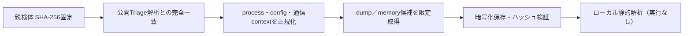

# Triage公開解析・後段取得証跡

## 完全ハッシュ一致

- [260805-ztaslawenc](https://tria.ge/260805-ztaslawenc): ファミリー候補 `remus_stealer`、評価score `10`
- [260805-vw7swscp7w](https://tria.ge/260805-vw7swscp7w): ファミリー候補 `remus_stealer`、評価score `10`

## プロセス・通信

- 観測process: `843eec789f90f15c13e6905f36f54c32a0dbf767d9715aef1387d232aa11ab93.exe, file.exe`
- raw commandは保存せず、command SHA-256と処理patternだけをJSONへ保持しています。
- sandbox background trafficは`context_only`であり、C2へ自動昇格しません。

- `http://none/`（sandbox config候補）
- `http://onesdto.shop:2535/`（sandbox config候補）
- `http://slyfogx.shop:5776/`（sandbox config候補）

## 二段目成果物

- `86ad2e7e74ed5c26255e0f0930904e061e532784e93e393287712e0cd6518520` / `memory_image` / 11747328 bytes / 親と同一: `false` / 静的解析: `partial`
- `7c452f04aaf61e5850b815096d78c97ab658668db6645f732251903a45bec23b` / `memory_image` / 11747328 bytes / 親と同一: `false` / 静的解析: `partial`

## 判定境界

Triage由来のfamily、process、config、通信は外部sandbox証跡です。config extractorが返したendpointはC2候補として扱えますが、
静的設定復元またはprocess帰属とprotocol応答が揃うまでは確認済みC2とはしません。取得成果物と検体は実行していません。
