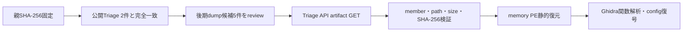

# Triage公開解析・後段取得証跡

## 完全ハッシュ一致

- [260805-ztaslawenc](https://tria.ge/260805-ztaslawenc): ファミリー候補 `remus_stealer`、score `10`
- [260805-vw7swscp7w](https://tria.ge/260805-vw7swscp7w): ファミリー候補 `remus_stealer`、score `10`

完全ハッシュ一致は2件です。初期memory image 2件に加え、review済みの後期process dump 5件をTriage APIから追加取得しました。API通信は公開解析のartifact GETだけであり、検体のローカル実行やC2接続ではありません。

### 既存の初期memory image

- `86ad2e7e74ed5c26255e0f0930904e061e532784e93e393287712e0cd6518520` / `11747328` bytes / 静的解析 `partial`
- `7c452f04aaf61e5850b815096d78c97ab658668db6645f732251903a45bec23b` / `11747328` bytes / 静的解析 `partial`

## terminal recoveryに使用したartifact

| 項目 | 値 |
|---|---|
| 後期dump SHA-256 | `bfe4f4c4a579b05fb1175e96674bb849e1cc635c7246d5ec50111c5f1b2aad69` |
| size | `11747328` bytes |
| 復元方式 | `expanded_memory_sections` |
| 復元PE SHA-256 | `0fbd56aca3de7bf2b504be5faf53486b9d2e041c213427bab58697c359937ab4` |
| 復元PE size | `11730944` bytes |
| MZ検証 | 84候補中1件採用、83件棄却 |

復元PEではmemory-onlyの`.themida`を回収し、350関数を認識しました。詳細は[REMUS-TERMINAL-RECOVERY.md](REMUS-TERMINAL-RECOVERY.md)を参照してください。

## config・通信相関

静的configで次を確認しました。

- selected: `http://onesdto.shop:2535`
- fallback: `http://slyfogx.shop:5776`
- sentinel: `http://none`（IOCではない）

完全ハッシュ一致sandbox／PCAPでは、別の外部動的証拠として次を観測しています。

- socket: `154.12.237.176:2535`
- HTTP Host: `microsoft.com`

この2項目の相互対応は本成果物だけでは直接証明していません。静的config値とも区別し、能動profileのpinned IP／HTTP Hostとしては使用していません。

## 判定境界

- Triage由来のfamily、process、socket、HTTP Hostは外部sandbox証拠です。
- endpoint 2件は復元PEのChaCha20 configとselector／rotationロジックで静的に確認しました。
- ローカルで検体、dump、復元PEを実行またはemulateしていません。
- C2候補への接続、合成端末登録、task取得は行っていません。
- runtime UUID／token、ChaCha20 key／nonceは値を公開していません。
