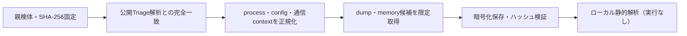

# Triage公開解析・後段取得証跡

## 完全ハッシュ一致

- [260923-f8dy1sxhpe](https://tria.ge/260923-f8dy1sxhpe): ファミリー候補 `未確定`、評価score `3`

## プロセス・通信

- 観測process: `file.exe`
- raw commandは保存せず、command SHA-256と処理patternだけをJSONへ保持します。
- sandbox background trafficは`context_only`であり、C2へ自動昇格しません。

- 取得できませんでした。

## 後段取得物

- `13ad2176423047f231ef70a3bc1de1438e4c713b5edc50cc864f094527c8e1e1` / `memory_image` / 249856 bytes / 親と同一: `false` / 静的解析: `未実施`

## 判定境界

Triage由来のfamily、process、config、通信は外部sandbox証跡です。Config extractorが返したendpointはC2候補として扱いますが、静的設定復元またはprocess帰属とprotocol応答が揃うまでは確認済みC2とはしません。取得成果物と検体は実行していません。
