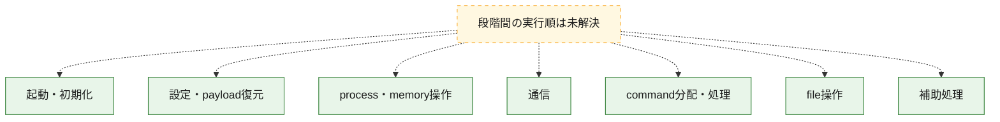
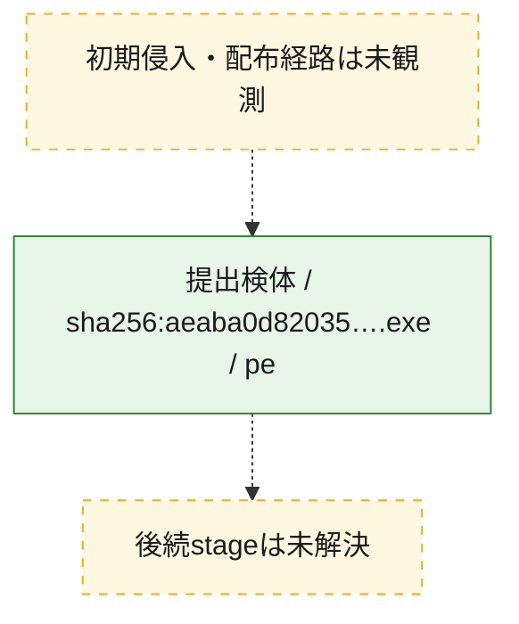
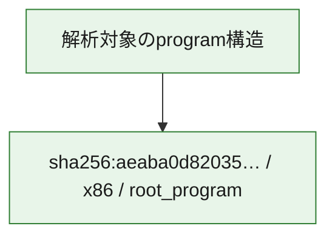

# 全体ロジック：aeaba0d82035fa8fd834bb88735c6f00d4c46ffbac13b746d1640eb91ce389ee

代表関数の静的証跡から、起動・初期化、設定・payload復元、process・memory操作、通信、command分配・処理、file操作の処理群を確認しました。

## 読み方

- phaseの掲載順は解析上の整理順です。observed_call_edgesがない段階間の実行順を断定しません。
- 図の実線は静的に観測した関係、点線と黄色のノードは未観測・未解決の関係を示します。
- 図は静的な要約であり、動的実行を再現するものではありません。
- 詳細な関数解説とfingerprintは[STATIC-LOGIC.md](STATIC-LOGIC.md)を参照してください。

## 静的可視化

### 実行フロー

### 感染チェーン

### モジュール関係

## 処理段階

### 1. 起動・初期化

entry pointから初期化と後続処理への移行を確認します。
確度: `confirmed_static_function_evidence`

- `aeaba0d82035fa8fd834bb88735c6f00d4c46ffbac13b746d1640eb91ce389ee:ghidra:140197520` — 初期化と主要処理への分岐を行う入口関数です。 状態: `succeeded`、選定理由: `entry_point`, `meaningful_symbol_name`, `probable_go_main_user_code`, `reviewed_call_centrality:5`, `role:entrypoint`
- `aeaba0d82035fa8fd834bb88735c6f00d4c46ffbac13b746d1640eb91ce389ee:ghidra:1401976e0` — 初期化と主要処理への分岐を行う入口関数です。 状態: `succeeded`、選定理由: `entry_point`, `meaningful_symbol_name`, `probable_go_main_user_code`, `reviewed_call_centrality:19`, `role:entrypoint`
- `aeaba0d82035fa8fd834bb88735c6f00d4c46ffbac13b746d1640eb91ce389ee:ghidra:14019a760` — 初期化と主要処理への分岐を行う入口関数です。 状態: `succeeded`、選定理由: `entry_point`, `meaningful_symbol_name`, `probable_go_main_user_code`, `reviewed_call_centrality:22`, `role:entrypoint`
- `aeaba0d82035fa8fd834bb88735c6f00d4c46ffbac13b746d1640eb91ce389ee:ghidra:1401a07c0` — 初期化と主要処理への分岐を行う入口関数です。 状態: `succeeded`、選定理由: `entry_point`, `meaningful_symbol_name`, `probable_go_main_user_code`, `reviewed_call_centrality:17`, `role:entrypoint`
- `aeaba0d82035fa8fd834bb88735c6f00d4c46ffbac13b746d1640eb91ce389ee:ghidra:1401a40e0` — 初期化と主要処理への分岐を行う入口関数です。 状態: `succeeded`、選定理由: `entry_point`, `meaningful_symbol_name`, `probable_go_main_user_code`, `reviewed_call_centrality:19`, `role:entrypoint`
- `aeaba0d82035fa8fd834bb88735c6f00d4c46ffbac13b746d1640eb91ce389ee:ghidra:1401a66e0` — 初期化と主要処理への分岐を行う入口関数です。 状態: `succeeded`、選定理由: `entry_point`, `meaningful_symbol_name`, `probable_go_main_user_code`, `reviewed_call_centrality:20`, `role:entrypoint`
- `aeaba0d82035fa8fd834bb88735c6f00d4c46ffbac13b746d1640eb91ce389ee:ghidra:1401a8c00` — 初期化と主要処理への分岐を行う入口関数です。 状態: `succeeded`、選定理由: `entry_point`, `meaningful_symbol_name`, `probable_go_main_user_code`, `reviewed_call_centrality:19`, `role:entrypoint`
- `aeaba0d82035fa8fd834bb88735c6f00d4c46ffbac13b746d1640eb91ce389ee:ghidra:1401acf20` — 初期化と主要処理への分岐を行う入口関数です。 状態: `succeeded`、選定理由: `entry_point`, `meaningful_symbol_name`, `probable_go_main_user_code`, `reviewed_call_centrality:21`, `role:entrypoint`
- `aeaba0d82035fa8fd834bb88735c6f00d4c46ffbac13b746d1640eb91ce389ee:ghidra:1401b2400` — 初期化と主要処理への分岐を行う入口関数です。 状態: `succeeded`、選定理由: `entry_point`, `meaningful_symbol_name`, `probable_go_main_user_code`, `reviewed_call_centrality:30`, `role:entrypoint`
- `aeaba0d82035fa8fd834bb88735c6f00d4c46ffbac13b746d1640eb91ce389ee:ghidra:1401b76c0` — 初期化と主要処理への分岐を行う入口関数です。 状態: `succeeded`、選定理由: `entry_point`, `meaningful_symbol_name`, `probable_go_main_user_code`, `reviewed_call_centrality:19`, `role:entrypoint`
- `aeaba0d82035fa8fd834bb88735c6f00d4c46ffbac13b746d1640eb91ce389ee:ghidra:1401ba6c0` — 初期化と主要処理への分岐を行う入口関数です。 状態: `succeeded`、選定理由: `entry_point`, `meaningful_symbol_name`, `probable_go_main_user_code`, `reviewed_call_centrality:18`, `role:entrypoint`
- `aeaba0d82035fa8fd834bb88735c6f00d4c46ffbac13b746d1640eb91ce389ee:ghidra:1401bcd20` — 初期化と主要処理への分岐を行う入口関数です。 状態: `succeeded`、選定理由: `entry_point`, `meaningful_symbol_name`, `probable_go_main_user_code`, `reviewed_call_centrality:20`, `role:entrypoint`
- `aeaba0d82035fa8fd834bb88735c6f00d4c46ffbac13b746d1640eb91ce389ee:ghidra:1401c0720` — 初期化と主要処理への分岐を行う入口関数です。 状態: `succeeded`、選定理由: `entry_point`, `meaningful_symbol_name`, `probable_go_main_user_code`, `reviewed_call_centrality:20`, `role:entrypoint`
- `aeaba0d82035fa8fd834bb88735c6f00d4c46ffbac13b746d1640eb91ce389ee:ghidra:1401c36a0` — 初期化と主要処理への分岐を行う入口関数です。 状態: `succeeded`、選定理由: `entry_point`, `meaningful_symbol_name`, `probable_go_main_user_code`, `reviewed_call_centrality:18`, `role:entrypoint`
- `aeaba0d82035fa8fd834bb88735c6f00d4c46ffbac13b746d1640eb91ce389ee:ghidra:1401c5be0` — 初期化と主要処理への分岐を行う入口関数です。 状態: `succeeded`、選定理由: `entry_point`, `meaningful_symbol_name`, `probable_go_main_user_code`, `reviewed_call_centrality:26`, `role:entrypoint`
- `aeaba0d82035fa8fd834bb88735c6f00d4c46ffbac13b746d1640eb91ce389ee:ghidra:1401cb0e0` — 初期化と主要処理への分岐を行う入口関数です。 状態: `succeeded`、選定理由: `entry_point`, `meaningful_symbol_name`, `probable_go_main_user_code`, `reviewed_call_centrality:20`, `role:entrypoint`
- `aeaba0d82035fa8fd834bb88735c6f00d4c46ffbac13b746d1640eb91ce389ee:ghidra:1401ce160` — 初期化と主要処理への分岐を行う入口関数です。 状態: `succeeded`、選定理由: `entry_point`, `meaningful_symbol_name`, `probable_go_main_user_code`, `reviewed_call_centrality:19`, `role:entrypoint`
- `aeaba0d82035fa8fd834bb88735c6f00d4c46ffbac13b746d1640eb91ce389ee:ghidra:1401cfdc0` — 初期化と主要処理への分岐を行う入口関数です。 状態: `succeeded`、選定理由: `entry_point`, `meaningful_symbol_name`, `probable_go_main_user_code`, `reviewed_call_centrality:20`, `role:entrypoint`
- `aeaba0d82035fa8fd834bb88735c6f00d4c46ffbac13b746d1640eb91ce389ee:ghidra:1401d2320` — 初期化と主要処理への分岐を行う入口関数です。 状態: `succeeded`、選定理由: `entry_point`, `meaningful_symbol_name`, `probable_go_main_user_code`, `reviewed_call_centrality:19`, `role:entrypoint`
- `aeaba0d82035fa8fd834bb88735c6f00d4c46ffbac13b746d1640eb91ce389ee:ghidra:1401d35e0` — 初期化と主要処理への分岐を行う入口関数です。 状態: `succeeded`、選定理由: `entry_point`, `meaningful_symbol_name`, `probable_go_main_user_code`, `reviewed_call_centrality:32`, `role:entrypoint`
- `aeaba0d82035fa8fd834bb88735c6f00d4c46ffbac13b746d1640eb91ce389ee:ghidra:1401e1800` — 初期化と主要処理への分岐を行う入口関数です。 状態: `succeeded`、選定理由: `entry_point`, `meaningful_symbol_name`, `probable_go_main_user_code`, `reviewed_call_centrality:17`, `role:entrypoint`
- `aeaba0d82035fa8fd834bb88735c6f00d4c46ffbac13b746d1640eb91ce389ee:ghidra:1401e3d60` — 初期化と主要処理への分岐を行う入口関数です。 状態: `succeeded`、選定理由: `entry_point`, `meaningful_symbol_name`, `probable_go_main_user_code`, `reviewed_call_centrality:40`, `role:entrypoint`
- `aeaba0d82035fa8fd834bb88735c6f00d4c46ffbac13b746d1640eb91ce389ee:ghidra:1401fa2c0` — 初期化と主要処理への分岐を行う入口関数です。 状態: `succeeded`、選定理由: `entry_point`, `meaningful_symbol_name`, `probable_go_main_user_code`, `reviewed_call_centrality:17`, `role:entrypoint`
- `aeaba0d82035fa8fd834bb88735c6f00d4c46ffbac13b746d1640eb91ce389ee:ghidra:1401fd1c0` — 初期化と主要処理への分岐を行う入口関数です。 状態: `succeeded`、選定理由: `entry_point`, `meaningful_symbol_name`, `probable_go_main_user_code`, `reviewed_call_centrality:19`, `role:entrypoint`

### 2. 設定・payload復元

設定、resource、payload、暗号化データの復元・変換を確認します。
確度: `confirmed_static_function_evidence`

- `aeaba0d82035fa8fd834bb88735c6f00d4c46ffbac13b746d1640eb91ce389ee:ghidra:140097740` — 設定、resource、payloadなどの解析・変換を行う関数です。 状態: `succeeded`、選定理由: `meaningful_symbol_name`, `reviewed_call_centrality:4`, `role:config_or_data_transform`
- `aeaba0d82035fa8fd834bb88735c6f00d4c46ffbac13b746d1640eb91ce389ee:ghidra:14009afe0` — 暗号、hash、encoding、または復号処理に関係する関数です。 状態: `succeeded`、選定理由: `meaningful_symbol_name`, `reviewed_call_centrality:4`, `role:cryptographic_transform`

### 3. process・memory操作

process、thread、module、memory操作と実行移行を確認します。
確度: `confirmed_static_function_evidence`

- `aeaba0d82035fa8fd834bb88735c6f00d4c46ffbac13b746d1640eb91ce389ee:ghidra:1400c9340` — process、thread、module、またはmemory操作に関係する関数です。 状態: `succeeded`、選定理由: `meaningful_symbol_name`, `reviewed_call_centrality:6`, `role:process_or_memory_operation`

### 4. 通信

通信初期化、endpoint処理、送受信の役割を確認します。
確度: `confirmed_static_function_evidence`

- `aeaba0d82035fa8fd834bb88735c6f00d4c46ffbac13b746d1640eb91ce389ee:ghidra:1400b38a0` — 通信初期化、送受信、またはendpoint処理に関係する関数です。 状態: `succeeded`、選定理由: `meaningful_symbol_name`, `reviewed_call_centrality:8`, `role:network_communication`

### 5. command分配・処理

受信commandやtaskの解釈、分配、個別handlerへの移行を確認します。
確度: `confirmed_static_function_evidence`

- `aeaba0d82035fa8fd834bb88735c6f00d4c46ffbac13b746d1640eb91ce389ee:ghidra:1400c8a60` — commandの解釈、分配、または個別処理を担当する関数です。 状態: `succeeded`、選定理由: `meaningful_symbol_name`, `reviewed_call_centrality:5`, `role:command_dispatch_or_handler`

### 6. file操作

fileやdirectoryの作成、読書き、削除を確認します。
確度: `confirmed_static_function_evidence`

- `aeaba0d82035fa8fd834bb88735c6f00d4c46ffbac13b746d1640eb91ce389ee:ghidra:1400c9600` — fileまたはdirectoryの読書き・管理に関係する関数です。 状態: `succeeded`、選定理由: `meaningful_symbol_name`, `reviewed_call_centrality:6`, `role:file_operation`

### 7. 補助処理

主要処理を支える一般内部関数またはlibrary処理を確認します。
確度: `confirmed_static_function_evidence`

- `aeaba0d82035fa8fd834bb88735c6f00d4c46ffbac13b746d1640eb91ce389ee:ghidra:140001080` — compiler生成処理または汎用library処理とみられる関数です。 状態: `succeeded`、選定理由: `meaningful_symbol_name`, `reviewed_call_centrality:9`
- `aeaba0d82035fa8fd834bb88735c6f00d4c46ffbac13b746d1640eb91ce389ee:ghidra:140079f80` — 検体内部の一般処理を実装する関数です。 状態: `succeeded`、選定理由: `meaningful_symbol_name`, `reviewed_call_centrality:3`

## 観測したcall関係

- `ghidra-function:078743091503364788f5058f` → `ghidra-external:025ca54fa8b9d169580a75c5` （`unclassified` → `unclassified`）
- `ghidra-function:078743091503364788f5058f` → `ghidra-external:0d2f6a161bdfad52240eb23e` （`unclassified` → `unclassified`）
- `ghidra-function:078743091503364788f5058f` → `ghidra-external:12b7dd3538a1390188ff7fbf` （`unclassified` → `unclassified`）
- `ghidra-function:078743091503364788f5058f` → `ghidra-external:16eb415560df5f2633f40b77` （`unclassified` → `unclassified`）
- `ghidra-function:078743091503364788f5058f` → `ghidra-external:23ded48a6f0fe8a0dca71ef0` （`unclassified` → `unclassified`）
- `ghidra-function:078743091503364788f5058f` → `ghidra-external:2723401ca86a9c0a0b38b806` （`unclassified` → `unclassified`）
- `ghidra-function:078743091503364788f5058f` → `ghidra-external:32b9be925b3bd2f3faa21b77` （`unclassified` → `unclassified`）
- `ghidra-function:078743091503364788f5058f` → `ghidra-external:384fc7fffff2dc87af54752d` （`unclassified` → `unclassified`）
- `ghidra-function:078743091503364788f5058f` → `ghidra-external:3da311add0bb64b8365b310b` （`unclassified` → `unclassified`）
- `ghidra-function:078743091503364788f5058f` → `ghidra-external:41f9f0c78ca7cab99a81ab10` （`unclassified` → `unclassified`）
- `ghidra-function:078743091503364788f5058f` → `ghidra-external:46613d48be7533858c16234d` （`unclassified` → `unclassified`）
- `ghidra-function:078743091503364788f5058f` → `ghidra-external:4bbcfc20c280b5419c448445` （`unclassified` → `unclassified`）
- `ghidra-function:078743091503364788f5058f` → `ghidra-external:4d1ad56db14b29cbe845f61a` （`unclassified` → `unclassified`）
- `ghidra-function:078743091503364788f5058f` → `ghidra-external:50997ccfd9f8bbf4ffff929a` （`unclassified` → `unclassified`）
- `ghidra-function:078743091503364788f5058f` → `ghidra-external:7cf55502a5d98b7f4df2987f` （`unclassified` → `unclassified`）
- `ghidra-function:078743091503364788f5058f` → `ghidra-external:8ba5f71147b51e637981dd7c` （`unclassified` → `unclassified`）
- `ghidra-function:078743091503364788f5058f` → `ghidra-external:9828086ab3be22850557bb11` （`unclassified` → `unclassified`）
- `ghidra-function:078743091503364788f5058f` → `ghidra-external:9c75bdc56bf7b6db83f47571` （`unclassified` → `unclassified`）
- `ghidra-function:078743091503364788f5058f` → `ghidra-external:9f9afba33ed71f5fcf15189a` （`unclassified` → `unclassified`）
- `ghidra-function:078743091503364788f5058f` → `ghidra-external:a8d4ed31ea885b5f4d14955a` （`unclassified` → `unclassified`）
- `ghidra-function:078743091503364788f5058f` → `ghidra-external:c46c2980b2a0481f698d0c11` （`unclassified` → `unclassified`）
- `ghidra-function:078743091503364788f5058f` → `ghidra-external:c53f97d2c5310ebfe13e9389` （`unclassified` → `unclassified`）
- `ghidra-function:078743091503364788f5058f` → `ghidra-external:c5dde2b51c5dabb412466f6b` （`unclassified` → `unclassified`）
- `ghidra-function:078743091503364788f5058f` → `ghidra-external:d09e0d37caf3d5eeaff4467f` （`unclassified` → `unclassified`）
- `ghidra-function:078743091503364788f5058f` → `ghidra-external:d1108217393ef803f558f7d4` （`unclassified` → `unclassified`）
- `ghidra-function:078743091503364788f5058f` → `ghidra-external:d574c57298fa5aa6a439c0a7` （`unclassified` → `unclassified`）
- `ghidra-function:078743091503364788f5058f` → `ghidra-external:d8fb3af952a0158009c23292` （`unclassified` → `unclassified`）
- `ghidra-function:078743091503364788f5058f` → `ghidra-external:e1825bc648227f0a7480bd55` （`unclassified` → `unclassified`）
- `ghidra-function:078743091503364788f5058f` → `ghidra-external:e649db21002e554ce4f0c121` （`unclassified` → `unclassified`）
- `ghidra-function:078743091503364788f5058f` → `ghidra-external:f1d0bef8d73b8ec136ed96f9` （`unclassified` → `unclassified`）
- `ghidra-function:078743091503364788f5058f` → `ghidra-external:fb7718215e04db37d3617462` （`unclassified` → `unclassified`）
- `ghidra-function:078743091503364788f5058f` → `ghidra-external:ffe76c1a65856aad6c661a9a` （`unclassified` → `unclassified`）
- `ghidra-function:0d49c23a540b8c2d2c744acf` → `ghidra-external:0d2f6a161bdfad52240eb23e` （`unclassified` → `unclassified`）
- `ghidra-function:0d49c23a540b8c2d2c744acf` → `ghidra-external:12b7dd3538a1390188ff7fbf` （`unclassified` → `unclassified`）
- `ghidra-function:0d49c23a540b8c2d2c744acf` → `ghidra-external:32b9be925b3bd2f3faa21b77` （`unclassified` → `unclassified`）
- `ghidra-function:0d49c23a540b8c2d2c744acf` → `ghidra-external:3da311add0bb64b8365b310b` （`unclassified` → `unclassified`）
- `ghidra-function:0d49c23a540b8c2d2c744acf` → `ghidra-external:4d1ad56db14b29cbe845f61a` （`unclassified` → `unclassified`）
- `ghidra-function:0d49c23a540b8c2d2c744acf` → `ghidra-external:50997ccfd9f8bbf4ffff929a` （`unclassified` → `unclassified`）
- `ghidra-function:0d49c23a540b8c2d2c744acf` → `ghidra-external:783ee50de77d075018e98d21` （`unclassified` → `unclassified`）
- `ghidra-function:0d49c23a540b8c2d2c744acf` → `ghidra-external:8ba5f71147b51e637981dd7c` （`unclassified` → `unclassified`）
- `ghidra-function:0d49c23a540b8c2d2c744acf` → `ghidra-external:9828086ab3be22850557bb11` （`unclassified` → `unclassified`）
- `ghidra-function:0d49c23a540b8c2d2c744acf` → `ghidra-external:9c75bdc56bf7b6db83f47571` （`unclassified` → `unclassified`）
- `ghidra-function:0d49c23a540b8c2d2c744acf` → `ghidra-external:9f9afba33ed71f5fcf15189a` （`unclassified` → `unclassified`）
- `ghidra-function:0d49c23a540b8c2d2c744acf` → `ghidra-external:c46c2980b2a0481f698d0c11` （`unclassified` → `unclassified`）
- `ghidra-function:0d49c23a540b8c2d2c744acf` → `ghidra-external:c53f97d2c5310ebfe13e9389` （`unclassified` → `unclassified`）
- `ghidra-function:0d49c23a540b8c2d2c744acf` → `ghidra-external:d8fb3af952a0158009c23292` （`unclassified` → `unclassified`）
- `ghidra-function:0d49c23a540b8c2d2c744acf` → `ghidra-external:f1d0bef8d73b8ec136ed96f9` （`unclassified` → `unclassified`）
- `ghidra-function:0d49c23a540b8c2d2c744acf` → `ghidra-external:fb7718215e04db37d3617462` （`unclassified` → `unclassified`）
- `ghidra-function:0d49c23a540b8c2d2c744acf` → `ghidra-external:ffe76c1a65856aad6c661a9a` （`unclassified` → `unclassified`）
- `ghidra-function:18ea3e5543c361df9fa0dc46` → `ghidra-external:0d2f6a161bdfad52240eb23e` （`unclassified` → `unclassified`）
- `ghidra-function:18ea3e5543c361df9fa0dc46` → `ghidra-external:12b7dd3538a1390188ff7fbf` （`unclassified` → `unclassified`）
- `ghidra-function:18ea3e5543c361df9fa0dc46` → `ghidra-external:2723401ca86a9c0a0b38b806` （`unclassified` → `unclassified`）
- `ghidra-function:18ea3e5543c361df9fa0dc46` → `ghidra-external:32b9be925b3bd2f3faa21b77` （`unclassified` → `unclassified`）
- `ghidra-function:18ea3e5543c361df9fa0dc46` → `ghidra-external:3da311add0bb64b8365b310b` （`unclassified` → `unclassified`）
- `ghidra-function:18ea3e5543c361df9fa0dc46` → `ghidra-external:4d1ad56db14b29cbe845f61a` （`unclassified` → `unclassified`）
- `ghidra-function:18ea3e5543c361df9fa0dc46` → `ghidra-external:50997ccfd9f8bbf4ffff929a` （`unclassified` → `unclassified`）
- `ghidra-function:18ea3e5543c361df9fa0dc46` → `ghidra-external:8ba5f71147b51e637981dd7c` （`unclassified` → `unclassified`）
- `ghidra-function:18ea3e5543c361df9fa0dc46` → `ghidra-external:9828086ab3be22850557bb11` （`unclassified` → `unclassified`）
- `ghidra-function:18ea3e5543c361df9fa0dc46` → `ghidra-external:9c75bdc56bf7b6db83f47571` （`unclassified` → `unclassified`）
- `ghidra-function:18ea3e5543c361df9fa0dc46` → `ghidra-external:9f9afba33ed71f5fcf15189a` （`unclassified` → `unclassified`）
- `ghidra-function:18ea3e5543c361df9fa0dc46` → `ghidra-external:c46c2980b2a0481f698d0c11` （`unclassified` → `unclassified`）
- `ghidra-function:18ea3e5543c361df9fa0dc46` → `ghidra-external:c53f97d2c5310ebfe13e9389` （`unclassified` → `unclassified`）
- `ghidra-function:18ea3e5543c361df9fa0dc46` → `ghidra-external:d8fb3af952a0158009c23292` （`unclassified` → `unclassified`）
- `ghidra-function:18ea3e5543c361df9fa0dc46` → `ghidra-external:f1d0bef8d73b8ec136ed96f9` （`unclassified` → `unclassified`）
- `ghidra-function:18ea3e5543c361df9fa0dc46` → `ghidra-external:fb7718215e04db37d3617462` （`unclassified` → `unclassified`）
- `ghidra-function:18ea3e5543c361df9fa0dc46` → `ghidra-external:ffe76c1a65856aad6c661a9a` （`unclassified` → `unclassified`）
- `ghidra-function:1efbaac7d4f516dc6726d443` → `ghidra-external:12b7dd3538a1390188ff7fbf` （`unclassified` → `unclassified`）
- `ghidra-function:1efbaac7d4f516dc6726d443` → `ghidra-external:42b38b27be3a5b978e359969` （`unclassified` → `unclassified`）
- `ghidra-function:1efbaac7d4f516dc6726d443` → `ghidra-external:6c44521ab7ca08dc1ee21017` （`unclassified` → `unclassified`）
- `ghidra-function:1efbaac7d4f516dc6726d443` → `ghidra-external:7ba36ff67f30d3d7ee5eb64b` （`unclassified` → `unclassified`）
- `ghidra-function:1efbaac7d4f516dc6726d443` → `ghidra-external:9828086ab3be22850557bb11` （`unclassified` → `unclassified`）
- `ghidra-function:1efbaac7d4f516dc6726d443` → `ghidra-external:9e192b15f1970f568eefda36` （`unclassified` → `unclassified`）
- `ghidra-function:1efbaac7d4f516dc6726d443` → `ghidra-external:f1d0bef8d73b8ec136ed96f9` （`unclassified` → `unclassified`）
- `ghidra-function:1efbaac7d4f516dc6726d443` → `ghidra-external:fb7718215e04db37d3617462` （`unclassified` → `unclassified`）
- `ghidra-function:1efbaac7d4f516dc6726d443` → `ghidra-external:ffe76c1a65856aad6c661a9a` （`unclassified` → `unclassified`）
- `ghidra-function:2073ae08657dc5a7d5be4590` → `ghidra-external:0d2f6a161bdfad52240eb23e` （`unclassified` → `unclassified`）
- `ghidra-function:2073ae08657dc5a7d5be4590` → `ghidra-external:12b7dd3538a1390188ff7fbf` （`unclassified` → `unclassified`）
- `ghidra-function:2073ae08657dc5a7d5be4590` → `ghidra-external:32b9be925b3bd2f3faa21b77` （`unclassified` → `unclassified`）
- `ghidra-function:2073ae08657dc5a7d5be4590` → `ghidra-external:331aea33fcd2de1d5177efc9` （`unclassified` → `unclassified`）
- `ghidra-function:2073ae08657dc5a7d5be4590` → `ghidra-external:3da311add0bb64b8365b310b` （`unclassified` → `unclassified`）
- `ghidra-function:2073ae08657dc5a7d5be4590` → `ghidra-external:4d1ad56db14b29cbe845f61a` （`unclassified` → `unclassified`）
- `ghidra-function:2073ae08657dc5a7d5be4590` → `ghidra-external:50997ccfd9f8bbf4ffff929a` （`unclassified` → `unclassified`）
- `ghidra-function:2073ae08657dc5a7d5be4590` → `ghidra-external:8ba5f71147b51e637981dd7c` （`unclassified` → `unclassified`）
- `ghidra-function:2073ae08657dc5a7d5be4590` → `ghidra-external:9828086ab3be22850557bb11` （`unclassified` → `unclassified`）
- `ghidra-function:2073ae08657dc5a7d5be4590` → `ghidra-external:9c75bdc56bf7b6db83f47571` （`unclassified` → `unclassified`）
- `ghidra-function:2073ae08657dc5a7d5be4590` → `ghidra-external:9f9afba33ed71f5fcf15189a` （`unclassified` → `unclassified`）
- `ghidra-function:2073ae08657dc5a7d5be4590` → `ghidra-external:a8d4ed31ea885b5f4d14955a` （`unclassified` → `unclassified`）
- `ghidra-function:2073ae08657dc5a7d5be4590` → `ghidra-external:c46c2980b2a0481f698d0c11` （`unclassified` → `unclassified`）
- `ghidra-function:2073ae08657dc5a7d5be4590` → `ghidra-external:c53f97d2c5310ebfe13e9389` （`unclassified` → `unclassified`）
- `ghidra-function:2073ae08657dc5a7d5be4590` → `ghidra-external:c98208f75e0dbcbf3d4e9cc3` （`unclassified` → `unclassified`）
- `ghidra-function:2073ae08657dc5a7d5be4590` → `ghidra-external:d8fb3af952a0158009c23292` （`unclassified` → `unclassified`）
- `ghidra-function:2073ae08657dc5a7d5be4590` → `ghidra-external:f1d0bef8d73b8ec136ed96f9` （`unclassified` → `unclassified`）
- `ghidra-function:2073ae08657dc5a7d5be4590` → `ghidra-external:fb7718215e04db37d3617462` （`unclassified` → `unclassified`）
- `ghidra-function:2073ae08657dc5a7d5be4590` → `ghidra-external:ffe76c1a65856aad6c661a9a` （`unclassified` → `unclassified`）
- `ghidra-function:265ad89a99ff586c46dd3a52` → `ghidra-external:0d2f6a161bdfad52240eb23e` （`unclassified` → `unclassified`）
- `ghidra-function:265ad89a99ff586c46dd3a52` → `ghidra-external:12b7dd3538a1390188ff7fbf` （`unclassified` → `unclassified`）
- `ghidra-function:265ad89a99ff586c46dd3a52` → `ghidra-external:1f971d370db39bb934ce95fb` （`unclassified` → `unclassified`）
- `ghidra-function:265ad89a99ff586c46dd3a52` → `ghidra-external:32b9be925b3bd2f3faa21b77` （`unclassified` → `unclassified`）
- `ghidra-function:265ad89a99ff586c46dd3a52` → `ghidra-external:331aea33fcd2de1d5177efc9` （`unclassified` → `unclassified`）
- `ghidra-function:265ad89a99ff586c46dd3a52` → `ghidra-external:3da311add0bb64b8365b310b` （`unclassified` → `unclassified`）
- `ghidra-function:265ad89a99ff586c46dd3a52` → `ghidra-external:4d1ad56db14b29cbe845f61a` （`unclassified` → `unclassified`）
- `ghidra-function:265ad89a99ff586c46dd3a52` → `ghidra-external:50997ccfd9f8bbf4ffff929a` （`unclassified` → `unclassified`）
- `ghidra-function:265ad89a99ff586c46dd3a52` → `ghidra-external:8ba5f71147b51e637981dd7c` （`unclassified` → `unclassified`）
- `ghidra-function:265ad89a99ff586c46dd3a52` → `ghidra-external:9828086ab3be22850557bb11` （`unclassified` → `unclassified`）
- `ghidra-function:265ad89a99ff586c46dd3a52` → `ghidra-external:9c75bdc56bf7b6db83f47571` （`unclassified` → `unclassified`）
- `ghidra-function:265ad89a99ff586c46dd3a52` → `ghidra-external:9f9afba33ed71f5fcf15189a` （`unclassified` → `unclassified`）
- `ghidra-function:265ad89a99ff586c46dd3a52` → `ghidra-external:a78b1e484b2427b14ea26cc2` （`unclassified` → `unclassified`）
- `ghidra-function:265ad89a99ff586c46dd3a52` → `ghidra-external:c46c2980b2a0481f698d0c11` （`unclassified` → `unclassified`）
- `ghidra-function:265ad89a99ff586c46dd3a52` → `ghidra-external:c53f97d2c5310ebfe13e9389` （`unclassified` → `unclassified`）
- `ghidra-function:265ad89a99ff586c46dd3a52` → `ghidra-external:d8fb3af952a0158009c23292` （`unclassified` → `unclassified`）
- `ghidra-function:265ad89a99ff586c46dd3a52` → `ghidra-external:f1d0bef8d73b8ec136ed96f9` （`unclassified` → `unclassified`）
- `ghidra-function:265ad89a99ff586c46dd3a52` → `ghidra-external:fb7718215e04db37d3617462` （`unclassified` → `unclassified`）
- `ghidra-function:265ad89a99ff586c46dd3a52` → `ghidra-external:ffe76c1a65856aad6c661a9a` （`unclassified` → `unclassified`）
- `ghidra-function:386eabc3266f77429fd1bb1e` → `ghidra-external:025ca54fa8b9d169580a75c5` （`unclassified` → `unclassified`）
- `ghidra-function:386eabc3266f77429fd1bb1e` → `ghidra-external:0d2f6a161bdfad52240eb23e` （`unclassified` → `unclassified`）
- `ghidra-function:386eabc3266f77429fd1bb1e` → `ghidra-external:12b7dd3538a1390188ff7fbf` （`unclassified` → `unclassified`）
- `ghidra-function:386eabc3266f77429fd1bb1e` → `ghidra-external:32b9be925b3bd2f3faa21b77` （`unclassified` → `unclassified`）
- `ghidra-function:386eabc3266f77429fd1bb1e` → `ghidra-external:3d379e9fa0240d4fa39c9081` （`unclassified` → `unclassified`）
- `ghidra-function:386eabc3266f77429fd1bb1e` → `ghidra-external:3da311add0bb64b8365b310b` （`unclassified` → `unclassified`）
- `ghidra-function:386eabc3266f77429fd1bb1e` → `ghidra-external:4d1ad56db14b29cbe845f61a` （`unclassified` → `unclassified`）
- `ghidra-function:386eabc3266f77429fd1bb1e` → `ghidra-external:50997ccfd9f8bbf4ffff929a` （`unclassified` → `unclassified`）
- `ghidra-function:386eabc3266f77429fd1bb1e` → `ghidra-external:55038fae3f8110190d08f7cc` （`unclassified` → `unclassified`）
- `ghidra-function:386eabc3266f77429fd1bb1e` → `ghidra-external:8ba5f71147b51e637981dd7c` （`unclassified` → `unclassified`）
- `ghidra-function:386eabc3266f77429fd1bb1e` → `ghidra-external:9828086ab3be22850557bb11` （`unclassified` → `unclassified`）
- `ghidra-function:386eabc3266f77429fd1bb1e` → `ghidra-external:9c75bdc56bf7b6db83f47571` （`unclassified` → `unclassified`）
- `ghidra-function:386eabc3266f77429fd1bb1e` → `ghidra-external:9f9afba33ed71f5fcf15189a` （`unclassified` → `unclassified`）
- `ghidra-function:386eabc3266f77429fd1bb1e` → `ghidra-external:c46c2980b2a0481f698d0c11` （`unclassified` → `unclassified`）
- `ghidra-function:386eabc3266f77429fd1bb1e` → `ghidra-external:c53f97d2c5310ebfe13e9389` （`unclassified` → `unclassified`）
- `ghidra-function:386eabc3266f77429fd1bb1e` → `ghidra-external:d8fb3af952a0158009c23292` （`unclassified` → `unclassified`）
- `ghidra-function:386eabc3266f77429fd1bb1e` → `ghidra-external:f1d0bef8d73b8ec136ed96f9` （`unclassified` → `unclassified`）
- `ghidra-function:386eabc3266f77429fd1bb1e` → `ghidra-external:f53d492e5efd6845dd7da30f` （`unclassified` → `unclassified`）
- `ghidra-function:386eabc3266f77429fd1bb1e` → `ghidra-external:fb7718215e04db37d3617462` （`unclassified` → `unclassified`）
- `ghidra-function:386eabc3266f77429fd1bb1e` → `ghidra-external:ffe76c1a65856aad6c661a9a` （`unclassified` → `unclassified`）
- `ghidra-function:42ae66e5e3883f80a5a8a78a` → `ghidra-external:0735c0d597022f466fc5ecf0` （`unclassified` → `unclassified`）
- `ghidra-function:42ae66e5e3883f80a5a8a78a` → `ghidra-external:0d2f6a161bdfad52240eb23e` （`unclassified` → `unclassified`）
- `ghidra-function:42ae66e5e3883f80a5a8a78a` → `ghidra-external:12b7dd3538a1390188ff7fbf` （`unclassified` → `unclassified`）
- `ghidra-function:42ae66e5e3883f80a5a8a78a` → `ghidra-external:249dabce1e0467e0c1f683df` （`unclassified` → `unclassified`）
- `ghidra-function:42ae66e5e3883f80a5a8a78a` → `ghidra-external:32b9be925b3bd2f3faa21b77` （`unclassified` → `unclassified`）
- `ghidra-function:42ae66e5e3883f80a5a8a78a` → `ghidra-external:3da311add0bb64b8365b310b` （`unclassified` → `unclassified`）
- `ghidra-function:42ae66e5e3883f80a5a8a78a` → `ghidra-external:4d1ad56db14b29cbe845f61a` （`unclassified` → `unclassified`）
- `ghidra-function:42ae66e5e3883f80a5a8a78a` → `ghidra-external:50997ccfd9f8bbf4ffff929a` （`unclassified` → `unclassified`）
- `ghidra-function:42ae66e5e3883f80a5a8a78a` → `ghidra-external:55038fae3f8110190d08f7cc` （`unclassified` → `unclassified`）
- `ghidra-function:42ae66e5e3883f80a5a8a78a` → `ghidra-external:8ba5f71147b51e637981dd7c` （`unclassified` → `unclassified`）
- `ghidra-function:42ae66e5e3883f80a5a8a78a` → `ghidra-external:9828086ab3be22850557bb11` （`unclassified` → `unclassified`）
- `ghidra-function:42ae66e5e3883f80a5a8a78a` → `ghidra-external:9c75bdc56bf7b6db83f47571` （`unclassified` → `unclassified`）
- `ghidra-function:42ae66e5e3883f80a5a8a78a` → `ghidra-external:9f9afba33ed71f5fcf15189a` （`unclassified` → `unclassified`）
- `ghidra-function:42ae66e5e3883f80a5a8a78a` → `ghidra-external:c46c2980b2a0481f698d0c11` （`unclassified` → `unclassified`）
- `ghidra-function:42ae66e5e3883f80a5a8a78a` → `ghidra-external:c53f97d2c5310ebfe13e9389` （`unclassified` → `unclassified`）
- `ghidra-function:42ae66e5e3883f80a5a8a78a` → `ghidra-external:d8fb3af952a0158009c23292` （`unclassified` → `unclassified`）
- `ghidra-function:42ae66e5e3883f80a5a8a78a` → `ghidra-external:e1825bc648227f0a7480bd55` （`unclassified` → `unclassified`）
- `ghidra-function:42ae66e5e3883f80a5a8a78a` → `ghidra-external:f1d0bef8d73b8ec136ed96f9` （`unclassified` → `unclassified`）
- `ghidra-function:42ae66e5e3883f80a5a8a78a` → `ghidra-external:fb7718215e04db37d3617462` （`unclassified` → `unclassified`）
- `ghidra-function:42ae66e5e3883f80a5a8a78a` → `ghidra-external:ffe76c1a65856aad6c661a9a` （`unclassified` → `unclassified`）
- `ghidra-function:4c540d95b169775c3e613bca` → `ghidra-external:00cb534a937bedfc2f1fb264` （`unclassified` → `unclassified`）
- `ghidra-function:4c540d95b169775c3e613bca` → `ghidra-external:04cc04b7c97d023f5533774f` （`unclassified` → `unclassified`）
- `ghidra-function:4c540d95b169775c3e613bca` → `ghidra-external:0d2f6a161bdfad52240eb23e` （`unclassified` → `unclassified`）
- `ghidra-function:4c540d95b169775c3e613bca` → `ghidra-external:12b7dd3538a1390188ff7fbf` （`unclassified` → `unclassified`）
- `ghidra-function:4c540d95b169775c3e613bca` → `ghidra-external:247ada9ed93c09b801c53b32` （`unclassified` → `unclassified`）
- `ghidra-function:4c540d95b169775c3e613bca` → `ghidra-external:32b9be925b3bd2f3faa21b77` （`unclassified` → `unclassified`）
- `ghidra-function:4c540d95b169775c3e613bca` → `ghidra-external:377e19cc944d5b9c0e5bef3d` （`unclassified` → `unclassified`）
- `ghidra-function:4c540d95b169775c3e613bca` → `ghidra-external:384fc7fffff2dc87af54752d` （`unclassified` → `unclassified`）
- `ghidra-function:4c540d95b169775c3e613bca` → `ghidra-external:3da311add0bb64b8365b310b` （`unclassified` → `unclassified`）
- `ghidra-function:4c540d95b169775c3e613bca` → `ghidra-external:41f9f0c78ca7cab99a81ab10` （`unclassified` → `unclassified`）
- `ghidra-function:4c540d95b169775c3e613bca` → `ghidra-external:4d1ad56db14b29cbe845f61a` （`unclassified` → `unclassified`）
- `ghidra-function:4c540d95b169775c3e613bca` → `ghidra-external:50997ccfd9f8bbf4ffff929a` （`unclassified` → `unclassified`）
- `ghidra-function:4c540d95b169775c3e613bca` → `ghidra-external:8ba5f71147b51e637981dd7c` （`unclassified` → `unclassified`）
- `ghidra-function:4c540d95b169775c3e613bca` → `ghidra-external:9828086ab3be22850557bb11` （`unclassified` → `unclassified`）
- `ghidra-function:4c540d95b169775c3e613bca` → `ghidra-external:98a7c6a7c37ff002f840e3f2` （`unclassified` → `unclassified`）
- `ghidra-function:4c540d95b169775c3e613bca` → `ghidra-external:9c75bdc56bf7b6db83f47571` （`unclassified` → `unclassified`）
- `ghidra-function:4c540d95b169775c3e613bca` → `ghidra-external:9f9afba33ed71f5fcf15189a` （`unclassified` → `unclassified`）
- `ghidra-function:4c540d95b169775c3e613bca` → `ghidra-external:b8de03ee2fc5f0b9ca3929b6` （`unclassified` → `unclassified`）
- `ghidra-function:4c540d95b169775c3e613bca` → `ghidra-external:bdd148faf163d438dacd15c6` （`unclassified` → `unclassified`）
- `ghidra-function:4c540d95b169775c3e613bca` → `ghidra-external:c46c2980b2a0481f698d0c11` （`unclassified` → `unclassified`）
- `ghidra-function:4c540d95b169775c3e613bca` → `ghidra-external:c53f97d2c5310ebfe13e9389` （`unclassified` → `unclassified`）
- `ghidra-function:4c540d95b169775c3e613bca` → `ghidra-external:c7173546cb11a0164ffd2b1d` （`unclassified` → `unclassified`）
- `ghidra-function:4c540d95b169775c3e613bca` → `ghidra-external:d8fb3af952a0158009c23292` （`unclassified` → `unclassified`）
- `ghidra-function:4c540d95b169775c3e613bca` → `ghidra-external:e67f517f463bfa3d1415f1de` （`unclassified` → `unclassified`）
- `ghidra-function:4c540d95b169775c3e613bca` → `ghidra-external:eb322ad84023c2f4b479a5ce` （`unclassified` → `unclassified`）
- `ghidra-function:4c540d95b169775c3e613bca` → `ghidra-external:f1d0bef8d73b8ec136ed96f9` （`unclassified` → `unclassified`）
- `ghidra-function:4c540d95b169775c3e613bca` → `ghidra-external:f49f3ef0c843819fcdf1993c` （`unclassified` → `unclassified`）
- `ghidra-function:4c540d95b169775c3e613bca` → `ghidra-external:fb7718215e04db37d3617462` （`unclassified` → `unclassified`）
- `ghidra-function:4c540d95b169775c3e613bca` → `ghidra-external:fd6608bff5e5ba2b7bfe6ef7` （`unclassified` → `unclassified`）
- `ghidra-function:4c540d95b169775c3e613bca` → `ghidra-external:ffe76c1a65856aad6c661a9a` （`unclassified` → `unclassified`）
- `ghidra-function:5462463a91a93d7c15945df5` → `ghidra-external:0d2f6a161bdfad52240eb23e` （`unclassified` → `unclassified`）
- `ghidra-function:5462463a91a93d7c15945df5` → `ghidra-external:12b7dd3538a1390188ff7fbf` （`unclassified` → `unclassified`）
- `ghidra-function:5462463a91a93d7c15945df5` → `ghidra-external:16eb415560df5f2633f40b77` （`unclassified` → `unclassified`）
- `ghidra-function:5462463a91a93d7c15945df5` → `ghidra-external:244ca82e91a0630a4f1136bc` （`unclassified` → `unclassified`）
- `ghidra-function:5462463a91a93d7c15945df5` → `ghidra-external:32b9be925b3bd2f3faa21b77` （`unclassified` → `unclassified`）
- `ghidra-function:5462463a91a93d7c15945df5` → `ghidra-external:3da311add0bb64b8365b310b` （`unclassified` → `unclassified`）
- `ghidra-function:5462463a91a93d7c15945df5` → `ghidra-external:4b6e71c6af94228e591cf974` （`unclassified` → `unclassified`）
- `ghidra-function:5462463a91a93d7c15945df5` → `ghidra-external:4d1ad56db14b29cbe845f61a` （`unclassified` → `unclassified`）
- `ghidra-function:5462463a91a93d7c15945df5` → `ghidra-external:50997ccfd9f8bbf4ffff929a` （`unclassified` → `unclassified`）
- `ghidra-function:5462463a91a93d7c15945df5` → `ghidra-external:8ba5f71147b51e637981dd7c` （`unclassified` → `unclassified`）
- `ghidra-function:5462463a91a93d7c15945df5` → `ghidra-external:9828086ab3be22850557bb11` （`unclassified` → `unclassified`）
- `ghidra-function:5462463a91a93d7c15945df5` → `ghidra-external:9c75bdc56bf7b6db83f47571` （`unclassified` → `unclassified`）
- `ghidra-function:5462463a91a93d7c15945df5` → `ghidra-external:9f9afba33ed71f5fcf15189a` （`unclassified` → `unclassified`）
- `ghidra-function:5462463a91a93d7c15945df5` → `ghidra-external:c46c2980b2a0481f698d0c11` （`unclassified` → `unclassified`）
- `ghidra-function:5462463a91a93d7c15945df5` → `ghidra-external:c53f97d2c5310ebfe13e9389` （`unclassified` → `unclassified`）
- `ghidra-function:5462463a91a93d7c15945df5` → `ghidra-external:d8fb3af952a0158009c23292` （`unclassified` → `unclassified`）
- `ghidra-function:5462463a91a93d7c15945df5` → `ghidra-external:e3e2d9c4a72fafe48bb3ddf6` （`unclassified` → `unclassified`）
- 残り341件は`static-logic.json`に記録しています。

## 解析範囲と制約

- 選定外関数は全体inventoryへ残しますが、関数本体の個別解説対象にはしていません。
- indirect call、難読化、packer、VM、壊れたcontrol flowによりcall関係が欠落する場合があります。
- 文書は静的解析に基づき、検体実行や外部通信による動的確認は行っていません。
