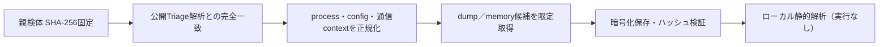

# Triage公開解析・後段取得証跡

## 完全ハッシュ一致

- [260803-wpwbysdd87](https://tria.ge/260803-wpwbysdd87): ファミリー候補 `remus_stealer`、評価score `10`

## プロセス・通信

- 観測process: `file.exe`
- raw commandは保存せず、command SHA-256と処理patternだけをJSONへ保持しています。
- sandbox background trafficは`context_only`であり、C2へ自動昇格しません。

- `http://azurhay.shop:8539/`（sandbox config候補）
- `http://none/`（sandbox config候補）
- `http://onesdto.shop:2535/`（sandbox config候補）

## 二段目成果物

- `9424b2b2f2343c935416cf7c8d9571aafc225ace1ff69395798a572ae14dccbc` / `memory_image` / 4825088 bytes / 親と同一: `false` / 静的解析: `partial`

## 判定境界

Triage由来のfamily、process、config、通信は外部sandbox証跡です。config extractorが返したendpointはC2候補として扱えますが、
静的設定復元またはprocess帰属とprotocol応答が揃うまでは確認済みC2とはしません。取得成果物と検体は実行していません。
