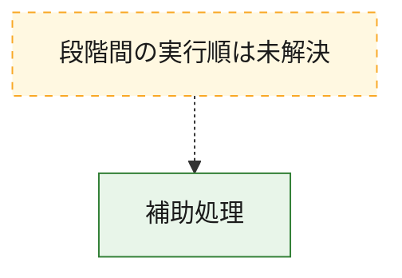
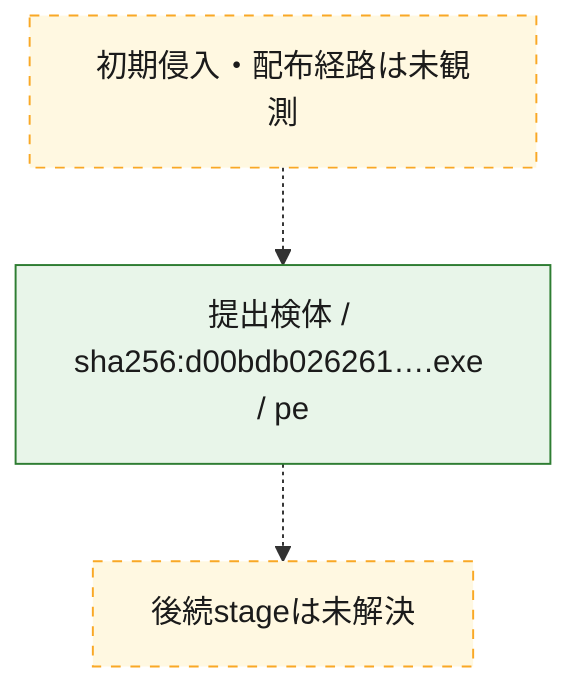
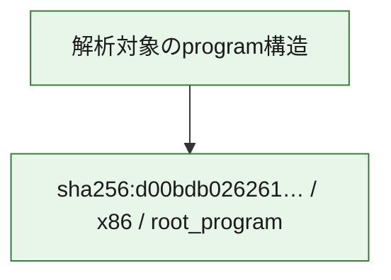

# 全体ロジック：d00bdb02626137fd008456600d4fd89500f1de1c87a3ea3295b4e78740613b76

代表関数から主要なmalware処理段階を自動分類できませんでした。

## 読み方

- phaseの掲載順は解析上の整理順です。observed_call_edgesがない段階間の実行順を断定しません。
- 図の実線は静的に観測した関係、点線と黄色のノードは未観測・未解決の関係を示します。
- 図は静的な要約であり、動的実行を再現するものではありません。
- 詳細な関数解説とfingerprintは[STATIC-LOGIC.md](STATIC-LOGIC.md)を参照してください。

## 静的可視化

### 実行フロー

### 感染チェーン

### モジュール関係

## 処理段階

### 1. 補助処理

主要処理を支える一般内部関数またはlibrary処理を確認します。
確度: `confirmed_static_function_evidence_with_limits`

- `d00bdb02626137fd008456600d4fd89500f1de1c87a3ea3295b4e78740613b76:ghidra:140039000` — 検体内部の一般処理を実装する関数です。 状態: `limited_bad_instruction_or_flow`、選定理由: `context_representative`, `reviewed_call_centrality:1`
- `d00bdb02626137fd008456600d4fd89500f1de1c87a3ea3295b4e78740613b76:ghidra:140039060` — 検体内部の一般処理を実装する関数です。 状態: `limited_bad_instruction_or_flow`、選定理由: `context_representative`, `reviewed_call_centrality:1`
- `d00bdb02626137fd008456600d4fd89500f1de1c87a3ea3295b4e78740613b76:ghidra:1400390b0` — 検体内部の一般処理を実装する関数です。 状態: `limited_bad_instruction_or_flow`、選定理由: `context_representative`, `reviewed_call_centrality:1`
- `d00bdb02626137fd008456600d4fd89500f1de1c87a3ea3295b4e78740613b76:ghidra:140039110` — 検体内部の一般処理を実装する関数です。 状態: `limited_bad_instruction_or_flow`、選定理由: `context_representative`, `reviewed_call_centrality:1`
- `d00bdb02626137fd008456600d4fd89500f1de1c87a3ea3295b4e78740613b76:ghidra:140039160` — 検体内部の一般処理を実装する関数です。 状態: `limited_bad_instruction_or_flow`、選定理由: `context_representative`, `reviewed_call_centrality:1`
- `d00bdb02626137fd008456600d4fd89500f1de1c87a3ea3295b4e78740613b76:ghidra:1400391a0` — 検体内部の一般処理を実装する関数です。 状態: `limited_bad_instruction_or_flow`、選定理由: `context_representative`, `reviewed_call_centrality:1`
- `d00bdb02626137fd008456600d4fd89500f1de1c87a3ea3295b4e78740613b76:ghidra:1400391e0` — 検体内部の一般処理を実装する関数です。 状態: `limited_bad_instruction_or_flow`、選定理由: `context_representative`, `reviewed_call_centrality:1`
- `d00bdb02626137fd008456600d4fd89500f1de1c87a3ea3295b4e78740613b76:ghidra:140039220` — 検体内部の一般処理を実装する関数です。 状態: `limited_bad_instruction_or_flow`、選定理由: `context_representative`, `reviewed_call_centrality:1`
- `d00bdb02626137fd008456600d4fd89500f1de1c87a3ea3295b4e78740613b76:ghidra:1400392c0` — 検体内部の一般処理を実装する関数です。 状態: `limited_bad_instruction_or_flow`、選定理由: `context_representative`, `reviewed_call_centrality:1`
- `d00bdb02626137fd008456600d4fd89500f1de1c87a3ea3295b4e78740613b76:ghidra:1400393b0` — 検体内部の一般処理を実装する関数です。 状態: `limited_bad_instruction_or_flow`、選定理由: `context_representative`, `reviewed_call_centrality:1`
- `d00bdb02626137fd008456600d4fd89500f1de1c87a3ea3295b4e78740613b76:ghidra:140039420` — 検体内部の一般処理を実装する関数です。 状態: `limited_bad_instruction_or_flow`、選定理由: `context_representative`, `reviewed_call_centrality:1`
- `d00bdb02626137fd008456600d4fd89500f1de1c87a3ea3295b4e78740613b76:ghidra:140039560` — 検体内部の一般処理を実装する関数です。 状態: `limited_bad_instruction_or_flow`、選定理由: `context_representative`, `reviewed_call_centrality:1`
- `d00bdb02626137fd008456600d4fd89500f1de1c87a3ea3295b4e78740613b76:ghidra:140039650` — 検体内部の一般処理を実装する関数です。 状態: `limited_bad_instruction_or_flow`、選定理由: `context_representative`, `reviewed_call_centrality:1`
- `d00bdb02626137fd008456600d4fd89500f1de1c87a3ea3295b4e78740613b76:ghidra:140039720` — 検体内部の一般処理を実装する関数です。 状態: `limited_bad_instruction_or_flow`、選定理由: `context_representative`, `reviewed_call_centrality:1`
- `d00bdb02626137fd008456600d4fd89500f1de1c87a3ea3295b4e78740613b76:ghidra:14003975f` — 検体内部の一般処理を実装する関数です。 状態: `limited_bad_instruction_or_flow`、選定理由: `context_representative`, `reviewed_call_centrality:1`
- `d00bdb02626137fd008456600d4fd89500f1de1c87a3ea3295b4e78740613b76:ghidra:1400397a9` — 検体内部の一般処理を実装する関数です。 状態: `limited_bad_instruction_or_flow`、選定理由: `context_representative`, `reviewed_call_centrality:1`
- `d00bdb02626137fd008456600d4fd89500f1de1c87a3ea3295b4e78740613b76:ghidra:1400397ae` — 検体内部の一般処理を実装する関数です。 状態: `limited_bad_instruction_or_flow`、選定理由: `context_representative`, `reviewed_call_centrality:1`
- `d00bdb02626137fd008456600d4fd89500f1de1c87a3ea3295b4e78740613b76:ghidra:1400397c0` — 検体内部の一般処理を実装する関数です。 状態: `limited_bad_instruction_or_flow`、選定理由: `context_representative`, `reviewed_call_centrality:1`
- `d00bdb02626137fd008456600d4fd89500f1de1c87a3ea3295b4e78740613b76:ghidra:1400397ea` — 検体内部の一般処理を実装する関数です。 状態: `limited_bad_instruction_or_flow`、選定理由: `context_representative`, `reviewed_call_centrality:1`
- `d00bdb02626137fd008456600d4fd89500f1de1c87a3ea3295b4e78740613b76:ghidra:140039828` — 検体内部の一般処理を実装する関数です。 状態: `limited_bad_instruction_or_flow`、選定理由: `context_representative`, `reviewed_call_centrality:1`
- `d00bdb02626137fd008456600d4fd89500f1de1c87a3ea3295b4e78740613b76:ghidra:140039830` — 検体内部の一般処理を実装する関数です。 状態: `limited_bad_instruction_or_flow`、選定理由: `context_representative`, `reviewed_call_centrality:1`
- `d00bdb02626137fd008456600d4fd89500f1de1c87a3ea3295b4e78740613b76:ghidra:140039891` — 検体内部の一般処理を実装する関数です。 状態: `limited_bad_instruction_or_flow`、選定理由: `context_representative`, `reviewed_call_centrality:1`
- `d00bdb02626137fd008456600d4fd89500f1de1c87a3ea3295b4e78740613b76:ghidra:1400398b2` — 検体内部の一般処理を実装する関数です。 状態: `limited_bad_instruction_or_flow`、選定理由: `context_representative`, `reviewed_call_centrality:1`
- `d00bdb02626137fd008456600d4fd89500f1de1c87a3ea3295b4e78740613b76:ghidra:1400398c0` — 検体内部の一般処理を実装する関数です。 状態: `limited_bad_instruction_or_flow`、選定理由: `context_representative`, `reviewed_call_centrality:1`
- `d00bdb02626137fd008456600d4fd89500f1de1c87a3ea3295b4e78740613b76:ghidra:140039990` — 検体内部の一般処理を実装する関数です。 状態: `limited_bad_instruction_or_flow`、選定理由: `context_representative`, `reviewed_call_centrality:1`
- `d00bdb02626137fd008456600d4fd89500f1de1c87a3ea3295b4e78740613b76:ghidra:140039ac0` — 検体内部の一般処理を実装する関数です。 状態: `limited_bad_instruction_or_flow`、選定理由: `context_representative`, `reviewed_call_centrality:1`
- `d00bdb02626137fd008456600d4fd89500f1de1c87a3ea3295b4e78740613b76:ghidra:140039b50` — 検体内部の一般処理を実装する関数です。 状態: `limited_bad_instruction_or_flow`、選定理由: `context_representative`, `reviewed_call_centrality:1`
- `d00bdb02626137fd008456600d4fd89500f1de1c87a3ea3295b4e78740613b76:ghidra:140039c30` — 検体内部の一般処理を実装する関数です。 状態: `limited_bad_instruction_or_flow`、選定理由: `context_representative`, `reviewed_call_centrality:1`
- `d00bdb02626137fd008456600d4fd89500f1de1c87a3ea3295b4e78740613b76:ghidra:140039cf0` — 検体内部の一般処理を実装する関数です。 状態: `limited_bad_instruction_or_flow`、選定理由: `context_representative`, `reviewed_call_centrality:1`
- `d00bdb02626137fd008456600d4fd89500f1de1c87a3ea3295b4e78740613b76:ghidra:140039f60` — 検体内部の一般処理を実装する関数です。 状態: `limited_bad_instruction_or_flow`、選定理由: `context_representative`, `reviewed_call_centrality:1`
- `d00bdb02626137fd008456600d4fd89500f1de1c87a3ea3295b4e78740613b76:ghidra:140039f7a` — 検体内部の一般処理を実装する関数です。 状態: `limited_bad_instruction_or_flow`、選定理由: `context_representative`, `reviewed_call_centrality:1`
- `d00bdb02626137fd008456600d4fd89500f1de1c87a3ea3295b4e78740613b76:ghidra:140039fac` — 検体内部の一般処理を実装する関数です。 状態: `limited_bad_instruction_or_flow`、選定理由: `context_representative`, `reviewed_call_centrality:1`

## 観測したcall関係

- 代表関数間で直接解決できた呼出関係はありません。

## 解析範囲と制約

- 選定外関数は全体inventoryへ残しますが、関数本体の個別解説対象にはしていません。
- indirect call、難読化、packer、VM、壊れたcontrol flowによりcall関係が欠落する場合があります。
- 文書は静的解析に基づき、検体実行や外部通信による動的確認は行っていません。
