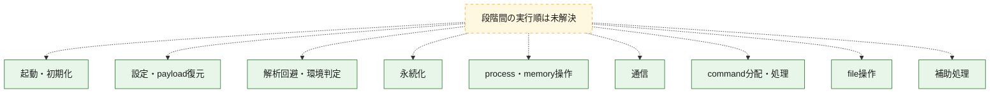
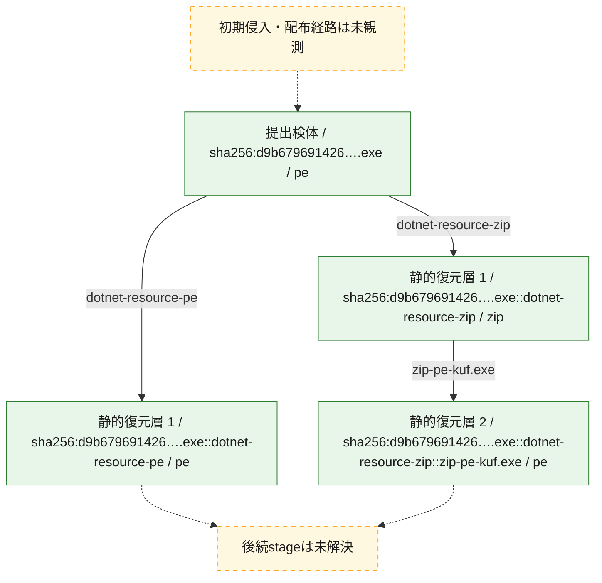
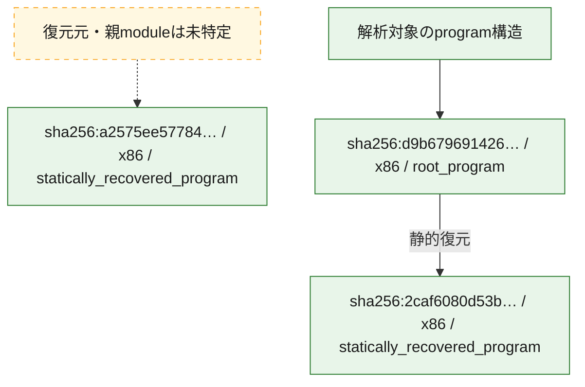

# 全体ロジック：d9b67969142627b6e0b2342e98fe900acd7440e79c5ada813e2500900f9678c1

代表関数の静的証跡から、起動・初期化、設定・payload復元、解析回避・環境判定、永続化、process・memory操作、通信、command分配・処理、file操作の処理群を確認しました。

## 読み方

- phaseの掲載順は解析上の整理順です。observed_call_edgesがない段階間の実行順を断定しません。
- 図の実線は静的に観測した関係、点線と黄色のノードは未観測・未解決の関係を示します。
- 図は静的な要約であり、動的実行を再現するものではありません。
- 詳細な関数解説とfingerprintは[STATIC-LOGIC.md](STATIC-LOGIC.md)を参照してください。

## 静的可視化

### 実行フロー

### 感染チェーン

### モジュール関係

## 処理段階

### 1. 起動・初期化

entry pointから初期化と後続処理への移行を確認します。
確度: `confirmed_static_function_evidence`

- `a2575ee5778439ccf7d1998383edf01d494cb4d683f82e1cadd44b82f97c5011:cil:0x06000230` — 初期化と主要処理への分岐を行う入口関数です。 状態: `succeeded`、選定理由: `entry_point`, `reviewed_call_centrality:6`
- `a2575ee5778439ccf7d1998383edf01d494cb4d683f82e1cadd44b82f97c5011:cil:0x06000232` — 初期化と主要処理への分岐を行う入口関数です。 状態: `succeeded`、選定理由: `entry_point`, `reviewed_call_centrality:6`
- `a2575ee5778439ccf7d1998383edf01d494cb4d683f82e1cadd44b82f97c5011:cil:0x06000233` — 初期化と主要処理への分岐を行う入口関数です。 状態: `succeeded`、選定理由: `entry_point`, `large_function:instructions=911`, `reviewed_call_centrality:98`
- `a2575ee5778439ccf7d1998383edf01d494cb4d683f82e1cadd44b82f97c5011:cil:0x06000234` — 初期化と主要処理への分岐を行う入口関数です。 状態: `succeeded`、選定理由: `entry_point`, `reviewed_call_centrality:2`
- `a2575ee5778439ccf7d1998383edf01d494cb4d683f82e1cadd44b82f97c5011:cil:0x06000311` — 初期化と主要処理への分岐を行う入口関数です。 状態: `succeeded`、選定理由: `entry_point`, `reviewed_call_centrality:32`
- `d9b67969142627b6e0b2342e98fe900acd7440e79c5ada813e2500900f9678c1:cil:0x0600024f` — 初期化と主要処理への分岐を行う入口関数です。 状態: `succeeded`、選定理由: `entry_point`, `reviewed_call_centrality:6`
- `d9b67969142627b6e0b2342e98fe900acd7440e79c5ada813e2500900f9678c1:cil:0x06000251` — 初期化と主要処理への分岐を行う入口関数です。 状態: `succeeded`、選定理由: `entry_point`, `reviewed_call_centrality:6`
- `d9b67969142627b6e0b2342e98fe900acd7440e79c5ada813e2500900f9678c1:cil:0x06000252` — 初期化と主要処理への分岐を行う入口関数です。 状態: `succeeded`、選定理由: `entry_point`, `large_function:instructions=931`, `reviewed_call_centrality:106`
- `d9b67969142627b6e0b2342e98fe900acd7440e79c5ada813e2500900f9678c1:cil:0x06000253` — 初期化と主要処理への分岐を行う入口関数です。 状態: `succeeded`、選定理由: `entry_point`, `reviewed_call_centrality:2`
- `d9b67969142627b6e0b2342e98fe900acd7440e79c5ada813e2500900f9678c1:cil:0x06000330` — 初期化と主要処理への分岐を行う入口関数です。 状態: `succeeded`、選定理由: `entry_point`, `reviewed_call_centrality:32`

### 2. 設定・payload復元

設定、resource、payload、暗号化データの復元・変換を確認します。
確度: `confirmed_static_function_evidence`

- `2caf6080d53b19a9648e55d325ae1fc9c44a9997e0fca6f04bd7e4ab09c55408:cil:0x06000001` — 設定、resource、payloadなどの解析・変換を行う関数です。 状態: `succeeded`、選定理由: `large_function:instructions=353`, `reviewed_call_centrality:22`, `role:config_or_data_transform`, `small_program_complete_context`
- `2caf6080d53b19a9648e55d325ae1fc9c44a9997e0fca6f04bd7e4ab09c55408:cil:0x06000002` — 設定、resource、payloadなどの解析・変換を行う関数です。 状態: `succeeded`、選定理由: `role:config_or_data_transform`, `small_program_complete_context`
- `2caf6080d53b19a9648e55d325ae1fc9c44a9997e0fca6f04bd7e4ab09c55408:cil:0x06000003` — 設定、resource、payloadなどの解析・変換を行う関数です。 状態: `succeeded`、選定理由: `role:config_or_data_transform`, `small_program_complete_context`
- `2caf6080d53b19a9648e55d325ae1fc9c44a9997e0fca6f04bd7e4ab09c55408:cil:0x06000004` — 設定、resource、payloadなどの解析・変換を行う関数です。 状態: `succeeded`、選定理由: `large_function:instructions=74`, `role:config_or_data_transform`, `small_program_complete_context`
- `2caf6080d53b19a9648e55d325ae1fc9c44a9997e0fca6f04bd7e4ab09c55408:cil:0x06000005` — 設定、resource、payloadなどの解析・変換を行う関数です。 状態: `succeeded`、選定理由: `reviewed_call_centrality:4`, `role:config_or_data_transform`, `small_program_complete_context`
- `2caf6080d53b19a9648e55d325ae1fc9c44a9997e0fca6f04bd7e4ab09c55408:cil:0x06000006` — 設定、resource、payloadなどの解析・変換を行う関数です。 状態: `succeeded`、選定理由: `large_function:instructions=237`, `reviewed_call_centrality:4`, `role:config_or_data_transform`, `small_program_complete_context`
- `2caf6080d53b19a9648e55d325ae1fc9c44a9997e0fca6f04bd7e4ab09c55408:cil:0x06000007` — 設定、resource、payloadなどの解析・変換を行う関数です。 状態: `succeeded`、選定理由: `reviewed_call_centrality:4`, `role:config_or_data_transform`, `small_program_complete_context`
- `2caf6080d53b19a9648e55d325ae1fc9c44a9997e0fca6f04bd7e4ab09c55408:cil:0x06000008` — 設定、resource、payloadなどの解析・変換を行う関数です。 状態: `succeeded`、選定理由: `reviewed_call_centrality:2`, `role:config_or_data_transform`, `small_program_complete_context`
- `2caf6080d53b19a9648e55d325ae1fc9c44a9997e0fca6f04bd7e4ab09c55408:cil:0x06000009` — 暗号、hash、encoding、または復号処理に関係する関数です。 状態: `succeeded`、選定理由: `reviewed_call_centrality:6`, `role:cryptographic_transform`, `small_program_complete_context`
- `2caf6080d53b19a9648e55d325ae1fc9c44a9997e0fca6f04bd7e4ab09c55408:cil:0x0600000a` — 暗号、hash、encoding、または復号処理に関係する関数です。 状態: `succeeded`、選定理由: `large_function:instructions=98`, `reviewed_call_centrality:4`, `role:cryptographic_transform`, `small_program_complete_context`
- `2caf6080d53b19a9648e55d325ae1fc9c44a9997e0fca6f04bd7e4ab09c55408:cil:0x0600000b` — 暗号、hash、encoding、または復号処理に関係する関数です。 状態: `succeeded`、選定理由: `role:cryptographic_transform`, `small_program_complete_context`
- `2caf6080d53b19a9648e55d325ae1fc9c44a9997e0fca6f04bd7e4ab09c55408:cil:0x0600000c` — 暗号、hash、encoding、または復号処理に関係する関数です。 状態: `succeeded`、選定理由: `reviewed_call_centrality:4`, `role:cryptographic_transform`, `small_program_complete_context`
- `2caf6080d53b19a9648e55d325ae1fc9c44a9997e0fca6f04bd7e4ab09c55408:cil:0x0600000d` — 暗号、hash、encoding、または復号処理に関係する関数です。 状態: `succeeded`、選定理由: `reviewed_call_centrality:4`, `role:cryptographic_transform`, `small_program_complete_context`
- `2caf6080d53b19a9648e55d325ae1fc9c44a9997e0fca6f04bd7e4ab09c55408:cil:0x0600000e` — 暗号、hash、encoding、または復号処理に関係する関数です。 状態: `succeeded`、選定理由: `large_function:instructions=120`, `reviewed_call_centrality:12`, `role:cryptographic_transform`, `small_program_complete_context`
- `2caf6080d53b19a9648e55d325ae1fc9c44a9997e0fca6f04bd7e4ab09c55408:cil:0x0600000f` — 暗号、hash、encoding、または復号処理に関係する関数です。 状態: `succeeded`、選定理由: `large_function:instructions=209`, `reviewed_call_centrality:4`, `role:cryptographic_transform`, `small_program_complete_context`
- `2caf6080d53b19a9648e55d325ae1fc9c44a9997e0fca6f04bd7e4ab09c55408:cil:0x06000010` — 暗号、hash、encoding、または復号処理に関係する関数です。 状態: `succeeded`、選定理由: `role:cryptographic_transform`, `small_program_complete_context`
- `2caf6080d53b19a9648e55d325ae1fc9c44a9997e0fca6f04bd7e4ab09c55408:cil:0x06000011` — 暗号、hash、encoding、または復号処理に関係する関数です。 状態: `succeeded`、選定理由: `role:cryptographic_transform`, `small_program_complete_context`
- `2caf6080d53b19a9648e55d325ae1fc9c44a9997e0fca6f04bd7e4ab09c55408:cil:0x06000012` — 暗号、hash、encoding、または復号処理に関係する関数です。 状態: `succeeded`、選定理由: `large_function:instructions=82`, `role:cryptographic_transform`, `small_program_complete_context`
- `2caf6080d53b19a9648e55d325ae1fc9c44a9997e0fca6f04bd7e4ab09c55408:cil:0x06000013` — 暗号、hash、encoding、または復号処理に関係する関数です。 状態: `succeeded`、選定理由: `large_function:instructions=112`, `reviewed_call_centrality:2`, `role:cryptographic_transform`, `small_program_complete_context`
- `2caf6080d53b19a9648e55d325ae1fc9c44a9997e0fca6f04bd7e4ab09c55408:cil:0x06000014` — 暗号、hash、encoding、または復号処理に関係する関数です。 状態: `succeeded`、選定理由: `role:cryptographic_transform`, `small_program_complete_context`
- `2caf6080d53b19a9648e55d325ae1fc9c44a9997e0fca6f04bd7e4ab09c55408:cil:0x06000015` — 暗号、hash、encoding、または復号処理に関係する関数です。 状態: `succeeded`、選定理由: `reviewed_call_centrality:2`, `role:cryptographic_transform`, `small_program_complete_context`
- `2caf6080d53b19a9648e55d325ae1fc9c44a9997e0fca6f04bd7e4ab09c55408:cil:0x06000016` — 暗号、hash、encoding、または復号処理に関係する関数です。 状態: `succeeded`、選定理由: `reviewed_call_centrality:2`, `role:cryptographic_transform`, `small_program_complete_context`
- `2caf6080d53b19a9648e55d325ae1fc9c44a9997e0fca6f04bd7e4ab09c55408:cil:0x06000017` — 暗号、hash、encoding、または復号処理に関係する関数です。 状態: `succeeded`、選定理由: `large_function:instructions=133`, `reviewed_call_centrality:14`, `role:cryptographic_transform`, `small_program_complete_context`
- `2caf6080d53b19a9648e55d325ae1fc9c44a9997e0fca6f04bd7e4ab09c55408:cil:0x06000018` — 暗号、hash、encoding、または復号処理に関係する関数です。 状態: `succeeded`、選定理由: `large_function:instructions=170`, `reviewed_call_centrality:4`, `role:cryptographic_transform`, `small_program_complete_context`
- `2caf6080d53b19a9648e55d325ae1fc9c44a9997e0fca6f04bd7e4ab09c55408:cil:0x06000019` — 暗号、hash、encoding、または復号処理に関係する関数です。 状態: `succeeded`、選定理由: `large_function:instructions=102`, `reviewed_call_centrality:8`, `role:cryptographic_transform`, `small_program_complete_context`
- `2caf6080d53b19a9648e55d325ae1fc9c44a9997e0fca6f04bd7e4ab09c55408:cil:0x0600001a` — 暗号、hash、encoding、または復号処理に関係する関数です。 状態: `succeeded`、選定理由: `role:cryptographic_transform`, `small_program_complete_context`
- `2caf6080d53b19a9648e55d325ae1fc9c44a9997e0fca6f04bd7e4ab09c55408:cil:0x0600001b` — 暗号、hash、encoding、または復号処理に関係する関数です。 状態: `succeeded`、選定理由: `large_function:instructions=371`, `reviewed_call_centrality:4`, `role:cryptographic_transform`, `small_program_complete_context`
- `2caf6080d53b19a9648e55d325ae1fc9c44a9997e0fca6f04bd7e4ab09c55408:cil:0x0600001c` — 暗号、hash、encoding、または復号処理に関係する関数です。 状態: `succeeded`、選定理由: `large_function:instructions=201`, `reviewed_call_centrality:2`, `role:cryptographic_transform`, `small_program_complete_context`
- `2caf6080d53b19a9648e55d325ae1fc9c44a9997e0fca6f04bd7e4ab09c55408:cil:0x0600001d` — 暗号、hash、encoding、または復号処理に関係する関数です。 状態: `succeeded`、選定理由: `role:cryptographic_transform`, `small_program_complete_context`
- `2caf6080d53b19a9648e55d325ae1fc9c44a9997e0fca6f04bd7e4ab09c55408:cil:0x0600001e` — 暗号、hash、encoding、または復号処理に関係する関数です。 状態: `succeeded`、選定理由: `role:cryptographic_transform`, `small_program_complete_context`
- `2caf6080d53b19a9648e55d325ae1fc9c44a9997e0fca6f04bd7e4ab09c55408:cil:0x0600001f` — 暗号、hash、encoding、または復号処理に関係する関数です。 状態: `succeeded`、選定理由: `reviewed_call_centrality:2`, `role:cryptographic_transform`, `small_program_complete_context`
- `a2575ee5778439ccf7d1998383edf01d494cb4d683f82e1cadd44b82f97c5011:cil:0x06000012` — 設定、resource、payloadなどの解析・変換を行う関数です。 状態: `succeeded`、選定理由: `large_function:instructions=267`, `reviewed_call_centrality:64`, `role:config_or_data_transform`
- `a2575ee5778439ccf7d1998383edf01d494cb4d683f82e1cadd44b82f97c5011:cil:0x060001cc` — 設定、resource、payloadなどの解析・変換を行う関数です。 状態: `succeeded`、選定理由: `large_function:instructions=406`, `reviewed_call_centrality:78`, `role:config_or_data_transform`
- `a2575ee5778439ccf7d1998383edf01d494cb4d683f82e1cadd44b82f97c5011:cil:0x060001ce` — 設定、resource、payloadなどの解析・変換を行う関数です。 状態: `succeeded`、選定理由: `large_function:instructions=75`, `reviewed_call_centrality:32`, `role:config_or_data_transform`
- `a2575ee5778439ccf7d1998383edf01d494cb4d683f82e1cadd44b82f97c5011:cil:0x06000267` — 設定、resource、payloadなどの解析・変換を行う関数です。 状態: `succeeded`、選定理由: `large_function:instructions=215`, `reviewed_call_centrality:50`, `role:config_or_data_transform`
- `a2575ee5778439ccf7d1998383edf01d494cb4d683f82e1cadd44b82f97c5011:cil:0x0600042f` — 暗号、hash、encoding、または復号処理に関係する関数です。 状態: `succeeded`、選定理由: `large_function:instructions=242`, `reviewed_call_centrality:28`, `role:cryptographic_transform`
- `a2575ee5778439ccf7d1998383edf01d494cb4d683f82e1cadd44b82f97c5011:cil:0x0600062a` — 暗号、hash、encoding、または復号処理に関係する関数です。 状態: `succeeded`、選定理由: `large_function:instructions=225`, `reviewed_call_centrality:40`, `role:cryptographic_transform`
- `a2575ee5778439ccf7d1998383edf01d494cb4d683f82e1cadd44b82f97c5011:cil:0x0600075d` — 暗号、hash、encoding、または復号処理に関係する関数です。 状態: `succeeded`、選定理由: `reviewed_call_centrality:34`, `role:cryptographic_transform`
- `a2575ee5778439ccf7d1998383edf01d494cb4d683f82e1cadd44b82f97c5011:cil:0x0600076f` — 暗号、hash、encoding、または復号処理に関係する関数です。 状態: `succeeded`、選定理由: `large_function:instructions=108`, `reviewed_call_centrality:54`, `role:cryptographic_transform`
- `a2575ee5778439ccf7d1998383edf01d494cb4d683f82e1cadd44b82f97c5011:cil:0x060007be` — 暗号、hash、encoding、または復号処理に関係する関数です。 状態: `succeeded`、選定理由: `large_function:instructions=78`, `reviewed_call_centrality:48`, `role:cryptographic_transform`
- `a2575ee5778439ccf7d1998383edf01d494cb4d683f82e1cadd44b82f97c5011:cil:0x060007bf` — 暗号、hash、encoding、または復号処理に関係する関数です。 状態: `succeeded`、選定理由: `reviewed_call_centrality:34`, `role:cryptographic_transform`
- `d9b67969142627b6e0b2342e98fe900acd7440e79c5ada813e2500900f9678c1:cil:0x0600001b` — 設定、resource、payloadなどの解析・変換を行う関数です。 状態: `succeeded`、選定理由: `large_function:instructions=102`, `reviewed_call_centrality:34`, `role:config_or_data_transform`
- `d9b67969142627b6e0b2342e98fe900acd7440e79c5ada813e2500900f9678c1:cil:0x0600002e` — 暗号、hash、encoding、または復号処理に関係する関数です。 状態: `succeeded`、選定理由: `large_function:instructions=156`, `reviewed_call_centrality:42`, `role:cryptographic_transform`
- `d9b67969142627b6e0b2342e98fe900acd7440e79c5ada813e2500900f9678c1:cil:0x06000031` — 設定、resource、payloadなどの解析・変換を行う関数です。 状態: `succeeded`、選定理由: `large_function:instructions=267`, `reviewed_call_centrality:64`, `role:config_or_data_transform`
- `d9b67969142627b6e0b2342e98fe900acd7440e79c5ada813e2500900f9678c1:cil:0x060001eb` — 設定、resource、payloadなどの解析・変換を行う関数です。 状態: `succeeded`、選定理由: `large_function:instructions=406`, `reviewed_call_centrality:78`, `role:config_or_data_transform`
- `d9b67969142627b6e0b2342e98fe900acd7440e79c5ada813e2500900f9678c1:cil:0x06000286` — 設定、resource、payloadなどの解析・変換を行う関数です。 状態: `succeeded`、選定理由: `large_function:instructions=215`, `reviewed_call_centrality:50`, `role:config_or_data_transform`
- `d9b67969142627b6e0b2342e98fe900acd7440e79c5ada813e2500900f9678c1:cil:0x06000710` — 暗号、hash、encoding、または復号処理に関係する関数です。 状態: `succeeded`、選定理由: `large_function:instructions=328`, `reviewed_call_centrality:42`, `role:cryptographic_transform`
- `d9b67969142627b6e0b2342e98fe900acd7440e79c5ada813e2500900f9678c1:cil:0x0600079a` — 暗号、hash、encoding、または復号処理に関係する関数です。 状態: `succeeded`、選定理由: `large_function:instructions=314`, `reviewed_call_centrality:30`, `role:cryptographic_transform`
- `d9b67969142627b6e0b2342e98fe900acd7440e79c5ada813e2500900f9678c1:cil:0x0600079b` — 暗号、hash、encoding、または復号処理に関係する関数です。 状態: `succeeded`、選定理由: `large_function:instructions=329`, `reviewed_call_centrality:26`, `role:cryptographic_transform`
- `d9b67969142627b6e0b2342e98fe900acd7440e79c5ada813e2500900f9678c1:cil:0x060007c5` — 暗号、hash、encoding、または復号処理に関係する関数です。 状態: `succeeded`、選定理由: `large_function:instructions=91`, `reviewed_call_centrality:52`, `role:cryptographic_transform`
- `d9b67969142627b6e0b2342e98fe900acd7440e79c5ada813e2500900f9678c1:cil:0x060007de` — 暗号、hash、encoding、または復号処理に関係する関数です。 状態: `succeeded`、選定理由: `reviewed_call_centrality:34`, `role:cryptographic_transform`
- `d9b67969142627b6e0b2342e98fe900acd7440e79c5ada813e2500900f9678c1:cil:0x060007ec` — 暗号、hash、encoding、または復号処理に関係する関数です。 状態: `succeeded`、選定理由: `large_function:instructions=161`, `reviewed_call_centrality:50`, `role:cryptographic_transform`

### 3. 解析回避・環境判定

debugger、sandbox、仮想環境、時間差などの判定を確認します。
確度: `confirmed_static_function_evidence`

- `a2575ee5778439ccf7d1998383edf01d494cb4d683f82e1cadd44b82f97c5011:cil:0x0600050e` — debugger、仮想環境、sandbox、または時間差の確認に関係する関数です。 状態: `succeeded`、選定理由: `reviewed_call_centrality:8`, `role:anti_analysis`
- `d9b67969142627b6e0b2342e98fe900acd7440e79c5ada813e2500900f9678c1:cil:0x0600052d` — debugger、仮想環境、sandbox、または時間差の確認に関係する関数です。 状態: `succeeded`、選定理由: `reviewed_call_centrality:8`, `role:anti_analysis`

### 4. 永続化

自動起動や永続化に関係する設定変更を確認します。
確度: `confirmed_static_function_evidence`

- `a2575ee5778439ccf7d1998383edf01d494cb4d683f82e1cadd44b82f97c5011:cil:0x06000320` — 自動起動または永続化に関係する処理を含む関数です。 状態: `succeeded`、選定理由: `large_function:instructions=150`, `reviewed_call_centrality:36`, `role:persistence`
- `d9b67969142627b6e0b2342e98fe900acd7440e79c5ada813e2500900f9678c1:cil:0x0600033f` — 自動起動または永続化に関係する処理を含む関数です。 状態: `succeeded`、選定理由: `large_function:instructions=150`, `reviewed_call_centrality:36`, `role:persistence`

### 5. process・memory操作

process、thread、module、memory操作と実行移行を確認します。
確度: `confirmed_static_function_evidence`

- `a2575ee5778439ccf7d1998383edf01d494cb4d683f82e1cadd44b82f97c5011:cil:0x06000475` — process、thread、module、またはmemory操作に関係する関数です。 状態: `succeeded`、選定理由: `large_function:instructions=137`, `reviewed_call_centrality:36`, `role:process_or_memory_operation`
- `d9b67969142627b6e0b2342e98fe900acd7440e79c5ada813e2500900f9678c1:cil:0x06000494` — process、thread、module、またはmemory操作に関係する関数です。 状態: `succeeded`、選定理由: `large_function:instructions=137`, `reviewed_call_centrality:36`, `role:process_or_memory_operation`

### 6. 通信

通信初期化、endpoint処理、送受信の役割を確認します。
確度: `confirmed_static_function_evidence`

- `a2575ee5778439ccf7d1998383edf01d494cb4d683f82e1cadd44b82f97c5011:cil:0x060007ae` — 通信初期化、送受信、またはendpoint処理に関係する関数です。 状態: `succeeded`、選定理由: `reviewed_call_centrality:28`, `role:network_communication`
- `d9b67969142627b6e0b2342e98fe900acd7440e79c5ada813e2500900f9678c1:cil:0x060007cd` — 通信初期化、送受信、またはendpoint処理に関係する関数です。 状態: `succeeded`、選定理由: `reviewed_call_centrality:28`, `role:network_communication`

### 7. command分配・処理

受信commandやtaskの解釈、分配、個別handlerへの移行を確認します。
確度: `confirmed_static_function_evidence`

- `a2575ee5778439ccf7d1998383edf01d494cb4d683f82e1cadd44b82f97c5011:cil:0x06000184` — commandの解釈、分配、または個別処理を担当する関数です。 状態: `succeeded`、選定理由: `large_function:instructions=174`, `reviewed_call_centrality:38`, `role:command_dispatch_or_handler`
- `a2575ee5778439ccf7d1998383edf01d494cb4d683f82e1cadd44b82f97c5011:cil:0x06000196` — commandの解釈、分配、または個別処理を担当する関数です。 状態: `succeeded`、選定理由: `large_function:instructions=247`, `reviewed_call_centrality:38`, `role:command_dispatch_or_handler`
- `a2575ee5778439ccf7d1998383edf01d494cb4d683f82e1cadd44b82f97c5011:cil:0x0600019c` — commandの解釈、分配、または個別処理を担当する関数です。 状態: `succeeded`、選定理由: `large_function:instructions=266`, `reviewed_call_centrality:30`, `role:command_dispatch_or_handler`
- `a2575ee5778439ccf7d1998383edf01d494cb4d683f82e1cadd44b82f97c5011:cil:0x060001c2` — commandの解釈、分配、または個別処理を担当する関数です。 状態: `succeeded`、選定理由: `large_function:instructions=88`, `reviewed_call_centrality:32`, `role:command_dispatch_or_handler`
- `a2575ee5778439ccf7d1998383edf01d494cb4d683f82e1cadd44b82f97c5011:cil:0x060001c4` — commandの解釈、分配、または個別処理を担当する関数です。 状態: `succeeded`、選定理由: `large_function:instructions=154`, `reviewed_call_centrality:50`, `role:command_dispatch_or_handler`
- `a2575ee5778439ccf7d1998383edf01d494cb4d683f82e1cadd44b82f97c5011:cil:0x060001c7` — commandの解釈、分配、または個別処理を担当する関数です。 状態: `succeeded`、選定理由: `large_function:instructions=143`, `reviewed_call_centrality:44`, `role:command_dispatch_or_handler`
- `a2575ee5778439ccf7d1998383edf01d494cb4d683f82e1cadd44b82f97c5011:cil:0x060001c9` — commandの解釈、分配、または個別処理を担当する関数です。 状態: `succeeded`、選定理由: `large_function:instructions=389`, `reviewed_call_centrality:92`, `role:command_dispatch_or_handler`
- `a2575ee5778439ccf7d1998383edf01d494cb4d683f82e1cadd44b82f97c5011:cil:0x0600031e` — commandの解釈、分配、または個別処理を担当する関数です。 状態: `succeeded`、選定理由: `large_function:instructions=248`, `reviewed_call_centrality:64`, `role:command_dispatch_or_handler`
- `a2575ee5778439ccf7d1998383edf01d494cb4d683f82e1cadd44b82f97c5011:cil:0x06000322` — commandの解釈、分配、または個別処理を担当する関数です。 状態: `succeeded`、選定理由: `large_function:instructions=132`, `reviewed_call_centrality:32`, `role:command_dispatch_or_handler`
- `a2575ee5778439ccf7d1998383edf01d494cb4d683f82e1cadd44b82f97c5011:cil:0x060007f5` — commandの解釈、分配、または個別処理を担当する関数です。 状態: `succeeded`、選定理由: `large_function:instructions=358`, `reviewed_call_centrality:38`, `role:command_dispatch_or_handler`
- `a2575ee5778439ccf7d1998383edf01d494cb4d683f82e1cadd44b82f97c5011:cil:0x06000813` — commandの解釈、分配、または個別処理を担当する関数です。 状態: `succeeded`、選定理由: `large_function:instructions=91`, `reviewed_call_centrality:32`, `role:command_dispatch_or_handler`
- `d9b67969142627b6e0b2342e98fe900acd7440e79c5ada813e2500900f9678c1:cil:0x060001a3` — commandの解釈、分配、または個別処理を担当する関数です。 状態: `succeeded`、選定理由: `large_function:instructions=174`, `reviewed_call_centrality:38`, `role:command_dispatch_or_handler`
- `d9b67969142627b6e0b2342e98fe900acd7440e79c5ada813e2500900f9678c1:cil:0x060001b5` — commandの解釈、分配、または個別処理を担当する関数です。 状態: `succeeded`、選定理由: `large_function:instructions=247`, `reviewed_call_centrality:38`, `role:command_dispatch_or_handler`
- `d9b67969142627b6e0b2342e98fe900acd7440e79c5ada813e2500900f9678c1:cil:0x060001bb` — commandの解釈、分配、または個別処理を担当する関数です。 状態: `succeeded`、選定理由: `large_function:instructions=266`, `reviewed_call_centrality:30`, `role:command_dispatch_or_handler`
- `d9b67969142627b6e0b2342e98fe900acd7440e79c5ada813e2500900f9678c1:cil:0x060001e3` — commandの解釈、分配、または個別処理を担当する関数です。 状態: `succeeded`、選定理由: `large_function:instructions=154`, `reviewed_call_centrality:50`, `role:command_dispatch_or_handler`
- `d9b67969142627b6e0b2342e98fe900acd7440e79c5ada813e2500900f9678c1:cil:0x060001e6` — commandの解釈、分配、または個別処理を担当する関数です。 状態: `succeeded`、選定理由: `large_function:instructions=143`, `reviewed_call_centrality:44`, `role:command_dispatch_or_handler`
- `d9b67969142627b6e0b2342e98fe900acd7440e79c5ada813e2500900f9678c1:cil:0x060001e8` — commandの解釈、分配、または個別処理を担当する関数です。 状態: `succeeded`、選定理由: `large_function:instructions=389`, `reviewed_call_centrality:92`, `role:command_dispatch_or_handler`
- `d9b67969142627b6e0b2342e98fe900acd7440e79c5ada813e2500900f9678c1:cil:0x0600033d` — commandの解釈、分配、または個別処理を担当する関数です。 状態: `succeeded`、選定理由: `large_function:instructions=248`, `reviewed_call_centrality:64`, `role:command_dispatch_or_handler`
- `d9b67969142627b6e0b2342e98fe900acd7440e79c5ada813e2500900f9678c1:cil:0x06000341` — commandの解釈、分配、または個別処理を担当する関数です。 状態: `succeeded`、選定理由: `large_function:instructions=132`, `reviewed_call_centrality:32`, `role:command_dispatch_or_handler`
- `d9b67969142627b6e0b2342e98fe900acd7440e79c5ada813e2500900f9678c1:cil:0x06000814` — commandの解釈、分配、または個別処理を担当する関数です。 状態: `succeeded`、選定理由: `large_function:instructions=358`, `reviewed_call_centrality:38`, `role:command_dispatch_or_handler`
- `d9b67969142627b6e0b2342e98fe900acd7440e79c5ada813e2500900f9678c1:cil:0x06000832` — commandの解釈、分配、または個別処理を担当する関数です。 状態: `succeeded`、選定理由: `large_function:instructions=91`, `reviewed_call_centrality:32`, `role:command_dispatch_or_handler`

### 8. file操作

fileやdirectoryの作成、読書き、削除を確認します。
確度: `confirmed_static_function_evidence`

- `a2575ee5778439ccf7d1998383edf01d494cb4d683f82e1cadd44b82f97c5011:cil:0x06000803` — fileまたはdirectoryの読書き・管理に関係する関数です。 状態: `succeeded`、選定理由: `large_function:instructions=180`, `reviewed_call_centrality:32`, `role:file_operation`
- `d9b67969142627b6e0b2342e98fe900acd7440e79c5ada813e2500900f9678c1:cil:0x06000822` — fileまたはdirectoryの読書き・管理に関係する関数です。 状態: `succeeded`、選定理由: `large_function:instructions=180`, `reviewed_call_centrality:32`, `role:file_operation`

### 9. 補助処理

主要処理を支える一般内部関数またはlibrary処理を確認します。
確度: `confirmed_static_function_evidence`

- `a2575ee5778439ccf7d1998383edf01d494cb4d683f82e1cadd44b82f97c5011:cil:0x060007cb` — 検体内部の一般処理を実装する関数です。 状態: `succeeded`、選定理由: `large_function:instructions=251`, `reviewed_call_centrality:78`
- `d9b67969142627b6e0b2342e98fe900acd7440e79c5ada813e2500900f9678c1:cil:0x060007ea` — 検体内部の一般処理を実装する関数です。 状態: `succeeded`、選定理由: `large_function:instructions=251`, `reviewed_call_centrality:78`

## 観測したcall関係

- 代表関数間で直接解決できた呼出関係はありません。

## 解析範囲と制約

- 選定外関数は全体inventoryへ残しますが、関数本体の個別解説対象にはしていません。
- indirect call、難読化、packer、VM、壊れたcontrol flowによりcall関係が欠落する場合があります。
- 文書は静的解析に基づき、検体実行や外部通信による動的確認は行っていません。
