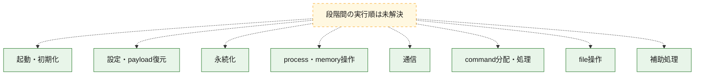
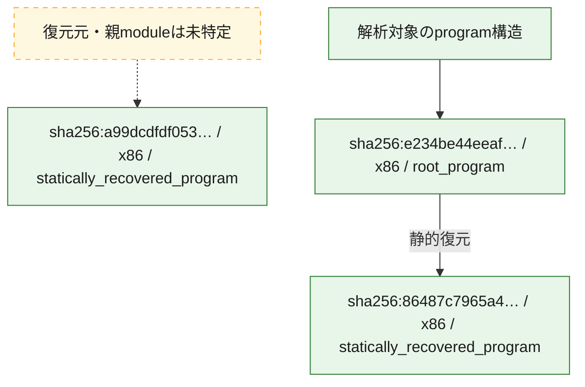

# 全体ロジック：e234be44eeafaf0250d9ef2cef198e223264e1541cff78d30a98163c5a7dde67

代表関数の静的証跡から、起動・初期化、設定・payload復元、永続化、process・memory操作、通信、command分配・処理、file操作の処理群を確認しました。

## 読み方

- phaseの掲載順は解析上の整理順です。observed_call_edgesがない段階間の実行順を断定しません。
- 図の実線は静的に観測した関係、点線と黄色のノードは未観測・未解決の関係を示します。
- 図は静的な要約であり、動的実行を再現するものではありません。
- 詳細な関数解説とfingerprintは[STATIC-LOGIC.md](STATIC-LOGIC.md)を参照してください。

## 静的可視化

### 実行フロー

### 感染チェーン

```mermaid
flowchart TD
  chain_initial["初期侵入・配布経路は未観測"]
  chain_01["提出検体 / sha256:e234be44eeaf….exe / pe"]
  chain_02["静的復元層 1 / sha256:e234be44eeaf….exe::dotnet-resource-ole / ole"]
  chain_03["静的復元層 1 / sha256:e234be44eeaf….exe::dotnet-resource-ole / ole"]
  chain_04["静的復元層 1 / sha256:e234be44eeaf….exe::dotnet-resource-ole / ole"]
  chain_05["静的復元層 1 / sha256:e234be44eeaf….exe::dotnet-resource-opaque / data"]
  chain_06["静的復元層 1 / sha256:e234be44eeaf….exe::dotnet-resource-pe / pe"]
  chain_07["静的復元層 1 / sha256:e234be44eeaf….exe::dotnet-resource-script / script"]
  chain_08["静的復元層 1 / sha256:e234be44eeaf….exe::dotnet-resource-script / data"]
  chain_09["静的復元層 1 / sha256:e234be44eeaf….exe::dotnet-resource-script / script"]
  chain_10["静的復元層 1 / sha256:e234be44eeaf….exe::dotnet-resource-zip / zip"]
  chain_11["静的復元層 1 / sha256:e234be44eeaf….exe::dotnet-resource-zip / zip"]
  chain_12["静的復元層 1 / sha256:e234be44eeaf….exe::dotnet-resource-zip / zip"]
  chain_13["静的復元層 1 / sha256:e234be44eeaf….exe::dotnet-resource-zip / zip"]
  chain_14["静的復元層 2 / sha256:e234be44eeaf….exe::dotnet-resource-script::base64-png / png"]
  chain_15["静的復元層 2 / sha256:e234be44eeaf….exe::dotnet-resource-script::base64-png / png"]
  chain_16["静的復元層 2 / sha256:e234be44eeaf….exe::dotnet-resource-script::base64-png / png"]
  chain_01 -->|dotnet-resource-ole| chain_02
  chain_01 -->|dotnet-resource-ole| chain_03
  chain_01 -->|dotnet-resource-ole| chain_04
  chain_01 -->|dotnet-resource-opaque| chain_05
  chain_01 -->|dotnet-resource-pe| chain_06
  chain_01 -->|dotnet-resource-script| chain_07
  chain_01 -->|dotnet-resource-script| chain_08
  chain_01 -->|dotnet-resource-script| chain_09
  chain_01 -->|dotnet-resource-zip| chain_10
  chain_01 -->|dotnet-resource-zip| chain_11
  chain_01 -->|dotnet-resource-zip| chain_12
  chain_01 -->|dotnet-resource-zip| chain_13
  chain_09 -->|base64-png| chain_14
  chain_09 -->|base64-png| chain_15
  chain_07 -->|base64-png| chain_16
  chain_initial -.-> chain_01
  chain_more["その他48層はstatic-layers.jsonを参照"]
  chain_02 -.-> chain_more
  chain_03 -.-> chain_more
  chain_04 -.-> chain_more
  chain_05 -.-> chain_more
  chain_06 -.-> chain_more
  chain_08 -.-> chain_more
  chain_10 -.-> chain_more
  chain_11 -.-> chain_more
  chain_12 -.-> chain_more
  chain_13 -.-> chain_more
  chain_14 -.-> chain_more
  chain_15 -.-> chain_more
  chain_16 -.-> chain_more
  class chain_more unresolved
  class chain_01,chain_02,chain_03,chain_04,chain_05,chain_06,chain_07,chain_08,chain_09,chain_10,chain_11,chain_12,chain_13,chain_14,chain_15,chain_16 confirmed
  class chain_initial unresolved
  classDef confirmed fill:#e8f5e9,stroke:#2e7d32,color:#1b1b1b
  classDef unresolved fill:#fff8e1,stroke:#f9a825,color:#1b1b1b,stroke-dasharray:5 5
```

### モジュール関係

## 処理段階

### 1. 起動・初期化

entry pointから初期化と後続処理への移行を確認します。
確度: `confirmed_static_function_evidence`

- `a99dcdfdf053a01a69f369c5df31e7ffb23f74a02a700e6739b67c5420d3fad8:cil:0x060001a3` — 初期化と主要処理への分岐を行う入口関数です。 状態: `succeeded`、選定理由: `entry_point`, `large_function:instructions=402`, `reviewed_call_centrality:88`
- `e234be44eeafaf0250d9ef2cef198e223264e1541cff78d30a98163c5a7dde67:cil:0x060001c2` — 初期化と主要処理への分岐を行う入口関数です。 状態: `succeeded`、選定理由: `entry_point`, `large_function:instructions=419`, `reviewed_call_centrality:90`

### 2. 設定・payload復元

設定、resource、payload、暗号化データの復元・変換を確認します。
確度: `confirmed_static_function_evidence`

- `86487c7965a4c78bb128586c0165472b5ba61d7f341f6220b65611a4aa1e1cf6:cil:0x06000002` — 暗号、hash、encoding、または復号処理に関係する関数です。 状態: `succeeded`、選定理由: `reviewed_call_centrality:2`, `role:cryptographic_transform`, `small_program_complete_context`
- `86487c7965a4c78bb128586c0165472b5ba61d7f341f6220b65611a4aa1e1cf6:cil:0x06000003` — 暗号、hash、encoding、または復号処理に関係する関数です。 状態: `succeeded`、選定理由: `reviewed_call_centrality:2`, `role:cryptographic_transform`, `small_program_complete_context`
- `86487c7965a4c78bb128586c0165472b5ba61d7f341f6220b65611a4aa1e1cf6:cil:0x06000004` — 暗号、hash、encoding、または復号処理に関係する関数です。 状態: `succeeded`、選定理由: `reviewed_call_centrality:2`, `role:cryptographic_transform`, `small_program_complete_context`
- `86487c7965a4c78bb128586c0165472b5ba61d7f341f6220b65611a4aa1e1cf6:cil:0x06000005` — 設定、resource、payloadなどの解析・変換を行う関数です。 状態: `succeeded`、選定理由: `large_function:instructions=245`, `reviewed_call_centrality:10`, `role:config_or_data_transform`, `small_program_complete_context`
- `86487c7965a4c78bb128586c0165472b5ba61d7f341f6220b65611a4aa1e1cf6:cil:0x06000009` — 設定、resource、payloadなどの解析・変換を行う関数です。 状態: `succeeded`、選定理由: `large_function:instructions=133`, `reviewed_call_centrality:10`, `role:config_or_data_transform`, `small_program_complete_context`
- `86487c7965a4c78bb128586c0165472b5ba61d7f341f6220b65611a4aa1e1cf6:cil:0x0600000b` — 暗号、hash、encoding、または復号処理に関係する関数です。 状態: `succeeded`、選定理由: `reviewed_call_centrality:6`, `role:cryptographic_transform`, `small_program_complete_context`
- `86487c7965a4c78bb128586c0165472b5ba61d7f341f6220b65611a4aa1e1cf6:cil:0x0600000c` — 暗号、hash、encoding、または復号処理に関係する関数です。 状態: `succeeded`、選定理由: `reviewed_call_centrality:6`, `role:cryptographic_transform`, `small_program_complete_context`
- `86487c7965a4c78bb128586c0165472b5ba61d7f341f6220b65611a4aa1e1cf6:cil:0x0600000d` — 設定、resource、payloadなどの解析・変換を行う関数です。 状態: `succeeded`、選定理由: `large_function:instructions=69`, `reviewed_call_centrality:24`, `role:config_or_data_transform`, `small_program_complete_context`
- `86487c7965a4c78bb128586c0165472b5ba61d7f341f6220b65611a4aa1e1cf6:cil:0x0600000e` — 暗号、hash、encoding、または復号処理に関係する関数です。 状態: `succeeded`、選定理由: `role:cryptographic_transform`, `small_program_complete_context`
- `86487c7965a4c78bb128586c0165472b5ba61d7f341f6220b65611a4aa1e1cf6:cil:0x0600000f` — 設定、resource、payloadなどの解析・変換を行う関数です。 状態: `succeeded`、選定理由: `large_function:instructions=139`, `reviewed_call_centrality:30`, `role:config_or_data_transform`, `small_program_complete_context`
- `a99dcdfdf053a01a69f369c5df31e7ffb23f74a02a700e6739b67c5420d3fad8:cil:0x06000036` — 設定、resource、payloadなどの解析・変換を行う関数です。 状態: `succeeded`、選定理由: `large_function:instructions=230`, `reviewed_call_centrality:50`, `role:config_or_data_transform`
- `a99dcdfdf053a01a69f369c5df31e7ffb23f74a02a700e6739b67c5420d3fad8:cil:0x0600014c` — 設定、resource、payloadなどの解析・変換を行う関数です。 状態: `succeeded`、選定理由: `large_function:instructions=301`, `reviewed_call_centrality:58`, `role:config_or_data_transform`
- `a99dcdfdf053a01a69f369c5df31e7ffb23f74a02a700e6739b67c5420d3fad8:cil:0x060001be` — 設定、resource、payloadなどの解析・変換を行う関数です。 状態: `succeeded`、選定理由: `large_function:instructions=1489`, `reviewed_call_centrality:40`, `role:config_or_data_transform`
- `a99dcdfdf053a01a69f369c5df31e7ffb23f74a02a700e6739b67c5420d3fad8:cil:0x060001ea` — 暗号、hash、encoding、または復号処理に関係する関数です。 状態: `succeeded`、選定理由: `large_function:instructions=226`, `reviewed_call_centrality:40`, `role:cryptographic_transform`
- `a99dcdfdf053a01a69f369c5df31e7ffb23f74a02a700e6739b67c5420d3fad8:cil:0x06000270` — 暗号、hash、encoding、または復号処理に関係する関数です。 状態: `succeeded`、選定理由: `large_function:instructions=935`, `reviewed_call_centrality:46`, `role:cryptographic_transform`
- `a99dcdfdf053a01a69f369c5df31e7ffb23f74a02a700e6739b67c5420d3fad8:cil:0x06000272` — 暗号、hash、encoding、または復号処理に関係する関数です。 状態: `succeeded`、選定理由: `large_function:instructions=623`, `reviewed_call_centrality:44`, `role:cryptographic_transform`
- `a99dcdfdf053a01a69f369c5df31e7ffb23f74a02a700e6739b67c5420d3fad8:cil:0x060002bd` — 暗号、hash、encoding、または復号処理に関係する関数です。 状態: `succeeded`、選定理由: `large_function:instructions=450`, `reviewed_call_centrality:46`, `role:cryptographic_transform`
- `a99dcdfdf053a01a69f369c5df31e7ffb23f74a02a700e6739b67c5420d3fad8:cil:0x060002ed` — 暗号、hash、encoding、または復号処理に関係する関数です。 状態: `succeeded`、選定理由: `large_function:instructions=149`, `reviewed_call_centrality:40`, `role:cryptographic_transform`
- `a99dcdfdf053a01a69f369c5df31e7ffb23f74a02a700e6739b67c5420d3fad8:cil:0x0600035e` — 暗号、hash、encoding、または復号処理に関係する関数です。 状態: `succeeded`、選定理由: `large_function:instructions=452`, `reviewed_call_centrality:46`, `role:cryptographic_transform`
- `a99dcdfdf053a01a69f369c5df31e7ffb23f74a02a700e6739b67c5420d3fad8:cil:0x06000365` — 暗号、hash、encoding、または復号処理に関係する関数です。 状態: `succeeded`、選定理由: `large_function:instructions=158`, `reviewed_call_centrality:40`, `role:cryptographic_transform`
- `a99dcdfdf053a01a69f369c5df31e7ffb23f74a02a700e6739b67c5420d3fad8:cil:0x060003a0` — 暗号、hash、encoding、または復号処理に関係する関数です。 状態: `succeeded`、選定理由: `large_function:instructions=246`, `reviewed_call_centrality:38`, `role:cryptographic_transform`
- `a99dcdfdf053a01a69f369c5df31e7ffb23f74a02a700e6739b67c5420d3fad8:cil:0x060003cd` — 暗号、hash、encoding、または復号処理に関係する関数です。 状態: `succeeded`、選定理由: `large_function:instructions=172`, `reviewed_call_centrality:42`, `role:cryptographic_transform`
- `a99dcdfdf053a01a69f369c5df31e7ffb23f74a02a700e6739b67c5420d3fad8:cil:0x060003d8` — 暗号、hash、encoding、または復号処理に関係する関数です。 状態: `succeeded`、選定理由: `large_function:instructions=454`, `reviewed_call_centrality:40`, `role:cryptographic_transform`
- `a99dcdfdf053a01a69f369c5df31e7ffb23f74a02a700e6739b67c5420d3fad8:cil:0x06000427` — 暗号、hash、encoding、または復号処理に関係する関数です。 状態: `succeeded`、選定理由: `large_function:instructions=161`, `reviewed_call_centrality:38`, `role:cryptographic_transform`
- `a99dcdfdf053a01a69f369c5df31e7ffb23f74a02a700e6739b67c5420d3fad8:cil:0x0600042a` — 暗号、hash、encoding、または復号処理に関係する関数です。 状態: `succeeded`、選定理由: `large_function:instructions=200`, `reviewed_call_centrality:42`, `role:cryptographic_transform`
- `a99dcdfdf053a01a69f369c5df31e7ffb23f74a02a700e6739b67c5420d3fad8:cil:0x06000440` — 暗号、hash、encoding、または復号処理に関係する関数です。 状態: `succeeded`、選定理由: `large_function:instructions=237`, `reviewed_call_centrality:38`, `role:cryptographic_transform`
- `a99dcdfdf053a01a69f369c5df31e7ffb23f74a02a700e6739b67c5420d3fad8:cil:0x06000482` — 暗号、hash、encoding、または復号処理に関係する関数です。 状態: `succeeded`、選定理由: `large_function:instructions=461`, `reviewed_call_centrality:40`, `role:cryptographic_transform`
- `a99dcdfdf053a01a69f369c5df31e7ffb23f74a02a700e6739b67c5420d3fad8:cil:0x06000489` — 設定、resource、payloadなどの解析・変換を行う関数です。 状態: `succeeded`、選定理由: `large_function:instructions=1493`, `reviewed_call_centrality:12`, `role:config_or_data_transform`
- `e234be44eeafaf0250d9ef2cef198e223264e1541cff78d30a98163c5a7dde67:cil:0x06000055` — 設定、resource、payloadなどの解析・変換を行う関数です。 状態: `succeeded`、選定理由: `large_function:instructions=228`, `reviewed_call_centrality:50`, `role:config_or_data_transform`
- `e234be44eeafaf0250d9ef2cef198e223264e1541cff78d30a98163c5a7dde67:cil:0x0600016b` — 設定、resource、payloadなどの解析・変換を行う関数です。 状態: `succeeded`、選定理由: `large_function:instructions=297`, `reviewed_call_centrality:58`, `role:config_or_data_transform`
- `e234be44eeafaf0250d9ef2cef198e223264e1541cff78d30a98163c5a7dde67:cil:0x060001dd` — 設定、resource、payloadなどの解析・変換を行う関数です。 状態: `succeeded`、選定理由: `large_function:instructions=1462`, `reviewed_call_centrality:40`, `role:config_or_data_transform`
- `e234be44eeafaf0250d9ef2cef198e223264e1541cff78d30a98163c5a7dde67:cil:0x06000209` — 暗号、hash、encoding、または復号処理に関係する関数です。 状態: `succeeded`、選定理由: `large_function:instructions=244`, `reviewed_call_centrality:40`, `role:cryptographic_transform`
- `e234be44eeafaf0250d9ef2cef198e223264e1541cff78d30a98163c5a7dde67:cil:0x0600028f` — 暗号、hash、encoding、または復号処理に関係する関数です。 状態: `succeeded`、選定理由: `large_function:instructions=891`, `reviewed_call_centrality:46`, `role:cryptographic_transform`
- `e234be44eeafaf0250d9ef2cef198e223264e1541cff78d30a98163c5a7dde67:cil:0x06000291` — 暗号、hash、encoding、または復号処理に関係する関数です。 状態: `succeeded`、選定理由: `large_function:instructions=643`, `reviewed_call_centrality:44`, `role:cryptographic_transform`
- `e234be44eeafaf0250d9ef2cef198e223264e1541cff78d30a98163c5a7dde67:cil:0x060002dc` — 暗号、hash、encoding、または復号処理に関係する関数です。 状態: `succeeded`、選定理由: `large_function:instructions=461`, `reviewed_call_centrality:46`, `role:cryptographic_transform`
- `e234be44eeafaf0250d9ef2cef198e223264e1541cff78d30a98163c5a7dde67:cil:0x0600030c` — 暗号、hash、encoding、または復号処理に関係する関数です。 状態: `succeeded`、選定理由: `large_function:instructions=161`, `reviewed_call_centrality:40`, `role:cryptographic_transform`
- `e234be44eeafaf0250d9ef2cef198e223264e1541cff78d30a98163c5a7dde67:cil:0x0600037d` — 暗号、hash、encoding、または復号処理に関係する関数です。 状態: `succeeded`、選定理由: `large_function:instructions=444`, `reviewed_call_centrality:46`, `role:cryptographic_transform`
- `e234be44eeafaf0250d9ef2cef198e223264e1541cff78d30a98163c5a7dde67:cil:0x06000384` — 暗号、hash、encoding、または復号処理に関係する関数です。 状態: `succeeded`、選定理由: `large_function:instructions=156`, `reviewed_call_centrality:40`, `role:cryptographic_transform`
- `e234be44eeafaf0250d9ef2cef198e223264e1541cff78d30a98163c5a7dde67:cil:0x060003bf` — 暗号、hash、encoding、または復号処理に関係する関数です。 状態: `succeeded`、選定理由: `large_function:instructions=235`, `reviewed_call_centrality:38`, `role:cryptographic_transform`
- `e234be44eeafaf0250d9ef2cef198e223264e1541cff78d30a98163c5a7dde67:cil:0x060003ec` — 暗号、hash、encoding、または復号処理に関係する関数です。 状態: `succeeded`、選定理由: `large_function:instructions=187`, `reviewed_call_centrality:42`, `role:cryptographic_transform`
- `e234be44eeafaf0250d9ef2cef198e223264e1541cff78d30a98163c5a7dde67:cil:0x060003f7` — 暗号、hash、encoding、または復号処理に関係する関数です。 状態: `succeeded`、選定理由: `large_function:instructions=455`, `reviewed_call_centrality:40`, `role:cryptographic_transform`
- `e234be44eeafaf0250d9ef2cef198e223264e1541cff78d30a98163c5a7dde67:cil:0x06000449` — 暗号、hash、encoding、または復号処理に関係する関数です。 状態: `succeeded`、選定理由: `large_function:instructions=194`, `reviewed_call_centrality:42`, `role:cryptographic_transform`
- `e234be44eeafaf0250d9ef2cef198e223264e1541cff78d30a98163c5a7dde67:cil:0x0600045f` — 暗号、hash、encoding、または復号処理に関係する関数です。 状態: `succeeded`、選定理由: `large_function:instructions=230`, `reviewed_call_centrality:38`, `role:cryptographic_transform`
- `e234be44eeafaf0250d9ef2cef198e223264e1541cff78d30a98163c5a7dde67:cil:0x060004a1` — 暗号、hash、encoding、または復号処理に関係する関数です。 状態: `succeeded`、選定理由: `large_function:instructions=464`, `reviewed_call_centrality:40`, `role:cryptographic_transform`
- `e234be44eeafaf0250d9ef2cef198e223264e1541cff78d30a98163c5a7dde67:cil:0x060004a8` — 設定、resource、payloadなどの解析・変換を行う関数です。 状態: `succeeded`、選定理由: `large_function:instructions=1733`, `reviewed_call_centrality:12`, `role:config_or_data_transform`

### 3. 永続化

自動起動や永続化に関係する設定変更を確認します。
確度: `confirmed_static_function_evidence`

- `86487c7965a4c78bb128586c0165472b5ba61d7f341f6220b65611a4aa1e1cf6:cil:0x06000008` — 自動起動または永続化に関係する処理を含む関数です。 状態: `succeeded`、選定理由: `reviewed_call_centrality:2`, `role:persistence`, `small_program_complete_context`
- `86487c7965a4c78bb128586c0165472b5ba61d7f341f6220b65611a4aa1e1cf6:cil:0x0600000a` — 自動起動または永続化に関係する処理を含む関数です。 状態: `succeeded`、選定理由: `reviewed_call_centrality:2`, `role:persistence`, `small_program_complete_context`
- `a99dcdfdf053a01a69f369c5df31e7ffb23f74a02a700e6739b67c5420d3fad8:cil:0x06000005` — 自動起動または永続化に関係する処理を含む関数です。 状態: `succeeded`、選定理由: `reviewed_call_centrality:4`, `role:persistence`
- `e234be44eeafaf0250d9ef2cef198e223264e1541cff78d30a98163c5a7dde67:cil:0x06000005` — 自動起動または永続化に関係する処理を含む関数です。 状態: `succeeded`、選定理由: `reviewed_call_centrality:10`, `role:persistence`

### 4. process・memory操作

process、thread、module、memory操作と実行移行を確認します。
確度: `confirmed_static_function_evidence`

- `a99dcdfdf053a01a69f369c5df31e7ffb23f74a02a700e6739b67c5420d3fad8:cil:0x060001cf` — process、thread、module、またはmemory操作に関係する関数です。 状態: `succeeded`、選定理由: `reviewed_call_centrality:6`, `role:process_or_memory_operation`
- `e234be44eeafaf0250d9ef2cef198e223264e1541cff78d30a98163c5a7dde67:cil:0x060001ee` — process、thread、module、またはmemory操作に関係する関数です。 状態: `succeeded`、選定理由: `reviewed_call_centrality:6`, `role:process_or_memory_operation`

### 5. 通信

通信初期化、endpoint処理、送受信の役割を確認します。
確度: `confirmed_static_function_evidence`

- `a99dcdfdf053a01a69f369c5df31e7ffb23f74a02a700e6739b67c5420d3fad8:cil:0x0600026c` — 通信初期化、送受信、またはendpoint処理に関係する関数です。 状態: `succeeded`、選定理由: `large_function:instructions=1049`, `reviewed_call_centrality:46`, `role:network_communication`
- `e234be44eeafaf0250d9ef2cef198e223264e1541cff78d30a98163c5a7dde67:cil:0x0600028b` — 通信初期化、送受信、またはendpoint処理に関係する関数です。 状態: `succeeded`、選定理由: `large_function:instructions=1061`, `reviewed_call_centrality:46`, `role:network_communication`
- `e234be44eeafaf0250d9ef2cef198e223264e1541cff78d30a98163c5a7dde67:cil:0x06000302` — 通信初期化、送受信、またはendpoint処理に関係する関数です。 状態: `succeeded`、選定理由: `large_function:instructions=149`, `reviewed_call_centrality:38`, `role:network_communication`

### 6. command分配・処理

受信commandやtaskの解釈、分配、個別handlerへの移行を確認します。
確度: `confirmed_static_function_evidence`

- `a99dcdfdf053a01a69f369c5df31e7ffb23f74a02a700e6739b67c5420d3fad8:cil:0x06000225` — commandの解釈、分配、または個別処理を担当する関数です。 状態: `succeeded`、選定理由: `large_function:instructions=530`, `reviewed_call_centrality:34`, `role:command_dispatch_or_handler`
- `a99dcdfdf053a01a69f369c5df31e7ffb23f74a02a700e6739b67c5420d3fad8:cil:0x06000227` — commandの解釈、分配、または個別処理を担当する関数です。 状態: `succeeded`、選定理由: `large_function:instructions=1695`, `reviewed_call_centrality:60`, `role:command_dispatch_or_handler`
- `a99dcdfdf053a01a69f369c5df31e7ffb23f74a02a700e6739b67c5420d3fad8:cil:0x06000228` — commandの解釈、分配、または個別処理を担当する関数です。 状態: `succeeded`、選定理由: `large_function:instructions=490`, `reviewed_call_centrality:48`, `role:command_dispatch_or_handler`
- `a99dcdfdf053a01a69f369c5df31e7ffb23f74a02a700e6739b67c5420d3fad8:cil:0x0600022d` — commandの解釈、分配、または個別処理を担当する関数です。 状態: `succeeded`、選定理由: `large_function:instructions=817`, `reviewed_call_centrality:54`, `role:command_dispatch_or_handler`
- `e234be44eeafaf0250d9ef2cef198e223264e1541cff78d30a98163c5a7dde67:cil:0x06000244` — commandの解釈、分配、または個別処理を担当する関数です。 状態: `succeeded`、選定理由: `large_function:instructions=517`, `reviewed_call_centrality:34`, `role:command_dispatch_or_handler`
- `e234be44eeafaf0250d9ef2cef198e223264e1541cff78d30a98163c5a7dde67:cil:0x06000246` — commandの解釈、分配、または個別処理を担当する関数です。 状態: `succeeded`、選定理由: `large_function:instructions=1681`, `reviewed_call_centrality:60`, `role:command_dispatch_or_handler`
- `e234be44eeafaf0250d9ef2cef198e223264e1541cff78d30a98163c5a7dde67:cil:0x06000247` — commandの解釈、分配、または個別処理を担当する関数です。 状態: `succeeded`、選定理由: `large_function:instructions=479`, `reviewed_call_centrality:48`, `role:command_dispatch_or_handler`
- `e234be44eeafaf0250d9ef2cef198e223264e1541cff78d30a98163c5a7dde67:cil:0x0600024c` — commandの解釈、分配、または個別処理を担当する関数です。 状態: `succeeded`、選定理由: `large_function:instructions=851`, `reviewed_call_centrality:54`, `role:command_dispatch_or_handler`

### 7. file操作

fileやdirectoryの作成、読書き、削除を確認します。
確度: `confirmed_static_function_evidence`

- `a99dcdfdf053a01a69f369c5df31e7ffb23f74a02a700e6739b67c5420d3fad8:cil:0x06000098` — fileまたはdirectoryの読書き・管理に関係する関数です。 状態: `succeeded`、選定理由: `large_function:instructions=169`, `reviewed_call_centrality:44`, `role:file_operation`
- `a99dcdfdf053a01a69f369c5df31e7ffb23f74a02a700e6739b67c5420d3fad8:cil:0x06000373` — fileまたはdirectoryの読書き・管理に関係する関数です。 状態: `succeeded`、選定理由: `large_function:instructions=378`, `reviewed_call_centrality:34`, `role:file_operation`
- `a99dcdfdf053a01a69f369c5df31e7ffb23f74a02a700e6739b67c5420d3fad8:cil:0x06000376` — fileまたはdirectoryの読書き・管理に関係する関数です。 状態: `succeeded`、選定理由: `large_function:instructions=799`, `reviewed_call_centrality:52`, `role:file_operation`
- `a99dcdfdf053a01a69f369c5df31e7ffb23f74a02a700e6739b67c5420d3fad8:cil:0x06000377` — fileまたはdirectoryの読書き・管理に関係する関数です。 状態: `succeeded`、選定理由: `large_function:instructions=571`, `reviewed_call_centrality:34`, `role:file_operation`
- `a99dcdfdf053a01a69f369c5df31e7ffb23f74a02a700e6739b67c5420d3fad8:cil:0x06000381` — fileまたはdirectoryの読書き・管理に関係する関数です。 状態: `succeeded`、選定理由: `large_function:instructions=333`, `reviewed_call_centrality:56`, `role:file_operation`
- `e234be44eeafaf0250d9ef2cef198e223264e1541cff78d30a98163c5a7dde67:cil:0x060000b7` — fileまたはdirectoryの読書き・管理に関係する関数です。 状態: `succeeded`、選定理由: `large_function:instructions=169`, `reviewed_call_centrality:44`, `role:file_operation`
- `e234be44eeafaf0250d9ef2cef198e223264e1541cff78d30a98163c5a7dde67:cil:0x06000392` — fileまたはdirectoryの読書き・管理に関係する関数です。 状態: `succeeded`、選定理由: `large_function:instructions=396`, `reviewed_call_centrality:34`, `role:file_operation`
- `e234be44eeafaf0250d9ef2cef198e223264e1541cff78d30a98163c5a7dde67:cil:0x06000395` — fileまたはdirectoryの読書き・管理に関係する関数です。 状態: `succeeded`、選定理由: `large_function:instructions=816`, `reviewed_call_centrality:52`, `role:file_operation`
- `e234be44eeafaf0250d9ef2cef198e223264e1541cff78d30a98163c5a7dde67:cil:0x06000396` — fileまたはdirectoryの読書き・管理に関係する関数です。 状態: `succeeded`、選定理由: `large_function:instructions=589`, `reviewed_call_centrality:34`, `role:file_operation`
- `e234be44eeafaf0250d9ef2cef198e223264e1541cff78d30a98163c5a7dde67:cil:0x060003a0` — fileまたはdirectoryの読書き・管理に関係する関数です。 状態: `succeeded`、選定理由: `large_function:instructions=355`, `reviewed_call_centrality:56`, `role:file_operation`

### 8. 補助処理

主要処理を支える一般内部関数またはlibrary処理を確認します。
確度: `confirmed_static_function_evidence`

- `86487c7965a4c78bb128586c0165472b5ba61d7f341f6220b65611a4aa1e1cf6:cil:0x06000001` — 検体内部の一般処理を実装する関数です。 状態: `succeeded`、選定理由: `context_representative`, `small_program_complete_context`
- `86487c7965a4c78bb128586c0165472b5ba61d7f341f6220b65611a4aa1e1cf6:cil:0x06000006` — 検体内部の一般処理を実装する関数です。 状態: `succeeded`、選定理由: `large_function:instructions=68`, `small_program_complete_context`
- `86487c7965a4c78bb128586c0165472b5ba61d7f341f6220b65611a4aa1e1cf6:cil:0x06000007` — 検体内部の一般処理を実装する関数です。 状態: `succeeded`、選定理由: `context_representative`, `small_program_complete_context`
- `86487c7965a4c78bb128586c0165472b5ba61d7f341f6220b65611a4aa1e1cf6:cil:0x06000010` — 検体内部の一般処理を実装する関数です。 状態: `succeeded`、選定理由: `reviewed_call_centrality:2`, `small_program_complete_context`
- `a99dcdfdf053a01a69f369c5df31e7ffb23f74a02a700e6739b67c5420d3fad8:cil:0x06000125` — 検体内部の一般処理を実装する関数です。 状態: `succeeded`、選定理由: `large_function:instructions=216`, `reviewed_call_centrality:34`
- `e234be44eeafaf0250d9ef2cef198e223264e1541cff78d30a98163c5a7dde67:cil:0x06000144` — 検体内部の一般処理を実装する関数です。 状態: `succeeded`、選定理由: `large_function:instructions=216`, `reviewed_call_centrality:34`

## 観測したcall関係

- 代表関数間で直接解決できた呼出関係はありません。

## 解析範囲と制約

- 選定外関数は全体inventoryへ残しますが、関数本体の個別解説対象にはしていません。
- indirect call、難読化、packer、VM、壊れたcontrol flowによりcall関係が欠落する場合があります。
- 文書は静的解析に基づき、検体実行や外部通信による動的確認は行っていません。
