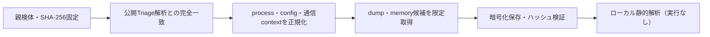

# Triage公開解析・後段取得証跡

## 完全ハッシュ一致

- [260807-advematejf](https://tria.ge/260807-advematejf): ファミリー候補 `未確定`、評価score `None`
- [260806-r9gxvaxzbs](https://tria.ge/260806-r9gxvaxzbs): ファミリー候補 `未確定`、評価score `None`

## プロセス・通信

- 観測process: `取得できず`
- raw commandは保存せず、command SHA-256と処理patternだけをJSONへ保持します。
- sandbox background trafficは`context_only`であり、C2へ自動昇格しません。

- 取得できませんでした。

## 後段取得物

- `f516f3c410fa44eb5e07eaeb093237ceafee15078f00a743a063607a64d64eda` / `memory_image` / 237568 bytes / 親と同一: `false` / 静的解析: `partial`
- `333cd56c3d41f7bbc8c4eea6064b3157d51c7e2db2bb5249aa682d89a6f8adf0` / `memory_image` / 237568 bytes / 親と同一: `false` / 静的解析: `partial`

## 判定境界

Triage由来のfamily、process、config、通信は外部sandbox証跡です。Config extractorが返したendpointはC2候補として扱いますが、静的設定復元またはprocess帰属とprotocol応答が揃うまでは確認済みC2とはしません。取得成果物と検体は実行していません。
