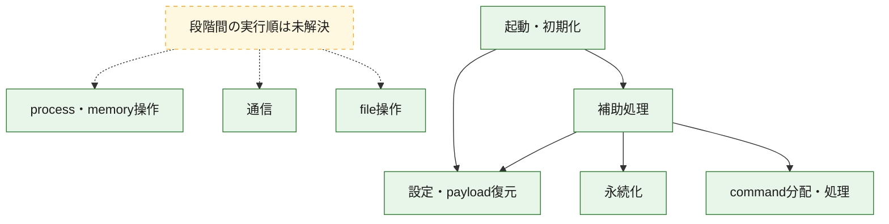

# 全体ロジック：0705daac7dbdb5c3814088256e6d4e45e844b35b183c6cd50b9595384fb44276

代表関数の静的証跡から、起動・初期化、設定・payload復元、永続化、process・memory操作、通信、command分配・処理、file操作の処理群を確認しました。

## 読み方

- phaseの掲載順は解析上の整理順です。observed_call_edgesがない段階間の実行順を断定しません。
- 図の実線は静的に観測した関係、点線と黄色のノードは未観測・未解決の関係を示します。
- 図は静的な要約であり、動的実行を再現するものではありません。
- 詳細な関数解説とfingerprintは[STATIC-LOGIC.md](STATIC-LOGIC.md)を参照してください。

## 静的可視化

### 実行フロー

### 感染チェーン

```mermaid
flowchart TD
  chain_initial["初期侵入・配布経路は未観測"]
  chain_01["提出検体 / sha256:0705daac7dbd….exe / pe"]
  chain_02["静的復元層 1 / sha256:0705daac7dbd….exe::embedded-pe / pe"]
  chain_03["静的復元層 1 / sha256:0705daac7dbd….exe::embedded-pe / pe"]
  chain_04["静的復元層 1 / sha256:0705daac7dbd….exe::embedded-pe / pe"]
  chain_05["静的復元層 1 / sha256:0705daac7dbd….exe::embedded-pe / pe"]
  chain_06["静的復元層 1 / sha256:0705daac7dbd….exe::embedded-pe / pe"]
  chain_07["静的復元層 1 / sha256:0705daac7dbd….exe::embedded-pe / pe"]
  chain_08["静的復元層 1 / sha256:0705daac7dbd….exe::embedded-pe / pe"]
  chain_09["静的復元層 1 / sha256:0705daac7dbd….exe::embedded-pe / pe"]
  chain_10["静的復元層 1 / sha256:0705daac7dbd….exe::pe-resource-pe / pe"]
  chain_11["静的復元層 1 / sha256:0705daac7dbd….exe::pe-resource-pe / pe"]
  chain_12["静的復元層 1 / sha256:0705daac7dbd….exe::pe-resource-pe / pe"]
  chain_13["静的復元層 1 / sha256:0705daac7dbd….exe::pe-resource-pe / pe"]
  chain_14["静的復元層 1 / sha256:0705daac7dbd….exe::pe-resource-pe / pe"]
  chain_15["静的復元層 2 / sha256:0705daac7dbd….exe::pe-resource-pe::dotnet-resource-ole / ole"]
  chain_16["静的復元層 3 / sha256:0705daac7dbd….exe::pe-resource-pe::dotnet-resource-ole::o / cab"]
  chain_01 -->|embedded-pe| chain_02
  chain_01 -->|embedded-pe| chain_03
  chain_01 -->|embedded-pe| chain_04
  chain_01 -->|embedded-pe| chain_05
  chain_01 -->|embedded-pe| chain_06
  chain_01 -->|embedded-pe| chain_07
  chain_01 -->|embedded-pe| chain_08
  chain_01 -->|embedded-pe| chain_09
  chain_01 -->|pe-resource-pe| chain_10
  chain_01 -->|pe-resource-pe| chain_11
  chain_01 -->|pe-resource-pe| chain_12
  chain_01 -->|pe-resource-pe| chain_13
  chain_01 -->|pe-resource-pe| chain_14
  chain_11 -->|dotnet-resource-ole| chain_15
  chain_15 -->|ole-cab-stream| chain_16
  chain_initial -.-> chain_01
  chain_more["その他8層はstatic-layers.jsonを参照"]
  chain_02 -.-> chain_more
  chain_03 -.-> chain_more
  chain_04 -.-> chain_more
  chain_05 -.-> chain_more
  chain_06 -.-> chain_more
  chain_07 -.-> chain_more
  chain_08 -.-> chain_more
  chain_09 -.-> chain_more
  chain_10 -.-> chain_more
  chain_12 -.-> chain_more
  chain_13 -.-> chain_more
  chain_14 -.-> chain_more
  chain_16 -.-> chain_more
  class chain_more unresolved
  class chain_01,chain_02,chain_03,chain_04,chain_05,chain_06,chain_07,chain_08,chain_09,chain_10,chain_11,chain_12,chain_13,chain_14,chain_15,chain_16 confirmed
  class chain_initial unresolved
  classDef confirmed fill:#e8f5e9,stroke:#2e7d32,color:#1b1b1b
  classDef unresolved fill:#fff8e1,stroke:#f9a825,color:#1b1b1b,stroke-dasharray:5 5
```

### モジュール関係

```mermaid
flowchart TD
  module_scope["解析対象のprogram構造"]
  module_01["sha256:19ac323ca6ea… / x86 / statically_recovered_program"]
  module_02["sha256:c79a22accadb… / x86 / statically_recovered_program"]
  module_03["sha256:e04de7988a2a… / x86 / statically_recovered_program"]
  module_04["sha256:9d32032109ff… / x86 / statically_recovered_program"]
  module_05["sha256:548c551f6ebc… / x86 / statically_recovered_program"]
  module_06["sha256:ad6062215032… / x86 / statically_recovered_program"]
  module_07["sha256:8a55c15cc76e… / x86 / statically_recovered_program"]
  module_08["sha256:e84dfe0b660f… / x86 / statically_recovered_program"]
  module_09["sha256:4adedcd57d23… / x86 / statically_recovered_program"]
  module_10["sha256:3e54286e348e… / x86 / statically_recovered_program"]
  module_11["sha256:3cff4ac91288… / x86 / statically_recovered_program"]
  module_12["sha256:8e7783dec955… / x86 / statically_recovered_program"]
  module_parent_unknown["復元元・親moduleは未特定"]
  module_parent_unknown -.-> module_01
  module_parent_unknown -.-> module_02
  module_parent_unknown -.-> module_03
  module_parent_unknown -.-> module_04
  module_parent_unknown -.-> module_05
  module_parent_unknown -.-> module_06
  module_parent_unknown -.-> module_07
  module_parent_unknown -.-> module_08
  module_parent_unknown -.-> module_09
  module_parent_unknown -.-> module_10
  module_parent_unknown -.-> module_11
  module_parent_unknown -.-> module_12
  class module_parent_unknown unresolved
  module_more["その他9moduleはstatic-logic.jsonを参照"]
  module_scope -.-> module_more
  class module_more unresolved
  class module_scope confirmed
  class module_01,module_02,module_03,module_04,module_05,module_06,module_07,module_08,module_09,module_10,module_11,module_12 confirmed
  classDef confirmed fill:#e8f5e9,stroke:#2e7d32,color:#1b1b1b
  classDef unresolved fill:#fff8e1,stroke:#f9a825,color:#1b1b1b,stroke-dasharray:5 5
```

## 処理段階

### 1. 起動・初期化

entry pointから初期化と後続処理への移行を確認します。
確度: `confirmed_static_function_evidence_with_limits`

- `19ac323ca6eae2f8145cdc2bac865b32cd5a48ad6ff199d4ca7da214b056e1dc:cil:0x06000001` — 初期化と主要処理への分岐を行う入口関数です。 状態: `succeeded`、選定理由: `entry_point`, `reviewed_call_centrality:10`, `small_program_complete_context`
- `19ac323ca6eae2f8145cdc2bac865b32cd5a48ad6ff199d4ca7da214b056e1dc:cil:0x0600000d` — 初期化と主要処理への分岐を行う入口関数です。 状態: `succeeded`、選定理由: `entry_point`, `reviewed_call_centrality:16`, `small_program_complete_context`
- `8a55c15cc76e31042e17458c479772aa95bc1b908016c85b1dc8b8e3eff23254:ghidra:180007e50` — 初期化と主要処理への分岐を行う入口関数です。 状態: `succeeded`、選定理由: `entry_point`, `meaningful_symbol_name`, `reviewed_call_centrality:4`, `role:entrypoint`
- `4adedcd57d2316469f0f770bbe27cbc2cc2ee17a2afa1b0dd5c5035b276cbc64:ghidra:100069a5` — 初期化と主要処理への分岐を行う入口関数です。 状態: `succeeded`、選定理由: `entry_point`, `meaningful_symbol_name`, `role:entrypoint`, `small_program_complete_context`
- `8e7783dec955ee271d9d79c305a90dce1b4f2522948d4fe343fa63df7e37854d:ghidra:10010a26` — 初期化と主要処理への分岐を行う入口関数です。 状態: `failed`、選定理由: `entry_point`, `meaningful_symbol_name`, `role:entrypoint`, `small_program_complete_context`
- `808c61a09e220c361cff01e76c30f269e6c037c85069e0811662fd86c137874a:ghidra:1800380f8` — 初期化と主要処理への分岐を行う入口関数です。 状態: `succeeded`、選定理由: `entry_point`, `meaningful_symbol_name`, `reviewed_call_centrality:4`, `role:entrypoint`
- `e4b29e87ae288199964726c10ea221827cfde794c2aee17f71f4561cd09bf472:ghidra:180036be8` — 初期化と主要処理への分岐を行う入口関数です。 状態: `succeeded`、選定理由: `entry_point`, `meaningful_symbol_name`, `reviewed_call_centrality:4`, `role:entrypoint`
- `a45ba86c5d13aa8e814e4cb0860b5b2a39ce9677b0d980947f6fe31676051cb2:ghidra:100069a5` — 初期化と主要処理への分岐を行う入口関数です。 状態: `succeeded`、選定理由: `call_graph_centrality:in=0,out=1`, `entry_point`, `meaningful_symbol_name`, `reviewed_call_centrality:2`, `role:entrypoint`, `small_program_complete_context`
- `471f006f8fa65639c35f754bf173b5f7749e0e0bbc4c8e1a699c5358b995684c:cil:0x06000014` — 初期化と主要処理への分岐を行う入口関数です。 状態: `succeeded`、選定理由: `entry_point`, `reviewed_call_centrality:4`, `small_program_complete_context`
- `471f006f8fa65639c35f754bf173b5f7749e0e0bbc4c8e1a699c5358b995684c:cil:0x06000017` — 初期化と主要処理への分岐を行う入口関数です。 状態: `succeeded`、選定理由: `entry_point`, `large_function:instructions=192`, `reviewed_call_centrality:82`, `small_program_complete_context`
- `471f006f8fa65639c35f754bf173b5f7749e0e0bbc4c8e1a699c5358b995684c:cil:0x06000018` — 初期化と主要処理への分岐を行う入口関数です。 状態: `succeeded`、選定理由: `entry_point`, `reviewed_call_centrality:4`, `small_program_complete_context`
- `471f006f8fa65639c35f754bf173b5f7749e0e0bbc4c8e1a699c5358b995684c:cil:0x06000019` — 初期化と主要処理への分岐を行う入口関数です。 状態: `succeeded`、選定理由: `entry_point`, `reviewed_call_centrality:8`, `small_program_complete_context`
- `471f006f8fa65639c35f754bf173b5f7749e0e0bbc4c8e1a699c5358b995684c:cil:0x0600001a` — 初期化と主要処理への分岐を行う入口関数です。 状態: `succeeded`、選定理由: `entry_point`, `reviewed_call_centrality:20`, `small_program_complete_context`
- `471f006f8fa65639c35f754bf173b5f7749e0e0bbc4c8e1a699c5358b995684c:cil:0x0600001c` — 初期化と主要処理への分岐を行う入口関数です。 状態: `succeeded`、選定理由: `entry_point`, `reviewed_call_centrality:2`, `small_program_complete_context`
- `471f006f8fa65639c35f754bf173b5f7749e0e0bbc4c8e1a699c5358b995684c:cil:0x0600001e` — 初期化と主要処理への分岐を行う入口関数です。 状態: `succeeded`、選定理由: `entry_point`, `reviewed_call_centrality:8`, `small_program_complete_context`
- `471f006f8fa65639c35f754bf173b5f7749e0e0bbc4c8e1a699c5358b995684c:cil:0x0600001f` — 初期化と主要処理への分岐を行う入口関数です。 状態: `succeeded`、選定理由: `entry_point`, `reviewed_call_centrality:6`, `small_program_complete_context`

### 2. 設定・payload復元

設定、resource、payload、暗号化データの復元・変換を確認します。
確度: `confirmed_static_function_evidence_with_limits`

- `e04de7988a2a39931831977fa22d2a4c39cf3f70211b77b618cae9243170f1a7:cil:0x0600002e` — 設定、resource、payloadなどの解析・変換を行う関数です。 状態: `succeeded`、選定理由: `reviewed_call_centrality:2`, `role:config_or_data_transform`
- `e04de7988a2a39931831977fa22d2a4c39cf3f70211b77b618cae9243170f1a7:cil:0x0600002f` — 設定、resource、payloadなどの解析・変換を行う関数です。 状態: `succeeded`、選定理由: `reviewed_call_centrality:14`, `role:config_or_data_transform`
- `e04de7988a2a39931831977fa22d2a4c39cf3f70211b77b618cae9243170f1a7:cil:0x06000030` — 設定、resource、payloadなどの解析・変換を行う関数です。 状態: `succeeded`、選定理由: `reviewed_call_centrality:4`, `role:config_or_data_transform`
- `e04de7988a2a39931831977fa22d2a4c39cf3f70211b77b618cae9243170f1a7:cil:0x06000031` — 設定、resource、payloadなどの解析・変換を行う関数です。 状態: `succeeded`、選定理由: `reviewed_call_centrality:2`, `role:config_or_data_transform`
- `e04de7988a2a39931831977fa22d2a4c39cf3f70211b77b618cae9243170f1a7:cil:0x06000032` — 設定、resource、payloadなどの解析・変換を行う関数です。 状態: `succeeded`、選定理由: `reviewed_call_centrality:10`, `role:config_or_data_transform`
- `e04de7988a2a39931831977fa22d2a4c39cf3f70211b77b618cae9243170f1a7:cil:0x06000033` — 設定、resource、payloadなどの解析・変換を行う関数です。 状態: `succeeded`、選定理由: `reviewed_call_centrality:2`, `role:config_or_data_transform`
- `e04de7988a2a39931831977fa22d2a4c39cf3f70211b77b618cae9243170f1a7:cil:0x06000034` — 設定、resource、payloadなどの解析・変換を行う関数です。 状態: `succeeded`、選定理由: `reviewed_call_centrality:16`, `role:config_or_data_transform`
- `e04de7988a2a39931831977fa22d2a4c39cf3f70211b77b618cae9243170f1a7:cil:0x0600007d` — 設定、resource、payloadなどの解析・変換を行う関数です。 状態: `succeeded`、選定理由: `reviewed_call_centrality:10`, `role:config_or_data_transform`
- `e04de7988a2a39931831977fa22d2a4c39cf3f70211b77b618cae9243170f1a7:cil:0x060000c1` — 設定、resource、payloadなどの解析・変換を行う関数です。 状態: `succeeded`、選定理由: `reviewed_call_centrality:2`, `role:config_or_data_transform`
- `e04de7988a2a39931831977fa22d2a4c39cf3f70211b77b618cae9243170f1a7:cil:0x060000c5` — 設定、resource、payloadなどの解析・変換を行う関数です。 状態: `succeeded`、選定理由: `reviewed_call_centrality:4`, `role:config_or_data_transform`
- `9d32032109ffc217b7dc49390bd01a067a49883843459356ebfb4d29ba696bf8:cil:0x06000020` — 設定、resource、payloadなどの解析・変換を行う関数です。 状態: `succeeded`、選定理由: `reviewed_call_centrality:4`, `role:config_or_data_transform`
- `9d32032109ffc217b7dc49390bd01a067a49883843459356ebfb4d29ba696bf8:cil:0x06000050` — 設定、resource、payloadなどの解析・変換を行う関数です。 状態: `succeeded`、選定理由: `large_function:instructions=145`, `reviewed_call_centrality:48`, `role:config_or_data_transform`
- `548c551f6ebc5d829158a1e9ad1948d301d7c921906c3d8d6b6d69925fc624a1:cil:0x06000031` — 設定、resource、payloadなどの解析・変換を行う関数です。 状態: `succeeded`、選定理由: `large_function:instructions=159`, `reviewed_call_centrality:8`, `role:config_or_data_transform`
- `548c551f6ebc5d829158a1e9ad1948d301d7c921906c3d8d6b6d69925fc624a1:cil:0x0600009f` — 設定、resource、payloadなどの解析・変換を行う関数です。 状態: `succeeded`、選定理由: `large_function:instructions=95`, `reviewed_call_centrality:20`, `role:config_or_data_transform`
- `e84dfe0b660f1698d83b0ee959c1b228eb51e2d5cbee90fcc2fe987a6fe08441:cil:0x06000016` — 暗号、hash、encoding、または復号処理に関係する関数です。 状態: `succeeded`、選定理由: `reviewed_call_centrality:4`, `role:cryptographic_transform`
- `e84dfe0b660f1698d83b0ee959c1b228eb51e2d5cbee90fcc2fe987a6fe08441:cil:0x06000024` — 暗号、hash、encoding、または復号処理に関係する関数です。 状態: `succeeded`、選定理由: `reviewed_call_centrality:4`, `role:cryptographic_transform`
- `e84dfe0b660f1698d83b0ee959c1b228eb51e2d5cbee90fcc2fe987a6fe08441:cil:0x0600002e` — 設定、resource、payloadなどの解析・変換を行う関数です。 状態: `succeeded`、選定理由: `reviewed_call_centrality:2`, `role:config_or_data_transform`
- `e84dfe0b660f1698d83b0ee959c1b228eb51e2d5cbee90fcc2fe987a6fe08441:cil:0x0600003a` — 設定、resource、payloadなどの解析・変換を行う関数です。 状態: `succeeded`、選定理由: `large_function:instructions=64`, `reviewed_call_centrality:20`, `role:config_or_data_transform`
- `e84dfe0b660f1698d83b0ee959c1b228eb51e2d5cbee90fcc2fe987a6fe08441:cil:0x0600003b` — 設定、resource、payloadなどの解析・変換を行う関数です。 状態: `succeeded`、選定理由: `reviewed_call_centrality:2`, `role:config_or_data_transform`
- `e84dfe0b660f1698d83b0ee959c1b228eb51e2d5cbee90fcc2fe987a6fe08441:cil:0x0600003c` — 設定、resource、payloadなどの解析・変換を行う関数です。 状態: `succeeded`、選定理由: `reviewed_call_centrality:4`, `role:config_or_data_transform`
- `e84dfe0b660f1698d83b0ee959c1b228eb51e2d5cbee90fcc2fe987a6fe08441:cil:0x06000050` — 暗号、hash、encoding、または復号処理に関係する関数です。 状態: `succeeded`、選定理由: `reviewed_call_centrality:4`, `role:cryptographic_transform`
- `e84dfe0b660f1698d83b0ee959c1b228eb51e2d5cbee90fcc2fe987a6fe08441:cil:0x0600006d` — 設定、resource、payloadなどの解析・変換を行う関数です。 状態: `succeeded`、選定理由: `reviewed_call_centrality:14`, `role:config_or_data_transform`
- `e84dfe0b660f1698d83b0ee959c1b228eb51e2d5cbee90fcc2fe987a6fe08441:cil:0x0600006e` — 設定、resource、payloadなどの解析・変換を行う関数です。 状態: `succeeded`、選定理由: `role:config_or_data_transform`
- `e84dfe0b660f1698d83b0ee959c1b228eb51e2d5cbee90fcc2fe987a6fe08441:cil:0x06000076` — 設定、resource、payloadなどの解析・変換を行う関数です。 状態: `succeeded`、選定理由: `role:config_or_data_transform`
- `e84dfe0b660f1698d83b0ee959c1b228eb51e2d5cbee90fcc2fe987a6fe08441:cil:0x06000077` — 設定、resource、payloadなどの解析・変換を行う関数です。 状態: `succeeded`、選定理由: `reviewed_call_centrality:8`, `role:config_or_data_transform`
- `e84dfe0b660f1698d83b0ee959c1b228eb51e2d5cbee90fcc2fe987a6fe08441:cil:0x06000083` — 設定、resource、payloadなどの解析・変換を行う関数です。 状態: `succeeded`、選定理由: `reviewed_call_centrality:18`, `role:config_or_data_transform`
- `e84dfe0b660f1698d83b0ee959c1b228eb51e2d5cbee90fcc2fe987a6fe08441:cil:0x06000084` — 設定、resource、payloadなどの解析・変換を行う関数です。 状態: `succeeded`、選定理由: `reviewed_call_centrality:6`, `role:config_or_data_transform`
- `e84dfe0b660f1698d83b0ee959c1b228eb51e2d5cbee90fcc2fe987a6fe08441:cil:0x060000e7` — 暗号、hash、encoding、または復号処理に関係する関数です。 状態: `succeeded`、選定理由: `reviewed_call_centrality:4`, `role:cryptographic_transform`
- `e84dfe0b660f1698d83b0ee959c1b228eb51e2d5cbee90fcc2fe987a6fe08441:cil:0x06000185` — 暗号、hash、encoding、または復号処理に関係する関数です。 状態: `succeeded`、選定理由: `role:cryptographic_transform`
- `e84dfe0b660f1698d83b0ee959c1b228eb51e2d5cbee90fcc2fe987a6fe08441:cil:0x06000186` — 暗号、hash、encoding、または復号処理に関係する関数です。 状態: `succeeded`、選定理由: `reviewed_call_centrality:2`, `role:cryptographic_transform`
- `e84dfe0b660f1698d83b0ee959c1b228eb51e2d5cbee90fcc2fe987a6fe08441:cil:0x06000238` — 設定、resource、payloadなどの解析・変換を行う関数です。 状態: `deferred_resource_budget`、選定理由: `role:config_or_data_transform`
- `e84dfe0b660f1698d83b0ee959c1b228eb51e2d5cbee90fcc2fe987a6fe08441:cil:0x06000239` — 設定、resource、payloadなどの解析・変換を行う関数です。 状態: `deferred_resource_budget`、選定理由: `role:config_or_data_transform`
- `e84dfe0b660f1698d83b0ee959c1b228eb51e2d5cbee90fcc2fe987a6fe08441:cil:0x06000292` — 設定、resource、payloadなどの解析・変換を行う関数です。 状態: `deferred_resource_budget`、選定理由: `role:config_or_data_transform`
- `3e54286e348ebd3d70eaed8174cca500455c3e098cdd1fccb167bc43d93db29d:cil:0x0600005e` — 設定、resource、payloadなどの解析・変換を行う関数です。 状態: `succeeded`、選定理由: `reviewed_call_centrality:12`, `role:config_or_data_transform`
- `3e54286e348ebd3d70eaed8174cca500455c3e098cdd1fccb167bc43d93db29d:cil:0x06000061` — 設定、resource、payloadなどの解析・変換を行う関数です。 状態: `succeeded`、選定理由: `large_function:instructions=120`, `reviewed_call_centrality:14`, `role:config_or_data_transform`
- `3e54286e348ebd3d70eaed8174cca500455c3e098cdd1fccb167bc43d93db29d:cil:0x06000107` — 暗号、hash、encoding、または復号処理に関係する関数です。 状態: `succeeded`、選定理由: `reviewed_call_centrality:8`, `role:cryptographic_transform`
- `3e54286e348ebd3d70eaed8174cca500455c3e098cdd1fccb167bc43d93db29d:cil:0x0600012e` — 暗号、hash、encoding、または復号処理に関係する関数です。 状態: `succeeded`、選定理由: `reviewed_call_centrality:4`, `role:cryptographic_transform`
- `3e54286e348ebd3d70eaed8174cca500455c3e098cdd1fccb167bc43d93db29d:cil:0x0600023b` — 設定、resource、payloadなどの解析・変換を行う関数です。 状態: `succeeded`、選定理由: `large_function:instructions=76`, `reviewed_call_centrality:16`, `role:config_or_data_transform`
- `3e54286e348ebd3d70eaed8174cca500455c3e098cdd1fccb167bc43d93db29d:cil:0x060002e7` — 暗号、hash、encoding、または復号処理に関係する関数です。 状態: `deferred_resource_budget`、選定理由: `role:cryptographic_transform`
- `b8100e5ab07983cbf82d721cf719576ca3f60e352628dcaabd42d428011fdedf:cil:0x06000005` — 暗号、hash、encoding、または復号処理に関係する関数です。 状態: `succeeded`、選定理由: `reviewed_call_centrality:4`, `role:cryptographic_transform`
- `b8100e5ab07983cbf82d721cf719576ca3f60e352628dcaabd42d428011fdedf:cil:0x0600000b` — 暗号、hash、encoding、または復号処理に関係する関数です。 状態: `succeeded`、選定理由: `reviewed_call_centrality:4`, `role:cryptographic_transform`
- `b8100e5ab07983cbf82d721cf719576ca3f60e352628dcaabd42d428011fdedf:cil:0x06000011` — 暗号、hash、encoding、または復号処理に関係する関数です。 状態: `succeeded`、選定理由: `reviewed_call_centrality:4`, `role:cryptographic_transform`
- `b8100e5ab07983cbf82d721cf719576ca3f60e352628dcaabd42d428011fdedf:cil:0x06000017` — 暗号、hash、encoding、または復号処理に関係する関数です。 状態: `succeeded`、選定理由: `reviewed_call_centrality:4`, `role:cryptographic_transform`
- `b8100e5ab07983cbf82d721cf719576ca3f60e352628dcaabd42d428011fdedf:cil:0x0600001d` — 暗号、hash、encoding、または復号処理に関係する関数です。 状態: `succeeded`、選定理由: `reviewed_call_centrality:4`, `role:cryptographic_transform`
- `b8100e5ab07983cbf82d721cf719576ca3f60e352628dcaabd42d428011fdedf:cil:0x0600008e` — 暗号、hash、encoding、または復号処理に関係する関数です。 状態: `succeeded`、選定理由: `reviewed_call_centrality:6`, `role:cryptographic_transform`
- `b8100e5ab07983cbf82d721cf719576ca3f60e352628dcaabd42d428011fdedf:cil:0x0600009b` — 暗号、hash、encoding、または復号処理に関係する関数です。 状態: `succeeded`、選定理由: `reviewed_call_centrality:8`, `role:cryptographic_transform`
- `b8100e5ab07983cbf82d721cf719576ca3f60e352628dcaabd42d428011fdedf:cil:0x060000a8` — 暗号、hash、encoding、または復号処理に関係する関数です。 状態: `succeeded`、選定理由: `reviewed_call_centrality:10`, `role:cryptographic_transform`
- `b8100e5ab07983cbf82d721cf719576ca3f60e352628dcaabd42d428011fdedf:cil:0x060000b5` — 暗号、hash、encoding、または復号処理に関係する関数です。 状態: `succeeded`、選定理由: `reviewed_call_centrality:12`, `role:cryptographic_transform`
- `b8100e5ab07983cbf82d721cf719576ca3f60e352628dcaabd42d428011fdedf:cil:0x060000c2` — 暗号、hash、encoding、または復号処理に関係する関数です。 状態: `succeeded`、選定理由: `reviewed_call_centrality:14`, `role:cryptographic_transform`
- `b8100e5ab07983cbf82d721cf719576ca3f60e352628dcaabd42d428011fdedf:cil:0x060000cf` — 暗号、hash、encoding、または復号処理に関係する関数です。 状態: `succeeded`、選定理由: `reviewed_call_centrality:16`, `role:cryptographic_transform`
- `b8100e5ab07983cbf82d721cf719576ca3f60e352628dcaabd42d428011fdedf:cil:0x060000f1` — 暗号、hash、encoding、または復号処理に関係する関数です。 状態: `succeeded`、選定理由: `reviewed_call_centrality:2`, `role:cryptographic_transform`
- `b8100e5ab07983cbf82d721cf719576ca3f60e352628dcaabd42d428011fdedf:cil:0x060000f2` — 暗号、hash、encoding、または復号処理に関係する関数です。 状態: `succeeded`、選定理由: `reviewed_call_centrality:2`, `role:cryptographic_transform`
- `b8100e5ab07983cbf82d721cf719576ca3f60e352628dcaabd42d428011fdedf:cil:0x0600012d` — 暗号、hash、encoding、または復号処理に関係する関数です。 状態: `succeeded`、選定理由: `reviewed_call_centrality:2`, `role:cryptographic_transform`
- `b8100e5ab07983cbf82d721cf719576ca3f60e352628dcaabd42d428011fdedf:cil:0x0600013a` — 暗号、hash、encoding、または復号処理に関係する関数です。 状態: `succeeded`、選定理由: `reviewed_call_centrality:4`, `role:cryptographic_transform`
- `b8100e5ab07983cbf82d721cf719576ca3f60e352628dcaabd42d428011fdedf:cil:0x06000282` — 暗号、hash、encoding、または復号処理に関係する関数です。 状態: `deferred_resource_budget`、選定理由: `role:cryptographic_transform`
- `b8100e5ab07983cbf82d721cf719576ca3f60e352628dcaabd42d428011fdedf:cil:0x06000286` — 設定、resource、payloadなどの解析・変換を行う関数です。 状態: `deferred_resource_budget`、選定理由: `role:config_or_data_transform`
- `b8100e5ab07983cbf82d721cf719576ca3f60e352628dcaabd42d428011fdedf:cil:0x060002ec` — 暗号、hash、encoding、または復号処理に関係する関数です。 状態: `deferred_resource_budget`、選定理由: `role:cryptographic_transform`
- `b8100e5ab07983cbf82d721cf719576ca3f60e352628dcaabd42d428011fdedf:cil:0x060002f1` — 暗号、hash、encoding、または復号処理に関係する関数です。 状態: `deferred_resource_budget`、選定理由: `role:cryptographic_transform`
- `b8100e5ab07983cbf82d721cf719576ca3f60e352628dcaabd42d428011fdedf:cil:0x060002f9` — 暗号、hash、encoding、または復号処理に関係する関数です。 状態: `deferred_resource_budget`、選定理由: `role:cryptographic_transform`
- `b8100e5ab07983cbf82d721cf719576ca3f60e352628dcaabd42d428011fdedf:cil:0x06000319` — 暗号、hash、encoding、または復号処理に関係する関数です。 状態: `deferred_resource_budget`、選定理由: `role:cryptographic_transform`
- `b8100e5ab07983cbf82d721cf719576ca3f60e352628dcaabd42d428011fdedf:cil:0x06000324` — 暗号、hash、encoding、または復号処理に関係する関数です。 状態: `deferred_resource_budget`、選定理由: `role:cryptographic_transform`
- `b8100e5ab07983cbf82d721cf719576ca3f60e352628dcaabd42d428011fdedf:cil:0x06000345` — 暗号、hash、encoding、または復号処理に関係する関数です。 状態: `deferred_resource_budget`、選定理由: `role:cryptographic_transform`
- `b8100e5ab07983cbf82d721cf719576ca3f60e352628dcaabd42d428011fdedf:cil:0x0600034c` — 設定、resource、payloadなどの解析・変換を行う関数です。 状態: `deferred_resource_budget`、選定理由: `role:config_or_data_transform`
- `b8100e5ab07983cbf82d721cf719576ca3f60e352628dcaabd42d428011fdedf:cil:0x0600036b` — 設定、resource、payloadなどの解析・変換を行う関数です。 状態: `deferred_resource_budget`、選定理由: `role:config_or_data_transform`
- `b8100e5ab07983cbf82d721cf719576ca3f60e352628dcaabd42d428011fdedf:cil:0x06000372` — 暗号、hash、encoding、または復号処理に関係する関数です。 状態: `deferred_resource_budget`、選定理由: `role:cryptographic_transform`
- `da29455a64858fda773319c32c0a6cd40edbe8042ed005aa2befb8a4f0fb0522:cil:0x06000028` — 暗号、hash、encoding、または復号処理に関係する関数です。 状態: `succeeded`、選定理由: `reviewed_call_centrality:4`, `role:cryptographic_transform`
- `da29455a64858fda773319c32c0a6cd40edbe8042ed005aa2befb8a4f0fb0522:cil:0x06000085` — 設定、resource、payloadなどの解析・変換を行う関数です。 状態: `succeeded`、選定理由: `reviewed_call_centrality:2`, `role:config_or_data_transform`
- `da29455a64858fda773319c32c0a6cd40edbe8042ed005aa2befb8a4f0fb0522:cil:0x060002b6` — 設定、resource、payloadなどの解析・変換を行う関数です。 状態: `succeeded`、選定理由: `reviewed_call_centrality:4`, `role:config_or_data_transform`
- `da29455a64858fda773319c32c0a6cd40edbe8042ed005aa2befb8a4f0fb0522:cil:0x060002ed` — 設定、resource、payloadなどの解析・変換を行う関数です。 状態: `succeeded`、選定理由: `reviewed_call_centrality:18`, `role:config_or_data_transform`
- `da29455a64858fda773319c32c0a6cd40edbe8042ed005aa2befb8a4f0fb0522:cil:0x060002ee` — 設定、resource、payloadなどの解析・変換を行う関数です。 状態: `succeeded`、選定理由: `reviewed_call_centrality:14`, `role:config_or_data_transform`
- `da29455a64858fda773319c32c0a6cd40edbe8042ed005aa2befb8a4f0fb0522:cil:0x060002f0` — 設定、resource、payloadなどの解析・変換を行う関数です。 状態: `succeeded`、選定理由: `reviewed_call_centrality:4`, `role:config_or_data_transform`
- `471f006f8fa65639c35f754bf173b5f7749e0e0bbc4c8e1a699c5358b995684c:cil:0x0600000d` — 暗号、hash、encoding、または復号処理に関係する関数です。 状態: `succeeded`、選定理由: `large_function:instructions=72`, `reviewed_call_centrality:4`, `role:cryptographic_transform`, `small_program_complete_context`

### 3. 永続化

自動起動や永続化に関係する設定変更を確認します。
確度: `confirmed_static_function_evidence_with_limits`

- `3e54286e348ebd3d70eaed8174cca500455c3e098cdd1fccb167bc43d93db29d:cil:0x06000338` — 自動起動または永続化に関係する処理を含む関数です。 状態: `deferred_resource_budget`、選定理由: `role:persistence`
- `da29455a64858fda773319c32c0a6cd40edbe8042ed005aa2befb8a4f0fb0522:cil:0x06000099` — 自動起動または永続化に関係する処理を含む関数です。 状態: `succeeded`、選定理由: `reviewed_call_centrality:6`, `role:persistence`

### 4. process・memory操作

process、thread、module、memory操作と実行移行を確認します。
確度: `confirmed_static_function_evidence_with_limits`

- `b8100e5ab07983cbf82d721cf719576ca3f60e352628dcaabd42d428011fdedf:cil:0x06000915` — process、thread、module、またはmemory操作に関係する関数です。 状態: `deferred_resource_budget`、選定理由: `role:process_or_memory_operation`
- `da29455a64858fda773319c32c0a6cd40edbe8042ed005aa2befb8a4f0fb0522:cil:0x060000b9` — process、thread、module、またはmemory操作に関係する関数です。 状態: `succeeded`、選定理由: `reviewed_call_centrality:22`, `role:process_or_memory_operation`
- `da29455a64858fda773319c32c0a6cd40edbe8042ed005aa2befb8a4f0fb0522:cil:0x060000d0` — process、thread、module、またはmemory操作に関係する関数です。 状態: `succeeded`、選定理由: `large_function:instructions=73`, `reviewed_call_centrality:24`, `role:process_or_memory_operation`
- `da29455a64858fda773319c32c0a6cd40edbe8042ed005aa2befb8a4f0fb0522:cil:0x0600013c` — process、thread、module、またはmemory操作に関係する関数です。 状態: `succeeded`、選定理由: `large_function:instructions=220`, `reviewed_call_centrality:50`, `role:process_or_memory_operation`
- `da29455a64858fda773319c32c0a6cd40edbe8042ed005aa2befb8a4f0fb0522:cil:0x0600013d` — process、thread、module、またはmemory操作に関係する関数です。 状態: `succeeded`、選定理由: `large_function:instructions=155`, `reviewed_call_centrality:16`, `role:process_or_memory_operation`
- `da29455a64858fda773319c32c0a6cd40edbe8042ed005aa2befb8a4f0fb0522:cil:0x06000142` — process、thread、module、またはmemory操作に関係する関数です。 状態: `succeeded`、選定理由: `large_function:instructions=191`, `reviewed_call_centrality:16`, `role:process_or_memory_operation`
- `da29455a64858fda773319c32c0a6cd40edbe8042ed005aa2befb8a4f0fb0522:cil:0x060002b8` — process、thread、module、またはmemory操作に関係する関数です。 状態: `succeeded`、選定理由: `reviewed_call_centrality:6`, `role:process_or_memory_operation`

### 5. 通信

通信初期化、endpoint処理、送受信の役割を確認します。
確度: `confirmed_static_function_evidence_with_limits`

- `b8100e5ab07983cbf82d721cf719576ca3f60e352628dcaabd42d428011fdedf:cil:0x06000b50` — 通信初期化、送受信、またはendpoint処理に関係する関数です。 状態: `deferred_resource_budget`、選定理由: `role:network_communication`
- `da29455a64858fda773319c32c0a6cd40edbe8042ed005aa2befb8a4f0fb0522:cil:0x06000314` — 通信初期化、送受信、またはendpoint処理に関係する関数です。 状態: `succeeded`、選定理由: `large_function:instructions=74`, `reviewed_call_centrality:28`, `role:network_communication`

### 6. command分配・処理

受信commandやtaskの解釈、分配、個別handlerへの移行を確認します。
確度: `confirmed_static_function_evidence_with_limits`

- `3e54286e348ebd3d70eaed8174cca500455c3e098cdd1fccb167bc43d93db29d:cil:0x06000086` — commandの解釈、分配、または個別処理を担当する関数です。 状態: `succeeded`、選定理由: `reviewed_call_centrality:6`, `role:command_dispatch_or_handler`
- `3e54286e348ebd3d70eaed8174cca500455c3e098cdd1fccb167bc43d93db29d:cil:0x06000088` — commandの解釈、分配、または個別処理を担当する関数です。 状態: `succeeded`、選定理由: `reviewed_call_centrality:10`, `role:command_dispatch_or_handler`
- `3e54286e348ebd3d70eaed8174cca500455c3e098cdd1fccb167bc43d93db29d:cil:0x06000089` — commandの解釈、分配、または個別処理を担当する関数です。 状態: `succeeded`、選定理由: `reviewed_call_centrality:10`, `role:command_dispatch_or_handler`
- `3e54286e348ebd3d70eaed8174cca500455c3e098cdd1fccb167bc43d93db29d:cil:0x0600008a` — commandの解釈、分配、または個別処理を担当する関数です。 状態: `succeeded`、選定理由: `reviewed_call_centrality:10`, `role:command_dispatch_or_handler`
- `3e54286e348ebd3d70eaed8174cca500455c3e098cdd1fccb167bc43d93db29d:cil:0x0600008b` — commandの解釈、分配、または個別処理を担当する関数です。 状態: `succeeded`、選定理由: `large_function:instructions=74`, `reviewed_call_centrality:24`, `role:command_dispatch_or_handler`
- `3e54286e348ebd3d70eaed8174cca500455c3e098cdd1fccb167bc43d93db29d:cil:0x0600008c` — commandの解釈、分配、または個別処理を担当する関数です。 状態: `succeeded`、選定理由: `reviewed_call_centrality:10`, `role:command_dispatch_or_handler`
- `3e54286e348ebd3d70eaed8174cca500455c3e098cdd1fccb167bc43d93db29d:cil:0x0600008d` — commandの解釈、分配、または個別処理を担当する関数です。 状態: `succeeded`、選定理由: `large_function:instructions=73`, `reviewed_call_centrality:24`, `role:command_dispatch_or_handler`
- `3e54286e348ebd3d70eaed8174cca500455c3e098cdd1fccb167bc43d93db29d:cil:0x0600008e` — commandの解釈、分配、または個別処理を担当する関数です。 状態: `succeeded`、選定理由: `reviewed_call_centrality:10`, `role:command_dispatch_or_handler`
- `3e54286e348ebd3d70eaed8174cca500455c3e098cdd1fccb167bc43d93db29d:cil:0x0600008f` — commandの解釈、分配、または個別処理を担当する関数です。 状態: `succeeded`、選定理由: `large_function:instructions=73`, `reviewed_call_centrality:24`, `role:command_dispatch_or_handler`
- `3e54286e348ebd3d70eaed8174cca500455c3e098cdd1fccb167bc43d93db29d:cil:0x06000090` — commandの解釈、分配、または個別処理を担当する関数です。 状態: `succeeded`、選定理由: `reviewed_call_centrality:10`, `role:command_dispatch_or_handler`
- `3e54286e348ebd3d70eaed8174cca500455c3e098cdd1fccb167bc43d93db29d:cil:0x06000091` — commandの解釈、分配、または個別処理を担当する関数です。 状態: `succeeded`、選定理由: `reviewed_call_centrality:16`, `role:command_dispatch_or_handler`
- `3e54286e348ebd3d70eaed8174cca500455c3e098cdd1fccb167bc43d93db29d:cil:0x060000d3` — commandの解釈、分配、または個別処理を担当する関数です。 状態: `succeeded`、選定理由: `role:command_dispatch_or_handler`
- `3e54286e348ebd3d70eaed8174cca500455c3e098cdd1fccb167bc43d93db29d:cil:0x060000d4` — commandの解釈、分配、または個別処理を担当する関数です。 状態: `succeeded`、選定理由: `reviewed_call_centrality:2`, `role:command_dispatch_or_handler`
- `3e54286e348ebd3d70eaed8174cca500455c3e098cdd1fccb167bc43d93db29d:cil:0x060000d6` — commandの解釈、分配、または個別処理を担当する関数です。 状態: `succeeded`、選定理由: `role:command_dispatch_or_handler`
- `3e54286e348ebd3d70eaed8174cca500455c3e098cdd1fccb167bc43d93db29d:cil:0x060000d7` — commandの解釈、分配、または個別処理を担当する関数です。 状態: `succeeded`、選定理由: `reviewed_call_centrality:8`, `role:command_dispatch_or_handler`
- `3e54286e348ebd3d70eaed8174cca500455c3e098cdd1fccb167bc43d93db29d:cil:0x0600029c` — commandの解釈、分配、または個別処理を担当する関数です。 状態: `succeeded`、選定理由: `reviewed_call_centrality:10`, `role:command_dispatch_or_handler`
- `3e54286e348ebd3d70eaed8174cca500455c3e098cdd1fccb167bc43d93db29d:cil:0x0600035a` — commandの解釈、分配、または個別処理を担当する関数です。 状態: `deferred_resource_budget`、選定理由: `role:command_dispatch_or_handler`
- `3e54286e348ebd3d70eaed8174cca500455c3e098cdd1fccb167bc43d93db29d:cil:0x0600035b` — commandの解釈、分配、または個別処理を担当する関数です。 状態: `deferred_resource_budget`、選定理由: `role:command_dispatch_or_handler`
- `808c61a09e220c361cff01e76c30f269e6c037c85069e0811662fd86c137874a:ghidra:1800429a0` — commandの解釈、分配、または個別処理を担当する関数です。 状態: `limited_bad_instruction_or_flow`、選定理由: `meaningful_symbol_name`, `role:command_dispatch_or_handler`
- `e4b29e87ae288199964726c10ea221827cfde794c2aee17f71f4561cd09bf472:ghidra:180046360` — commandの解釈、分配、または個別処理を担当する関数です。 状態: `limited_bad_instruction_or_flow`、選定理由: `meaningful_symbol_name`, `role:command_dispatch_or_handler`
- `b8100e5ab07983cbf82d721cf719576ca3f60e352628dcaabd42d428011fdedf:cil:0x06000480` — commandの解釈、分配、または個別処理を担当する関数です。 状態: `deferred_resource_budget`、選定理由: `role:command_dispatch_or_handler`
- `da29455a64858fda773319c32c0a6cd40edbe8042ed005aa2befb8a4f0fb0522:cil:0x060000ba` — commandの解釈、分配、または個別処理を担当する関数です。 状態: `succeeded`、選定理由: `large_function:instructions=237`, `reviewed_call_centrality:104`, `role:command_dispatch_or_handler`
- `da29455a64858fda773319c32c0a6cd40edbe8042ed005aa2befb8a4f0fb0522:cil:0x060000bb` — commandの解釈、分配、または個別処理を担当する関数です。 状態: `succeeded`、選定理由: `large_function:instructions=104`, `reviewed_call_centrality:30`, `role:command_dispatch_or_handler`
- `da29455a64858fda773319c32c0a6cd40edbe8042ed005aa2befb8a4f0fb0522:cil:0x06000310` — commandの解釈、分配、または個別処理を担当する関数です。 状態: `succeeded`、選定理由: `reviewed_call_centrality:2`, `role:command_dispatch_or_handler`
- `da29455a64858fda773319c32c0a6cd40edbe8042ed005aa2befb8a4f0fb0522:cil:0x06000311` — commandの解釈、分配、または個別処理を担当する関数です。 状態: `succeeded`、選定理由: `reviewed_call_centrality:2`, `role:command_dispatch_or_handler`
- `da29455a64858fda773319c32c0a6cd40edbe8042ed005aa2befb8a4f0fb0522:cil:0x06000346` — commandの解釈、分配、または個別処理を担当する関数です。 状態: `succeeded`、選定理由: `large_function:instructions=145`, `reviewed_call_centrality:22`, `role:command_dispatch_or_handler`

### 7. file操作

fileやdirectoryの作成、読書き、削除を確認します。
確度: `confirmed_static_function_evidence_with_limits`

- `b8100e5ab07983cbf82d721cf719576ca3f60e352628dcaabd42d428011fdedf:cil:0x060005ee` — fileまたはdirectoryの読書き・管理に関係する関数です。 状態: `deferred_resource_budget`、選定理由: `role:file_operation`
- `da29455a64858fda773319c32c0a6cd40edbe8042ed005aa2befb8a4f0fb0522:cil:0x060000d4` — fileまたはdirectoryの読書き・管理に関係する関数です。 状態: `succeeded`、選定理由: `large_function:instructions=131`, `reviewed_call_centrality:32`, `role:file_operation`
- `da29455a64858fda773319c32c0a6cd40edbe8042ed005aa2befb8a4f0fb0522:cil:0x060000ea` — fileまたはdirectoryの読書き・管理に関係する関数です。 状態: `succeeded`、選定理由: `reviewed_call_centrality:4`, `role:file_operation`
- `da29455a64858fda773319c32c0a6cd40edbe8042ed005aa2befb8a4f0fb0522:cil:0x06000102` — fileまたはdirectoryの読書き・管理に関係する関数です。 状態: `succeeded`、選定理由: `reviewed_call_centrality:4`, `role:file_operation`
- `da29455a64858fda773319c32c0a6cd40edbe8042ed005aa2befb8a4f0fb0522:cil:0x06000116` — fileまたはdirectoryの読書き・管理に関係する関数です。 状態: `succeeded`、選定理由: `reviewed_call_centrality:4`, `role:file_operation`
- `da29455a64858fda773319c32c0a6cd40edbe8042ed005aa2befb8a4f0fb0522:cil:0x06000117` — fileまたはdirectoryの読書き・管理に関係する関数です。 状態: `succeeded`、選定理由: `reviewed_call_centrality:6`, `role:file_operation`
- `da29455a64858fda773319c32c0a6cd40edbe8042ed005aa2befb8a4f0fb0522:cil:0x06000134` — fileまたはdirectoryの読書き・管理に関係する関数です。 状態: `succeeded`、選定理由: `large_function:instructions=132`, `reviewed_call_centrality:12`, `role:file_operation`

### 8. 補助処理

主要処理を支える一般内部関数またはlibrary処理を確認します。
確度: `confirmed_static_function_evidence_with_limits`

- `19ac323ca6eae2f8145cdc2bac865b32cd5a48ad6ff199d4ca7da214b056e1dc:cil:0x06000007` — compiler生成処理または汎用library処理とみられる関数です。 状態: `succeeded`、選定理由: `reviewed_call_centrality:2`, `small_program_complete_context`
- `19ac323ca6eae2f8145cdc2bac865b32cd5a48ad6ff199d4ca7da214b056e1dc:cil:0x0600000c` — compiler生成処理または汎用library処理とみられる関数です。 状態: `succeeded`、選定理由: `reviewed_call_centrality:2`, `small_program_complete_context`
- `c79a22accadb1f8a716669ca68c6d6f4e9a21c0d639e2846f288b60bc8adc770:cil:0x06000001` — compiler生成処理または汎用library処理とみられる関数です。 状態: `succeeded`、選定理由: `reviewed_call_centrality:2`, `small_program_complete_context`
- `c79a22accadb1f8a716669ca68c6d6f4e9a21c0d639e2846f288b60bc8adc770:cil:0x06000002` — compiler生成処理または汎用library処理とみられる関数です。 状態: `succeeded`、選定理由: `reviewed_call_centrality:2`, `small_program_complete_context`
- `c79a22accadb1f8a716669ca68c6d6f4e9a21c0d639e2846f288b60bc8adc770:cil:0x06000003` — compiler生成処理または汎用library処理とみられる関数です。 状態: `succeeded`、選定理由: `reviewed_call_centrality:2`, `small_program_complete_context`
- `c79a22accadb1f8a716669ca68c6d6f4e9a21c0d639e2846f288b60bc8adc770:cil:0x06000004` — compiler生成処理または汎用library処理とみられる関数です。 状態: `succeeded`、選定理由: `reviewed_call_centrality:2`, `small_program_complete_context`
- `c79a22accadb1f8a716669ca68c6d6f4e9a21c0d639e2846f288b60bc8adc770:cil:0x06000005` — compiler生成処理または汎用library処理とみられる関数です。 状態: `succeeded`、選定理由: `reviewed_call_centrality:2`, `small_program_complete_context`
- `c79a22accadb1f8a716669ca68c6d6f4e9a21c0d639e2846f288b60bc8adc770:cil:0x06000006` — 検体内部の一般処理を実装する関数です。 状態: `succeeded`、選定理由: `large_function:instructions=127`, `reviewed_call_centrality:40`, `small_program_complete_context`
- `c79a22accadb1f8a716669ca68c6d6f4e9a21c0d639e2846f288b60bc8adc770:cil:0x06000007` — 検体内部の一般処理を実装する関数です。 状態: `succeeded`、選定理由: `reviewed_call_centrality:8`, `small_program_complete_context`
- `c79a22accadb1f8a716669ca68c6d6f4e9a21c0d639e2846f288b60bc8adc770:cil:0x06000008` — 検体内部の一般処理を実装する関数です。 状態: `succeeded`、選定理由: `large_function:instructions=81`, `reviewed_call_centrality:18`, `small_program_complete_context`
- `c79a22accadb1f8a716669ca68c6d6f4e9a21c0d639e2846f288b60bc8adc770:cil:0x06000009` — 検体内部の一般処理を実装する関数です。 状態: `succeeded`、選定理由: `large_function:instructions=86`, `reviewed_call_centrality:16`, `small_program_complete_context`
- `c79a22accadb1f8a716669ca68c6d6f4e9a21c0d639e2846f288b60bc8adc770:cil:0x0600000a` — 検体内部の一般処理を実装する関数です。 状態: `succeeded`、選定理由: `reviewed_call_centrality:8`, `small_program_complete_context`
- `c79a22accadb1f8a716669ca68c6d6f4e9a21c0d639e2846f288b60bc8adc770:cil:0x0600000b` — 検体内部の一般処理を実装する関数です。 状態: `succeeded`、選定理由: `reviewed_call_centrality:8`, `small_program_complete_context`
- `c79a22accadb1f8a716669ca68c6d6f4e9a21c0d639e2846f288b60bc8adc770:cil:0x0600000c` — 検体内部の一般処理を実装する関数です。 状態: `succeeded`、選定理由: `reviewed_call_centrality:2`, `small_program_complete_context`
- `c79a22accadb1f8a716669ca68c6d6f4e9a21c0d639e2846f288b60bc8adc770:cil:0x0600000d` — 検体内部の一般処理を実装する関数です。 状態: `succeeded`、選定理由: `reviewed_call_centrality:8`, `small_program_complete_context`
- `c79a22accadb1f8a716669ca68c6d6f4e9a21c0d639e2846f288b60bc8adc770:cil:0x0600000e` — 検体内部の一般処理を実装する関数です。 状態: `succeeded`、選定理由: `reviewed_call_centrality:10`, `small_program_complete_context`
- `c79a22accadb1f8a716669ca68c6d6f4e9a21c0d639e2846f288b60bc8adc770:cil:0x0600000f` — 検体内部の一般処理を実装する関数です。 状態: `succeeded`、選定理由: `reviewed_call_centrality:8`, `small_program_complete_context`
- `c79a22accadb1f8a716669ca68c6d6f4e9a21c0d639e2846f288b60bc8adc770:cil:0x06000010` — compiler生成処理または汎用library処理とみられる関数です。 状態: `succeeded`、選定理由: `reviewed_call_centrality:2`, `small_program_complete_context`
- `c79a22accadb1f8a716669ca68c6d6f4e9a21c0d639e2846f288b60bc8adc770:cil:0x06000011` — compiler生成処理または汎用library処理とみられる関数です。 状態: `succeeded`、選定理由: `reviewed_call_centrality:2`, `small_program_complete_context`
- `c79a22accadb1f8a716669ca68c6d6f4e9a21c0d639e2846f288b60bc8adc770:cil:0x06000012` — 検体内部の一般処理を実装する関数です。 状態: `succeeded`、選定理由: `reviewed_call_centrality:2`, `small_program_complete_context`
- `c79a22accadb1f8a716669ca68c6d6f4e9a21c0d639e2846f288b60bc8adc770:cil:0x06000013` — compiler生成処理または汎用library処理とみられる関数です。 状態: `succeeded`、選定理由: `reviewed_call_centrality:2`, `small_program_complete_context`
- `c79a22accadb1f8a716669ca68c6d6f4e9a21c0d639e2846f288b60bc8adc770:cil:0x06000014` — 検体内部の一般処理を実装する関数です。 状態: `succeeded`、選定理由: `reviewed_call_centrality:2`, `small_program_complete_context`
- `c79a22accadb1f8a716669ca68c6d6f4e9a21c0d639e2846f288b60bc8adc770:cil:0x06000015` — compiler生成処理または汎用library処理とみられる関数です。 状態: `succeeded`、選定理由: `reviewed_call_centrality:6`, `small_program_complete_context`
- `c79a22accadb1f8a716669ca68c6d6f4e9a21c0d639e2846f288b60bc8adc770:cil:0x06000016` — 検体内部の一般処理を実装する関数です。 状態: `succeeded`、選定理由: `reviewed_call_centrality:2`, `small_program_complete_context`
- `c79a22accadb1f8a716669ca68c6d6f4e9a21c0d639e2846f288b60bc8adc770:cil:0x06000017` — 検体内部の一般処理を実装する関数です。 状態: `succeeded`、選定理由: `large_function:instructions=127`, `reviewed_call_centrality:16`, `small_program_complete_context`
- `c79a22accadb1f8a716669ca68c6d6f4e9a21c0d639e2846f288b60bc8adc770:cil:0x06000018` — 検体内部の一般処理を実装する関数です。 状態: `succeeded`、選定理由: `reviewed_call_centrality:2`, `small_program_complete_context`
- `c79a22accadb1f8a716669ca68c6d6f4e9a21c0d639e2846f288b60bc8adc770:cil:0x06000019` — 検体内部の一般処理を実装する関数です。 状態: `succeeded`、選定理由: `context_representative`, `small_program_complete_context`
- `c79a22accadb1f8a716669ca68c6d6f4e9a21c0d639e2846f288b60bc8adc770:cil:0x0600001a` — 検体内部の一般処理を実装する関数です。 状態: `succeeded`、選定理由: `reviewed_call_centrality:2`, `small_program_complete_context`
- `c79a22accadb1f8a716669ca68c6d6f4e9a21c0d639e2846f288b60bc8adc770:cil:0x0600001b` — 検体内部の一般処理を実装する関数です。 状態: `succeeded`、選定理由: `context_representative`, `small_program_complete_context`
- `c79a22accadb1f8a716669ca68c6d6f4e9a21c0d639e2846f288b60bc8adc770:cil:0x0600001c` — 検体内部の一般処理を実装する関数です。 状態: `succeeded`、選定理由: `reviewed_call_centrality:6`, `small_program_complete_context`
- `c79a22accadb1f8a716669ca68c6d6f4e9a21c0d639e2846f288b60bc8adc770:cil:0x0600001d` — 検体内部の一般処理を実装する関数です。 状態: `succeeded`、選定理由: `reviewed_call_centrality:2`, `small_program_complete_context`
- `e04de7988a2a39931831977fa22d2a4c39cf3f70211b77b618cae9243170f1a7:cil:0x06000001` — 検体内部の一般処理を実装する関数です。 状態: `succeeded`、選定理由: `large_function:instructions=117`, `reviewed_call_centrality:44`
- `e04de7988a2a39931831977fa22d2a4c39cf3f70211b77b618cae9243170f1a7:cil:0x06000008` — compiler生成処理または汎用library処理とみられる関数です。 状態: `succeeded`、選定理由: `reviewed_call_centrality:10`
- `e04de7988a2a39931831977fa22d2a4c39cf3f70211b77b618cae9243170f1a7:cil:0x0600000a` — compiler生成処理または汎用library処理とみられる関数です。 状態: `succeeded`、選定理由: `reviewed_call_centrality:16`
- `e04de7988a2a39931831977fa22d2a4c39cf3f70211b77b618cae9243170f1a7:cil:0x0600000d` — 検体内部の一般処理を実装する関数です。 状態: `succeeded`、選定理由: `reviewed_call_centrality:10`
- `e04de7988a2a39931831977fa22d2a4c39cf3f70211b77b618cae9243170f1a7:cil:0x06000019` — 検体内部の一般処理を実装する関数です。 状態: `succeeded`、選定理由: `reviewed_call_centrality:16`
- `e04de7988a2a39931831977fa22d2a4c39cf3f70211b77b618cae9243170f1a7:cil:0x0600001b` — 検体内部の一般処理を実装する関数です。 状態: `succeeded`、選定理由: `reviewed_call_centrality:18`
- `e04de7988a2a39931831977fa22d2a4c39cf3f70211b77b618cae9243170f1a7:cil:0x0600002b` — 検体内部の一般処理を実装する関数です。 状態: `succeeded`、選定理由: `reviewed_call_centrality:10`
- `e04de7988a2a39931831977fa22d2a4c39cf3f70211b77b618cae9243170f1a7:cil:0x0600002d` — 検体内部の一般処理を実装する関数です。 状態: `succeeded`、選定理由: `reviewed_call_centrality:16`
- `e04de7988a2a39931831977fa22d2a4c39cf3f70211b77b618cae9243170f1a7:cil:0x06000035` — 検体内部の一般処理を実装する関数です。 状態: `succeeded`、選定理由: `reviewed_call_centrality:10`
- `e04de7988a2a39931831977fa22d2a4c39cf3f70211b77b618cae9243170f1a7:cil:0x0600003a` — 検体内部の一般処理を実装する関数です。 状態: `succeeded`、選定理由: `large_function:instructions=73`, `reviewed_call_centrality:28`
- `e04de7988a2a39931831977fa22d2a4c39cf3f70211b77b618cae9243170f1a7:cil:0x0600003c` — 検体内部の一般処理を実装する関数です。 状態: `succeeded`、選定理由: `reviewed_call_centrality:24`
- `e04de7988a2a39931831977fa22d2a4c39cf3f70211b77b618cae9243170f1a7:cil:0x06000040` — 検体内部の一般処理を実装する関数です。 状態: `succeeded`、選定理由: `reviewed_call_centrality:10`
- `e04de7988a2a39931831977fa22d2a4c39cf3f70211b77b618cae9243170f1a7:cil:0x06000041` — 検体内部の一般処理を実装する関数です。 状態: `succeeded`、選定理由: `reviewed_call_centrality:12`
- `e04de7988a2a39931831977fa22d2a4c39cf3f70211b77b618cae9243170f1a7:cil:0x06000042` — 検体内部の一般処理を実装する関数です。 状態: `succeeded`、選定理由: `reviewed_call_centrality:18`
- `e04de7988a2a39931831977fa22d2a4c39cf3f70211b77b618cae9243170f1a7:cil:0x0600005c` — 検体内部の一般処理を実装する関数です。 状態: `succeeded`、選定理由: `large_function:instructions=65`, `reviewed_call_centrality:24`
- `e04de7988a2a39931831977fa22d2a4c39cf3f70211b77b618cae9243170f1a7:cil:0x0600005d` — 検体内部の一般処理を実装する関数です。 状態: `succeeded`、選定理由: `reviewed_call_centrality:22`
- `e04de7988a2a39931831977fa22d2a4c39cf3f70211b77b618cae9243170f1a7:cil:0x0600005e` — 検体内部の一般処理を実装する関数です。 状態: `succeeded`、選定理由: `reviewed_call_centrality:10`
- `e04de7988a2a39931831977fa22d2a4c39cf3f70211b77b618cae9243170f1a7:cil:0x06000061` — 検体内部の一般処理を実装する関数です。 状態: `succeeded`、選定理由: `reviewed_call_centrality:12`
- `e04de7988a2a39931831977fa22d2a4c39cf3f70211b77b618cae9243170f1a7:cil:0x06000063` — 検体内部の一般処理を実装する関数です。 状態: `succeeded`、選定理由: `reviewed_call_centrality:22`
- `e04de7988a2a39931831977fa22d2a4c39cf3f70211b77b618cae9243170f1a7:cil:0x06000064` — 検体内部の一般処理を実装する関数です。 状態: `succeeded`、選定理由: `reviewed_call_centrality:12`
- `e04de7988a2a39931831977fa22d2a4c39cf3f70211b77b618cae9243170f1a7:cil:0x0600007c` — 検体内部の一般処理を実装する関数です。 状態: `succeeded`、選定理由: `reviewed_call_centrality:14`
- `e04de7988a2a39931831977fa22d2a4c39cf3f70211b77b618cae9243170f1a7:cil:0x0600008e` — 検体内部の一般処理を実装する関数です。 状態: `succeeded`、選定理由: `reviewed_call_centrality:10`
- `9d32032109ffc217b7dc49390bd01a067a49883843459356ebfb4d29ba696bf8:cil:0x06000001` — 検体内部の一般処理を実装する関数です。 状態: `succeeded`、選定理由: `large_function:instructions=117`, `reviewed_call_centrality:44`
- `9d32032109ffc217b7dc49390bd01a067a49883843459356ebfb4d29ba696bf8:cil:0x06000009` — 検体内部の一般処理を実装する関数です。 状態: `succeeded`、選定理由: `large_function:instructions=118`, `reviewed_call_centrality:36`
- `9d32032109ffc217b7dc49390bd01a067a49883843459356ebfb4d29ba696bf8:cil:0x0600000a` — 検体内部の一般処理を実装する関数です。 状態: `succeeded`、選定理由: `large_function:instructions=256`, `reviewed_call_centrality:56`
- `9d32032109ffc217b7dc49390bd01a067a49883843459356ebfb4d29ba696bf8:cil:0x0600000b` — 検体内部の一般処理を実装する関数です。 状態: `succeeded`、選定理由: `large_function:instructions=120`, `reviewed_call_centrality:46`
- `9d32032109ffc217b7dc49390bd01a067a49883843459356ebfb4d29ba696bf8:cil:0x0600000c` — 検体内部の一般処理を実装する関数です。 状態: `succeeded`、選定理由: `reviewed_call_centrality:10`
- `9d32032109ffc217b7dc49390bd01a067a49883843459356ebfb4d29ba696bf8:cil:0x0600000d` — 検体内部の一般処理を実装する関数です。 状態: `succeeded`、選定理由: `large_function:instructions=126`, `reviewed_call_centrality:32`
- `9d32032109ffc217b7dc49390bd01a067a49883843459356ebfb4d29ba696bf8:cil:0x06000010` — 検体内部の一般処理を実装する関数です。 状態: `succeeded`、選定理由: `large_function:instructions=94`, `reviewed_call_centrality:32`
- `9d32032109ffc217b7dc49390bd01a067a49883843459356ebfb4d29ba696bf8:cil:0x06000012` — 検体内部の一般処理を実装する関数です。 状態: `succeeded`、選定理由: `reviewed_call_centrality:8`
- `9d32032109ffc217b7dc49390bd01a067a49883843459356ebfb4d29ba696bf8:cil:0x06000013` — 検体内部の一般処理を実装する関数です。 状態: `succeeded`、選定理由: `reviewed_call_centrality:12`
- `9d32032109ffc217b7dc49390bd01a067a49883843459356ebfb4d29ba696bf8:cil:0x06000015` — 検体内部の一般処理を実装する関数です。 状態: `succeeded`、選定理由: `reviewed_call_centrality:14`
- `9d32032109ffc217b7dc49390bd01a067a49883843459356ebfb4d29ba696bf8:cil:0x06000017` — 検体内部の一般処理を実装する関数です。 状態: `succeeded`、選定理由: `reviewed_call_centrality:14`
- `9d32032109ffc217b7dc49390bd01a067a49883843459356ebfb4d29ba696bf8:cil:0x06000018` — 検体内部の一般処理を実装する関数です。 状態: `succeeded`、選定理由: `reviewed_call_centrality:8`
- `9d32032109ffc217b7dc49390bd01a067a49883843459356ebfb4d29ba696bf8:cil:0x0600001d` — 検体内部の一般処理を実装する関数です。 状態: `succeeded`、選定理由: `reviewed_call_centrality:12`
- `9d32032109ffc217b7dc49390bd01a067a49883843459356ebfb4d29ba696bf8:cil:0x06000041` — 検体内部の一般処理を実装する関数です。 状態: `succeeded`、選定理由: `reviewed_call_centrality:12`
- `9d32032109ffc217b7dc49390bd01a067a49883843459356ebfb4d29ba696bf8:cil:0x0600004a` — 検体内部の一般処理を実装する関数です。 状態: `succeeded`、選定理由: `reviewed_call_centrality:10`
- `9d32032109ffc217b7dc49390bd01a067a49883843459356ebfb4d29ba696bf8:cil:0x0600004c` — 検体内部の一般処理を実装する関数です。 状態: `succeeded`、選定理由: `reviewed_call_centrality:16`
- `9d32032109ffc217b7dc49390bd01a067a49883843459356ebfb4d29ba696bf8:cil:0x0600004d` — compiler生成処理または汎用library処理とみられる関数です。 状態: `succeeded`、選定理由: `large_function:instructions=87`, `reviewed_call_centrality:20`
- `9d32032109ffc217b7dc49390bd01a067a49883843459356ebfb4d29ba696bf8:cil:0x0600004e` — 検体内部の一般処理を実装する関数です。 状態: `succeeded`、選定理由: `reviewed_call_centrality:8`
- `9d32032109ffc217b7dc49390bd01a067a49883843459356ebfb4d29ba696bf8:cil:0x0600004f` — 検体内部の一般処理を実装する関数です。 状態: `succeeded`、選定理由: `large_function:instructions=98`, `reviewed_call_centrality:36`
- `9d32032109ffc217b7dc49390bd01a067a49883843459356ebfb4d29ba696bf8:cil:0x06000051` — 検体内部の一般処理を実装する関数です。 状態: `succeeded`、選定理由: `large_function:instructions=85`, `reviewed_call_centrality:26`
- `9d32032109ffc217b7dc49390bd01a067a49883843459356ebfb4d29ba696bf8:cil:0x06000052` — 検体内部の一般処理を実装する関数です。 状態: `succeeded`、選定理由: `reviewed_call_centrality:10`
- `9d32032109ffc217b7dc49390bd01a067a49883843459356ebfb4d29ba696bf8:cil:0x06000054` — 検体内部の一般処理を実装する関数です。 状態: `succeeded`、選定理由: `reviewed_call_centrality:18`
- `9d32032109ffc217b7dc49390bd01a067a49883843459356ebfb4d29ba696bf8:cil:0x06000056` — 検体内部の一般処理を実装する関数です。 状態: `succeeded`、選定理由: `reviewed_call_centrality:16`
- `9d32032109ffc217b7dc49390bd01a067a49883843459356ebfb4d29ba696bf8:cil:0x06000057` — 検体内部の一般処理を実装する関数です。 状態: `succeeded`、選定理由: `large_function:instructions=66`, `reviewed_call_centrality:22`
- `9d32032109ffc217b7dc49390bd01a067a49883843459356ebfb4d29ba696bf8:cil:0x06000058` — 検体内部の一般処理を実装する関数です。 状態: `succeeded`、選定理由: `large_function:instructions=99`, `reviewed_call_centrality:18`
- `9d32032109ffc217b7dc49390bd01a067a49883843459356ebfb4d29ba696bf8:cil:0x06000059` — 検体内部の一般処理を実装する関数です。 状態: `succeeded`、選定理由: `reviewed_call_centrality:22`
- `9d32032109ffc217b7dc49390bd01a067a49883843459356ebfb4d29ba696bf8:cil:0x0600005a` — 検体内部の一般処理を実装する関数です。 状態: `succeeded`、選定理由: `large_function:instructions=97`, `reviewed_call_centrality:16`
- `9d32032109ffc217b7dc49390bd01a067a49883843459356ebfb4d29ba696bf8:cil:0x0600005b` — 検体内部の一般処理を実装する関数です。 状態: `succeeded`、選定理由: `large_function:instructions=67`, `reviewed_call_centrality:20`
- `9d32032109ffc217b7dc49390bd01a067a49883843459356ebfb4d29ba696bf8:cil:0x06000067` — 検体内部の一般処理を実装する関数です。 状態: `succeeded`、選定理由: `reviewed_call_centrality:18`
- `9d32032109ffc217b7dc49390bd01a067a49883843459356ebfb4d29ba696bf8:cil:0x06000068` — 検体内部の一般処理を実装する関数です。 状態: `succeeded`、選定理由: `reviewed_call_centrality:18`
- `548c551f6ebc5d829158a1e9ad1948d301d7c921906c3d8d6b6d69925fc624a1:cil:0x06000001` — 検体内部の一般処理を実装する関数です。 状態: `succeeded`、選定理由: `large_function:instructions=117`, `reviewed_call_centrality:44`
- `548c551f6ebc5d829158a1e9ad1948d301d7c921906c3d8d6b6d69925fc624a1:cil:0x06000012` — 検体内部の一般処理を実装する関数です。 状態: `succeeded`、選定理由: `reviewed_call_centrality:28`
- `548c551f6ebc5d829158a1e9ad1948d301d7c921906c3d8d6b6d69925fc624a1:cil:0x06000013` — 検体内部の一般処理を実装する関数です。 状態: `succeeded`、選定理由: `reviewed_call_centrality:26`
- `548c551f6ebc5d829158a1e9ad1948d301d7c921906c3d8d6b6d69925fc624a1:cil:0x06000017` — 検体内部の一般処理を実装する関数です。 状態: `succeeded`、選定理由: `reviewed_call_centrality:14`
- `548c551f6ebc5d829158a1e9ad1948d301d7c921906c3d8d6b6d69925fc624a1:cil:0x06000018` — 検体内部の一般処理を実装する関数です。 状態: `succeeded`、選定理由: `large_function:instructions=237`, `reviewed_call_centrality:50`
- `548c551f6ebc5d829158a1e9ad1948d301d7c921906c3d8d6b6d69925fc624a1:cil:0x06000019` — 検体内部の一般処理を実装する関数です。 状態: `succeeded`、選定理由: `large_function:instructions=202`, `reviewed_call_centrality:68`
- `548c551f6ebc5d829158a1e9ad1948d301d7c921906c3d8d6b6d69925fc624a1:cil:0x0600001a` — 検体内部の一般処理を実装する関数です。 状態: `succeeded`、選定理由: `reviewed_call_centrality:16`
- `548c551f6ebc5d829158a1e9ad1948d301d7c921906c3d8d6b6d69925fc624a1:cil:0x0600001d` — 検体内部の一般処理を実装する関数です。 状態: `succeeded`、選定理由: `large_function:instructions=293`, `reviewed_call_centrality:90`
- `548c551f6ebc5d829158a1e9ad1948d301d7c921906c3d8d6b6d69925fc624a1:cil:0x0600001e` — 検体内部の一般処理を実装する関数です。 状態: `succeeded`、選定理由: `large_function:instructions=126`, `reviewed_call_centrality:32`
- `548c551f6ebc5d829158a1e9ad1948d301d7c921906c3d8d6b6d69925fc624a1:cil:0x0600001f` — 検体内部の一般処理を実装する関数です。 状態: `succeeded`、選定理由: `large_function:instructions=273`, `reviewed_call_centrality:78`
- `548c551f6ebc5d829158a1e9ad1948d301d7c921906c3d8d6b6d69925fc624a1:cil:0x06000020` — 検体内部の一般処理を実装する関数です。 状態: `succeeded`、選定理由: `large_function:instructions=69`, `reviewed_call_centrality:22`
- `548c551f6ebc5d829158a1e9ad1948d301d7c921906c3d8d6b6d69925fc624a1:cil:0x06000021` — 検体内部の一般処理を実装する関数です。 状態: `succeeded`、選定理由: `large_function:instructions=163`, `reviewed_call_centrality:56`
- `548c551f6ebc5d829158a1e9ad1948d301d7c921906c3d8d6b6d69925fc624a1:cil:0x06000022` — 検体内部の一般処理を実装する関数です。 状態: `succeeded`、選定理由: `reviewed_call_centrality:18`
- `548c551f6ebc5d829158a1e9ad1948d301d7c921906c3d8d6b6d69925fc624a1:cil:0x06000023` — 検体内部の一般処理を実装する関数です。 状態: `succeeded`、選定理由: `large_function:instructions=131`, `reviewed_call_centrality:46`
- `548c551f6ebc5d829158a1e9ad1948d301d7c921906c3d8d6b6d69925fc624a1:cil:0x06000024` — 検体内部の一般処理を実装する関数です。 状態: `succeeded`、選定理由: `large_function:instructions=191`, `reviewed_call_centrality:48`
- `548c551f6ebc5d829158a1e9ad1948d301d7c921906c3d8d6b6d69925fc624a1:cil:0x0600002a` — 検体内部の一般処理を実装する関数です。 状態: `succeeded`、選定理由: `large_function:instructions=595`, `reviewed_call_centrality:98`
- `548c551f6ebc5d829158a1e9ad1948d301d7c921906c3d8d6b6d69925fc624a1:cil:0x06000052` — 検体内部の一般処理を実装する関数です。 状態: `succeeded`、選定理由: `large_function:instructions=87`, `reviewed_call_centrality:30`
- `548c551f6ebc5d829158a1e9ad1948d301d7c921906c3d8d6b6d69925fc624a1:cil:0x06000053` — 検体内部の一般処理を実装する関数です。 状態: `succeeded`、選定理由: `large_function:instructions=64`, `reviewed_call_centrality:22`
- `548c551f6ebc5d829158a1e9ad1948d301d7c921906c3d8d6b6d69925fc624a1:cil:0x06000055` — 検体内部の一般処理を実装する関数です。 状態: `succeeded`、選定理由: `large_function:instructions=133`, `reviewed_call_centrality:42`
- `548c551f6ebc5d829158a1e9ad1948d301d7c921906c3d8d6b6d69925fc624a1:cil:0x06000056` — 検体内部の一般処理を実装する関数です。 状態: `succeeded`、選定理由: `reviewed_call_centrality:20`
- `548c551f6ebc5d829158a1e9ad1948d301d7c921906c3d8d6b6d69925fc624a1:cil:0x06000071` — 検体内部の一般処理を実装する関数です。 状態: `succeeded`、選定理由: `reviewed_call_centrality:18`
- `548c551f6ebc5d829158a1e9ad1948d301d7c921906c3d8d6b6d69925fc624a1:cil:0x06000083` — 検体内部の一般処理を実装する関数です。 状態: `succeeded`、選定理由: `reviewed_call_centrality:18`
- `548c551f6ebc5d829158a1e9ad1948d301d7c921906c3d8d6b6d69925fc624a1:cil:0x06000094` — 検体内部の一般処理を実装する関数です。 状態: `succeeded`、選定理由: `reviewed_call_centrality:16`
- `548c551f6ebc5d829158a1e9ad1948d301d7c921906c3d8d6b6d69925fc624a1:cil:0x06000097` — 検体内部の一般処理を実装する関数です。 状態: `succeeded`、選定理由: `reviewed_call_centrality:18`
- `548c551f6ebc5d829158a1e9ad1948d301d7c921906c3d8d6b6d69925fc624a1:cil:0x0600009a` — 検体内部の一般処理を実装する関数です。 状態: `succeeded`、選定理由: `reviewed_call_centrality:14`
- `548c551f6ebc5d829158a1e9ad1948d301d7c921906c3d8d6b6d69925fc624a1:cil:0x0600009b` — 検体内部の一般処理を実装する関数です。 状態: `succeeded`、選定理由: `large_function:instructions=93`, `reviewed_call_centrality:30`
- `548c551f6ebc5d829158a1e9ad1948d301d7c921906c3d8d6b6d69925fc624a1:cil:0x0600009c` — 検体内部の一般処理を実装する関数です。 状態: `succeeded`、選定理由: `reviewed_call_centrality:16`
- `548c551f6ebc5d829158a1e9ad1948d301d7c921906c3d8d6b6d69925fc624a1:cil:0x0600009d` — compiler生成処理または汎用library処理とみられる関数です。 状態: `succeeded`、選定理由: `reviewed_call_centrality:10`
- `548c551f6ebc5d829158a1e9ad1948d301d7c921906c3d8d6b6d69925fc624a1:cil:0x060000b0` — 検体内部の一般処理を実装する関数です。 状態: `succeeded`、選定理由: `large_function:instructions=64`, `reviewed_call_centrality:18`
- `548c551f6ebc5d829158a1e9ad1948d301d7c921906c3d8d6b6d69925fc624a1:cil:0x060000b7` — 検体内部の一般処理を実装する関数です。 状態: `succeeded`、選定理由: `large_function:instructions=64`, `reviewed_call_centrality:18`
- `8a55c15cc76e31042e17458c479772aa95bc1b908016c85b1dc8b8e3eff23254:ghidra:180001000` — 検体内部の一般処理を実装する関数です。 状態: `succeeded`、選定理由: `context_representative`, `reviewed_call_centrality:6`
- `8a55c15cc76e31042e17458c479772aa95bc1b908016c85b1dc8b8e3eff23254:ghidra:180001370` — 検体内部の一般処理を実装する関数です。 状態: `succeeded`、選定理由: `context_representative`
- `8a55c15cc76e31042e17458c479772aa95bc1b908016c85b1dc8b8e3eff23254:ghidra:180001690` — 検体内部の一般処理を実装する関数です。 状態: `succeeded`、選定理由: `entry_point`, `meaningful_symbol_name`, `reviewed_call_centrality:2`
- `8a55c15cc76e31042e17458c479772aa95bc1b908016c85b1dc8b8e3eff23254:ghidra:180001920` — 検体内部の一般処理を実装する関数です。 状態: `succeeded`、選定理由: `context_representative`, `reviewed_call_centrality:4`
- `8a55c15cc76e31042e17458c479772aa95bc1b908016c85b1dc8b8e3eff23254:ghidra:1800019f0` — 検体内部の一般処理を実装する関数です。 状態: `succeeded`、選定理由: `context_representative`, `reviewed_call_centrality:3`
- `8a55c15cc76e31042e17458c479772aa95bc1b908016c85b1dc8b8e3eff23254:ghidra:180001a50` — 検体内部の一般処理を実装する関数です。 状態: `succeeded`、選定理由: `context_representative`, `reviewed_call_centrality:8`
- `8a55c15cc76e31042e17458c479772aa95bc1b908016c85b1dc8b8e3eff23254:ghidra:180001ad0` — 検体内部の一般処理を実装する関数です。 状態: `succeeded`、選定理由: `entry_point`, `meaningful_symbol_name`, `reviewed_call_centrality:9`
- `8a55c15cc76e31042e17458c479772aa95bc1b908016c85b1dc8b8e3eff23254:ghidra:180002390` — 検体内部の一般処理を実装する関数です。 状態: `succeeded`、選定理由: `entry_point`, `meaningful_symbol_name`, `reviewed_call_centrality:1`
- `8a55c15cc76e31042e17458c479772aa95bc1b908016c85b1dc8b8e3eff23254:ghidra:180002470` — 検体内部の一般処理を実装する関数です。 状態: `succeeded`、選定理由: `context_representative`, `reviewed_call_centrality:4`
- `8a55c15cc76e31042e17458c479772aa95bc1b908016c85b1dc8b8e3eff23254:ghidra:180002520` — 検体内部の一般処理を実装する関数です。 状態: `succeeded`、選定理由: `context_representative`, `reviewed_call_centrality:2`
- `8a55c15cc76e31042e17458c479772aa95bc1b908016c85b1dc8b8e3eff23254:ghidra:1800025e0` — 検体内部の一般処理を実装する関数です。 状態: `succeeded`、選定理由: `context_representative`, `reviewed_call_centrality:8`
- `8a55c15cc76e31042e17458c479772aa95bc1b908016c85b1dc8b8e3eff23254:ghidra:180002850` — 検体内部の一般処理を実装する関数です。 状態: `succeeded`、選定理由: `context_representative`, `reviewed_call_centrality:3`
- `8a55c15cc76e31042e17458c479772aa95bc1b908016c85b1dc8b8e3eff23254:ghidra:180002a60` — 検体内部の一般処理を実装する関数です。 状態: `succeeded`、選定理由: `context_representative`, `reviewed_call_centrality:4`
- `8a55c15cc76e31042e17458c479772aa95bc1b908016c85b1dc8b8e3eff23254:ghidra:180002e70` — 検体内部の一般処理を実装する関数です。 状態: `succeeded`、選定理由: `context_representative`, `reviewed_call_centrality:4`
- `8a55c15cc76e31042e17458c479772aa95bc1b908016c85b1dc8b8e3eff23254:ghidra:180003390` — 検体内部の一般処理を実装する関数です。 状態: `succeeded`、選定理由: `context_representative`, `reviewed_call_centrality:4`
- `8a55c15cc76e31042e17458c479772aa95bc1b908016c85b1dc8b8e3eff23254:ghidra:1800036e0` — 検体内部の一般処理を実装する関数です。 状態: `succeeded`、選定理由: `context_representative`, `reviewed_call_centrality:4`
- `8a55c15cc76e31042e17458c479772aa95bc1b908016c85b1dc8b8e3eff23254:ghidra:1800038b0` — 検体内部の一般処理を実装する関数です。 状態: `succeeded`、選定理由: `context_representative`, `reviewed_call_centrality:2`
- `8a55c15cc76e31042e17458c479772aa95bc1b908016c85b1dc8b8e3eff23254:ghidra:180003b10` — 検体内部の一般処理を実装する関数です。 状態: `succeeded`、選定理由: `context_representative`, `reviewed_call_centrality:2`
- `8a55c15cc76e31042e17458c479772aa95bc1b908016c85b1dc8b8e3eff23254:ghidra:180003bc0` — 検体内部の一般処理を実装する関数です。 状態: `succeeded`、選定理由: `entry_point`, `meaningful_symbol_name`, `reviewed_call_centrality:1`
- `8a55c15cc76e31042e17458c479772aa95bc1b908016c85b1dc8b8e3eff23254:ghidra:180003ce0` — 検体内部の一般処理を実装する関数です。 状態: `succeeded`、選定理由: `context_representative`, `reviewed_call_centrality:2`
- `8a55c15cc76e31042e17458c479772aa95bc1b908016c85b1dc8b8e3eff23254:ghidra:180003de0` — 検体内部の一般処理を実装する関数です。 状態: `succeeded`、選定理由: `entry_point`, `meaningful_symbol_name`, `reviewed_call_centrality:7`
- `8a55c15cc76e31042e17458c479772aa95bc1b908016c85b1dc8b8e3eff23254:ghidra:180005530` — 検体内部の一般処理を実装する関数です。 状態: `succeeded`、選定理由: `entry_point`, `meaningful_symbol_name`
- `8a55c15cc76e31042e17458c479772aa95bc1b908016c85b1dc8b8e3eff23254:ghidra:180005590` — 検体内部の一般処理を実装する関数です。 状態: `succeeded`、選定理由: `context_representative`, `reviewed_call_centrality:4`
- `8a55c15cc76e31042e17458c479772aa95bc1b908016c85b1dc8b8e3eff23254:ghidra:180005af0` — 検体内部の一般処理を実装する関数です。 状態: `succeeded`、選定理由: `context_representative`, `reviewed_call_centrality:2`
- `8a55c15cc76e31042e17458c479772aa95bc1b908016c85b1dc8b8e3eff23254:ghidra:180005be0` — 検体内部の一般処理を実装する関数です。 状態: `succeeded`、選定理由: `context_representative`, `reviewed_call_centrality:1`
- `8a55c15cc76e31042e17458c479772aa95bc1b908016c85b1dc8b8e3eff23254:ghidra:180005e00` — 検体内部の一般処理を実装する関数です。 状態: `succeeded`、選定理由: `context_representative`, `reviewed_call_centrality:1`
- `8a55c15cc76e31042e17458c479772aa95bc1b908016c85b1dc8b8e3eff23254:ghidra:180005e80` — 検体内部の一般処理を実装する関数です。 状態: `succeeded`、選定理由: `context_representative`, `reviewed_call_centrality:4`
- `8a55c15cc76e31042e17458c479772aa95bc1b908016c85b1dc8b8e3eff23254:ghidra:1800060d0` — 検体内部の一般処理を実装する関数です。 状態: `succeeded`、選定理由: `context_representative`, `reviewed_call_centrality:1`
- `8a55c15cc76e31042e17458c479772aa95bc1b908016c85b1dc8b8e3eff23254:ghidra:1800061c0` — 検体内部の一般処理を実装する関数です。 状態: `succeeded`、選定理由: `context_representative`, `reviewed_call_centrality:1`
- `8a55c15cc76e31042e17458c479772aa95bc1b908016c85b1dc8b8e3eff23254:ghidra:180006730` — 検体内部の一般処理を実装する関数です。 状態: `succeeded`、選定理由: `context_representative`, `reviewed_call_centrality:2`
- `8a55c15cc76e31042e17458c479772aa95bc1b908016c85b1dc8b8e3eff23254:ghidra:1800067c0` — 検体内部の一般処理を実装する関数です。 状態: `succeeded`、選定理由: `context_representative`, `reviewed_call_centrality:1`
- `e84dfe0b660f1698d83b0ee959c1b228eb51e2d5cbee90fcc2fe987a6fe08441:cil:0x0600006f` — compiler生成処理または汎用library処理とみられる関数です。 状態: `succeeded`、選定理由: `large_function:instructions=204`, `reviewed_call_centrality:26`
- `e84dfe0b660f1698d83b0ee959c1b228eb51e2d5cbee90fcc2fe987a6fe08441:cil:0x06000078` — 検体内部の一般処理を実装する関数です。 状態: `succeeded`、選定理由: `large_function:instructions=168`, `reviewed_call_centrality:46`
- `e84dfe0b660f1698d83b0ee959c1b228eb51e2d5cbee90fcc2fe987a6fe08441:cil:0x06000082` — 検体内部の一般処理を実装する関数です。 状態: `succeeded`、選定理由: `large_function:instructions=405`, `reviewed_call_centrality:34`
- `e84dfe0b660f1698d83b0ee959c1b228eb51e2d5cbee90fcc2fe987a6fe08441:cil:0x06000089` — 検体内部の一般処理を実装する関数です。 状態: `succeeded`、選定理由: `large_function:instructions=486`, `reviewed_call_centrality:68`
- `e84dfe0b660f1698d83b0ee959c1b228eb51e2d5cbee90fcc2fe987a6fe08441:cil:0x06000105` — 検体内部の一般処理を実装する関数です。 状態: `succeeded`、選定理由: `large_function:instructions=143`, `reviewed_call_centrality:40`
- `e84dfe0b660f1698d83b0ee959c1b228eb51e2d5cbee90fcc2fe987a6fe08441:cil:0x0600011f` — 検体内部の一般処理を実装する関数です。 状態: `succeeded`、選定理由: `large_function:instructions=146`, `reviewed_call_centrality:40`
- `e84dfe0b660f1698d83b0ee959c1b228eb51e2d5cbee90fcc2fe987a6fe08441:cil:0x06000125` — 検体内部の一般処理を実装する関数です。 状態: `succeeded`、選定理由: `large_function:instructions=179`, `reviewed_call_centrality:48`
- `e84dfe0b660f1698d83b0ee959c1b228eb51e2d5cbee90fcc2fe987a6fe08441:cil:0x0600012a` — 検体内部の一般処理を実装する関数です。 状態: `succeeded`、選定理由: `large_function:instructions=169`, `reviewed_call_centrality:40`
- `e84dfe0b660f1698d83b0ee959c1b228eb51e2d5cbee90fcc2fe987a6fe08441:cil:0x0600012f` — 検体内部の一般処理を実装する関数です。 状態: `succeeded`、選定理由: `large_function:instructions=413`, `reviewed_call_centrality:54`
- `e84dfe0b660f1698d83b0ee959c1b228eb51e2d5cbee90fcc2fe987a6fe08441:cil:0x06000142` — 検体内部の一般処理を実装する関数です。 状態: `succeeded`、選定理由: `large_function:instructions=100`, `reviewed_call_centrality:36`
- `e84dfe0b660f1698d83b0ee959c1b228eb51e2d5cbee90fcc2fe987a6fe08441:cil:0x06000145` — 検体内部の一般処理を実装する関数です。 状態: `succeeded`、選定理由: `large_function:instructions=159`, `reviewed_call_centrality:42`
- `e84dfe0b660f1698d83b0ee959c1b228eb51e2d5cbee90fcc2fe987a6fe08441:cil:0x06000147` — 検体内部の一般処理を実装する関数です。 状態: `succeeded`、選定理由: `large_function:instructions=442`, `reviewed_call_centrality:54`
- `e84dfe0b660f1698d83b0ee959c1b228eb51e2d5cbee90fcc2fe987a6fe08441:cil:0x06000162` — 検体内部の一般処理を実装する関数です。 状態: `succeeded`、選定理由: `large_function:instructions=75`, `reviewed_call_centrality:36`
- `3e54286e348ebd3d70eaed8174cca500455c3e098cdd1fccb167bc43d93db29d:cil:0x06000001` — 検体内部の一般処理を実装する関数です。 状態: `succeeded`、選定理由: `large_function:instructions=117`, `reviewed_call_centrality:44`
- `3e54286e348ebd3d70eaed8174cca500455c3e098cdd1fccb167bc43d93db29d:cil:0x06000064` — 検体内部の一般処理を実装する関数です。 状態: `succeeded`、選定理由: `large_function:instructions=144`, `reviewed_call_centrality:44`
- `3e54286e348ebd3d70eaed8174cca500455c3e098cdd1fccb167bc43d93db29d:cil:0x0600007f` — 検体内部の一般処理を実装する関数です。 状態: `succeeded`、選定理由: `large_function:instructions=159`, `reviewed_call_centrality:38`
- `3e54286e348ebd3d70eaed8174cca500455c3e098cdd1fccb167bc43d93db29d:cil:0x06000098` — 検体内部の一般処理を実装する関数です。 状態: `succeeded`、選定理由: `large_function:instructions=186`, `reviewed_call_centrality:34`
- `3e54286e348ebd3d70eaed8174cca500455c3e098cdd1fccb167bc43d93db29d:cil:0x060000bc` — compiler生成処理または汎用library処理とみられる関数です。 状態: `succeeded`、選定理由: `large_function:instructions=66`, `reviewed_call_centrality:22`
- `3e54286e348ebd3d70eaed8174cca500455c3e098cdd1fccb167bc43d93db29d:cil:0x06000102` — 検体内部の一般処理を実装する関数です。 状態: `succeeded`、選定理由: `large_function:instructions=106`, `reviewed_call_centrality:44`
- `3e54286e348ebd3d70eaed8174cca500455c3e098cdd1fccb167bc43d93db29d:cil:0x0600025a` — 検体内部の一般処理を実装する関数です。 状態: `succeeded`、選定理由: `large_function:instructions=122`, `reviewed_call_centrality:40`
- `3cff4ac91288a0ff0c13278e73b282a64e83d089c5a61a45d483194ab336b852:ghidra:1000afe9` — 検体内部の一般処理を実装する関数です。 状態: `succeeded`、選定理由: `meaningful_symbol_name`, `small_program_complete_context`
- `289a4eea79baa4141744e44d60db713e18b5f23322663c63047962f51b467614:ghidra:1003100b` — 検体内部の一般処理を実装する関数です。 状態: `succeeded`、選定理由: `meaningful_symbol_name`, `small_program_complete_context`
- `808c61a09e220c361cff01e76c30f269e6c037c85069e0811662fd86c137874a:ghidra:180001000` — 検体内部の一般処理を実装する関数です。 状態: `succeeded`、選定理由: `context_representative`, `reviewed_call_centrality:3`
- `808c61a09e220c361cff01e76c30f269e6c037c85069e0811662fd86c137874a:ghidra:1800012f0` — 検体内部の一般処理を実装する関数です。 状態: `succeeded`、選定理由: `context_representative`, `reviewed_call_centrality:3`
- `808c61a09e220c361cff01e76c30f269e6c037c85069e0811662fd86c137874a:ghidra:1800017b0` — 検体内部の一般処理を実装する関数です。 状態: `succeeded`、選定理由: `context_representative`, `reviewed_call_centrality:2`
- `808c61a09e220c361cff01e76c30f269e6c037c85069e0811662fd86c137874a:ghidra:180001970` — 検体内部の一般処理を実装する関数です。 状態: `succeeded`、選定理由: `context_representative`, `reviewed_call_centrality:3`
- `808c61a09e220c361cff01e76c30f269e6c037c85069e0811662fd86c137874a:ghidra:1800021f0` — 検体内部の一般処理を実装する関数です。 状態: `succeeded`、選定理由: `context_representative`, `reviewed_call_centrality:4`
- `808c61a09e220c361cff01e76c30f269e6c037c85069e0811662fd86c137874a:ghidra:1800022b0` — 検体内部の一般処理を実装する関数です。 状態: `succeeded`、選定理由: `context_representative`, `reviewed_call_centrality:1`
- `808c61a09e220c361cff01e76c30f269e6c037c85069e0811662fd86c137874a:ghidra:180002330` — 検体内部の一般処理を実装する関数です。 状態: `succeeded`、選定理由: `context_representative`, `reviewed_call_centrality:1`
- `808c61a09e220c361cff01e76c30f269e6c037c85069e0811662fd86c137874a:ghidra:1800024e0` — 検体内部の一般処理を実装する関数です。 状態: `succeeded`、選定理由: `context_representative`
- `808c61a09e220c361cff01e76c30f269e6c037c85069e0811662fd86c137874a:ghidra:180002790` — 検体内部の一般処理を実装する関数です。 状態: `succeeded`、選定理由: `context_representative`, `reviewed_call_centrality:4`
- `808c61a09e220c361cff01e76c30f269e6c037c85069e0811662fd86c137874a:ghidra:180002910` — 検体内部の一般処理を実装する関数です。 状態: `succeeded`、選定理由: `context_representative`, `reviewed_call_centrality:1`
- `808c61a09e220c361cff01e76c30f269e6c037c85069e0811662fd86c137874a:ghidra:180002b70` — 検体内部の一般処理を実装する関数です。 状態: `succeeded`、選定理由: `context_representative`, `reviewed_call_centrality:4`
- `808c61a09e220c361cff01e76c30f269e6c037c85069e0811662fd86c137874a:ghidra:180003820` — 検体内部の一般処理を実装する関数です。 状態: `succeeded`、選定理由: `context_representative`, `reviewed_call_centrality:2`
- `808c61a09e220c361cff01e76c30f269e6c037c85069e0811662fd86c137874a:ghidra:1800038b0` — 検体内部の一般処理を実装する関数です。 状態: `succeeded`、選定理由: `context_representative`, `reviewed_call_centrality:3`
- `808c61a09e220c361cff01e76c30f269e6c037c85069e0811662fd86c137874a:ghidra:180003ba0` — 検体内部の一般処理を実装する関数です。 状態: `succeeded`、選定理由: `context_representative`, `reviewed_call_centrality:6`
- `808c61a09e220c361cff01e76c30f269e6c037c85069e0811662fd86c137874a:ghidra:180003ef0` — 検体内部の一般処理を実装する関数です。 状態: `succeeded`、選定理由: `context_representative`, `reviewed_call_centrality:1`
- `808c61a09e220c361cff01e76c30f269e6c037c85069e0811662fd86c137874a:ghidra:1800042a0` — 検体内部の一般処理を実装する関数です。 状態: `succeeded`、選定理由: `context_representative`, `reviewed_call_centrality:4`
- `808c61a09e220c361cff01e76c30f269e6c037c85069e0811662fd86c137874a:ghidra:180005460` — 検体内部の一般処理を実装する関数です。 状態: `succeeded`、選定理由: `context_representative`, `reviewed_call_centrality:2`
- `808c61a09e220c361cff01e76c30f269e6c037c85069e0811662fd86c137874a:ghidra:1800054f0` — 検体内部の一般処理を実装する関数です。 状態: `succeeded`、選定理由: `context_representative`, `reviewed_call_centrality:3`
- `808c61a09e220c361cff01e76c30f269e6c037c85069e0811662fd86c137874a:ghidra:1800055e0` — 検体内部の一般処理を実装する関数です。 状態: `succeeded`、選定理由: `context_representative`, `reviewed_call_centrality:5`
- `808c61a09e220c361cff01e76c30f269e6c037c85069e0811662fd86c137874a:ghidra:180005690` — 検体内部の一般処理を実装する関数です。 状態: `succeeded`、選定理由: `context_representative`, `reviewed_call_centrality:2`
- `808c61a09e220c361cff01e76c30f269e6c037c85069e0811662fd86c137874a:ghidra:180005760` — 検体内部の一般処理を実装する関数です。 状態: `succeeded`、選定理由: `context_representative`, `reviewed_call_centrality:1`
- `808c61a09e220c361cff01e76c30f269e6c037c85069e0811662fd86c137874a:ghidra:1800057e0` — 検体内部の一般処理を実装する関数です。 状態: `succeeded`、選定理由: `context_representative`, `reviewed_call_centrality:3`
- `808c61a09e220c361cff01e76c30f269e6c037c85069e0811662fd86c137874a:ghidra:1800059c0` — 検体内部の一般処理を実装する関数です。 状態: `succeeded`、選定理由: `context_representative`, `reviewed_call_centrality:3`
- `808c61a09e220c361cff01e76c30f269e6c037c85069e0811662fd86c137874a:ghidra:180006e20` — 検体内部の一般処理を実装する関数です。 状態: `succeeded`、選定理由: `entry_point`, `meaningful_symbol_name`, `reviewed_call_centrality:2`
- `808c61a09e220c361cff01e76c30f269e6c037c85069e0811662fd86c137874a:ghidra:180006eb0` — 検体内部の一般処理を実装する関数です。 状態: `succeeded`、選定理由: `entry_point`, `meaningful_symbol_name`, `reviewed_call_centrality:1`
- `808c61a09e220c361cff01e76c30f269e6c037c85069e0811662fd86c137874a:ghidra:180006f00` — 検体内部の一般処理を実装する関数です。 状態: `succeeded`、選定理由: `entry_point`, `meaningful_symbol_name`
- `808c61a09e220c361cff01e76c30f269e6c037c85069e0811662fd86c137874a:ghidra:180006fb0` — 検体内部の一般処理を実装する関数です。 状態: `succeeded`、選定理由: `entry_point`, `meaningful_symbol_name`, `reviewed_call_centrality:9`
- `808c61a09e220c361cff01e76c30f269e6c037c85069e0811662fd86c137874a:ghidra:18000cf60` — 検体内部の一般処理を実装する関数です。 状態: `succeeded`、選定理由: `entry_point`, `meaningful_symbol_name`, `reviewed_call_centrality:2`
- `808c61a09e220c361cff01e76c30f269e6c037c85069e0811662fd86c137874a:ghidra:180012110` — 検体内部の一般処理を実装する関数です。 状態: `succeeded`、選定理由: `entry_point`, `meaningful_symbol_name`, `reviewed_call_centrality:4`
- `808c61a09e220c361cff01e76c30f269e6c037c85069e0811662fd86c137874a:ghidra:180038784` — 検体内部の一般処理を実装する関数です。 状態: `succeeded`、選定理由: `meaningful_symbol_name`
- `9342c7be8036a5f8dc3895d75e3314dce961fd3bc70ee59928c67fa04f0c7e08:ghidra:10008390` — 検体内部の一般処理を実装する関数です。 状態: `succeeded`、選定理由: `meaningful_symbol_name`, `small_program_complete_context`
- `e4b29e87ae288199964726c10ea221827cfde794c2aee17f71f4561cd09bf472:ghidra:180001000` — 検体内部の一般処理を実装する関数です。 状態: `succeeded`、選定理由: `context_representative`, `reviewed_call_centrality:10`
- `e4b29e87ae288199964726c10ea221827cfde794c2aee17f71f4561cd09bf472:ghidra:1800013d0` — 検体内部の一般処理を実装する関数です。 状態: `failed_empty`、選定理由: `context_representative`
- `e4b29e87ae288199964726c10ea221827cfde794c2aee17f71f4561cd09bf472:ghidra:180001420` — 検体内部の一般処理を実装する関数です。 状態: `failed_empty`、選定理由: `context_representative`, `reviewed_call_centrality:1`
- `e4b29e87ae288199964726c10ea221827cfde794c2aee17f71f4561cd09bf472:ghidra:1800015f0` — 検体内部の一般処理を実装する関数です。 状態: `succeeded`、選定理由: `context_representative`, `reviewed_call_centrality:3`
- `e4b29e87ae288199964726c10ea221827cfde794c2aee17f71f4561cd09bf472:ghidra:180001950` — 検体内部の一般処理を実装する関数です。 状態: `succeeded`、選定理由: `context_representative`, `reviewed_call_centrality:1`
- `e4b29e87ae288199964726c10ea221827cfde794c2aee17f71f4561cd09bf472:ghidra:180001980` — 検体内部の一般処理を実装する関数です。 状態: `succeeded`、選定理由: `context_representative`, `reviewed_call_centrality:1`
- `e4b29e87ae288199964726c10ea221827cfde794c2aee17f71f4561cd09bf472:ghidra:1800019c0` — 検体内部の一般処理を実装する関数です。 状態: `succeeded`、選定理由: `context_representative`, `reviewed_call_centrality:6`
- `e4b29e87ae288199964726c10ea221827cfde794c2aee17f71f4561cd09bf472:ghidra:180001cd0` — 検体内部の一般処理を実装する関数です。 状態: `succeeded`、選定理由: `context_representative`, `reviewed_call_centrality:1`
- `e4b29e87ae288199964726c10ea221827cfde794c2aee17f71f4561cd09bf472:ghidra:180002000` — 検体内部の一般処理を実装する関数です。 状態: `succeeded`、選定理由: `context_representative`, `reviewed_call_centrality:3`
- `e4b29e87ae288199964726c10ea221827cfde794c2aee17f71f4561cd09bf472:ghidra:1800023f0` — 検体内部の一般処理を実装する関数です。 状態: `succeeded`、選定理由: `context_representative`, `reviewed_call_centrality:2`
- `e4b29e87ae288199964726c10ea221827cfde794c2aee17f71f4561cd09bf472:ghidra:180002700` — 検体内部の一般処理を実装する関数です。 状態: `succeeded`、選定理由: `context_representative`, `reviewed_call_centrality:6`
- `e4b29e87ae288199964726c10ea221827cfde794c2aee17f71f4561cd09bf472:ghidra:180002a40` — 検体内部の一般処理を実装する関数です。 状態: `succeeded`、選定理由: `context_representative`, `reviewed_call_centrality:1`
- `e4b29e87ae288199964726c10ea221827cfde794c2aee17f71f4561cd09bf472:ghidra:180002dd0` — 検体内部の一般処理を実装する関数です。 状態: `succeeded`、選定理由: `context_representative`, `reviewed_call_centrality:4`
- `e4b29e87ae288199964726c10ea221827cfde794c2aee17f71f4561cd09bf472:ghidra:1800036d0` — 検体内部の一般処理を実装する関数です。 状態: `succeeded`、選定理由: `context_representative`, `reviewed_call_centrality:2`
- `e4b29e87ae288199964726c10ea221827cfde794c2aee17f71f4561cd09bf472:ghidra:1800037e0` — 検体内部の一般処理を実装する関数です。 状態: `succeeded`、選定理由: `context_representative`, `reviewed_call_centrality:1`
- `e4b29e87ae288199964726c10ea221827cfde794c2aee17f71f4561cd09bf472:ghidra:180003850` — 検体内部の一般処理を実装する関数です。 状態: `succeeded`、選定理由: `context_representative`, `reviewed_call_centrality:1`
- `e4b29e87ae288199964726c10ea221827cfde794c2aee17f71f4561cd09bf472:ghidra:180003a00` — 検体内部の一般処理を実装する関数です。 状態: `succeeded`、選定理由: `context_representative`, `reviewed_call_centrality:4`
- `e4b29e87ae288199964726c10ea221827cfde794c2aee17f71f4561cd09bf472:ghidra:180003b10` — 検体内部の一般処理を実装する関数です。 状態: `succeeded`、選定理由: `context_representative`, `reviewed_call_centrality:7`
- `e4b29e87ae288199964726c10ea221827cfde794c2aee17f71f4561cd09bf472:ghidra:180003cc0` — 検体内部の一般処理を実装する関数です。 状態: `succeeded`、選定理由: `context_representative`
- `e4b29e87ae288199964726c10ea221827cfde794c2aee17f71f4561cd09bf472:ghidra:180003d30` — 検体内部の一般処理を実装する関数です。 状態: `succeeded`、選定理由: `context_representative`, `reviewed_call_centrality:5`
- `e4b29e87ae288199964726c10ea221827cfde794c2aee17f71f4561cd09bf472:ghidra:180003e90` — 検体内部の一般処理を実装する関数です。 状態: `succeeded`、選定理由: `context_representative`, `reviewed_call_centrality:1`
- `e4b29e87ae288199964726c10ea221827cfde794c2aee17f71f4561cd09bf472:ghidra:180003ec0` — 検体内部の一般処理を実装する関数です。 状態: `succeeded`、選定理由: `context_representative`
- `e4b29e87ae288199964726c10ea221827cfde794c2aee17f71f4561cd09bf472:ghidra:180003ff0` — 検体内部の一般処理を実装する関数です。 状態: `succeeded`、選定理由: `context_representative`
- `e4b29e87ae288199964726c10ea221827cfde794c2aee17f71f4561cd09bf472:ghidra:180004140` — 検体内部の一般処理を実装する関数です。 状態: `succeeded`、選定理由: `context_representative`, `reviewed_call_centrality:2`
- `e4b29e87ae288199964726c10ea221827cfde794c2aee17f71f4561cd09bf472:ghidra:180004200` — 検体内部の一般処理を実装する関数です。 状態: `succeeded`、選定理由: `context_representative`, `reviewed_call_centrality:1`
- `e4b29e87ae288199964726c10ea221827cfde794c2aee17f71f4561cd09bf472:ghidra:180004430` — 検体内部の一般処理を実装する関数です。 状態: `succeeded`、選定理由: `context_representative`, `reviewed_call_centrality:1`
- `e4b29e87ae288199964726c10ea221827cfde794c2aee17f71f4561cd09bf472:ghidra:1800044a0` — 検体内部の一般処理を実装する関数です。 状態: `succeeded`、選定理由: `context_representative`, `reviewed_call_centrality:1`
- `e4b29e87ae288199964726c10ea221827cfde794c2aee17f71f4561cd09bf472:ghidra:180007b50` — 検体内部の一般処理を実装する関数です。 状態: `succeeded`、選定理由: `entry_point`, `meaningful_symbol_name`, `reviewed_call_centrality:1`
- `e4b29e87ae288199964726c10ea221827cfde794c2aee17f71f4561cd09bf472:ghidra:180009e40` — 検体内部の一般処理を実装する関数です。 状態: `succeeded`、選定理由: `meaningful_symbol_name`
- `e4b29e87ae288199964726c10ea221827cfde794c2aee17f71f4561cd09bf472:ghidra:18000f280` — 検体内部の一般処理を実装する関数です。 状態: `succeeded`、選定理由: `entry_point`, `meaningful_symbol_name`, `reviewed_call_centrality:6`
- `b8100e5ab07983cbf82d721cf719576ca3f60e352628dcaabd42d428011fdedf:cil:0x06000142` — 検体内部の一般処理を実装する関数です。 状態: `succeeded`、選定理由: `large_function:instructions=71`, `reviewed_call_centrality:30`
- `b8100e5ab07983cbf82d721cf719576ca3f60e352628dcaabd42d428011fdedf:cil:0x0600015b` — compiler生成処理または汎用library処理とみられる関数です。 状態: `succeeded`、選定理由: `reviewed_call_centrality:18`
- `da29455a64858fda773319c32c0a6cd40edbe8042ed005aa2befb8a4f0fb0522:cil:0x06000059` — compiler生成処理または汎用library処理とみられる関数です。 状態: `succeeded`、選定理由: `large_function:instructions=85`, `reviewed_call_centrality:50`
- `da29455a64858fda773319c32c0a6cd40edbe8042ed005aa2befb8a4f0fb0522:cil:0x0600005a` — 検体内部の一般処理を実装する関数です。 状態: `succeeded`、選定理由: `large_function:instructions=119`, `reviewed_call_centrality:50`
- `da29455a64858fda773319c32c0a6cd40edbe8042ed005aa2befb8a4f0fb0522:cil:0x0600006b` — 検体内部の一般処理を実装する関数です。 状態: `succeeded`、選定理由: `large_function:instructions=138`, `reviewed_call_centrality:56`
- `da29455a64858fda773319c32c0a6cd40edbe8042ed005aa2befb8a4f0fb0522:cil:0x06000074` — 検体内部の一般処理を実装する関数です。 状態: `succeeded`、選定理由: `large_function:instructions=218`, `reviewed_call_centrality:52`
- `da29455a64858fda773319c32c0a6cd40edbe8042ed005aa2befb8a4f0fb0522:cil:0x0600007a` — 検体内部の一般処理を実装する関数です。 状態: `succeeded`、選定理由: `large_function:instructions=623`, `reviewed_call_centrality:88`
- `da29455a64858fda773319c32c0a6cd40edbe8042ed005aa2befb8a4f0fb0522:cil:0x0600007b` — 検体内部の一般処理を実装する関数です。 状態: `succeeded`、選定理由: `large_function:instructions=105`, `reviewed_call_centrality:54`
- `da29455a64858fda773319c32c0a6cd40edbe8042ed005aa2befb8a4f0fb0522:cil:0x060000e2` — 検体内部の一般処理を実装する関数です。 状態: `succeeded`、選定理由: `large_function:instructions=88`, `reviewed_call_centrality:44`
- `471f006f8fa65639c35f754bf173b5f7749e0e0bbc4c8e1a699c5358b995684c:cil:0x06000001` — 検体内部の一般処理を実装する関数です。 状態: `succeeded`、選定理由: `context_representative`, `small_program_complete_context`
- `471f006f8fa65639c35f754bf173b5f7749e0e0bbc4c8e1a699c5358b995684c:cil:0x06000002` — 検体内部の一般処理を実装する関数です。 状態: `succeeded`、選定理由: `context_representative`, `small_program_complete_context`
- `471f006f8fa65639c35f754bf173b5f7749e0e0bbc4c8e1a699c5358b995684c:cil:0x06000003` — 検体内部の一般処理を実装する関数です。 状態: `succeeded`、選定理由: `context_representative`, `small_program_complete_context`
- `471f006f8fa65639c35f754bf173b5f7749e0e0bbc4c8e1a699c5358b995684c:cil:0x06000004` — 検体内部の一般処理を実装する関数です。 状態: `succeeded`、選定理由: `context_representative`, `small_program_complete_context`
- `471f006f8fa65639c35f754bf173b5f7749e0e0bbc4c8e1a699c5358b995684c:cil:0x06000005` — 検体内部の一般処理を実装する関数です。 状態: `succeeded`、選定理由: `context_representative`, `small_program_complete_context`
- `471f006f8fa65639c35f754bf173b5f7749e0e0bbc4c8e1a699c5358b995684c:cil:0x06000006` — 検体内部の一般処理を実装する関数です。 状態: `succeeded`、選定理由: `context_representative`, `small_program_complete_context`
- `471f006f8fa65639c35f754bf173b5f7749e0e0bbc4c8e1a699c5358b995684c:cil:0x06000007` — 検体内部の一般処理を実装する関数です。 状態: `succeeded`、選定理由: `context_representative`, `small_program_complete_context`
- `471f006f8fa65639c35f754bf173b5f7749e0e0bbc4c8e1a699c5358b995684c:cil:0x06000008` — 検体内部の一般処理を実装する関数です。 状態: `succeeded`、選定理由: `context_representative`, `small_program_complete_context`
- `471f006f8fa65639c35f754bf173b5f7749e0e0bbc4c8e1a699c5358b995684c:cil:0x06000009` — 検体内部の一般処理を実装する関数です。 状態: `succeeded`、選定理由: `context_representative`, `small_program_complete_context`
- `471f006f8fa65639c35f754bf173b5f7749e0e0bbc4c8e1a699c5358b995684c:cil:0x0600000a` — 検体内部の一般処理を実装する関数です。 状態: `succeeded`、選定理由: `context_representative`, `small_program_complete_context`
- `471f006f8fa65639c35f754bf173b5f7749e0e0bbc4c8e1a699c5358b995684c:cil:0x0600000b` — compiler生成処理または汎用library処理とみられる関数です。 状態: `succeeded`、選定理由: `reviewed_call_centrality:2`, `small_program_complete_context`
- `471f006f8fa65639c35f754bf173b5f7749e0e0bbc4c8e1a699c5358b995684c:cil:0x0600000c` — 検体内部の一般処理を実装する関数です。 状態: `succeeded`、選定理由: `large_function:instructions=82`, `reviewed_call_centrality:4`, `small_program_complete_context`
- `471f006f8fa65639c35f754bf173b5f7749e0e0bbc4c8e1a699c5358b995684c:cil:0x0600000e` — 検体内部の一般処理を実装する関数です。 状態: `succeeded`、選定理由: `large_function:instructions=166`, `reviewed_call_centrality:4`, `small_program_complete_context`
- `471f006f8fa65639c35f754bf173b5f7749e0e0bbc4c8e1a699c5358b995684c:cil:0x0600000f` — compiler生成処理または汎用library処理とみられる関数です。 状態: `succeeded`、選定理由: `reviewed_call_centrality:2`, `small_program_complete_context`
- `471f006f8fa65639c35f754bf173b5f7749e0e0bbc4c8e1a699c5358b995684c:cil:0x06000010` — compiler生成処理または汎用library処理とみられる関数です。 状態: `succeeded`、選定理由: `reviewed_call_centrality:2`, `small_program_complete_context`
- `471f006f8fa65639c35f754bf173b5f7749e0e0bbc4c8e1a699c5358b995684c:cil:0x06000011` — compiler生成処理または汎用library処理とみられる関数です。 状態: `succeeded`、選定理由: `reviewed_call_centrality:2`, `small_program_complete_context`
- `471f006f8fa65639c35f754bf173b5f7749e0e0bbc4c8e1a699c5358b995684c:cil:0x06000012` — compiler生成処理または汎用library処理とみられる関数です。 状態: `succeeded`、選定理由: `reviewed_call_centrality:2`, `small_program_complete_context`
- `471f006f8fa65639c35f754bf173b5f7749e0e0bbc4c8e1a699c5358b995684c:cil:0x06000013` — compiler生成処理または汎用library処理とみられる関数です。 状態: `succeeded`、選定理由: `reviewed_call_centrality:2`, `small_program_complete_context`
- `471f006f8fa65639c35f754bf173b5f7749e0e0bbc4c8e1a699c5358b995684c:cil:0x06000015` — compiler生成処理または汎用library処理とみられる関数です。 状態: `succeeded`、選定理由: `reviewed_call_centrality:2`, `small_program_complete_context`
- `471f006f8fa65639c35f754bf173b5f7749e0e0bbc4c8e1a699c5358b995684c:cil:0x06000016` — compiler生成処理または汎用library処理とみられる関数です。 状態: `succeeded`、選定理由: `reviewed_call_centrality:2`, `small_program_complete_context`
- `471f006f8fa65639c35f754bf173b5f7749e0e0bbc4c8e1a699c5358b995684c:cil:0x0600001b` — compiler生成処理または汎用library処理とみられる関数です。 状態: `succeeded`、選定理由: `reviewed_call_centrality:2`, `small_program_complete_context`
- `471f006f8fa65639c35f754bf173b5f7749e0e0bbc4c8e1a699c5358b995684c:cil:0x0600001d` — compiler生成処理または汎用library処理とみられる関数です。 状態: `succeeded`、選定理由: `reviewed_call_centrality:2`, `small_program_complete_context`
- `0705daac7dbdb5c3814088256e6d4e45e844b35b183c6cd50b9595384fb44276:ghidra:004018ff` — 検体内部の一般処理を実装する関数です。 状態: `succeeded`、選定理由: `meaningful_symbol_name`, `small_program_complete_context`

## 観測したcall関係

- `471f006f8fa65639c35f754bf173b5f7749e0e0bbc4c8e1a699c5358b995684c:cil:0x06000017` → `e84dfe0b660f1698d83b0ee959c1b228eb51e2d5cbee90fcc2fe987a6fe08441:cil:0x06000082` （`startup` → `support`）
- `471f006f8fa65639c35f754bf173b5f7749e0e0bbc4c8e1a699c5358b995684c:cil:0x06000017` → `e84dfe0b660f1698d83b0ee959c1b228eb51e2d5cbee90fcc2fe987a6fe08441:cil:0x06000083` （`startup` → `configuration`）
- `471f006f8fa65639c35f754bf173b5f7749e0e0bbc4c8e1a699c5358b995684c:cil:0x06000017` → `e84dfe0b660f1698d83b0ee959c1b228eb51e2d5cbee90fcc2fe987a6fe08441:cil:0x06000089` （`startup` → `support`）
- `548c551f6ebc5d829158a1e9ad1948d301d7c921906c3d8d6b6d69925fc624a1:cil:0x06000018` → `3e54286e348ebd3d70eaed8174cca500455c3e098cdd1fccb167bc43d93db29d:cil:0x0600035a` （`support` → `dispatch`）
- `548c551f6ebc5d829158a1e9ad1948d301d7c921906c3d8d6b6d69925fc624a1:cil:0x06000019` → `3e54286e348ebd3d70eaed8174cca500455c3e098cdd1fccb167bc43d93db29d:cil:0x0600025a` （`support` → `support`）
- `548c551f6ebc5d829158a1e9ad1948d301d7c921906c3d8d6b6d69925fc624a1:cil:0x06000019` → `3e54286e348ebd3d70eaed8174cca500455c3e098cdd1fccb167bc43d93db29d:cil:0x0600035a` （`support` → `dispatch`）
- `548c551f6ebc5d829158a1e9ad1948d301d7c921906c3d8d6b6d69925fc624a1:cil:0x06000019` → `e04de7988a2a39931831977fa22d2a4c39cf3f70211b77b618cae9243170f1a7:cil:0x06000033` （`support` → `configuration`）
- `548c551f6ebc5d829158a1e9ad1948d301d7c921906c3d8d6b6d69925fc624a1:cil:0x0600001d` → `3e54286e348ebd3d70eaed8174cca500455c3e098cdd1fccb167bc43d93db29d:cil:0x06000088` （`support` → `dispatch`）
- `548c551f6ebc5d829158a1e9ad1948d301d7c921906c3d8d6b6d69925fc624a1:cil:0x0600001d` → `3e54286e348ebd3d70eaed8174cca500455c3e098cdd1fccb167bc43d93db29d:cil:0x0600025a` （`support` → `support`）
- `548c551f6ebc5d829158a1e9ad1948d301d7c921906c3d8d6b6d69925fc624a1:cil:0x0600001d` → `3e54286e348ebd3d70eaed8174cca500455c3e098cdd1fccb167bc43d93db29d:cil:0x0600035a` （`support` → `dispatch`）
- `548c551f6ebc5d829158a1e9ad1948d301d7c921906c3d8d6b6d69925fc624a1:cil:0x0600001d` → `9d32032109ffc217b7dc49390bd01a067a49883843459356ebfb4d29ba696bf8:cil:0x06000067` （`support` → `support`）
- `548c551f6ebc5d829158a1e9ad1948d301d7c921906c3d8d6b6d69925fc624a1:cil:0x0600001d` → `e04de7988a2a39931831977fa22d2a4c39cf3f70211b77b618cae9243170f1a7:cil:0x06000031` （`support` → `configuration`）
- `548c551f6ebc5d829158a1e9ad1948d301d7c921906c3d8d6b6d69925fc624a1:cil:0x0600001d` → `e04de7988a2a39931831977fa22d2a4c39cf3f70211b77b618cae9243170f1a7:cil:0x0600003a` （`support` → `support`）
- `548c551f6ebc5d829158a1e9ad1948d301d7c921906c3d8d6b6d69925fc624a1:cil:0x0600001e` → `3e54286e348ebd3d70eaed8174cca500455c3e098cdd1fccb167bc43d93db29d:cil:0x06000088` （`support` → `dispatch`）
- `548c551f6ebc5d829158a1e9ad1948d301d7c921906c3d8d6b6d69925fc624a1:cil:0x0600001e` → `3e54286e348ebd3d70eaed8174cca500455c3e098cdd1fccb167bc43d93db29d:cil:0x06000107` （`support` → `configuration`）
- `548c551f6ebc5d829158a1e9ad1948d301d7c921906c3d8d6b6d69925fc624a1:cil:0x0600001f` → `3e54286e348ebd3d70eaed8174cca500455c3e098cdd1fccb167bc43d93db29d:cil:0x06000088` （`support` → `dispatch`）
- `548c551f6ebc5d829158a1e9ad1948d301d7c921906c3d8d6b6d69925fc624a1:cil:0x0600001f` → `3e54286e348ebd3d70eaed8174cca500455c3e098cdd1fccb167bc43d93db29d:cil:0x06000338` （`support` → `persistence`）
- `548c551f6ebc5d829158a1e9ad1948d301d7c921906c3d8d6b6d69925fc624a1:cil:0x0600001f` → `3e54286e348ebd3d70eaed8174cca500455c3e098cdd1fccb167bc43d93db29d:cil:0x0600035a` （`support` → `dispatch`）
- `548c551f6ebc5d829158a1e9ad1948d301d7c921906c3d8d6b6d69925fc624a1:cil:0x0600001f` → `e04de7988a2a39931831977fa22d2a4c39cf3f70211b77b618cae9243170f1a7:cil:0x0600003a` （`support` → `support`）
- `548c551f6ebc5d829158a1e9ad1948d301d7c921906c3d8d6b6d69925fc624a1:cil:0x06000020` → `3e54286e348ebd3d70eaed8174cca500455c3e098cdd1fccb167bc43d93db29d:cil:0x06000088` （`support` → `dispatch`）
- `548c551f6ebc5d829158a1e9ad1948d301d7c921906c3d8d6b6d69925fc624a1:cil:0x06000020` → `3e54286e348ebd3d70eaed8174cca500455c3e098cdd1fccb167bc43d93db29d:cil:0x0600035a` （`support` → `dispatch`）
- `548c551f6ebc5d829158a1e9ad1948d301d7c921906c3d8d6b6d69925fc624a1:cil:0x06000021` → `3e54286e348ebd3d70eaed8174cca500455c3e098cdd1fccb167bc43d93db29d:cil:0x0600025a` （`support` → `support`）
- `548c551f6ebc5d829158a1e9ad1948d301d7c921906c3d8d6b6d69925fc624a1:cil:0x06000021` → `3e54286e348ebd3d70eaed8174cca500455c3e098cdd1fccb167bc43d93db29d:cil:0x0600035a` （`support` → `dispatch`）
- `548c551f6ebc5d829158a1e9ad1948d301d7c921906c3d8d6b6d69925fc624a1:cil:0x06000021` → `e04de7988a2a39931831977fa22d2a4c39cf3f70211b77b618cae9243170f1a7:cil:0x06000031` （`support` → `configuration`）
- `548c551f6ebc5d829158a1e9ad1948d301d7c921906c3d8d6b6d69925fc624a1:cil:0x06000023` → `3e54286e348ebd3d70eaed8174cca500455c3e098cdd1fccb167bc43d93db29d:cil:0x0600035a` （`support` → `dispatch`）
- `548c551f6ebc5d829158a1e9ad1948d301d7c921906c3d8d6b6d69925fc624a1:cil:0x06000024` → `3e54286e348ebd3d70eaed8174cca500455c3e098cdd1fccb167bc43d93db29d:cil:0x0600025a` （`support` → `support`）
- `548c551f6ebc5d829158a1e9ad1948d301d7c921906c3d8d6b6d69925fc624a1:cil:0x06000024` → `3e54286e348ebd3d70eaed8174cca500455c3e098cdd1fccb167bc43d93db29d:cil:0x0600035a` （`support` → `dispatch`）
- `548c551f6ebc5d829158a1e9ad1948d301d7c921906c3d8d6b6d69925fc624a1:cil:0x06000024` → `e04de7988a2a39931831977fa22d2a4c39cf3f70211b77b618cae9243170f1a7:cil:0x06000030` （`support` → `configuration`）
- `548c551f6ebc5d829158a1e9ad1948d301d7c921906c3d8d6b6d69925fc624a1:cil:0x0600002a` → `3e54286e348ebd3d70eaed8174cca500455c3e098cdd1fccb167bc43d93db29d:cil:0x06000088` （`support` → `dispatch`）
- `548c551f6ebc5d829158a1e9ad1948d301d7c921906c3d8d6b6d69925fc624a1:cil:0x0600002a` → `3e54286e348ebd3d70eaed8174cca500455c3e098cdd1fccb167bc43d93db29d:cil:0x0600008c` （`support` → `dispatch`）
- `548c551f6ebc5d829158a1e9ad1948d301d7c921906c3d8d6b6d69925fc624a1:cil:0x0600002a` → `3e54286e348ebd3d70eaed8174cca500455c3e098cdd1fccb167bc43d93db29d:cil:0x0600008e` （`support` → `dispatch`）
- `548c551f6ebc5d829158a1e9ad1948d301d7c921906c3d8d6b6d69925fc624a1:cil:0x0600002a` → `3e54286e348ebd3d70eaed8174cca500455c3e098cdd1fccb167bc43d93db29d:cil:0x06000090` （`support` → `dispatch`）
- `548c551f6ebc5d829158a1e9ad1948d301d7c921906c3d8d6b6d69925fc624a1:cil:0x0600002a` → `3e54286e348ebd3d70eaed8174cca500455c3e098cdd1fccb167bc43d93db29d:cil:0x0600025a` （`support` → `support`）
- `548c551f6ebc5d829158a1e9ad1948d301d7c921906c3d8d6b6d69925fc624a1:cil:0x0600002a` → `3e54286e348ebd3d70eaed8174cca500455c3e098cdd1fccb167bc43d93db29d:cil:0x06000338` （`support` → `persistence`）
- `548c551f6ebc5d829158a1e9ad1948d301d7c921906c3d8d6b6d69925fc624a1:cil:0x0600002a` → `3e54286e348ebd3d70eaed8174cca500455c3e098cdd1fccb167bc43d93db29d:cil:0x0600035a` （`support` → `dispatch`）
- `548c551f6ebc5d829158a1e9ad1948d301d7c921906c3d8d6b6d69925fc624a1:cil:0x06000052` → `3e54286e348ebd3d70eaed8174cca500455c3e098cdd1fccb167bc43d93db29d:cil:0x0600035a` （`support` → `dispatch`）
- `548c551f6ebc5d829158a1e9ad1948d301d7c921906c3d8d6b6d69925fc624a1:cil:0x06000053` → `3e54286e348ebd3d70eaed8174cca500455c3e098cdd1fccb167bc43d93db29d:cil:0x0600035a` （`support` → `dispatch`）
- `548c551f6ebc5d829158a1e9ad1948d301d7c921906c3d8d6b6d69925fc624a1:cil:0x06000055` → `3e54286e348ebd3d70eaed8174cca500455c3e098cdd1fccb167bc43d93db29d:cil:0x0600035a` （`support` → `dispatch`）
- `548c551f6ebc5d829158a1e9ad1948d301d7c921906c3d8d6b6d69925fc624a1:cil:0x0600009b` → `3e54286e348ebd3d70eaed8174cca500455c3e098cdd1fccb167bc43d93db29d:cil:0x06000098` （`support` → `support`）
- `548c551f6ebc5d829158a1e9ad1948d301d7c921906c3d8d6b6d69925fc624a1:cil:0x0600009c` → `3e54286e348ebd3d70eaed8174cca500455c3e098cdd1fccb167bc43d93db29d:cil:0x0600025a` （`support` → `support`）
- `548c551f6ebc5d829158a1e9ad1948d301d7c921906c3d8d6b6d69925fc624a1:cil:0x0600009c` → `3e54286e348ebd3d70eaed8174cca500455c3e098cdd1fccb167bc43d93db29d:cil:0x0600035a` （`support` → `dispatch`）
- `808c61a09e220c361cff01e76c30f269e6c037c85069e0811662fd86c137874a:ghidra:1800012f0` → `808c61a09e220c361cff01e76c30f269e6c037c85069e0811662fd86c137874a:ghidra:1800021f0` （`support` → `support`）
- `808c61a09e220c361cff01e76c30f269e6c037c85069e0811662fd86c137874a:ghidra:1800021f0` → `808c61a09e220c361cff01e76c30f269e6c037c85069e0811662fd86c137874a:ghidra:180001000` （`support` → `support`）
- `808c61a09e220c361cff01e76c30f269e6c037c85069e0811662fd86c137874a:ghidra:1800021f0` → `808c61a09e220c361cff01e76c30f269e6c037c85069e0811662fd86c137874a:ghidra:1800017b0` （`support` → `support`）
- `808c61a09e220c361cff01e76c30f269e6c037c85069e0811662fd86c137874a:ghidra:1800021f0` → `808c61a09e220c361cff01e76c30f269e6c037c85069e0811662fd86c137874a:ghidra:180001970` （`support` → `support`）
- `808c61a09e220c361cff01e76c30f269e6c037c85069e0811662fd86c137874a:ghidra:180002790` → `808c61a09e220c361cff01e76c30f269e6c037c85069e0811662fd86c137874a:ghidra:1800012f0` （`support` → `support`）
- `808c61a09e220c361cff01e76c30f269e6c037c85069e0811662fd86c137874a:ghidra:180003820` → `808c61a09e220c361cff01e76c30f269e6c037c85069e0811662fd86c137874a:ghidra:180002790` （`support` → `support`）
- `808c61a09e220c361cff01e76c30f269e6c037c85069e0811662fd86c137874a:ghidra:180003820` → `808c61a09e220c361cff01e76c30f269e6c037c85069e0811662fd86c137874a:ghidra:180002b70` （`support` → `support`）
- `808c61a09e220c361cff01e76c30f269e6c037c85069e0811662fd86c137874a:ghidra:180003ba0` → `808c61a09e220c361cff01e76c30f269e6c037c85069e0811662fd86c137874a:ghidra:1800012f0` （`support` → `support`）
- `808c61a09e220c361cff01e76c30f269e6c037c85069e0811662fd86c137874a:ghidra:180003ba0` → `808c61a09e220c361cff01e76c30f269e6c037c85069e0811662fd86c137874a:ghidra:1800038b0` （`support` → `support`）
- `808c61a09e220c361cff01e76c30f269e6c037c85069e0811662fd86c137874a:ghidra:180005460` → `808c61a09e220c361cff01e76c30f269e6c037c85069e0811662fd86c137874a:ghidra:180003ba0` （`support` → `support`）
- `808c61a09e220c361cff01e76c30f269e6c037c85069e0811662fd86c137874a:ghidra:180005460` → `808c61a09e220c361cff01e76c30f269e6c037c85069e0811662fd86c137874a:ghidra:1800042a0` （`support` → `support`）
- `808c61a09e220c361cff01e76c30f269e6c037c85069e0811662fd86c137874a:ghidra:180005690` → `808c61a09e220c361cff01e76c30f269e6c037c85069e0811662fd86c137874a:ghidra:1800054f0` （`support` → `support`）
- `808c61a09e220c361cff01e76c30f269e6c037c85069e0811662fd86c137874a:ghidra:1800057e0` → `808c61a09e220c361cff01e76c30f269e6c037c85069e0811662fd86c137874a:ghidra:180005760` （`support` → `support`）
- `808c61a09e220c361cff01e76c30f269e6c037c85069e0811662fd86c137874a:ghidra:1800059c0` → `808c61a09e220c361cff01e76c30f269e6c037c85069e0811662fd86c137874a:ghidra:1800022b0` （`support` → `support`）
- `808c61a09e220c361cff01e76c30f269e6c037c85069e0811662fd86c137874a:ghidra:1800059c0` → `808c61a09e220c361cff01e76c30f269e6c037c85069e0811662fd86c137874a:ghidra:1800057e0` （`support` → `support`）
- `808c61a09e220c361cff01e76c30f269e6c037c85069e0811662fd86c137874a:ghidra:180006e20` → `808c61a09e220c361cff01e76c30f269e6c037c85069e0811662fd86c137874a:ghidra:1800055e0` （`support` → `support`）
- `808c61a09e220c361cff01e76c30f269e6c037c85069e0811662fd86c137874a:ghidra:180006eb0` → `808c61a09e220c361cff01e76c30f269e6c037c85069e0811662fd86c137874a:ghidra:1800054f0` （`support` → `support`）
- `808c61a09e220c361cff01e76c30f269e6c037c85069e0811662fd86c137874a:ghidra:180006fb0` → `808c61a09e220c361cff01e76c30f269e6c037c85069e0811662fd86c137874a:ghidra:1800057e0` （`support` → `support`）
- `808c61a09e220c361cff01e76c30f269e6c037c85069e0811662fd86c137874a:ghidra:180006fb0` → `808c61a09e220c361cff01e76c30f269e6c037c85069e0811662fd86c137874a:ghidra:1800059c0` （`support` → `support`）
- `8a55c15cc76e31042e17458c479772aa95bc1b908016c85b1dc8b8e3eff23254:ghidra:180001690` → `8a55c15cc76e31042e17458c479772aa95bc1b908016c85b1dc8b8e3eff23254:ghidra:1800019f0` （`support` → `support`）
- `8a55c15cc76e31042e17458c479772aa95bc1b908016c85b1dc8b8e3eff23254:ghidra:180001690` → `8a55c15cc76e31042e17458c479772aa95bc1b908016c85b1dc8b8e3eff23254:ghidra:180002390` （`support` → `support`）
- `8a55c15cc76e31042e17458c479772aa95bc1b908016c85b1dc8b8e3eff23254:ghidra:180001920` → `8a55c15cc76e31042e17458c479772aa95bc1b908016c85b1dc8b8e3eff23254:ghidra:180001000` （`support` → `support`）
- `8a55c15cc76e31042e17458c479772aa95bc1b908016c85b1dc8b8e3eff23254:ghidra:1800019f0` → `8a55c15cc76e31042e17458c479772aa95bc1b908016c85b1dc8b8e3eff23254:ghidra:180001920` （`support` → `support`）
- `8a55c15cc76e31042e17458c479772aa95bc1b908016c85b1dc8b8e3eff23254:ghidra:1800019f0` → `8a55c15cc76e31042e17458c479772aa95bc1b908016c85b1dc8b8e3eff23254:ghidra:180002520` （`support` → `support`）
- `8a55c15cc76e31042e17458c479772aa95bc1b908016c85b1dc8b8e3eff23254:ghidra:180001ad0` → `8a55c15cc76e31042e17458c479772aa95bc1b908016c85b1dc8b8e3eff23254:ghidra:180001000` （`support` → `support`）
- `8a55c15cc76e31042e17458c479772aa95bc1b908016c85b1dc8b8e3eff23254:ghidra:180001ad0` → `8a55c15cc76e31042e17458c479772aa95bc1b908016c85b1dc8b8e3eff23254:ghidra:180001a50` （`support` → `support`）
- `8a55c15cc76e31042e17458c479772aa95bc1b908016c85b1dc8b8e3eff23254:ghidra:180001ad0` → `8a55c15cc76e31042e17458c479772aa95bc1b908016c85b1dc8b8e3eff23254:ghidra:180003390` （`support` → `support`）
- `8a55c15cc76e31042e17458c479772aa95bc1b908016c85b1dc8b8e3eff23254:ghidra:180001ad0` → `8a55c15cc76e31042e17458c479772aa95bc1b908016c85b1dc8b8e3eff23254:ghidra:1800036e0` （`support` → `support`）
- `8a55c15cc76e31042e17458c479772aa95bc1b908016c85b1dc8b8e3eff23254:ghidra:180002470` → `8a55c15cc76e31042e17458c479772aa95bc1b908016c85b1dc8b8e3eff23254:ghidra:180001000` （`support` → `support`）
- `8a55c15cc76e31042e17458c479772aa95bc1b908016c85b1dc8b8e3eff23254:ghidra:1800025e0` → `8a55c15cc76e31042e17458c479772aa95bc1b908016c85b1dc8b8e3eff23254:ghidra:180002470` （`support` → `support`）
- `8a55c15cc76e31042e17458c479772aa95bc1b908016c85b1dc8b8e3eff23254:ghidra:180002850` → `8a55c15cc76e31042e17458c479772aa95bc1b908016c85b1dc8b8e3eff23254:ghidra:180001a50` （`support` → `support`）
- `8a55c15cc76e31042e17458c479772aa95bc1b908016c85b1dc8b8e3eff23254:ghidra:180002850` → `8a55c15cc76e31042e17458c479772aa95bc1b908016c85b1dc8b8e3eff23254:ghidra:1800025e0` （`support` → `support`）
- `8a55c15cc76e31042e17458c479772aa95bc1b908016c85b1dc8b8e3eff23254:ghidra:180002a60` → `8a55c15cc76e31042e17458c479772aa95bc1b908016c85b1dc8b8e3eff23254:ghidra:180001a50` （`support` → `support`）
- `8a55c15cc76e31042e17458c479772aa95bc1b908016c85b1dc8b8e3eff23254:ghidra:180002a60` → `8a55c15cc76e31042e17458c479772aa95bc1b908016c85b1dc8b8e3eff23254:ghidra:1800025e0` （`support` → `support`）
- `8a55c15cc76e31042e17458c479772aa95bc1b908016c85b1dc8b8e3eff23254:ghidra:180002e70` → `8a55c15cc76e31042e17458c479772aa95bc1b908016c85b1dc8b8e3eff23254:ghidra:180001a50` （`support` → `support`）
- `8a55c15cc76e31042e17458c479772aa95bc1b908016c85b1dc8b8e3eff23254:ghidra:180002e70` → `8a55c15cc76e31042e17458c479772aa95bc1b908016c85b1dc8b8e3eff23254:ghidra:1800025e0` （`support` → `support`）
- `8a55c15cc76e31042e17458c479772aa95bc1b908016c85b1dc8b8e3eff23254:ghidra:180003390` → `8a55c15cc76e31042e17458c479772aa95bc1b908016c85b1dc8b8e3eff23254:ghidra:180001a50` （`support` → `support`）
- `8a55c15cc76e31042e17458c479772aa95bc1b908016c85b1dc8b8e3eff23254:ghidra:180003390` → `8a55c15cc76e31042e17458c479772aa95bc1b908016c85b1dc8b8e3eff23254:ghidra:1800025e0` （`support` → `support`）
- `8a55c15cc76e31042e17458c479772aa95bc1b908016c85b1dc8b8e3eff23254:ghidra:1800036e0` → `8a55c15cc76e31042e17458c479772aa95bc1b908016c85b1dc8b8e3eff23254:ghidra:180001a50` （`support` → `support`）
- `8a55c15cc76e31042e17458c479772aa95bc1b908016c85b1dc8b8e3eff23254:ghidra:1800036e0` → `8a55c15cc76e31042e17458c479772aa95bc1b908016c85b1dc8b8e3eff23254:ghidra:1800025e0` （`support` → `support`）
- `8a55c15cc76e31042e17458c479772aa95bc1b908016c85b1dc8b8e3eff23254:ghidra:180003bc0` → `8a55c15cc76e31042e17458c479772aa95bc1b908016c85b1dc8b8e3eff23254:ghidra:180003b10` （`support` → `support`）
- `8a55c15cc76e31042e17458c479772aa95bc1b908016c85b1dc8b8e3eff23254:ghidra:180003de0` → `8a55c15cc76e31042e17458c479772aa95bc1b908016c85b1dc8b8e3eff23254:ghidra:180001000` （`support` → `support`）
- `8a55c15cc76e31042e17458c479772aa95bc1b908016c85b1dc8b8e3eff23254:ghidra:180003de0` → `8a55c15cc76e31042e17458c479772aa95bc1b908016c85b1dc8b8e3eff23254:ghidra:1800038b0` （`support` → `support`）
- `8a55c15cc76e31042e17458c479772aa95bc1b908016c85b1dc8b8e3eff23254:ghidra:180003de0` → `8a55c15cc76e31042e17458c479772aa95bc1b908016c85b1dc8b8e3eff23254:ghidra:180003ce0` （`support` → `support`）
- `8a55c15cc76e31042e17458c479772aa95bc1b908016c85b1dc8b8e3eff23254:ghidra:180003de0` → `8a55c15cc76e31042e17458c479772aa95bc1b908016c85b1dc8b8e3eff23254:ghidra:180005590` （`support` → `support`）
- `8a55c15cc76e31042e17458c479772aa95bc1b908016c85b1dc8b8e3eff23254:ghidra:180005e80` → `8a55c15cc76e31042e17458c479772aa95bc1b908016c85b1dc8b8e3eff23254:ghidra:180005af0` （`support` → `support`）
- `8a55c15cc76e31042e17458c479772aa95bc1b908016c85b1dc8b8e3eff23254:ghidra:180005e80` → `8a55c15cc76e31042e17458c479772aa95bc1b908016c85b1dc8b8e3eff23254:ghidra:180005be0` （`support` → `support`）
- `8a55c15cc76e31042e17458c479772aa95bc1b908016c85b1dc8b8e3eff23254:ghidra:180006730` → `8a55c15cc76e31042e17458c479772aa95bc1b908016c85b1dc8b8e3eff23254:ghidra:180005e80` （`support` → `support`）
- `8a55c15cc76e31042e17458c479772aa95bc1b908016c85b1dc8b8e3eff23254:ghidra:180006730` → `8a55c15cc76e31042e17458c479772aa95bc1b908016c85b1dc8b8e3eff23254:ghidra:1800060d0` （`support` → `support`）
- `8a55c15cc76e31042e17458c479772aa95bc1b908016c85b1dc8b8e3eff23254:ghidra:1800067c0` → `8a55c15cc76e31042e17458c479772aa95bc1b908016c85b1dc8b8e3eff23254:ghidra:1800061c0` （`support` → `support`）
- `9d32032109ffc217b7dc49390bd01a067a49883843459356ebfb4d29ba696bf8:cil:0x06000067` → `e04de7988a2a39931831977fa22d2a4c39cf3f70211b77b618cae9243170f1a7:cil:0x0600002d` （`support` → `support`）
- `9d32032109ffc217b7dc49390bd01a067a49883843459356ebfb4d29ba696bf8:cil:0x06000068` → `e04de7988a2a39931831977fa22d2a4c39cf3f70211b77b618cae9243170f1a7:cil:0x0600002d` （`support` → `support`）
- `da29455a64858fda773319c32c0a6cd40edbe8042ed005aa2befb8a4f0fb0522:cil:0x060000bb` → `b8100e5ab07983cbf82d721cf719576ca3f60e352628dcaabd42d428011fdedf:cil:0x06000480` （`dispatch` → `dispatch`）
- `e4b29e87ae288199964726c10ea221827cfde794c2aee17f71f4561cd09bf472:ghidra:1800015f0` → `e4b29e87ae288199964726c10ea221827cfde794c2aee17f71f4561cd09bf472:ghidra:180001420` （`support` → `support`）
- `e4b29e87ae288199964726c10ea221827cfde794c2aee17f71f4561cd09bf472:ghidra:180002000` → `e4b29e87ae288199964726c10ea221827cfde794c2aee17f71f4561cd09bf472:ghidra:180001cd0` （`support` → `support`）
- `e4b29e87ae288199964726c10ea221827cfde794c2aee17f71f4561cd09bf472:ghidra:180002700` → `e4b29e87ae288199964726c10ea221827cfde794c2aee17f71f4561cd09bf472:ghidra:180001000` （`support` → `support`）
- `e4b29e87ae288199964726c10ea221827cfde794c2aee17f71f4561cd09bf472:ghidra:180002700` → `e4b29e87ae288199964726c10ea221827cfde794c2aee17f71f4561cd09bf472:ghidra:180002000` （`support` → `support`）
- `e4b29e87ae288199964726c10ea221827cfde794c2aee17f71f4561cd09bf472:ghidra:180002700` → `e4b29e87ae288199964726c10ea221827cfde794c2aee17f71f4561cd09bf472:ghidra:1800023f0` （`support` → `support`）
- `e4b29e87ae288199964726c10ea221827cfde794c2aee17f71f4561cd09bf472:ghidra:180002700` → `e4b29e87ae288199964726c10ea221827cfde794c2aee17f71f4561cd09bf472:ghidra:180002dd0` （`support` → `support`）
- `e4b29e87ae288199964726c10ea221827cfde794c2aee17f71f4561cd09bf472:ghidra:1800036d0` → `e4b29e87ae288199964726c10ea221827cfde794c2aee17f71f4561cd09bf472:ghidra:180002a40` （`support` → `support`）
- `e4b29e87ae288199964726c10ea221827cfde794c2aee17f71f4561cd09bf472:ghidra:180003a00` → `e4b29e87ae288199964726c10ea221827cfde794c2aee17f71f4561cd09bf472:ghidra:1800019c0` （`support` → `support`）
- `e4b29e87ae288199964726c10ea221827cfde794c2aee17f71f4561cd09bf472:ghidra:180003b10` → `e4b29e87ae288199964726c10ea221827cfde794c2aee17f71f4561cd09bf472:ghidra:180001000` （`support` → `support`）
- `e4b29e87ae288199964726c10ea221827cfde794c2aee17f71f4561cd09bf472:ghidra:180003b10` → `e4b29e87ae288199964726c10ea221827cfde794c2aee17f71f4561cd09bf472:ghidra:180002000` （`support` → `support`）
- `e4b29e87ae288199964726c10ea221827cfde794c2aee17f71f4561cd09bf472:ghidra:180003b10` → `e4b29e87ae288199964726c10ea221827cfde794c2aee17f71f4561cd09bf472:ghidra:1800023f0` （`support` → `support`）
- `e4b29e87ae288199964726c10ea221827cfde794c2aee17f71f4561cd09bf472:ghidra:180003b10` → `e4b29e87ae288199964726c10ea221827cfde794c2aee17f71f4561cd09bf472:ghidra:180002dd0` （`support` → `support`）
- `ghidra-function:0087a6932adf4f979d2cdda3` → `ghidra-function:ecc5ff8c83cae794386b6a2a` （`unclassified` → `unclassified`）
- `ghidra-function:0145a29e16ab7820bc2e569e` → `ghidra-function:c5e4f1ad8d72df2c113e74fa` （`unclassified` → `unclassified`）
- `ghidra-function:0448b10fad9286bc7e734ba5` → `ghidra-function:1d384cb7052a1f22d29cfe0d` （`unclassified` → `unclassified`）
- `ghidra-function:0448b10fad9286bc7e734ba5` → `ghidra-function:fe3170df5c067ba167903e72` （`unclassified` → `unclassified`）
- `ghidra-function:04b29b271a605463ad509911` → `ghidra-external:a0d62ac7a9a0d4288fce2e56` （`unclassified` → `unclassified`）
- `ghidra-function:04b29b271a605463ad509911` → `ghidra-function:47ad27bd47c1f8f9c2006419` （`unclassified` → `unclassified`）
- `ghidra-function:04d888abd576dd4b74a63992` → `ghidra-external:7b8770a228642158b5be7722` （`unclassified` → `unclassified`）
- `ghidra-function:055fe9cedcb3239504745d3f` → `ghidra-external:9a2e914354f17b9d87c042a8` （`unclassified` → `unclassified`）
- `ghidra-function:055fe9cedcb3239504745d3f` → `ghidra-function:57fa992054cdbd30cceda27d` （`unclassified` → `unclassified`）
- `ghidra-function:055fe9cedcb3239504745d3f` → `ghidra-function:b3ebcd7e9793c567d3369df4` （`unclassified` → `unclassified`）
- `ghidra-function:055fe9cedcb3239504745d3f` → `ghidra-function:f195e213846f47d0df5fbcd1` （`unclassified` → `unclassified`）
- `ghidra-function:0b08d9a9560e0679d853b8af` → `ghidra-external:4d0aa4263a3f86127f84d668` （`unclassified` → `unclassified`）
- `ghidra-function:0bc507a33b2684203e4bbb75` → `ghidra-external:4ac2143d2d2934eaf362d65f` （`unclassified` → `unclassified`）
- `ghidra-function:0d18f5af7880f5e95f74077a` → `ghidra-external:210ffe58b4a8fd82045e5f8f` （`unclassified` → `unclassified`）
- `ghidra-function:0d18f5af7880f5e95f74077a` → `ghidra-function:fe284ff9ceb9e90748e5f7ad` （`unclassified` → `unclassified`）
- `ghidra-function:0e3eb67f81ce50ac0d9efc77` → `ghidra-external:87263e31ff9c9c4d16bd7c7b` （`unclassified` → `unclassified`）
- `ghidra-function:0e3eb67f81ce50ac0d9efc77` → `ghidra-external:a3d930861185ea9aff63fcd3` （`unclassified` → `unclassified`）
- `ghidra-function:0e3eb67f81ce50ac0d9efc77` → `ghidra-function:40502b9428987cf5b3735919` （`unclassified` → `unclassified`）
- `ghidra-function:0ffb0d7b5f3484741ffc8d64` → `ghidra-function:50f8afe1e9f835ec4bdd22a3` （`unclassified` → `unclassified`）
- `ghidra-function:0ffb0d7b5f3484741ffc8d64` → `ghidra-function:5914e7833c5cf498a3d2a762` （`unclassified` → `unclassified`）
- `ghidra-function:12d87da7be2087abe6d9af62` → `ghidra-function:fee5e25f250c96389dc997ee` （`unclassified` → `unclassified`）
- `ghidra-function:153b2a386557390b3177318e` → `ghidra-function:1756ede63e4f07ca35631d0b` （`unclassified` → `unclassified`）
- `ghidra-function:153b2a386557390b3177318e` → `ghidra-function:784f3b0d9bff229f9b74293c` （`unclassified` → `unclassified`）
- `ghidra-function:153b2a386557390b3177318e` → `ghidra-function:8b72355ed9adab0a2df3c6fc` （`unclassified` → `unclassified`）
- `ghidra-function:17baee94c06f32ad0915275e` → `ghidra-function:d02952b667c199c49c5877b0` （`unclassified` → `unclassified`）
- `ghidra-function:1a658044417df7780e09847f` → `ghidra-external:4d0aa4263a3f86127f84d668` （`unclassified` → `unclassified`）
- `ghidra-function:1e8fbe1019988b22df13aba2` → `ghidra-external:5a0ea23a26f01bac178cb1e2` （`unclassified` → `unclassified`）
- `ghidra-function:1e8fbe1019988b22df13aba2` → `ghidra-external:65065d999b737f3aebb6fbb2` （`unclassified` → `unclassified`）
- `ghidra-function:1e8fbe1019988b22df13aba2` → `ghidra-function:b32bc72072723f8717f85b4b` （`unclassified` → `unclassified`）
- `ghidra-function:1e8fbe1019988b22df13aba2` → `ghidra-function:e9d012c74fb4a79837784900` （`unclassified` → `unclassified`）
- `ghidra-function:25dc98acb5d4dbce8c23f2b7` → `ghidra-external:12ee84e0d9ae668fe443e2cf` （`unclassified` → `unclassified`）
- `ghidra-function:27f04f3299aecd405fcca990` → `ghidra-function:c5e4f1ad8d72df2c113e74fa` （`unclassified` → `unclassified`）
- `ghidra-function:28a044dfc9fcead95c7f9fc6` → `ghidra-function:58a0f27d8831b6f2a41e5f26` （`unclassified` → `unclassified`）
- `ghidra-function:28a044dfc9fcead95c7f9fc6` → `ghidra-function:f162e253448d8c24e5211202` （`unclassified` → `unclassified`）
- `ghidra-function:292c241491f5ebeafdd0414a` → `ghidra-function:81b2ce21badf0b17d8dd7b24` （`unclassified` → `unclassified`）
- `ghidra-function:2bb76d6c3d6723d39cfd4588` → `ghidra-function:4f9ed12fea31985ddfa5eb06` （`unclassified` → `unclassified`）
- `ghidra-function:2da7e8ca2c9c89a41bc3a427` → `ghidra-external:46eede964bf3642ed6c9c603` （`unclassified` → `unclassified`）
- `ghidra-function:2da7e8ca2c9c89a41bc3a427` → `ghidra-external:981b6ef0ed0835a28a4703b1` （`unclassified` → `unclassified`）
- `ghidra-function:2da7e8ca2c9c89a41bc3a427` → `ghidra-external:b608c4b34562230d492b8c47` （`unclassified` → `unclassified`）
- `ghidra-function:2da7e8ca2c9c89a41bc3a427` → `ghidra-external:ce6e4979b2452de41024b835` （`unclassified` → `unclassified`）
- `ghidra-function:2da7e8ca2c9c89a41bc3a427` → `ghidra-function:153b2a386557390b3177318e` （`unclassified` → `unclassified`）
- `ghidra-function:2da7e8ca2c9c89a41bc3a427` → `ghidra-function:5ea839a9a766a223618aa9fa` （`unclassified` → `unclassified`）
- `ghidra-function:2da7e8ca2c9c89a41bc3a427` → `ghidra-function:8b72355ed9adab0a2df3c6fc` （`unclassified` → `unclassified`）
- `ghidra-function:2da7e8ca2c9c89a41bc3a427` → `ghidra-function:ccde5be5303264903e8eabbc` （`unclassified` → `unclassified`）
- `ghidra-function:2da7e8ca2c9c89a41bc3a427` → `ghidra-function:d8db25d35c67398f60a61dd9` （`unclassified` → `unclassified`）
- `ghidra-function:3129eca216b3098ad31171a6` → `ghidra-function:fcde4dbd35d3899d456f7936` （`unclassified` → `unclassified`）
- `ghidra-function:361f15a23deff457d139584e` → `ghidra-function:be02bfaf52d0e2b142a9d1f3` （`unclassified` → `unclassified`）
- `ghidra-function:367008bbc480924828ee4587` → `ghidra-function:31a340d7d5e5537484ee8e0c` （`unclassified` → `unclassified`）
- `ghidra-function:368ec87461516161d442d117` → `ghidra-function:bd989bb1dc6faa9cda95bbee` （`unclassified` → `unclassified`）
- `ghidra-function:389f800e87f957d213ef9c2a` → `ghidra-function:8d204a3d830379985afb8ba8` （`unclassified` → `unclassified`）
- `ghidra-function:3a360be4bf760b8f9fbce970` → `ghidra-function:3f634d59759e7a9d1273804e` （`unclassified` → `unclassified`）
- `ghidra-function:3a360be4bf760b8f9fbce970` → `ghidra-function:65b18f625f5ca8229eb35d38` （`unclassified` → `unclassified`）
- `ghidra-function:3b9ea567cb0b47975d2c6bb2` → `ghidra-function:6567c431ff061fe835569207` （`unclassified` → `unclassified`）
- `ghidra-function:3ed9ae4a7108a262949400e7` → `ghidra-function:fc0d1784a3a9aadfa62503ba` （`unclassified` → `unclassified`）
- `ghidra-function:3f634d59759e7a9d1273804e` → `ghidra-function:daa5a41a49fe87bcf8baf2b4` （`unclassified` → `unclassified`）
- `ghidra-function:40502b9428987cf5b3735919` → `ghidra-function:3da6d11169a77231bf5626d2` （`unclassified` → `unclassified`）
- `ghidra-function:40502b9428987cf5b3735919` → `ghidra-function:4b171afc8a908eb9146f67ab` （`unclassified` → `unclassified`）
- `ghidra-function:40502b9428987cf5b3735919` → `ghidra-function:4c8511769c28f373c0f47385` （`unclassified` → `unclassified`）
- `ghidra-function:40502b9428987cf5b3735919` → `ghidra-function:be34aa91aaa0e5931effb461` （`unclassified` → `unclassified`）
- `ghidra-function:409292b2809593a30670b001` → `ghidra-function:3a360be4bf760b8f9fbce970` （`unclassified` → `unclassified`）
- `ghidra-function:40f7485ce8ade60f11e2503d` → `ghidra-function:2ef9861110bce451b5bc4210` （`unclassified` → `unclassified`）
- `ghidra-function:4919c9ca5f7c49f77db5270b` → `ghidra-external:4d0aa4263a3f86127f84d668` （`unclassified` → `unclassified`）
- `ghidra-function:4919c9ca5f7c49f77db5270b` → `ghidra-external:9a2e914354f17b9d87c042a8` （`unclassified` → `unclassified`）
- `ghidra-function:4b0cf0fb591319e18ee0469a` → `ghidra-external:777c4ccc25f53c3beda83a38` （`unclassified` → `unclassified`）
- `ghidra-function:4b0cf0fb591319e18ee0469a` → `ghidra-external:800c9d74b2fdc6c531b56954` （`unclassified` → `unclassified`）
- `ghidra-function:4b0cf0fb591319e18ee0469a` → `ghidra-external:809e47f2d7eda53784252ff0` （`unclassified` → `unclassified`）
- `ghidra-function:4c2592f0a483c4ecfaf4cb27` → `ghidra-function:3ed9ae4a7108a262949400e7` （`unclassified` → `unclassified`）
- `ghidra-function:4deaebf08ad421551873b742` → `ghidra-external:b608c4b34562230d492b8c47` （`unclassified` → `unclassified`）
- `ghidra-function:4deaebf08ad421551873b742` → `ghidra-function:73647d7f2b855896e8efbc07` （`unclassified` → `unclassified`）
- `ghidra-function:4deaebf08ad421551873b742` → `ghidra-function:ccde5be5303264903e8eabbc` （`unclassified` → `unclassified`）
- `ghidra-function:4f9ed12fea31985ddfa5eb06` → `ghidra-function:2c82320efd80606ed50c28fd` （`unclassified` → `unclassified`）
- `ghidra-function:4f9ed12fea31985ddfa5eb06` → `ghidra-function:50f8afe1e9f835ec4bdd22a3` （`unclassified` → `unclassified`）
- `ghidra-function:4fd32f083e274152fc74a140` → `ghidra-external:976f205e0c1c73446f507e02` （`unclassified` → `unclassified`）
- `ghidra-function:4fd32f083e274152fc74a140` → `ghidra-external:a0d62ac7a9a0d4288fce2e56` （`unclassified` → `unclassified`）
- `ghidra-function:4fd32f083e274152fc74a140` → `ghidra-function:7e36c0466a864847d7d48d61` （`unclassified` → `unclassified`）
- `ghidra-function:4fd32f083e274152fc74a140` → `ghidra-function:fa23f16de6a686990c2bb9b6` （`unclassified` → `unclassified`）
- `ghidra-function:50f8afe1e9f835ec4bdd22a3` → `ghidra-function:c0c9e4a9d2940e42e78439d0` （`unclassified` → `unclassified`）
- `ghidra-function:54be348ac34ac9db46f603a5` → `ghidra-function:4b6f3df36b7dfb5e0b7876b9` （`unclassified` → `unclassified`）
- `ghidra-function:54be348ac34ac9db46f603a5` → `ghidra-function:969bf816f8e83b64ab026b2c` （`unclassified` → `unclassified`）
- `ghidra-function:54c334abe444b6847d732175` → `ghidra-function:50f8afe1e9f835ec4bdd22a3` （`unclassified` → `unclassified`）
- `ghidra-function:54c334abe444b6847d732175` → `ghidra-function:5914e7833c5cf498a3d2a762` （`unclassified` → `unclassified`）
- `ghidra-function:55b5285358e9e6df447a1c4d` → `ghidra-external:210ffe58b4a8fd82045e5f8f` （`unclassified` → `unclassified`）
- `ghidra-function:55b5285358e9e6df447a1c4d` → `ghidra-function:29e949ddf198a005dd7c43c2` （`unclassified` → `unclassified`）
- `ghidra-function:579f712b476fa6cd01fb2e2a` → `ghidra-external:3449297bc5c6ed6f8b149cbf` （`unclassified` → `unclassified`）
- `ghidra-function:579f712b476fa6cd01fb2e2a` → `ghidra-external:6a8411f010678e7f1bc633b0` （`unclassified` → `unclassified`）
- `ghidra-function:579f712b476fa6cd01fb2e2a` → `ghidra-function:7816db937d48eb80011f4393` （`unclassified` → `unclassified`）
- `ghidra-function:579f712b476fa6cd01fb2e2a` → `ghidra-function:c02d3544dc0b6af3fbbe2d2e` （`unclassified` → `unclassified`）
- `ghidra-function:587acdcdb4af0a160acbe733` → `ghidra-external:f6924de33720e4664f95ac49` （`unclassified` → `unclassified`）
- `ghidra-function:58a0f27d8831b6f2a41e5f26` → `ghidra-external:2a0a30b6b94082d9879deeb9` （`unclassified` → `unclassified`）
- `ghidra-function:58a0f27d8831b6f2a41e5f26` → `ghidra-external:4d0aa4263a3f86127f84d668` （`unclassified` → `unclassified`）
- `ghidra-function:58a0f27d8831b6f2a41e5f26` → `ghidra-external:9a2e914354f17b9d87c042a8` （`unclassified` → `unclassified`）
- `ghidra-function:5914e7833c5cf498a3d2a762` → `ghidra-function:a940e46b079cdf89d89cb8a7` （`unclassified` → `unclassified`）
- `ghidra-function:5bb738e768e740226f11a221` → `ghidra-function:26f2e2662127c338d908260a` （`unclassified` → `unclassified`）
- `ghidra-function:5bb738e768e740226f11a221` → `ghidra-function:a45af09377a45c0be47d968f` （`unclassified` → `unclassified`）
- 残り210件は`static-logic.json`に記録しています。

## 解析範囲と制約

- 選定外関数は全体inventoryへ残しますが、関数本体の個別解説対象にはしていません。
- indirect call、難読化、packer、VM、壊れたcontrol flowによりcall関係が欠落する場合があります。
- 文書は静的解析に基づき、検体実行や外部通信による動的確認は行っていません。
