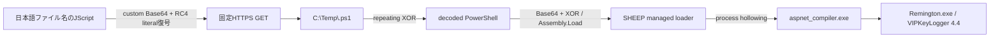
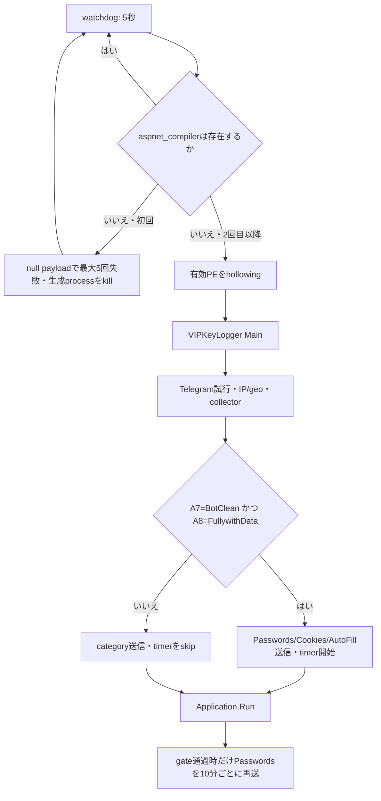

# 全体ロジック

対象SHA-256: `d97dae8f8aafa75dd7c13e3b3018cbb3667bb8d990bd4fac1aee54ad492a51e6`

## 配布から終端payloadまで

## process lifetime

## active / dormant境界

| 機能 | 今回の状態 | 根拠 |
|---|---|---|
| JScript downloadとPowerShell起動 | active | 静的call path + Triage process/HTTP |
| PowerShell watchdog | active | 無限loop、5秒sleep、Triage 6 host process |
| process hollowing | active | loader CIL + WriteProcessMemory/SetThreadContext観測 |
| browser process kill | active | Main direct call、4 process name |
| anti-bot `0x060000A7` | active | 5 profile値（1値は重複比較）/`WALKER`を比較しBotDetected/BotCleanを返す |
| empty-data `0x060000A8` | active | 10 aggregate fieldからNoData/FullywithDataを返す |
| Passwords/Cookies/AutoFill回収・送信 | active_conditional | collectorは先行。A7 clean + A8 dataありのときだけ3 senderへ進む |
| password 10分timer | active_conditional | 同じ2 gate通過時だけtimer startし`600000`を設定 |
| Telegram startup notice | activeだが失敗 | Main direct path、未設定token/chat ID、Triage 404 |
| keylogger | dormant | 完全なhook codeはあるがstarterへMain到達なし |
| clipboard/screenshot | dormant | handler codeはあるが対応timer未start |
| Wi-Fi profile recovery | dormant | Mainが呼ぶstubは`ret`、netsh methodへ到達なし |
| CreditCard/History/TopSites/Downloads送信 | dormant | send entrypointが`ret` |
| FTP/HTTP panel | dormant/unconfigured | code branchは存在するが有効設定を確認できない |
| self-delete | dormant | callerなし |
| reboot persistence | absent | Run key/task/service/startup書込みなし |

## terminal communication

terminalにはRAT型のcommand receiver、command ID dispatch、remote shellは確認できません。clientから外部へ環境情報や収集物を送るone-way flowです。SMTP設定値のうちidentity/password/recipientは非公開にし、endpointだけをIOC化しました。

## 安全境界

復元は文字列decode、XOR/Base64、PE/.NET metadataとCILの静的読取りで実施しました。CPU/CILのemulationやsample executionはしていません。後段取得以外の外部接続は行っていません。
