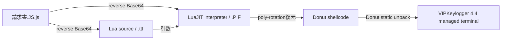
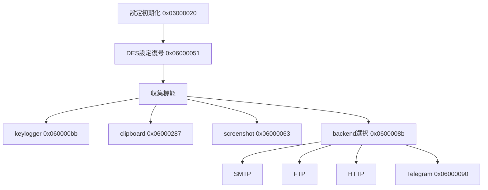
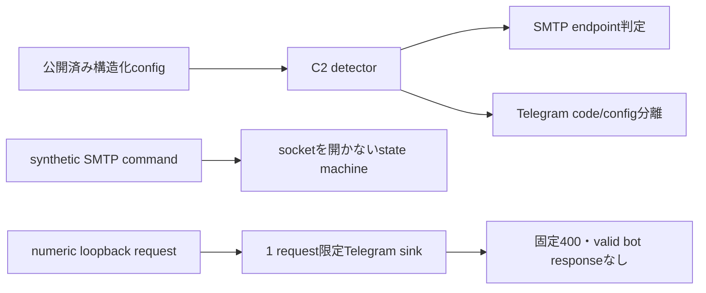

# 全体ロジック

## 配布から終端payloadまで

## terminal内部

## 防御側の安全な再現

## 過去AgentTesla chainとの比較

同一SHA-256のLuaJIT `.PIF` interpreterが過去のAgentTesla配布でも観測されています。ただし今回のLua source、Donut shellcode、managed terminalは別hashです。この一致はloader toolchain共有の証拠であり、terminal familyや配布actorの同一性を単独では証明しません。

## 解析境界

全復元はhash／size／metadataを検証した静的処理です。資格情報、復号済みraw payload、Telegram queryは公開していません。live C2確認は別途明示許可が必要です。
