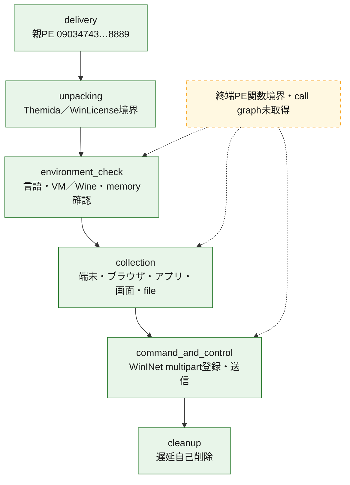
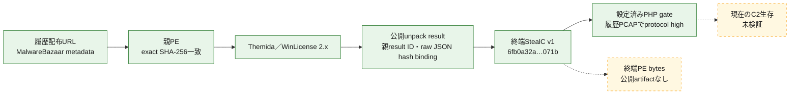
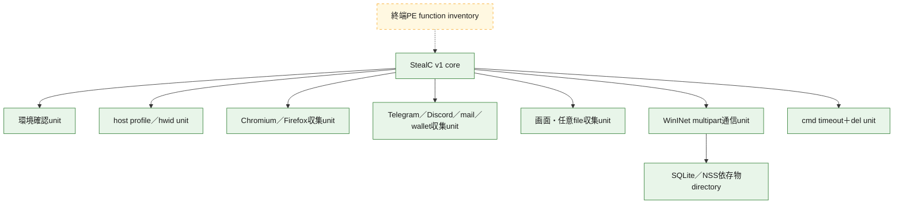

# 全体ロジック：StealC `09034743…8889`

本ケースでは終端StealC v1のhash、設定、処理単位、履歴通信を復元しましたが、終端PE bytesは取得できていません。したがって、処理段階を関数addressやcall graphへ結び付けず、静的証拠の種類と未解決境界を図中で分離します。

## 読み方

- 共通phaseは`delivery`、`unpacking`、`environment_check`、`collection`、`command_and_control`、`cleanup`の順で記載します。
- 実線と緑色ノードはexact hash、静的設定、復号文字列、または同一検体PCAPで観測した関係です。
- 点線と黄色ノードは終端binary不在のため関数単位では未解決、または現在状態を確認していない関係です。
- phase順は復号文字列、設定、既知のStealC v1処理、履歴PCAPから整理した論理順です。関数call順を復元したという意味ではありません。

## 静的可視化

### 実行フロー

### 感染チェーン

### モジュール関係

## 共通phase

| 順序 | phase ID | 入力 | 処理 | 出力 | 証拠境界 |
|---:|---|---|---|---|---|
| 1 | `delivery` | 履歴配布URL | 保護済みx86 PEを配布 | 親PE | URLはprovider metadata。今回は未接続 |
| 2 | `unpacking` | 親PE | Themida／WinLicense実行時展開 | 終端StealC v1 | exact-root公開unpack resultでidentityをbind。bytes未取得 |
| 3 | `environment_check` | host情報 | 言語、VM／Wine、memory条件を評価 | 継続／終了判断 | 復号文字列からの処理単位。関数未同定 |
| 4 | `collection` | user profile、browser DB、application data | 認証情報、Cookie、履歴、session、wallet、画面、任意fileを収集 | 送信用データ | API、SQL、pathの復号文字列。関数未同定 |
| 5 | `command_and_control` | `hwid`、`build`、収集物 | PHP gateへmultipart POST | `block`または未復元の成功応答 | 2024年PCAPで履歴high。現在生存ではない |
| 6 | `cleanup` | 実行file path | `cmd timeout`後に`del` | 自己削除 | 復号文字列からの処理単位。実行未確認 |

## 2軸比較

| 比較対象 | 実装・通信ロジック軸 | 証拠・復元可能性軸 |
|---|---|---|
| 本ケース | v1 multipart `hwid`／`build`、PHP gate、`block`応答 | exact root、provider ID、raw JSON hash、Triage task、PCAP hashをbind。終端bytesなし |
| `e978871a…25b8d` | 同じv1 multipart schema、異なるbotnet ID／C2 | 終端PEからBase64＋RC4設定を直接復元でき、関数比較へ進める余地あり |
| StealC v2 | JSON operationとRC4を用いる別protocol | v1 PCAP detectorを流用せず、v2専用profileと成功応答schemaが必要 |

ロジック軸の類似だけでは同一キャンペーンと判定しません。証拠軸では、終端bytesの有無とroot-to-artifact bindingを分けて評価します。

## 観測したcall関係

- 終端PE bytesがないため、関数間の直接call edgeは0件です。
- 上図の実線は処理単位・artifact・通信の証拠関係であり、逆コンパイル済みcall graphではありません。

## 制約

- 終端PEの関数境界、逆コンパイル、function hash、code similarityは`function_analysis_required`です。
- 履歴PCAPのhigh-confidence matchを現在稼働や能動C2確認へ昇格していません。
- 検体実行、C2接続、配布URL接続は行っていません。
