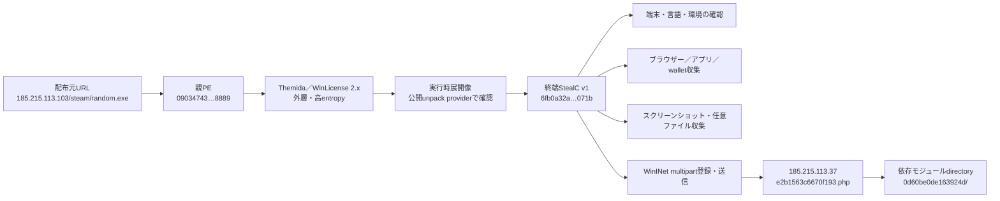
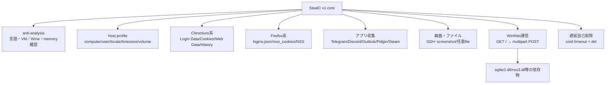
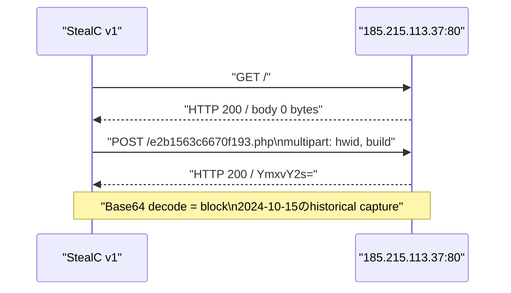

# StealC ケース `09034743ead73365c3077a85036d69c4ef0b0c19bba669db7cd53814b9308889`

## 結論

Themida／WinLicense で保護された親検体そのものから終端コードを復元することはできませんでしたが、親 SHA-256、公開unpack result ID、raw JSON SHA-256を相互検証し、終端 StealC v1 の SHA-256、設定、C2、依存モジュールパス、botnet ID を復元しました。同一親検体の公開 Triage PCAP では、root／sample／task／PCAP SHA-256に加え、静的 `config.json` の SHA-256と終端payload SHA-256を固定した上で、復元 C2 に対する `hwid`／`build` multipart 登録と Base64 の `block` 応答が残っていました。この履歴high-confidence判定は、repository内の固定review台帳に登録したreview IDとの完全一致を必須とし、CLI呼び出し側による証拠digestの自己申告では成立しません。公開する機械可読結果からはsandbox端末側のIPアドレスと一時ポートを除外しています。

終端 hash・config・C2・過去のプロトコルは復元済みです。一方、終端 PE bytes は公開経路から取得できず、関数境界、call graph、特徴関数の逆コンパイルは未実施です。このためケース状態は `partial`、`complete=false`、`resumable=true` とします。

| 項目 | 結果 |
|---|---|
| 親 SHA-256 | `09034743ead73365c3077a85036d69c4ef0b0c19bba669db7cd53814b9308889` |
| 親形式 | x86 native PE、1,837,056 bytes、Themida／WinLicense 2.x |
| 終端 SHA-256 | `6fb0a32ab4d483450a0f0d6ec2d39664d479a037f5d4e080f169029f35c8071b` |
| 終端サイズ | 6,914,048 bytes（公開 unpack metadata） |
| 世代 | StealC v1 |
| C2 | `http://185.215.113.37/e2b1563c6670f193.php` |
| 依存モジュール配置先 | `http://185.215.113.37/0d60be0de163924d/` |
| botnet ID | `doma` |
| 復号済み文字列 | 353件。全件はprivate archive、公開側は要約のみ |
| 復号文字列の正規化SHA-256 | `553e09d4293d6f5416ee9a87d4976635fbb1cc2417fd7402ba41f92c2624b686` |
| C2プロトコル | multipart `hwid`／`build`、HTTP 200、Base64 `block` の履歴high-confidence match |
| 現在の生存 | 未検証。過去PCAPの確認を現在の生存へ読み替えない |

## 実行・感染チェーン

配布元 URL は MalwareBazaar の対象レコードに付属する履歴情報です。今回その URL へは接続していません。

## 内包モジュールと役割

この図は公開 unpack 結果の353件の復号文字列、API名、SQL文、設定値から構成した処理単位です。終端 PE bytes がないため、各箱を特定の関数アドレスへ結び付けてはいません。

## C2シーケンス

`block` はsandbox端末を拒否した応答と解釈できますが、登録成功時の応答やtask schemaはこの通信に含まれません。そのため能動C2 profileは作らず、`protocol_profile_required` としてfail closedにしています。

## 類似検体との比較

| 比較軸 | 本ケース | `e978871a…25b8d` | StealC v2 |
|---|---|---|---|
| 世代 | v1 | v1 | v2以降 |
| 設定復元 | 公開unpack providerの終端結果 | 終端PEからBase64＋RC4 skip-keyを直接復元 | JSON＋RC4の別profile |
| C2 | IP＋ランダムPHP gate | IP＋ランダムPHP gate | JSON operation endpoint |
| 初回登録 | multipart `hwid`／`build` | 同じv1 field schemaを静的確認 | `type=create`、`hwid`、`build` |
| botnet/build | `doma` | `GoogleMaps` | build依存 |
| 関数比較 | 終端bytes不在のため未実施 | 復号configあり | v1と直接同一視しない |

本ケースと `e978871a…25b8d` は同じ v1 の設定・通信schemaを共有しますが、botnet ID、C2、設定復元経路が異なります。この一致だけで同一攻撃キャンペーンとは判定しません。v2用のRC4／JSON能動profileをv1へ流用しないことが重要です。

## 静的解析で確認した挙動

- VirtualBox ACPI、BIOS、Wine、言語、memory／NUMA allocationを使うanti-analysis／環境確認。
- ChromiumブラウザのLogin Data、Cookies、Web Data、Historyと、FirefoxのNSS／logins.json／moz_cookiesを対象とする認証情報・Cookie・履歴・カード情報収集。
- Telegram、Discord、Outlook、Pidgin、Steam、暗号資産walletを対象とするアプリケーション情報収集。
- GDI／GDI+による画面キャプチャ（screenshot）、任意ファイル収集、依存DLLの利用。
- WinINetのnetwork_accessによるHTTP通信、multipart `hwid`／`build`登録、収集物送信に使う`token`／`file_name`／`file`／`message` field。
- `cmd.exe /c timeout /t 5 ... del` による遅延自己削除。

共通phase、実線／点線の証拠境界、2軸比較は[OVERALL-LOGIC.md](OVERALL-LOGIC.md)、処理単位は[STATIC-LOGIC.md](STATIC-LOGIC.md)、取得試行は[TRIAGE.md](TRIAGE.md)、C2の機械可読判定は[c2-analysis.json](c2-analysis.json)を参照してください。

## OSINT上の位置付け

StealCは2023年から犯罪フォーラムで販売されたcommodity infostealer／MaaSで、特定の単一アクター専用ではありません。本ケースはMalwareBazaar上でAmadeyによるdrop関係が記録されており、配布サービスとの組み合わせを示しますが、運用者の帰属までは確定できません。StealC v1ではHTTPとPHP gateが使われ、v2ではJSON／RC4を含むprotocol変更が報告されています。

## 根拠と制約

- [MalwareBazaar exact hash](https://bazaar.abuse.ch/sample/09034743ead73365c3077a85036d69c4ef0b0c19bba669db7cd53814b9308889/)
- [Triageのexact-hash解析レポート](https://tria.ge/241015-hj7k5szgrf)
- [UnpacMe公開unpack結果](https://www.unpac.me/results/eeafa223-c8a3-4f7f-b208-9d6bcb450398/)
- [HPE Threat Labsによる解説：StealC Malware](https://community.hpe.com/t5/hpe-threat-labs/stealc-malware/ba-p/7267253)
- [Proofpointによる解説：StealC You Later](https://www.proofpoint.com/us/blog/threat-insight/stealc-you-later-proofpoint-and-ibm-x-force-support-operation-endgame)

検体はローカルで実行していません。復元C2、配布元URL、依存モジュールURLへ接続していません。PCAPは既存の公開sandbox実行をオフライン解析したもので、現在のC2生存や同じ運用者の継続を示しません。
