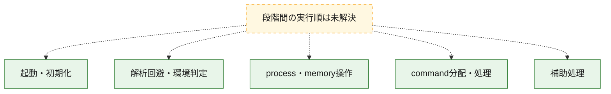
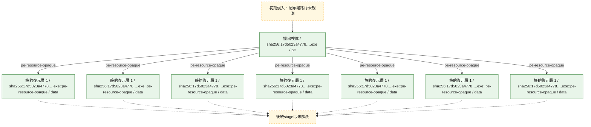
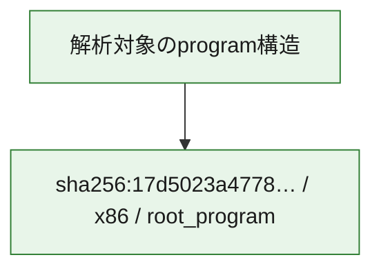

# 全体ロジック：17d5023a4778003af6f2d2a02d9e8b3719b9a3c78e314a25b5652e965e95906c

代表関数の静的証跡から、起動・初期化、解析回避・環境判定、process・memory操作、command分配・処理の処理群を確認しました。

## 読み方

- phaseの掲載順は解析上の整理順です。observed_call_edgesがない段階間の実行順を断定しません。
- 図の実線は静的に観測した関係、点線と黄色のノードは未観測・未解決の関係を示します。
- 図は静的な要約であり、動的実行を再現するものではありません。
- 詳細な関数解説とfingerprintは[STATIC-LOGIC.md](STATIC-LOGIC.md)を参照してください。

## 静的可視化

### 実行フロー

### 感染チェーン

### モジュール関係

## 処理段階

### 1. 起動・初期化

entry pointから初期化と後続処理への移行を確認します。
確度: `confirmed_static_function_evidence`

- `17d5023a4778003af6f2d2a02d9e8b3719b9a3c78e314a25b5652e965e95906c:ghidra:140003938` — 初期化と主要処理への分岐を行う入口関数です。 状態: `succeeded`、選定理由: `entry_point`, `meaningful_symbol_name`, `reviewed_call_centrality:22`, `role:entrypoint`

### 2. 解析回避・環境判定

debugger、sandbox、仮想環境、時間差などの判定を確認します。
確度: `confirmed_static_function_evidence`

- `17d5023a4778003af6f2d2a02d9e8b3719b9a3c78e314a25b5652e965e95906c:ghidra:140002530` — debugger、仮想環境、sandbox、または時間差の確認に関係する関数です。 状態: `succeeded`、選定理由: `context_representative`, `reviewed_call_centrality:20`, `role:anti_analysis`

### 3. process・memory操作

process、thread、module、memory操作と実行移行を確認します。
確度: `confirmed_static_function_evidence_with_limits`

- `17d5023a4778003af6f2d2a02d9e8b3719b9a3c78e314a25b5652e965e95906c:ghidra:140001000` — process、thread、module、またはmemory操作に関係する関数です。 状態: `succeeded`、選定理由: `context_representative`, `reviewed_call_centrality:3`, `role:process_or_memory_operation`
- `17d5023a4778003af6f2d2a02d9e8b3719b9a3c78e314a25b5652e965e95906c:ghidra:140001210` — process、thread、module、またはmemory操作に関係する関数です。 状態: `succeeded`、選定理由: `context_representative`, `reviewed_call_centrality:9`, `role:process_or_memory_operation`
- `17d5023a4778003af6f2d2a02d9e8b3719b9a3c78e314a25b5652e965e95906c:ghidra:140001760` — process、thread、module、またはmemory操作に関係する関数です。 状態: `succeeded`、選定理由: `context_representative`, `reviewed_call_centrality:12`, `role:process_or_memory_operation`
- `17d5023a4778003af6f2d2a02d9e8b3719b9a3c78e314a25b5652e965e95906c:ghidra:140001ae0` — process、thread、module、またはmemory操作に関係する関数です。 状態: `succeeded`、選定理由: `context_representative`, `reviewed_call_centrality:12`, `role:process_or_memory_operation`
- `17d5023a4778003af6f2d2a02d9e8b3719b9a3c78e314a25b5652e965e95906c:ghidra:140003390` — process、thread、module、またはmemory操作に関係する関数です。 状態: `limited_bad_instruction_or_flow`、選定理由: `context_representative`, `reviewed_call_centrality:12`, `role:process_or_memory_operation`
- `17d5023a4778003af6f2d2a02d9e8b3719b9a3c78e314a25b5652e965e95906c:ghidra:1400033c4` — process、thread、module、またはmemory操作に関係する関数です。 状態: `succeeded`、選定理由: `context_representative`, `reviewed_call_centrality:5`, `role:process_or_memory_operation`
- `17d5023a4778003af6f2d2a02d9e8b3719b9a3c78e314a25b5652e965e95906c:ghidra:1400034ac` — process、thread、module、またはmemory操作に関係する関数です。 状態: `succeeded`、選定理由: `context_representative`, `reviewed_call_centrality:6`, `role:process_or_memory_operation`
- `17d5023a4778003af6f2d2a02d9e8b3719b9a3c78e314a25b5652e965e95906c:ghidra:14000364c` — process、thread、module、またはmemory操作に関係する関数です。 状態: `succeeded`、選定理由: `context_representative`, `reviewed_call_centrality:6`, `role:process_or_memory_operation`
- `17d5023a4778003af6f2d2a02d9e8b3719b9a3c78e314a25b5652e965e95906c:ghidra:1400036c0` — process、thread、module、またはmemory操作に関係する関数です。 状態: `succeeded`、選定理由: `context_representative`, `reviewed_call_centrality:12`, `role:process_or_memory_operation`

### 4. command分配・処理

受信commandやtaskの解釈、分配、個別handlerへの移行を確認します。
確度: `confirmed_static_function_evidence_with_limits`

- `17d5023a4778003af6f2d2a02d9e8b3719b9a3c78e314a25b5652e965e95906c:ghidra:1400037c4` — commandの解釈、分配、または個別処理を担当する関数です。 状態: `succeeded`、選定理由: `context_representative`, `reviewed_call_centrality:21`, `role:command_dispatch_or_handler`
- `17d5023a4778003af6f2d2a02d9e8b3719b9a3c78e314a25b5652e965e95906c:ghidra:14000e5c0` — commandの解釈、分配、または個別処理を担当する関数です。 状態: `limited_bad_instruction_or_flow`、選定理由: `meaningful_symbol_name`, `reviewed_call_centrality:2`, `role:command_dispatch_or_handler`

### 5. 補助処理

主要処理を支える一般内部関数またはlibrary処理を確認します。
確度: `confirmed_static_function_evidence`

- `17d5023a4778003af6f2d2a02d9e8b3719b9a3c78e314a25b5652e965e95906c:ghidra:140001010` — 検体内部の一般処理を実装する関数です。 状態: `succeeded`、選定理由: `context_representative`, `reviewed_call_centrality:4`
- `17d5023a4778003af6f2d2a02d9e8b3719b9a3c78e314a25b5652e965e95906c:ghidra:140001a10` — 検体内部の一般処理を実装する関数です。 状態: `succeeded`、選定理由: `context_representative`, `reviewed_call_centrality:4`
- `17d5023a4778003af6f2d2a02d9e8b3719b9a3c78e314a25b5652e965e95906c:ghidra:140001a80` — 検体内部の一般処理を実装する関数です。 状態: `succeeded`、選定理由: `context_representative`, `reviewed_call_centrality:3`
- `17d5023a4778003af6f2d2a02d9e8b3719b9a3c78e314a25b5652e965e95906c:ghidra:1400022b0` — 検体内部の一般処理を実装する関数です。 状態: `succeeded`、選定理由: `context_representative`, `reviewed_call_centrality:2`
- `17d5023a4778003af6f2d2a02d9e8b3719b9a3c78e314a25b5652e965e95906c:ghidra:1400022f0` — 検体内部の一般処理を実装する関数です。 状態: `succeeded`、選定理由: `context_representative`, `reviewed_call_centrality:3`
- `17d5023a4778003af6f2d2a02d9e8b3719b9a3c78e314a25b5652e965e95906c:ghidra:1400031a0` — 検体内部の一般処理を実装する関数です。 状態: `succeeded`、選定理由: `entry_point`, `meaningful_symbol_name`
- `17d5023a4778003af6f2d2a02d9e8b3719b9a3c78e314a25b5652e965e95906c:ghidra:140003344` — 検体内部の一般処理を実装する関数です。 状態: `succeeded`、選定理由: `context_representative`, `reviewed_call_centrality:6`
- `17d5023a4778003af6f2d2a02d9e8b3719b9a3c78e314a25b5652e965e95906c:ghidra:140003498` — 検体内部の一般処理を実装する関数です。 状態: `succeeded`、選定理由: `context_representative`, `reviewed_call_centrality:2`
- `17d5023a4778003af6f2d2a02d9e8b3719b9a3c78e314a25b5652e965e95906c:ghidra:140003548` — 検体内部の一般処理を実装する関数です。 状態: `succeeded`、選定理由: `context_representative`, `reviewed_call_centrality:7`
- `17d5023a4778003af6f2d2a02d9e8b3719b9a3c78e314a25b5652e965e95906c:ghidra:1400035b8` — 検体内部の一般処理を実装する関数です。 状態: `succeeded`、選定理由: `context_representative`, `reviewed_call_centrality:9`
- `17d5023a4778003af6f2d2a02d9e8b3719b9a3c78e314a25b5652e965e95906c:ghidra:14000362c` — 検体内部の一般処理を実装する関数です。 状態: `succeeded`、選定理由: `context_representative`, `reviewed_call_centrality:1`
- `17d5023a4778003af6f2d2a02d9e8b3719b9a3c78e314a25b5652e965e95906c:ghidra:1400036e0` — 検体内部の一般処理を実装する関数です。 状態: `succeeded`、選定理由: `context_representative`, `reviewed_call_centrality:20`
- `17d5023a4778003af6f2d2a02d9e8b3719b9a3c78e314a25b5652e965e95906c:ghidra:140003798` — 検体内部の一般処理を実装する関数です。 状態: `succeeded`、選定理由: `context_representative`, `reviewed_call_centrality:1`
- `17d5023a4778003af6f2d2a02d9e8b3719b9a3c78e314a25b5652e965e95906c:ghidra:1400037a8` — 検体内部の一般処理を実装する関数です。 状態: `succeeded`、選定理由: `context_representative`, `reviewed_call_centrality:6`
- `17d5023a4778003af6f2d2a02d9e8b3719b9a3c78e314a25b5652e965e95906c:ghidra:14000394c` — 検体内部の一般処理を実装する関数です。 状態: `succeeded`、選定理由: `context_representative`, `reviewed_call_centrality:1`
- `17d5023a4778003af6f2d2a02d9e8b3719b9a3c78e314a25b5652e965e95906c:ghidra:1400039a8` — 検体内部の一般処理を実装する関数です。 状態: `succeeded`、選定理由: `context_representative`, `reviewed_call_centrality:1`
- `17d5023a4778003af6f2d2a02d9e8b3719b9a3c78e314a25b5652e965e95906c:ghidra:140003a04` — 検体内部の一般処理を実装する関数です。 状態: `succeeded`、選定理由: `context_representative`, `reviewed_call_centrality:1`
- `17d5023a4778003af6f2d2a02d9e8b3719b9a3c78e314a25b5652e965e95906c:ghidra:140003a4c` — 検体内部の一般処理を実装する関数です。 状態: `succeeded`、選定理由: `context_representative`, `reviewed_call_centrality:2`
- `17d5023a4778003af6f2d2a02d9e8b3719b9a3c78e314a25b5652e965e95906c:ghidra:140003e10` — 検体内部の一般処理を実装する関数です。 状態: `succeeded`、選定理由: `meaningful_symbol_name`, `reviewed_call_centrality:1`

## 観測したcall関係

- 代表関数間で直接解決できた呼出関係はありません。

## 解析範囲と制約

- 選定外関数は全体inventoryへ残しますが、関数本体の個別解説対象にはしていません。
- indirect call、難読化、packer、VM、壊れたcontrol flowによりcall関係が欠落する場合があります。
- 文書は静的解析に基づき、検体実行や外部通信による動的確認は行っていません。
