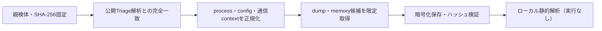

# Triage公開解析・後段取得証跡

## 完全ハッシュ一致

- [260919-ylrwgawbkh](https://tria.ge/260919-ylrwgawbkh): ファミリー候補 `stealc`、評価score `10`

## プロセス・通信

- 観測process: `AutoIt3.exe, Win_Pack.exe, at.exe`
- raw commandは保存せず、command SHA-256と処理patternだけをJSONへ保持します。
- sandbox background trafficは`context_only`であり、C2へ自動昇格しません。

- `http://160.20.109.59/`（sandbox config候補）

## 後段取得物

- `7844a499ea3a17b0b42679ceae0df508ffa8ed0874144ac7ce6d3d9ac7f14cbc` / `memory_image` / 745472 bytes / 親と同一: `false` / 静的解析: `未実施`
- `a14cd0848db264696f40a39a6b9f8e67291f854d5be9f576342d7c3ebf4b4063` / `memory_image` / 2052096 bytes / 親と同一: `false` / 静的解析: `未実施`
- `204c1a7ce9c095a7f2c94e903b36bc0472cc62650618a6da475a1fe4cd1bb49e` / `memory_image` / 4096 bytes / 親と同一: `false` / 静的解析: `partial`
- `6c563af6289ea521d4638b6d7cd8125249bbaff02be604a26c688105e611b520` / `memory_image` / 745472 bytes / 親と同一: `false` / 静的解析: `未実施`
- `4228979088c11a2cb89bfe9eae73dfc9524407bcd1d6be603bcb9a4a82af3f2b` / `memory_image` / 745472 bytes / 親と同一: `false` / 静的解析: `未実施`
- `101c3d88a61a59cf5bf7bb5db277b47ab2bf754838e739a388d850ba9bcc271a` / `memory_image` / 745472 bytes / 親と同一: `false` / 静的解析: `未実施`
- `3bd3413595c6b664c992cad2090b18ec6f17cdc9d12b53e2293f819bf3dfbff7` / `memory_image` / 745472 bytes / 親と同一: `false` / 静的解析: `未実施`
- `e0e9044beb123f3546b6c04d15d5821ccb04a66ffa1da02daa535181758ef9a5` / `memory_image` / 745472 bytes / 親と同一: `false` / 静的解析: `未実施`
- `aad6fbc176740bd440142e2077f2ace18759233610587f26769b7192d1d4100a` / `memory_image` / 745472 bytes / 親と同一: `false` / 静的解析: `未実施`
- `50c7370b2143184e9412d53193b1d3c41e67bc68905862c70d093032ff8eba21` / `memory_image` / 745472 bytes / 親と同一: `false` / 静的解析: `未実施`
- `2b2f6dd76f7a1dd29134f05dca8a324d49bb861128b20218eb6784b9a3556d60` / `memory_image` / 745472 bytes / 親と同一: `false` / 静的解析: `未実施`
- `368956815d409232775149d9a9566ab33af1038bb6ba0d7e18037f38bab09662` / `memory_image` / 745472 bytes / 親と同一: `false` / 静的解析: `未実施`
- `d8a826b44bde960c9002c4273655a116cec5cef157e3cac2e4d61559cffda9aa` / `memory_image` / 745472 bytes / 親と同一: `false` / 静的解析: `未実施`

## 判定境界

Triage由来のfamily、process、config、通信は外部sandbox証跡です。Config extractorが返したendpointはC2候補として扱いますが、静的設定復元またはprocess帰属とprotocol応答が揃うまでは確認済みC2とはしません。取得成果物と検体は実行していません。
