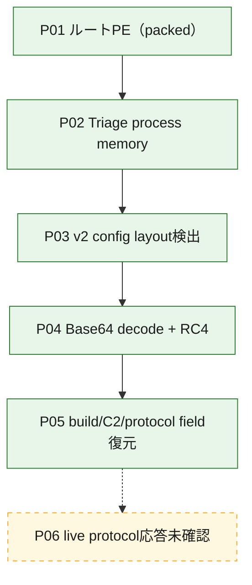
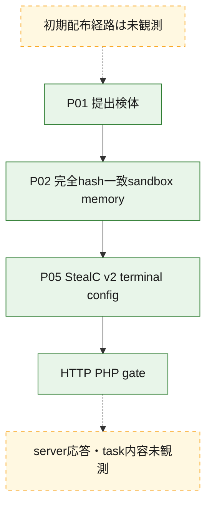

# 全体ロジック：2722e3fa2347b1a5c39b44773baa719a3bf1414b82814b780a5872e21cd3c9ca

完全SHA-256一致の公開sandbox memoryからStealC v2の終端payload、設定、文字列table、HTTP gateを静的に復元しました。終端未取得gapは解消済みで、server protocol応答だけが未確認です。

## 読み方

- 実線はartifact provenanceと静的復元関係、点線は未観測の配布経路とlive protocol確認です。
- 復号鍵の生値は公開せず、[復元設定](config.json)にSHA-256指紋だけを記録します。

## 静的可視化

### 実行フロー

### 感染チェーン

### モジュール関係

```mermaid
flowchart LR
  m01["memory image"] --> m02["v2 layout detector"]
  m02 --> m03["Base64 decoder"]
  m03 --> m04["RC4 string decryptor"]
  m04 --> m05["config normalizer"]
  m05 --> m06["bounded registration profile"]
  m06 -.-> m07["live probe未実行"]
  class m01,m02,m03,m04,m05,m06 confirmed
  class m07 unresolved
  classDef confirmed fill:#e8f5e9,stroke:#2e7d32,color:#1b1b1b
  classDef unresolved fill:#fff8e1,stroke:#f9a825,color:#1b1b1b,stroke-dasharray:5 5
```

## 処理段階

1. memoryの`.rdata`相当領域からbuild、key形式、連続Base64 blobを検証しました。
2. 復号tableからC2、gate、`create`、`loader`、応答fieldを分離しました。
3. 2026-08-11のTCP確認はtimeoutで、payloadは送信していません。

## 比較プロファイルと他ケースとの比較

- `x64 v2 memory layout`と`create→token→loader`の2軸がStealC v2と整合します。
- v1のBase64/RC4-skipやx86 paired-XOR handlerとは別patternです。
- 同じendpointや単一文字列だけでcampaign同一性を判定しません。
