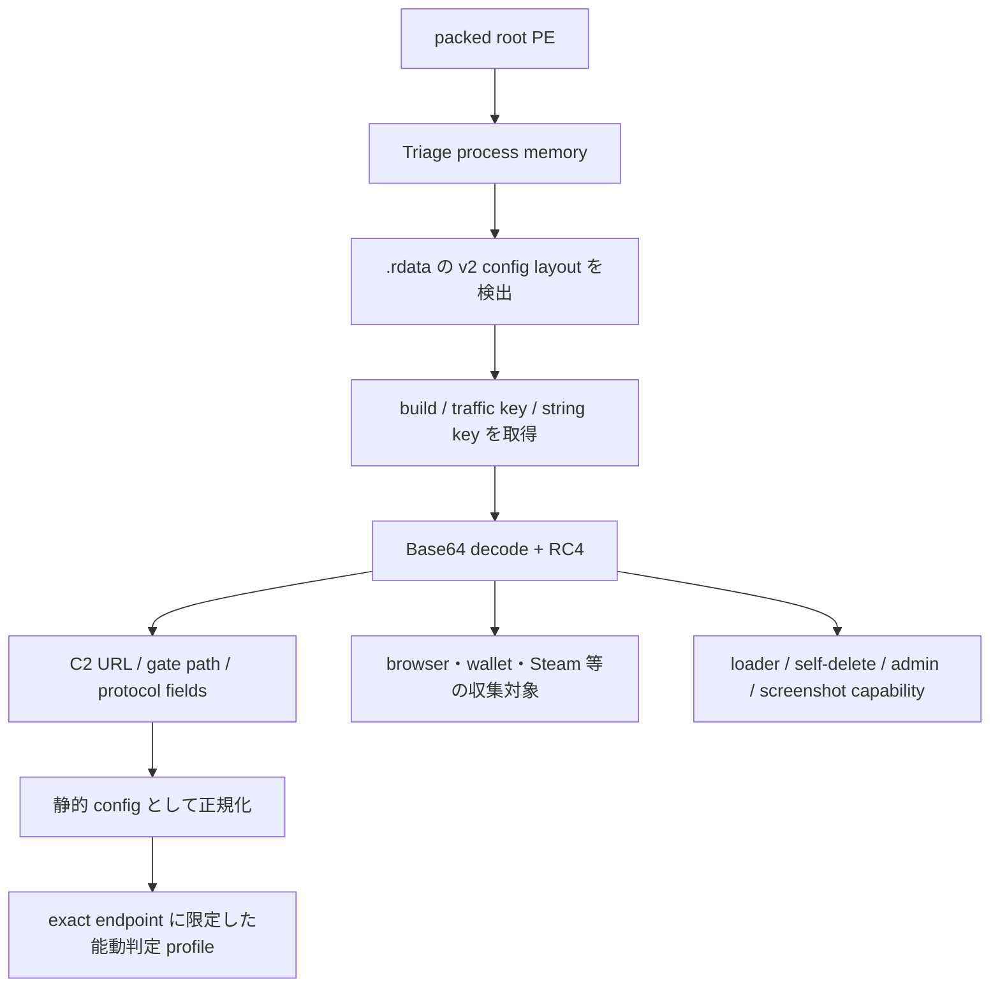

# StealC v2 静的追加解析

## 結論

ルート PE からは設定を復元できなかったが、Triage で取得済みのプロセスメモリを静的に解析し、StealC v2 系の build、通信 RC4 key、C2、gate path、暗号化文字列テーブルを復元した。既存 extractor は StealC v1 の Base64/RC4-skip と x86 の paired-XOR のみを対象としていたため、本検体の x64 v2 memory layout を処理できなかった。

| 項目 | 値 |
|---|---|
| ルート SHA-256 | `2722e3fa2347b1a5c39b44773baa719a3bf1414b82814b780a5872e21cd3c9ca` |
| メモリ SHA-256 | `5904a6b90c5558cebb2e5bec443e33e9269d13fba0f130ab8f9deaebe31b0e55` |
| Build / botnet | `8172045377` |
| C2 base URL | `http://77.110.119.94` |
| Gate path | `/ce369e7324834845.php` |
| Traffic RC4 key SHA-256 | `ab1783e8ee1d795c5ada05d447f7f0139dbe51bcec45a5ea55124cccc4c71dfd` |
| 文字列テーブル key SHA-256 | `5596d856fc820bfa72955dddd16ff3d97761995f1474673ca21c17a22a3f05ac` |
| 復号文字列数 | `276` |
| 設定オフセット | `510264` |

静的文字列テーブルの復号keyとネットワーク通信keyは別物です。生値は公開せず、それぞれのSHA-256指紋だけを記録します。

## 復元ロジック

メモリ内 `.rdata` の build、16 進 traffic key、文字列 key、その後に連続する Base64 blob という配置を検出する。各 blob を標準 Base64 decode した後、標準 RC4 で復号する。単一 marker だけで判定せず、次を独立に検証する。

- build が10進数字として妥当
- traffic key が固定長の16進表現
- 復号表に C2 URL、PHP path、protocol field がそろう
- `create`、`hwid`、`build`、`access_token`、`loader`、`success` が同一 table に存在
- WinHTTP、browser/credential collection、loader capability の文字列群が整合

## 代表関数

Ghidra MCP では常に明示的な program selector を使用し、任意 script や sample 実行は行っていない。

| 関数 | 役割 |
|---|---|
| `FUN_14000379c` | 暗号化文字列の global 初期化。対象範囲内で多数の direct reference を持つ |
| `FUN_140008cc4` | C 文字列から `std::string` 相当への変換 |
| `FUN_140008a34` | Base64 decode 後に global key で RC4 復号 |
| `FUN_140020fc8` | Base64 decoder |
| `FUN_140020bf8` | 標準 RC4 KSA/PRGA |
| `FUN_140008c78` | 復号文字列を global へ格納 |
| `FUN_140008df0` | 文字列 object の cleanup |
| `FUN_14001af9c` | WinHTTP 系の request/download/response 処理 wrapper。登録処理そのものとまでは断定しない |

## 2026-08-11 live確認

`77.110.119.94:80`へのTCP接続はtimeoutでした。payloadは送信せず、protocolは未確認です。この結果は一時点の到達性であり、C2否定または停止確定には使いません。

## C2プロトコルfingerprint

静的に復元した protocol field と既存の bounded registration probe から、次の二段階通信を検証候補とする。

1. `create`: synthetic UUID の `hwid` と静的 build を送信する。
2. 応答が Base64 + RC4 の JSON で、64～128桁の16進 `access_token` を含む場合だけ、同 token と `type=loader` を1回送る。
3. `opcode=success` と loader list の形だけを確認し、task 本文や token は保存しない。

profile validatorは、base URLをschemeとhost/portだけへ限定し、gateを単一segmentの`/[A-Za-z0-9_-]{1,128}\\.php`へ完全一致させ、結合後も同一hostであることを再検証します。本検体のexact PHP pathはこの境界内です。ただし、完全一致profile、traffic keyのsecret参照、request上限を結合した能動fake-registrationは未実行で、protocol成立を断定しません。今回の静的追加解析では新たな実ネットワーク通信を行っていません。

## 安全な client emulator 設計

状態機械:

`LOADED -> PINNED -> REGISTER_SENT -> TOKEN_VERIFIED -> TASK_POLL_SENT -> TASK_SUMMARIZED -> CLOSED`

入力:

- immutable な sample/config hash
- exact host/IP/path/build
- traffic key の SHA-256 または secret store 参照
- レビュー済み profile ID
- request 数、body size、timeout の上限

出力:

- HTTP status、Content-Type、body hash/size
- token の形状一致 boolean
- task opcode と件数だけを含む要約
- protocol confidence と停止理由

禁止操作:

- task 実行、URL 追従、payload download
- 実ユーザー/実端末の metadata 送信
- token・task 本文の公開ログ出力
- retry loop、常駐、redirect、任意コマンド
- 静的 config に結合されていない endpoint への通信

StealC は対話型 RAT ではなく task service 型であるため、常駐 emulator よりも上記2 request の bounded probe を標準とする。

## 自動化

`extractors/stealc/v2_memory.py` に、メモリ PE の section を境界付きで処理する純粋な offline extractor を追加した。ローカルで sample を起動せず、設定領域と復号文字列テーブルだけを処理する。
