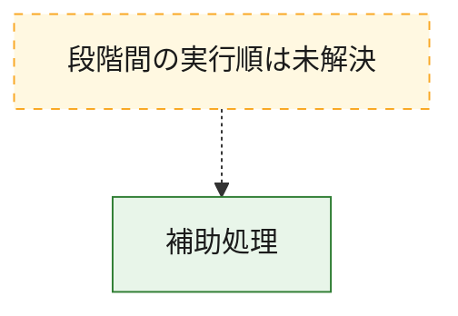
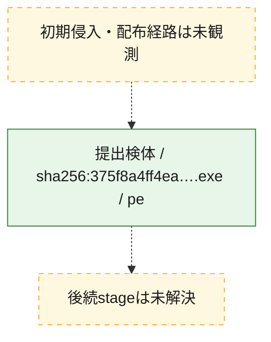
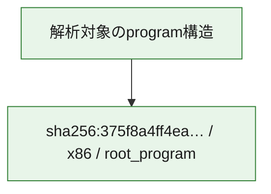

# 全体ロジック：375f8a4ff4eafe485b210a9ffb6a84bdbdb9c52ae602293ddae53717935e8daa

代表関数から主要なmalware処理段階を自動分類できませんでした。

## 読み方

- phaseの掲載順は解析上の整理順です。observed_call_edgesがない段階間の実行順を断定しません。
- 図の実線は静的に観測した関係、点線と黄色のノードは未観測・未解決の関係を示します。
- 図は静的な要約であり、動的実行を再現するものではありません。
- 詳細な関数解説とfingerprintは[STATIC-LOGIC.md](STATIC-LOGIC.md)を参照してください。

## 静的可視化

### 実行フロー

### 感染チェーン

### モジュール関係

## 処理段階

### 1. 補助処理

主要処理を支える一般内部関数またはlibrary処理を確認します。
確度: `confirmed_static_function_evidence_with_limits`

- `375f8a4ff4eafe485b210a9ffb6a84bdbdb9c52ae602293ddae53717935e8daa:ghidra:00001512` — 検体内部の一般処理を実装する関数です。 状態: `limited_bad_instruction_or_flow`、選定理由: `call_graph_centrality:in=1,out=35`, `large_function:instructions=684`, `reviewed_call_centrality:52`, `reviewed_call_centrality:96`
- `375f8a4ff4eafe485b210a9ffb6a84bdbdb9c52ae602293ddae53717935e8daa:ghidra:00002453` — 検体内部の一般処理を実装する関数です。 状態: `limited_bad_instruction_or_flow`、選定理由: `call_graph_centrality:in=1,out=9`, `large_function:instructions=109`, `reviewed_call_centrality:14`, `reviewed_call_centrality:67`
- `375f8a4ff4eafe485b210a9ffb6a84bdbdb9c52ae602293ddae53717935e8daa:ghidra:00003827` — 検体内部の一般処理を実装する関数です。 状態: `limited_bad_instruction_or_flow`、選定理由: `call_graph_centrality:in=1,out=22`, `large_function:instructions=1373`, `reviewed_call_centrality:28`, `reviewed_call_centrality:55`
- `375f8a4ff4eafe485b210a9ffb6a84bdbdb9c52ae602293ddae53717935e8daa:ghidra:00008bce` — 検体内部の一般処理を実装する関数です。 状態: `limited_bad_instruction_or_flow`、選定理由: `call_graph_centrality:in=0,out=5`, `large_function:instructions=160`, `reviewed_call_centrality:12`, `reviewed_call_centrality:6`
- `375f8a4ff4eafe485b210a9ffb6a84bdbdb9c52ae602293ddae53717935e8daa:ghidra:00009f12` — 検体内部の一般処理を実装する関数です。 状態: `limited_bad_instruction_or_flow`、選定理由: `call_graph_centrality:in=1,out=5`, `reviewed_call_centrality:8`, `reviewed_call_centrality:9`
- `375f8a4ff4eafe485b210a9ffb6a84bdbdb9c52ae602293ddae53717935e8daa:ghidra:0000a46e` — 検体内部の一般処理を実装する関数です。 状態: `limited_bad_instruction_or_flow`、選定理由: `call_graph_centrality:in=1,out=4`, `large_function:instructions=94`, `reviewed_call_centrality:19`, `reviewed_call_centrality:6`
- `375f8a4ff4eafe485b210a9ffb6a84bdbdb9c52ae602293ddae53717935e8daa:ghidra:0000b8a0` — 検体内部の一般処理を実装する関数です。 状態: `limited_bad_instruction_or_flow`、選定理由: `call_graph_centrality:in=1,out=19`, `large_function:instructions=178`, `reviewed_call_centrality:24`, `reviewed_call_centrality:36`
- `375f8a4ff4eafe485b210a9ffb6a84bdbdb9c52ae602293ddae53717935e8daa:ghidra:0000bde3` — 検体内部の一般処理を実装する関数です。 状態: `limited_bad_instruction_or_flow`、選定理由: `call_graph_centrality:in=0,out=5`, `large_function:instructions=182`, `reviewed_call_centrality:12`, `reviewed_call_centrality:7`
- `375f8a4ff4eafe485b210a9ffb6a84bdbdb9c52ae602293ddae53717935e8daa:ghidra:0000e5a6` — 検体内部の一般処理を実装する関数です。 状態: `succeeded`、選定理由: `call_graph_centrality:in=1,out=5`, `large_function:instructions=64`, `reviewed_call_centrality:12`, `reviewed_call_centrality:7`
- `375f8a4ff4eafe485b210a9ffb6a84bdbdb9c52ae602293ddae53717935e8daa:ghidra:00010100` — 検体内部の一般処理を実装する関数です。 状態: `limited_bad_instruction_or_flow`、選定理由: `call_graph_centrality:in=1,out=6`, `reviewed_call_centrality:46`, `reviewed_call_centrality:7`
- `375f8a4ff4eafe485b210a9ffb6a84bdbdb9c52ae602293ddae53717935e8daa:ghidra:000103d0` — 検体内部の一般処理を実装する関数です。 状態: `limited_bad_instruction_or_flow`、選定理由: `call_graph_centrality:in=1,out=6`, `reviewed_call_centrality:20`, `reviewed_call_centrality:8`
- `375f8a4ff4eafe485b210a9ffb6a84bdbdb9c52ae602293ddae53717935e8daa:ghidra:00010670` — 検体内部の一般処理を実装する関数です。 状態: `limited_bad_instruction_or_flow`、選定理由: `call_graph_centrality:in=1,out=7`, `reviewed_call_centrality:16`, `reviewed_call_centrality:9`
- `375f8a4ff4eafe485b210a9ffb6a84bdbdb9c52ae602293ddae53717935e8daa:ghidra:0001097e` — 検体内部の一般処理を実装する関数です。 状態: `limited_bad_instruction_or_flow`、選定理由: `call_graph_centrality:in=1,out=5`, `reviewed_call_centrality:19`, `reviewed_call_centrality:7`
- `375f8a4ff4eafe485b210a9ffb6a84bdbdb9c52ae602293ddae53717935e8daa:ghidra:00010eb9` — 検体内部の一般処理を実装する関数です。 状態: `limited_bad_instruction_or_flow`、選定理由: `call_graph_centrality:in=1,out=4`, `large_function:instructions=91`, `reviewed_call_centrality:12`, `reviewed_call_centrality:6`
- `375f8a4ff4eafe485b210a9ffb6a84bdbdb9c52ae602293ddae53717935e8daa:ghidra:0001115c` — 検体内部の一般処理を実装する関数です。 状態: `limited_bad_instruction_or_flow`、選定理由: `call_graph_centrality:in=1,out=8`, `large_function:instructions=201`, `reviewed_call_centrality:12`, `reviewed_call_centrality:40`
- `375f8a4ff4eafe485b210a9ffb6a84bdbdb9c52ae602293ddae53717935e8daa:ghidra:00011695` — 検体内部の一般処理を実装する関数です。 状態: `limited_bad_instruction_or_flow`、選定理由: `call_graph_centrality:in=1,out=5`, `large_function:instructions=81`, `reviewed_call_centrality:11`, `reviewed_call_centrality:8`
- `375f8a4ff4eafe485b210a9ffb6a84bdbdb9c52ae602293ddae53717935e8daa:ghidra:000128dc` — 検体内部の一般処理を実装する関数です。 状態: `limited_bad_instruction_or_flow`、選定理由: `call_graph_centrality:in=2,out=5`, `reviewed_call_centrality:13`, `reviewed_call_centrality:8`
- `375f8a4ff4eafe485b210a9ffb6a84bdbdb9c52ae602293ddae53717935e8daa:ghidra:00014efa` — 検体内部の一般処理を実装する関数です。 状態: `limited_bad_instruction_or_flow`、選定理由: `call_graph_centrality:in=1,out=9`, `large_function:instructions=179`, `reviewed_call_centrality:13`, `reviewed_call_centrality:15`
- `375f8a4ff4eafe485b210a9ffb6a84bdbdb9c52ae602293ddae53717935e8daa:ghidra:000167d2` — 検体内部の一般処理を実装する関数です。 状態: `succeeded`、選定理由: `call_graph_centrality:in=0,out=6`, `reviewed_call_centrality:11`, `reviewed_call_centrality:7`
- `375f8a4ff4eafe485b210a9ffb6a84bdbdb9c52ae602293ddae53717935e8daa:ghidra:00016afb` — 検体内部の一般処理を実装する関数です。 状態: `limited_bad_instruction_or_flow`、選定理由: `call_graph_centrality:in=1,out=4`, `large_function:instructions=107`, `reviewed_call_centrality:13`, `reviewed_call_centrality:7`
- `375f8a4ff4eafe485b210a9ffb6a84bdbdb9c52ae602293ddae53717935e8daa:ghidra:00016d27` — 検体内部の一般処理を実装する関数です。 状態: `limited_bad_instruction_or_flow`、選定理由: `call_graph_centrality:in=0,out=8`, `large_function:instructions=221`, `reviewed_call_centrality:10`, `reviewed_call_centrality:24`
- `375f8a4ff4eafe485b210a9ffb6a84bdbdb9c52ae602293ddae53717935e8daa:ghidra:0001d425` — 検体内部の一般処理を実装する関数です。 状態: `succeeded`、選定理由: `call_graph_centrality:in=1,out=5`, `reviewed_call_centrality:7`, `reviewed_call_centrality:9`
- `375f8a4ff4eafe485b210a9ffb6a84bdbdb9c52ae602293ddae53717935e8daa:ghidra:000205a2` — 検体内部の一般処理を実装する関数です。 状態: `limited_bad_instruction_or_flow`、選定理由: `call_graph_centrality:in=0,out=7`, `large_function:instructions=128`, `reviewed_call_centrality:10`, `reviewed_call_centrality:21`
- `375f8a4ff4eafe485b210a9ffb6a84bdbdb9c52ae602293ddae53717935e8daa:ghidra:000208e4` — 検体内部の一般処理を実装する関数です。 状態: `limited_bad_instruction_or_flow`、選定理由: `call_graph_centrality:in=2,out=5`, `large_function:instructions=164`, `reviewed_call_centrality:24`, `reviewed_call_centrality:7`
- `375f8a4ff4eafe485b210a9ffb6a84bdbdb9c52ae602293ddae53717935e8daa:ghidra:000250fb` — 検体内部の一般処理を実装する関数です。 状態: `limited_bad_instruction_or_flow`、選定理由: `call_graph_centrality:in=1,out=13`, `large_function:instructions=272`, `reviewed_call_centrality:18`, `reviewed_call_centrality:98`
- `375f8a4ff4eafe485b210a9ffb6a84bdbdb9c52ae602293ddae53717935e8daa:ghidra:00025e78` — 検体内部の一般処理を実装する関数です。 状態: `limited_bad_instruction_or_flow`、選定理由: `call_graph_centrality:in=1,out=6`, `large_function:instructions=128`, `reviewed_call_centrality:11`, `reviewed_call_centrality:21`
- `375f8a4ff4eafe485b210a9ffb6a84bdbdb9c52ae602293ddae53717935e8daa:ghidra:00028743` — 検体内部の一般処理を実装する関数です。 状態: `limited_bad_instruction_or_flow`、選定理由: `call_graph_centrality:in=1,out=6`, `large_function:instructions=175`, `reviewed_call_centrality:28`, `reviewed_call_centrality:8`
- `375f8a4ff4eafe485b210a9ffb6a84bdbdb9c52ae602293ddae53717935e8daa:ghidra:00029713` — 検体内部の一般処理を実装する関数です。 状態: `limited_bad_instruction_or_flow`、選定理由: `call_graph_centrality:in=0,out=13`, `large_function:instructions=180`, `reviewed_call_centrality:23`, `reviewed_call_centrality:27`
- `375f8a4ff4eafe485b210a9ffb6a84bdbdb9c52ae602293ddae53717935e8daa:ghidra:0002a30a` — 検体内部の一般処理を実装する関数です。 状態: `limited_bad_instruction_or_flow`、選定理由: `call_graph_centrality:in=0,out=19`, `large_function:instructions=608`, `reviewed_call_centrality:26`, `reviewed_call_centrality:61`
- `375f8a4ff4eafe485b210a9ffb6a84bdbdb9c52ae602293ddae53717935e8daa:ghidra:0002c86d` — 検体内部の一般処理を実装する関数です。 状態: `limited_bad_instruction_or_flow`、選定理由: `call_graph_centrality:in=1,out=8`, `large_function:instructions=120`, `reviewed_call_centrality:10`, `reviewed_call_centrality:18`
- `375f8a4ff4eafe485b210a9ffb6a84bdbdb9c52ae602293ddae53717935e8daa:ghidra:00034d8f` — 検体内部の一般処理を実装する関数です。 状態: `succeeded`、選定理由: `call_graph_centrality:in=0,out=5`, `large_function:instructions=93`, `reviewed_call_centrality:10`
- `375f8a4ff4eafe485b210a9ffb6a84bdbdb9c52ae602293ddae53717935e8daa:ghidra:00034f17` — 検体内部の一般処理を実装する関数です。 状態: `limited_bad_instruction_or_flow`、選定理由: `call_graph_centrality:in=1,out=5`, `large_function:instructions=100`, `reviewed_call_centrality:11`, `reviewed_call_centrality:16`

## 観測したcall関係

- 代表関数間で直接解決できた呼出関係はありません。

## 解析範囲と制約

- 選定外関数は全体inventoryへ残しますが、関数本体の個別解説対象にはしていません。
- indirect call、難読化、packer、VM、壊れたcontrol flowによりcall関係が欠落する場合があります。
- 文書は静的解析に基づき、検体実行や外部通信による動的確認は行っていません。
