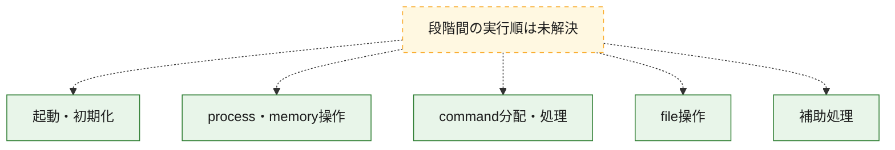
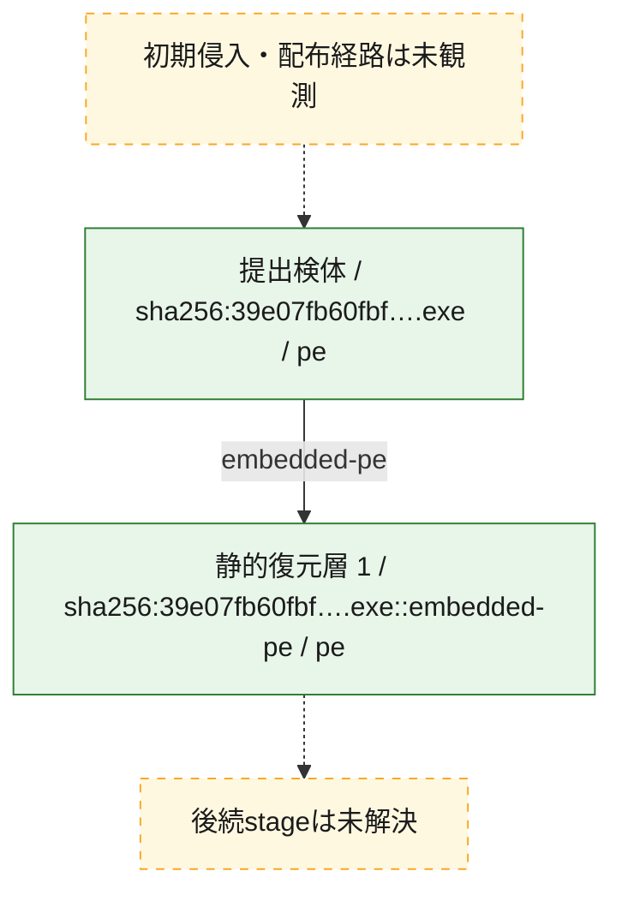
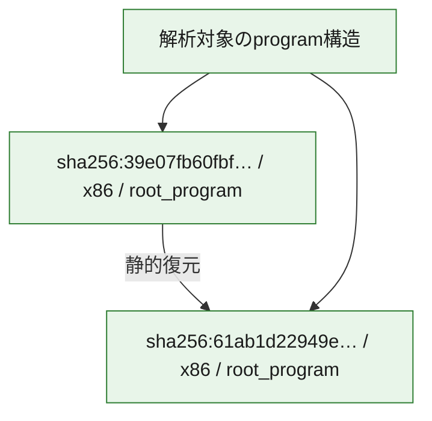

# 全体ロジック：39e07fb60fbf206b06d1b5b2b74848d9d393c6bd66fd11e003436cd7ee6b5788

代表関数の静的証跡から、起動・初期化、process・memory操作、command分配・処理、file操作の処理群を確認しました。

## 読み方

- phaseの掲載順は解析上の整理順です。observed_call_edgesがない段階間の実行順を断定しません。
- 図の実線は静的に観測した関係、点線と黄色のノードは未観測・未解決の関係を示します。
- 図は静的な要約であり、動的実行を再現するものではありません。
- 詳細な関数解説とfingerprintは[STATIC-LOGIC.md](STATIC-LOGIC.md)を参照してください。

## 静的可視化

### 実行フロー

### 感染チェーン

### モジュール関係

## 処理段階

### 1. 起動・初期化

entry pointから初期化と後続処理への移行を確認します。
確度: `confirmed_static_function_evidence`

- `61ab1d22949eac0582e989ae065ec4caee9ac99998276317edda96735cd311fb:ghidra:140002dac` — 初期化と主要処理への分岐を行う入口関数です。 状態: `succeeded`、選定理由: `entry_point`, `meaningful_symbol_name`, `reviewed_call_centrality:22`, `role:entrypoint`

### 2. process・memory操作

process、thread、module、memory操作と実行移行を確認します。
確度: `confirmed_static_function_evidence`

- `61ab1d22949eac0582e989ae065ec4caee9ac99998276317edda96735cd311fb:ghidra:14000148c` — process、thread、module、またはmemory操作に関係する関数です。 状態: `succeeded`、選定理由: `context_representative`, `reviewed_call_centrality:37`, `role:process_or_memory_operation`
- `61ab1d22949eac0582e989ae065ec4caee9ac99998276317edda96735cd311fb:ghidra:140002940` — process、thread、module、またはmemory操作に関係する関数です。 状態: `succeeded`、選定理由: `context_representative`, `reviewed_call_centrality:11`, `role:process_or_memory_operation`

### 3. command分配・処理

受信commandやtaskの解釈、分配、個別handlerへの移行を確認します。
確度: `confirmed_static_function_evidence_with_limits`

- `61ab1d22949eac0582e989ae065ec4caee9ac99998276317edda96735cd311fb:ghidra:140014310` — commandの解釈、分配、または個別処理を担当する関数です。 状態: `limited_bad_instruction_or_flow`、選定理由: `meaningful_symbol_name`, `reviewed_call_centrality:1`, `role:command_dispatch_or_handler`

### 4. file操作

fileやdirectoryの作成、読書き、削除を確認します。
確度: `confirmed_static_function_evidence`

- `61ab1d22949eac0582e989ae065ec4caee9ac99998276317edda96735cd311fb:ghidra:140001170` — fileまたはdirectoryの読書き・管理に関係する関数です。 状態: `succeeded`、選定理由: `context_representative`, `reviewed_call_centrality:17`, `role:file_operation`
- `61ab1d22949eac0582e989ae065ec4caee9ac99998276317edda96735cd311fb:ghidra:1400013c0` — fileまたはdirectoryの読書き・管理に関係する関数です。 状態: `succeeded`、選定理由: `context_representative`, `reviewed_call_centrality:11`, `role:file_operation`
- `61ab1d22949eac0582e989ae065ec4caee9ac99998276317edda96735cd311fb:ghidra:140002614` — fileまたはdirectoryの読書き・管理に関係する関数です。 状態: `succeeded`、選定理由: `context_representative`, `reviewed_call_centrality:10`, `role:file_operation`

### 5. 補助処理

主要処理を支える一般内部関数またはlibrary処理を確認します。
確度: `confirmed_static_function_evidence_with_limits`

- `61ab1d22949eac0582e989ae065ec4caee9ac99998276317edda96735cd311fb:ghidra:140001000` — 検体内部の一般処理を実装する関数です。 状態: `succeeded`、選定理由: `context_representative`, `reviewed_call_centrality:1`
- `61ab1d22949eac0582e989ae065ec4caee9ac99998276317edda96735cd311fb:ghidra:140001048` — 検体内部の一般処理を実装する関数です。 状態: `succeeded`、選定理由: `context_representative`, `reviewed_call_centrality:2`
- `61ab1d22949eac0582e989ae065ec4caee9ac99998276317edda96735cd311fb:ghidra:1400010c4` — 検体内部の一般処理を実装する関数です。 状態: `succeeded`、選定理由: `context_representative`, `reviewed_call_centrality:6`
- `61ab1d22949eac0582e989ae065ec4caee9ac99998276317edda96735cd311fb:ghidra:1400010e4` — 検体内部の一般処理を実装する関数です。 状態: `succeeded`、選定理由: `context_representative`, `reviewed_call_centrality:1`
- `61ab1d22949eac0582e989ae065ec4caee9ac99998276317edda96735cd311fb:ghidra:140001120` — 検体内部の一般処理を実装する関数です。 状態: `succeeded`、選定理由: `context_representative`, `reviewed_call_centrality:1`
- `61ab1d22949eac0582e989ae065ec4caee9ac99998276317edda96735cd311fb:ghidra:14000115c` — 検体内部の一般処理を実装する関数です。 状態: `succeeded`、選定理由: `context_representative`, `reviewed_call_centrality:6`
- `61ab1d22949eac0582e989ae065ec4caee9ac99998276317edda96735cd311fb:ghidra:140001cbc` — 検体内部の一般処理を実装する関数です。 状態: `succeeded`、選定理由: `context_representative`, `reviewed_call_centrality:3`
- `61ab1d22949eac0582e989ae065ec4caee9ac99998276317edda96735cd311fb:ghidra:140001dcc` — 検体内部の一般処理を実装する関数です。 状態: `succeeded`、選定理由: `context_representative`, `reviewed_call_centrality:2`
- `61ab1d22949eac0582e989ae065ec4caee9ac99998276317edda96735cd311fb:ghidra:140001e64` — 検体内部の一般処理を実装する関数です。 状態: `succeeded`、選定理由: `context_representative`, `reviewed_call_centrality:4`
- `61ab1d22949eac0582e989ae065ec4caee9ac99998276317edda96735cd311fb:ghidra:140001ed8` — 検体内部の一般処理を実装する関数です。 状態: `succeeded`、選定理由: `context_representative`, `reviewed_call_centrality:7`
- `61ab1d22949eac0582e989ae065ec4caee9ac99998276317edda96735cd311fb:ghidra:14000201c` — 検体内部の一般処理を実装する関数です。 状態: `succeeded`、選定理由: `context_representative`, `reviewed_call_centrality:4`
- `61ab1d22949eac0582e989ae065ec4caee9ac99998276317edda96735cd311fb:ghidra:140002090` — 検体内部の一般処理を実装する関数です。 状態: `succeeded`、選定理由: `context_representative`, `reviewed_call_centrality:5`
- `61ab1d22949eac0582e989ae065ec4caee9ac99998276317edda96735cd311fb:ghidra:14000215c` — 検体内部の一般処理を実装する関数です。 状態: `succeeded`、選定理由: `context_representative`, `reviewed_call_centrality:7`
- `61ab1d22949eac0582e989ae065ec4caee9ac99998276317edda96735cd311fb:ghidra:1400021d8` — 検体内部の一般処理を実装する関数です。 状態: `succeeded`、選定理由: `context_representative`, `reviewed_call_centrality:7`
- `61ab1d22949eac0582e989ae065ec4caee9ac99998276317edda96735cd311fb:ghidra:140002328` — 検体内部の一般処理を実装する関数です。 状態: `succeeded`、選定理由: `context_representative`, `reviewed_call_centrality:7`
- `61ab1d22949eac0582e989ae065ec4caee9ac99998276317edda96735cd311fb:ghidra:14000245c` — 検体内部の一般処理を実装する関数です。 状態: `succeeded`、選定理由: `context_representative`, `reviewed_call_centrality:6`
- `61ab1d22949eac0582e989ae065ec4caee9ac99998276317edda96735cd311fb:ghidra:1400025b4` — 検体内部の一般処理を実装する関数です。 状態: `succeeded`、選定理由: `context_representative`, `reviewed_call_centrality:3`
- `61ab1d22949eac0582e989ae065ec4caee9ac99998276317edda96735cd311fb:ghidra:1400027c4` — 検体内部の一般処理を実装する関数です。 状態: `succeeded`、選定理由: `context_representative`, `reviewed_call_centrality:3`
- `61ab1d22949eac0582e989ae065ec4caee9ac99998276317edda96735cd311fb:ghidra:14000284c` — 検体内部の一般処理を実装する関数です。 状態: `succeeded`、選定理由: `context_representative`, `reviewed_call_centrality:1`
- `61ab1d22949eac0582e989ae065ec4caee9ac99998276317edda96735cd311fb:ghidra:140002888` — 検体内部の一般処理を実装する関数です。 状態: `succeeded`、選定理由: `context_representative`, `reviewed_call_centrality:2`
- `61ab1d22949eac0582e989ae065ec4caee9ac99998276317edda96735cd311fb:ghidra:1400028d0` — 検体内部の一般処理を実装する関数です。 状態: `succeeded`、選定理由: `context_representative`, `reviewed_call_centrality:1`
- `61ab1d22949eac0582e989ae065ec4caee9ac99998276317edda96735cd311fb:ghidra:14000290c` — 検体内部の一般処理を実装する関数です。 状態: `succeeded`、選定理由: `context_representative`, `reviewed_call_centrality:4`
- `61ab1d22949eac0582e989ae065ec4caee9ac99998276317edda96735cd311fb:ghidra:140002960` — 検体内部の一般処理を実装する関数です。 状態: `succeeded`、選定理由: `context_representative`, `reviewed_call_centrality:7`
- `61ab1d22949eac0582e989ae065ec4caee9ac99998276317edda96735cd311fb:ghidra:1400029ac` — 検体内部の一般処理を実装する関数です。 状態: `succeeded`、選定理由: `context_representative`, `reviewed_call_centrality:1`
- `61ab1d22949eac0582e989ae065ec4caee9ac99998276317edda96735cd311fb:ghidra:140003100` — 検体内部の一般処理を実装する関数です。 状態: `succeeded`、選定理由: `meaningful_symbol_name`
- `39e07fb60fbf206b06d1b5b2b74848d9d393c6bd66fd11e003436cd7ee6b5788:ghidra:12cf8411c9c` — 検体内部の一般処理を実装する関数です。 状態: `succeeded`、選定理由: `context_representative`, `reviewed_call_centrality:2`
- `39e07fb60fbf206b06d1b5b2b74848d9d393c6bd66fd11e003436cd7ee6b5788:ghidra:12cf8411ce0` — 検体内部の一般処理を実装する関数です。 状態: `succeeded`、選定理由: `context_representative`, `reviewed_call_centrality:2`
- `39e07fb60fbf206b06d1b5b2b74848d9d393c6bd66fd11e003436cd7ee6b5788:ghidra:12cf8411d00` — 検体内部の一般処理を実装する関数です。 状態: `succeeded`、選定理由: `context_representative`, `reviewed_call_centrality:1`
- `39e07fb60fbf206b06d1b5b2b74848d9d393c6bd66fd11e003436cd7ee6b5788:ghidra:12cf8411d48` — 検体内部の一般処理を実装する関数です。 状態: `succeeded`、選定理由: `context_representative`, `reviewed_call_centrality:2`
- `39e07fb60fbf206b06d1b5b2b74848d9d393c6bd66fd11e003436cd7ee6b5788:ghidra:12cf8411dc4` — 検体内部の一般処理を実装する関数です。 状態: `succeeded`、選定理由: `context_representative`, `reviewed_call_centrality:4`
- `39e07fb60fbf206b06d1b5b2b74848d9d393c6bd66fd11e003436cd7ee6b5788:ghidra:12cf8411de4` — 検体内部の一般処理を実装する関数です。 状態: `succeeded`、選定理由: `context_representative`, `reviewed_call_centrality:1`
- `39e07fb60fbf206b06d1b5b2b74848d9d393c6bd66fd11e003436cd7ee6b5788:ghidra:12cf8411e20` — 検体内部の一般処理を実装する関数です。 状態: `succeeded`、選定理由: `context_representative`, `reviewed_call_centrality:1`
- `39e07fb60fbf206b06d1b5b2b74848d9d393c6bd66fd11e003436cd7ee6b5788:ghidra:12cf8411e5c` — 検体内部の一般処理を実装する関数です。 状態: `succeeded`、選定理由: `context_representative`, `reviewed_call_centrality:11`
- `39e07fb60fbf206b06d1b5b2b74848d9d393c6bd66fd11e003436cd7ee6b5788:ghidra:12cf8411e70` — 検体内部の一般処理を実装する関数です。 状態: `succeeded`、選定理由: `context_representative`, `reviewed_call_centrality:8`
- `39e07fb60fbf206b06d1b5b2b74848d9d393c6bd66fd11e003436cd7ee6b5788:ghidra:12cf8412aa4` — 検体内部の一般処理を実装する関数です。 状態: `succeeded`、選定理由: `context_representative`, `reviewed_call_centrality:11`
- `39e07fb60fbf206b06d1b5b2b74848d9d393c6bd66fd11e003436cd7ee6b5788:ghidra:12cf8417830` — 検体内部の一般処理を実装する関数です。 状態: `succeeded`、選定理由: `context_representative`, `reviewed_call_centrality:1`
- `39e07fb60fbf206b06d1b5b2b74848d9d393c6bd66fd11e003436cd7ee6b5788:ghidra:12cf84178c4` — 検体内部の一般処理を実装する関数です。 状態: `succeeded`、選定理由: `context_representative`, `reviewed_call_centrality:7`
- `39e07fb60fbf206b06d1b5b2b74848d9d393c6bd66fd11e003436cd7ee6b5788:ghidra:12cf841791c` — 検体内部の一般処理を実装する関数です。 状態: `succeeded`、選定理由: `context_representative`, `reviewed_call_centrality:6`
- `39e07fb60fbf206b06d1b5b2b74848d9d393c6bd66fd11e003436cd7ee6b5788:ghidra:12cf84179f8` — 検体内部の一般処理を実装する関数です。 状態: `succeeded`、選定理由: `context_representative`, `reviewed_call_centrality:3`
- `39e07fb60fbf206b06d1b5b2b74848d9d393c6bd66fd11e003436cd7ee6b5788:ghidra:12cf8417a5c` — 検体内部の一般処理を実装する関数です。 状態: `succeeded`、選定理由: `context_representative`, `reviewed_call_centrality:3`
- `39e07fb60fbf206b06d1b5b2b74848d9d393c6bd66fd11e003436cd7ee6b5788:ghidra:12cf8417aa8` — 検体内部の一般処理を実装する関数です。 状態: `succeeded`、選定理由: `context_representative`, `reviewed_call_centrality:3`
- `39e07fb60fbf206b06d1b5b2b74848d9d393c6bd66fd11e003436cd7ee6b5788:ghidra:12cf8417af4` — 検体内部の一般処理を実装する関数です。 状態: `succeeded`、選定理由: `context_representative`, `reviewed_call_centrality:12`
- `39e07fb60fbf206b06d1b5b2b74848d9d393c6bd66fd11e003436cd7ee6b5788:ghidra:12cf8417bb4` — 検体内部の一般処理を実装する関数です。 状態: `succeeded`、選定理由: `context_representative`, `reviewed_call_centrality:11`
- `39e07fb60fbf206b06d1b5b2b74848d9d393c6bd66fd11e003436cd7ee6b5788:ghidra:12cf8417c5c` — 検体内部の一般処理を実装する関数です。 状態: `succeeded`、選定理由: `context_representative`, `reviewed_call_centrality:8`
- `39e07fb60fbf206b06d1b5b2b74848d9d393c6bd66fd11e003436cd7ee6b5788:ghidra:12cf8417d54` — 検体内部の一般処理を実装する関数です。 状態: `succeeded`、選定理由: `context_representative`, `reviewed_call_centrality:8`
- `39e07fb60fbf206b06d1b5b2b74848d9d393c6bd66fd11e003436cd7ee6b5788:ghidra:12cf8417d90` — 検体内部の一般処理を実装する関数です。 状態: `succeeded`、選定理由: `context_representative`, `reviewed_call_centrality:14`
- `39e07fb60fbf206b06d1b5b2b74848d9d393c6bd66fd11e003436cd7ee6b5788:ghidra:12cf8418574` — 検体内部の一般処理を実装する関数です。 状態: `succeeded`、選定理由: `context_representative`, `reviewed_call_centrality:9`
- `39e07fb60fbf206b06d1b5b2b74848d9d393c6bd66fd11e003436cd7ee6b5788:ghidra:12cf8418758` — 検体内部の一般処理を実装する関数です。 状態: `succeeded`、選定理由: `context_representative`, `reviewed_call_centrality:1`
- `39e07fb60fbf206b06d1b5b2b74848d9d393c6bd66fd11e003436cd7ee6b5788:ghidra:12cf8418828` — 検体内部の一般処理を実装する関数です。 状態: `succeeded`、選定理由: `context_representative`, `reviewed_call_centrality:5`
- `39e07fb60fbf206b06d1b5b2b74848d9d393c6bd66fd11e003436cd7ee6b5788:ghidra:12cf84188a0` — 検体内部の一般処理を実装する関数です。 状態: `limited_bad_instruction_or_flow`、選定理由: `context_representative`, `reviewed_call_centrality:8`
- `39e07fb60fbf206b06d1b5b2b74848d9d393c6bd66fd11e003436cd7ee6b5788:ghidra:12cf8418950` — 検体内部の一般処理を実装する関数です。 状態: `succeeded`、選定理由: `context_representative`, `reviewed_call_centrality:7`
- `39e07fb60fbf206b06d1b5b2b74848d9d393c6bd66fd11e003436cd7ee6b5788:ghidra:12cf8418a94` — 検体内部の一般処理を実装する関数です。 状態: `succeeded`、選定理由: `context_representative`, `reviewed_call_centrality:17`
- `39e07fb60fbf206b06d1b5b2b74848d9d393c6bd66fd11e003436cd7ee6b5788:ghidra:12cf841925c` — 検体内部の一般処理を実装する関数です。 状態: `succeeded`、選定理由: `context_representative`, `reviewed_call_centrality:7`
- `39e07fb60fbf206b06d1b5b2b74848d9d393c6bd66fd11e003436cd7ee6b5788:ghidra:12cf84194d4` — 検体内部の一般処理を実装する関数です。 状態: `succeeded`、選定理由: `context_representative`, `reviewed_call_centrality:19`
- `39e07fb60fbf206b06d1b5b2b74848d9d393c6bd66fd11e003436cd7ee6b5788:ghidra:12cf8419b34` — 検体内部の一般処理を実装する関数です。 状態: `succeeded`、選定理由: `context_representative`, `reviewed_call_centrality:4`
- `39e07fb60fbf206b06d1b5b2b74848d9d393c6bd66fd11e003436cd7ee6b5788:ghidra:12cf8419b9c` — 検体内部の一般処理を実装する関数です。 状態: `succeeded`、選定理由: `context_representative`, `reviewed_call_centrality:5`
- `39e07fb60fbf206b06d1b5b2b74848d9d393c6bd66fd11e003436cd7ee6b5788:ghidra:12cf842ca14` — 検体内部の一般処理を実装する関数です。 状態: `succeeded`、選定理由: `meaningful_symbol_name`

## 観測したcall関係

- 代表関数間で直接解決できた呼出関係はありません。

## 解析範囲と制約

- 選定外関数は全体inventoryへ残しますが、関数本体の個別解説対象にはしていません。
- indirect call、難読化、packer、VM、壊れたcontrol flowによりcall関係が欠落する場合があります。
- 文書は静的解析に基づき、検体実行や外部通信による動的確認は行っていません。
