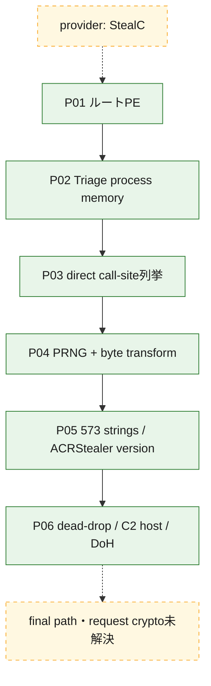
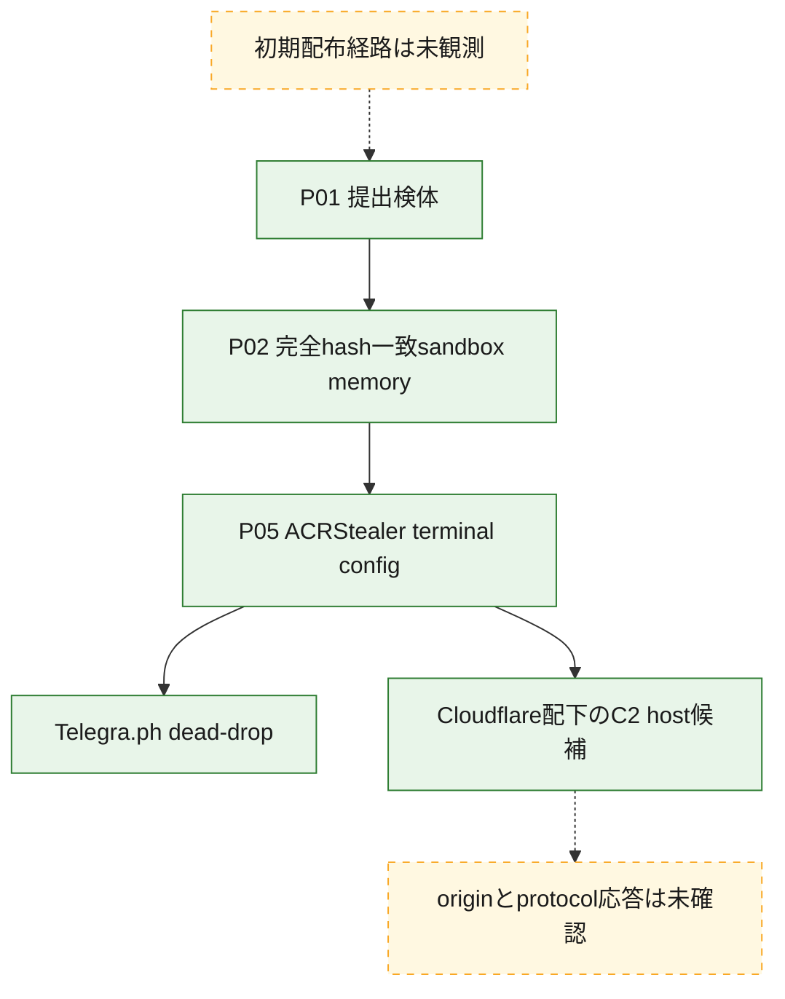
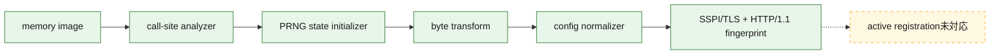

# 全体ロジック：4153db289c9a3de57845890aadeec7951fcf5516fd39f25c6d8c3e42fc21f801

providerのStealC報告と異なり、memoryのversion、専用文字列復号、SSPI/DoH/HTTP構造はACRStealer v4.3.2-alpha3で整合しました。正規caseへの移行は[再分類計画](RECLASSIFICATION.md)に従い、重複caseを作らず原子的に行います。

## 読み方

- 実線は静的復元関係、点線はprovider label、未復元path、未確認protocolです。
- `wss.` prefixだけをWebSocket根拠にしません。

## 静的可視化

### 実行フロー

### 感染チェーン

### モジュール関係

## 処理段階

1. memory-mapped/file-backed viewを検証し、direct call-siteから復号引数を復元しました。
2. version、GUID、dead-drop、DoH、C2 hostを静的に分類しました。
3. Cloudflare edgeの2 IPはorigin IOCおよびDNS遷移として扱いません。
4. TCP/443 openだけではC2 protocol一致に昇格しません。

## 比較プロファイルと他ケースとの比較

- `4.3.2-alpha3 versionと専用復号routine`、`SSPI/DoH/HTTP fingerprint`の2軸がACRStealerと整合します。
- providerのStealC labelは上記2軸と衝突するため、誤分類として保持します。
- 正規移行まで旧pathを削除・複製せず、catalog重複を避けます。
