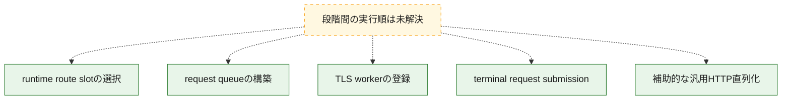
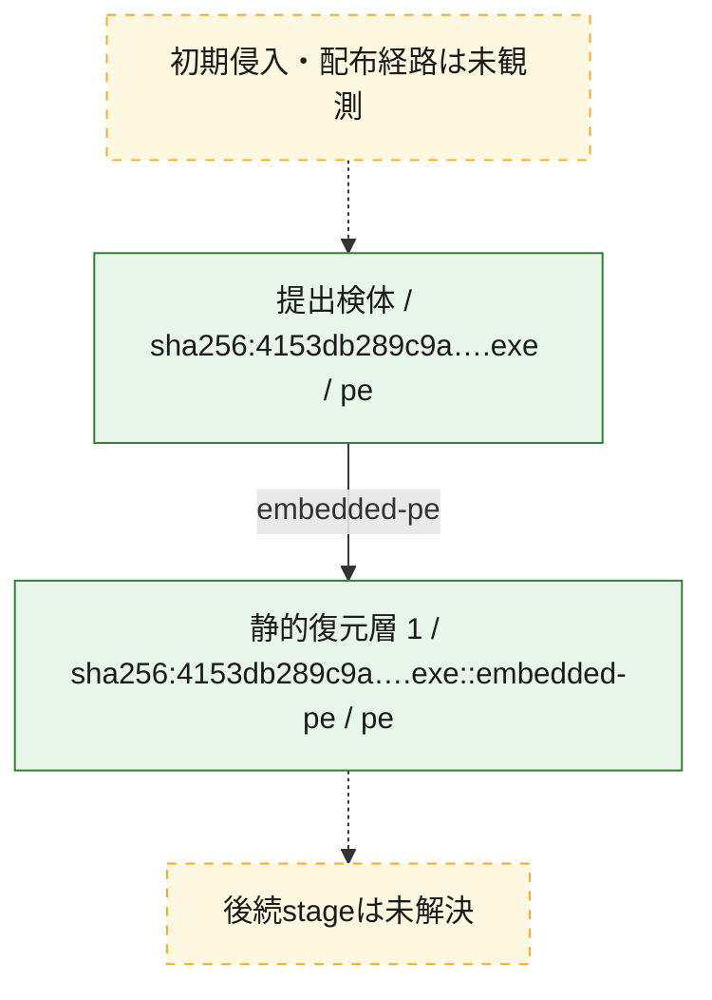
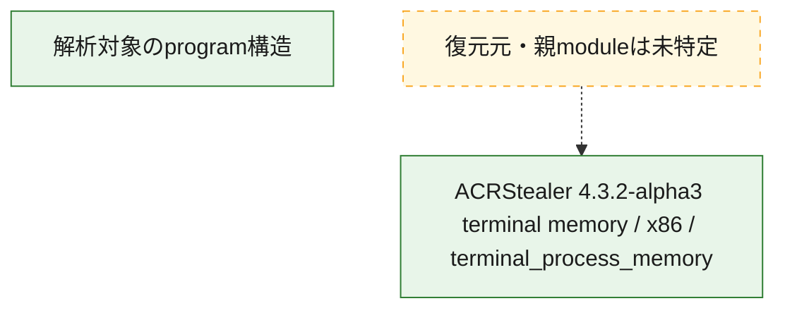

# 全体ロジック：4153db289c9a3de57845890aadeec7951fcf5516fd39f25c6d8c3e42fc21f801

exact 4153で11個のruntime route slot、queue構築、terminal submission wrapperを確認しました。captured dumpのslot値は全てzeroです。汎用HTTP serializerは別の補助経路であり、terminal submissionとの接続は未確認です。exact final path、body schema、request cryptoは未復元です。

## 読み方

- 静的な役割ごとの表示順です。隣接phase間の実行順やcall edgeを意味しません。
- 図の実線は静的に観測した関係、点線と黄色のノードは未観測・未解決の関係を示します。
- 図は静的な要約であり、動的実行を再現するものではありません。
- 詳細な関数解説とfingerprintは[STATIC-LOGIC.md](STATIC-LOGIC.md)を参照してください。

## 静的可視化

### 実行フロー

### 感染チェーン

### モジュール関係

## 処理段階

### 1. runtime route slotの選択

11個のslotから既存値を選んで返します。書込みとpath生成は確認していません。
確度: `confirmed_selector_with_zero_captured_values`

- `ghidra:FUN_0046b89e@0x0046b89e` — 復号済みselectorを照合し、対応するruntime route slotの既存値を複製して返します。 状態: `succeeded`、選定理由: `terminal C2 request経路`, `call graph上の役割`, `config・queue・transport境界`

### 2. request queueの構築

host、caller supplied path、data pointerとsizeをqueue itemへ格納します。
確度: `confirmed_static_review`

- `ghidra:FUN_0046988d@0x0046988d` — host、caller由来path、data pointerとsizeをqueue itemへ束ねます。 状態: `succeeded`、選定理由: `terminal C2 request経路`, `call graph上の役割`, `config・queue・transport境界`
- `ghidra:FUN_0046aba5@0x0046aba5` — 別経路からhost、path、dataを同じqueue表現へ格納します。 状態: `succeeded`、選定理由: `terminal C2 request経路`, `call graph上の役割`, `config・queue・transport境界`

### 3. TLS workerの登録

port 443とTLS flagを設定し、FUN_0046a6d5をthread callbackとして登録します。
確度: `confirmed_callback_registration`

- `ghidra:FUN_0046a2f7@0x0046a2f7` — host、port 443、TLS flagを設定しthread callbackを登録します。 状態: `succeeded`、選定理由: `terminal C2 request経路`, `call graph上の役割`, `config・queue・transport境界`

### 4. 終端リクエスト送信

queue消費、submission wrapper、HTTP status評価を確認しましたが、dispatcher内部は未復元です。
確度: `confirmed_with_virtualized_dispatch_limit`

- `ghidra:FUN_004699ed@0x004699ed` — queue入力を検査してrequest submission helperへ渡します。 状態: `succeeded`、選定理由: `terminal C2 request経路`, `call graph上の役割`, `config・queue・transport境界`
- `ghidra:FUN_0046a6d5@0x0046a6d5` — 登録済みqueueを消費し、bounded request helperを呼ぶworkerです。 状態: `succeeded`、選定理由: `terminal C2 request経路`, `call graph上の役割`, `config・queue・transport境界`
- `ghidra:FUN_004695ed@0x004695ed` — 入力を検査し、固定長response context付きで仮想化request builderへ委譲します。 状態: `succeeded`、選定理由: `terminal C2 request経路`, `call graph上の役割`, `config・queue・transport境界`
- `ghidra:FUN_00469476@0x00469476` — request builderを呼び、HTTP 200を含む戻り状態を解釈します。 状態: `succeeded`、選定理由: `terminal C2 request経路`, `call graph上の役割`, `config・queue・transport境界`
- `ghidra:FUN_00418b90@0x00418b90` — indirect jumpへ進むdispatcher stubだけを確認でき、内部bodyは未復元です。 状態: `limited_bad_instruction_or_flow`、選定理由: `terminal C2 request経路`, `call graph上の役割`, `config・queue・transport境界`

### 5. 補助的な汎用HTTP直列化

HTTP/1.1 serializerは確認しましたが、terminal submissionとのcall edgeは未確認です。
確度: `confirmed_auxiliary_path_only`

- `ghidra:FUN_00461a8a@0x00461a8a` — 汎用HTTP serializerへ進む補助経路です。最終C2 submissionとのcall edgeは未確認です。 状態: `limited_bad_instruction_or_flow`、選定理由: `terminal C2 request経路`, `call graph上の役割`, `config・queue・transport境界`
- `ghidra:FUN_00462720@0x00462720` — method、path、header、任意bodyをHTTP/1.1 requestへ直列化します。 状態: `succeeded`、選定理由: `terminal C2 request経路`, `call graph上の役割`, `config・queue・transport境界`

## 観測したcall関係

- `ghidra:FUN_00461a8a@0x00461a8a` → `ghidra:FUN_00462720@0x00462720` （`auxiliary_generic_http_serialization` → `auxiliary_generic_http_serialization`）
- `ghidra:FUN_00469476@0x00469476` → `ghidra:FUN_00418b90@0x00418b90` （`terminal_request_submission` → `terminal_request_submission`）
- `ghidra:FUN_004695ed@0x004695ed` → `ghidra:FUN_00418b90@0x00418b90` （`terminal_request_submission` → `terminal_request_submission`）
- `ghidra:FUN_004699ed@0x004699ed` → `ghidra:FUN_004695ed@0x004695ed` （`terminal_request_submission` → `terminal_request_submission`）
- `ghidra:FUN_0046a6d5@0x0046a6d5` → `ghidra:FUN_00469476@0x00469476` （`terminal_request_submission` → `terminal_request_submission`）

## 解析範囲と制約

- FUN_00461a8aとFUN_00418b90のindirect dispatcherは全分岐を高級表現へ復元できていません。
- FUN_00461a8a/FUN_00462720は補助的な汎用HTTP経路で、terminal submissionとのcall edgeは未確認です。
- peerの2件はtask_id=nullかつcontext_onlyのreport blockであり、独立runやprotocolの証拠ではありません。
- exact 4153のroute slot値、final path、request body schema、request crypto、runtime User-Agentは未復元です。
- Raw Binary入力には宣言済みentry pointがありません。
- 検体またはmemoryを実行せず、外部hostへ接続していません。
