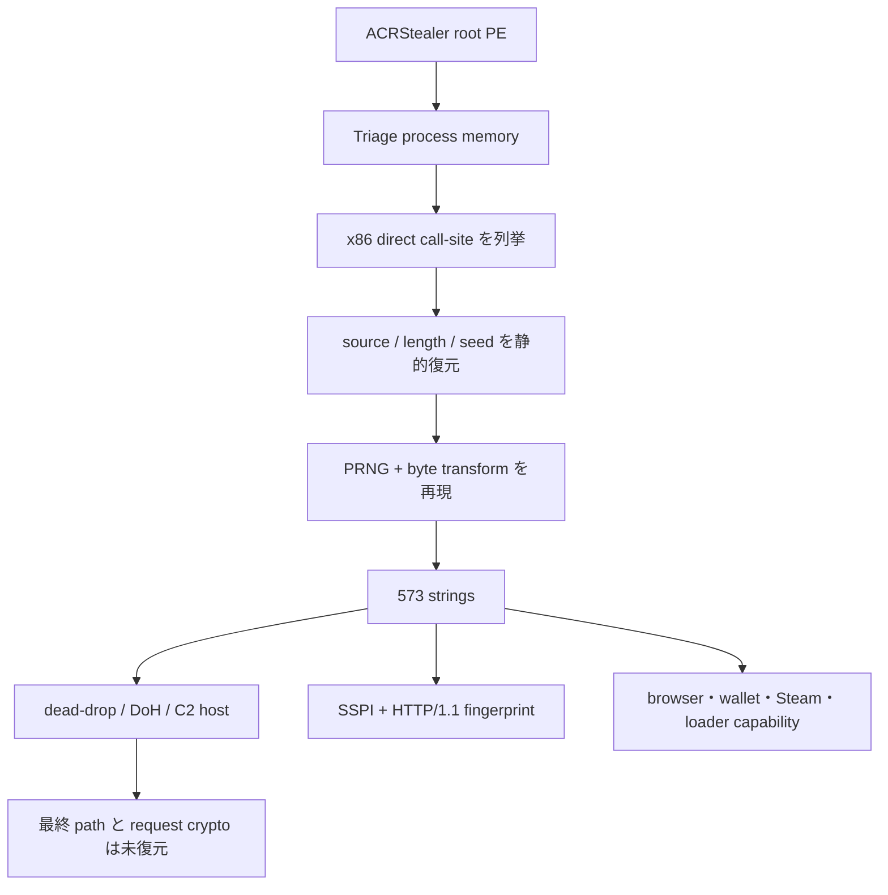

# ACRStealer v4.3.2-alpha3 静的追加解析

## 再分類

本検体は MalwareBazaar の `StealC` tag を起点に StealC case として作成されていたが、静的復号結果と Triage の family/config は ACRStealer v4 系で一致した。StealC extractor が失敗した主因は未対応版ではなく family 誤分類である。caseは重複を作らず、[再分類計画](RECLASSIFICATION.md)に従って`acrstealer/versions/v4.3.2-alpha3`へ原子的に移行し、再seal後にcatalog/UIを再生成する必要があります。

| 項目 | 値 |
|---|---|
| ルート SHA-256 | `4153db289c9a3de57845890aadeec7951fcf5516fd39f25c6d8c3e42fc21f801` |
| メモリ SHA-256 | `17b10e8a708b64f89b6fefd8dad820cbca502978e5b921b6aacdea1a1dc80ff2` |
| Family | `ACRStealer` |
| Version | `4.3.2-alpha3` |
| 文字列 key SHA-256 | `6f984849c1e85d221636038824d53ba6c7d0b9a2c18ca2bc837bfb028598e73e` |
| 復号文字列数 | `573` |
| Layout | `memory_mapped` |

## 静的復元した設定

| 値 | 役割 | 状態 |
|---|---|---|
| `https://telegra.ph/Executing-modules-as-scripts-06-16` | dead-drop/bootstrap | 静的復元済み |
| `wss.infrastructurecore.cc` | 最終 C2 host | 静的復元済み |
| `cloudflare-dns.com` | DoH resolver | 静的復元済み |
| `dns.google` | DoH resolver | 静的復元済み |
| `/dns-query` | DoH path | 静的文字列で確認 |
| `application/dns-message` | DoH Content-Type | 静的文字列で確認 |
| `keycdn.com` | decoy host | 静的復元済み |
| `a6cdcc0b-6b38-49d6-9672-20be114d9eba` | GUID | 静的復元済み |

`wss.` は hostname prefix にすぎず、WebSocket の証拠ではない。`Sec-WebSocket-Key`、`Upgrade: websocket` などの組み合わせは確認できず、静的文字列が示す protocol は SSPI/TLS 上の HTTP/1.1 request builder である。

Triage の runtime config では完全な URL path、別 GUID、User-Agent も観測されているが、今回の memory artifact の暗号化文字列からは再現できなかったため、静的復元値と runtime 観測値を混在させない。

## 文字列復号ロジック

Ghidra MCP では明示的な program selector を使用した。loader が memory image を file-backed としてずらして配置するため、実 runtime address と Ghidra 上の関数アドレスに `0xC00` の差がある。extractor は memory-mapped/file-backed の両 view を検証し、証拠が強い方を選択する。

| Ghidra 関数 | Runtime 相当 | 役割 |
|---|---:|---|
| `FUN_00472b35` | `0x471f35` | source、length、seed を受け取る per-byte 復号 loop |
| `FUN_00472b8e` | `0x471f8e` | 各位置の keystream derivation |
| `FUN_00472c50` | `0x472050` | SplitMix 型の初期 state 生成 |
| `FUN_004486a0` | `0x447aa0` | byte transform。XOR、減算、8 bit rotate、XOR の順に処理 |

byte transform は概ね次の構造である。

`(cipher XOR key[31:24]) - key[23:16] -> ROR8(key[15:8] & 7) -> XOR key[7:0]`

static direct call-site を Capstone で列挙し、call 引数をコードから復元して decrypt routine を純粋 Python で再現した。CPU emulation や sample 実行は行っていない。

## 2026-08-11 live確認

`wss.infrastructurecore.cc`はCloudflare edgeの`172.67.131.54`と`104.21.3.213`へ解決し、TCP/443はopenでした。payloadは送信せず、origin、path、protocol応答は未確認です。edge IPはDNS遷移または直接IOCとして扱いません。

## C2 protocol fingerprint と能動判定

静的 fingerprint は次の組み合わせで high confidence とする。

- SSPI provider と `sspicli.dll`
- HTTP/1.1 method/request builder の文字列群
- DoH resolver 2種、`/dns-query`、`application/dns-message`
- dead-drop URL と delimiter pair
- version、GUID、文字列復号定数

一方、final path、request body schema/暗号、runtime User-Agent、dead-drop 応答値が不足している。したがって active fake-registration は現時点で安全に実装できない。hostname への TCP/TLS 接続だけをもって ACRStealer C2 確認としてはならない。

## 安全な client emulator 設計

状態機械:

`LOADED -> DDR_SNAPSHOT_VERIFIED -> ENDPOINT_PINNED -> TLS_HANDSHAKE_ONLY -> HTTP_SCHEMA_VERIFIED -> ONE_SYNTHETIC_REQUEST -> RESPONSE_HEADER_HASHED -> CLOSED`

`HTTP_SCHEMA_VERIFIED` へ進む条件は、request body schema と暗号を静的コードから再現し、既知 config fixture で検証できた場合に限る。それまでは TLS handshake と certificate/HTTP fingerprint の受動的確認で停止する。

入力:

- immutable な sample/memory/config hash
- dead-drop snapshot hash と取得時刻
- exact SNI、IP、path
- request/body/timeout の上限

出力:

- 証明書chain hash、TLS version、HTTP statusを記録する
- Content-Type、body hash/size
- fingerprint 一致/不一致と未解決理由

禁止操作:

- redirect、poll、retry loopを禁止する
- 実端末 metadata や窃取データの送信
- task 実行、payload 取得、process injection
- schema 未復元状態での POST
- response body や token の無制限保存

## 自動化

- `extractors/acrstealer/v4_memory_core.py`: memory view、direct call-site、PRNG/byte transform を境界付きで静的復元する。
- `extractors/acrstealer/v4_memory.py`: family evidence と復号文字列を正規化する。
- `extractors/acrstealer/v4_config.py`: final C2、dead-drop、DoH、decoy、protocol fingerprint、未解決 field を分離する。

本ケースでは `active_registration_supported=false` を明示し、runtime 情報だけで能動登録を有効化しない。
