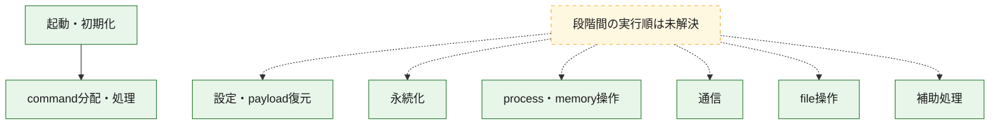
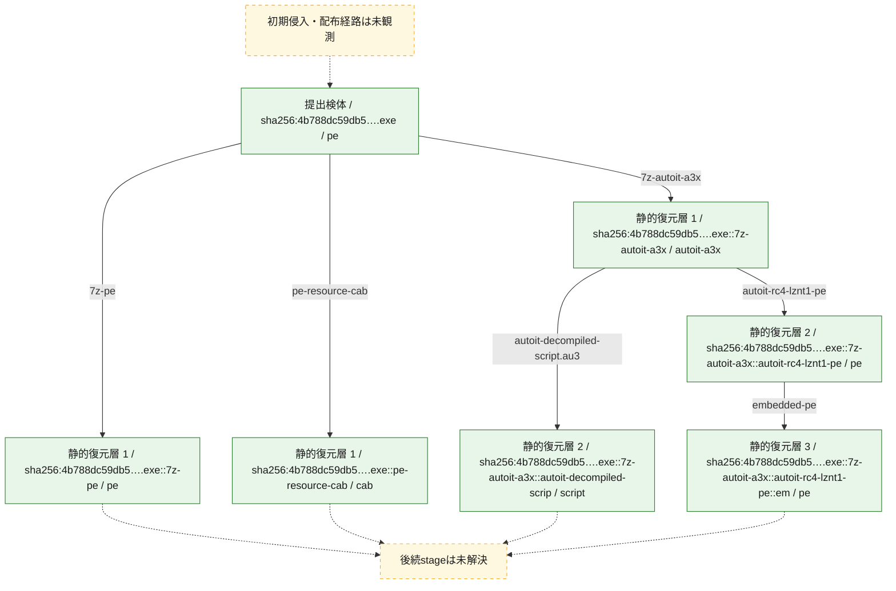
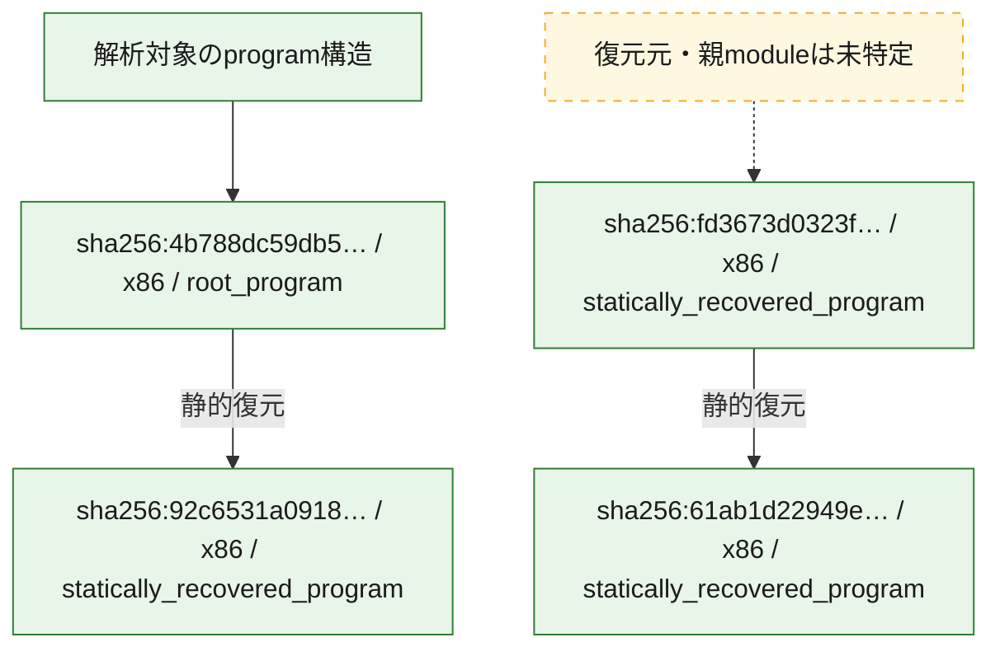

# 全体ロジック：4b788dc59db568205a6180f30bae301d6107896ee3e80c1edca4017c9bee5bed

代表関数の静的証跡から、起動・初期化、設定・payload復元、永続化、process・memory操作、通信、command分配・処理、file操作の処理群を確認しました。

## 読み方

- phaseの掲載順は解析上の整理順です。observed_call_edgesがない段階間の実行順を断定しません。
- 図の実線は静的に観測した関係、点線と黄色のノードは未観測・未解決の関係を示します。
- 図は静的な要約であり、動的実行を再現するものではありません。
- 詳細な関数解説とfingerprintは[STATIC-LOGIC.md](STATIC-LOGIC.md)を参照してください。

## 静的可視化

### 実行フロー

### 感染チェーン

### モジュール関係

## 処理段階

### 1. 起動・初期化

entry pointから初期化と後続処理への移行を確認します。
確度: `confirmed_static_function_evidence`

- `61ab1d22949eac0582e989ae065ec4caee9ac99998276317edda96735cd311fb:ghidra:140002dac` — 初期化と主要処理への分岐を行う入口関数です。 状態: `succeeded`、選定理由: `entry_point`, `meaningful_symbol_name`, `reviewed_call_centrality:22`, `role:entrypoint`
- `92c6531a09180fae8b2aae7384b4cea9986762f0c271b35da09b4d0e733f9f45:ghidra:140025aa4` — 初期化と主要処理への分岐を行う入口関数です。 状態: `succeeded`、選定理由: `entry_point`, `meaningful_symbol_name`, `reviewed_call_centrality:22`, `role:entrypoint`
- `4b788dc59db568205a6180f30bae301d6107896ee3e80c1edca4017c9bee5bed:ghidra:1400080c0` — 初期化と主要処理への分岐を行う入口関数です。 状態: `succeeded`、選定理由: `entry_point`, `meaningful_symbol_name`, `reviewed_call_centrality:18`, `role:entrypoint`

### 2. 設定・payload復元

設定、resource、payload、暗号化データの復元・変換を確認します。
確度: `confirmed_static_function_evidence`

- `4b788dc59db568205a6180f30bae301d6107896ee3e80c1edca4017c9bee5bed:ghidra:1400030a4` — 設定、resource、payloadなどの解析・変換を行う関数です。 状態: `succeeded`、選定理由: `context_representative`, `reviewed_call_centrality:27`, `role:config_or_data_transform`

### 3. 永続化

自動起動や永続化に関係する設定変更を確認します。
確度: `confirmed_static_function_evidence`

- `4b788dc59db568205a6180f30bae301d6107896ee3e80c1edca4017c9bee5bed:ghidra:140004360` — 自動起動または永続化に関係する処理を含む関数です。 状態: `succeeded`、選定理由: `context_representative`, `reviewed_call_centrality:32`, `role:persistence`

### 4. process・memory操作

process、thread、module、memory操作と実行移行を確認します。
確度: `confirmed_static_function_evidence`

- `61ab1d22949eac0582e989ae065ec4caee9ac99998276317edda96735cd311fb:ghidra:14000148c` — process、thread、module、またはmemory操作に関係する関数です。 状態: `succeeded`、選定理由: `context_representative`, `reviewed_call_centrality:37`, `role:process_or_memory_operation`
- `61ab1d22949eac0582e989ae065ec4caee9ac99998276317edda96735cd311fb:ghidra:140002940` — process、thread、module、またはmemory操作に関係する関数です。 状態: `succeeded`、選定理由: `context_representative`, `reviewed_call_centrality:11`, `role:process_or_memory_operation`
- `4b788dc59db568205a6180f30bae301d6107896ee3e80c1edca4017c9bee5bed:ghidra:14000163c` — process、thread、module、またはmemory操作に関係する関数です。 状態: `succeeded`、選定理由: `context_representative`, `reviewed_call_centrality:13`, `role:process_or_memory_operation`
- `4b788dc59db568205a6180f30bae301d6107896ee3e80c1edca4017c9bee5bed:ghidra:14000173c` — process、thread、module、またはmemory操作に関係する関数です。 状態: `succeeded`、選定理由: `context_representative`, `reviewed_call_centrality:23`, `role:process_or_memory_operation`
- `4b788dc59db568205a6180f30bae301d6107896ee3e80c1edca4017c9bee5bed:ghidra:140001ff4` — process、thread、module、またはmemory操作に関係する関数です。 状態: `succeeded`、選定理由: `context_representative`, `reviewed_call_centrality:16`, `role:process_or_memory_operation`
- `4b788dc59db568205a6180f30bae301d6107896ee3e80c1edca4017c9bee5bed:ghidra:1400020e8` — process、thread、module、またはmemory操作に関係する関数です。 状態: `succeeded`、選定理由: `context_representative`, `reviewed_call_centrality:28`, `role:process_or_memory_operation`
- `4b788dc59db568205a6180f30bae301d6107896ee3e80c1edca4017c9bee5bed:ghidra:1400033a8` — process、thread、module、またはmemory操作に関係する関数です。 状態: `succeeded`、選定理由: `context_representative`, `reviewed_call_centrality:31`, `role:process_or_memory_operation`

### 5. 通信

通信初期化、endpoint処理、送受信の役割を確認します。
確度: `confirmed_static_function_evidence`

- `92c6531a09180fae8b2aae7384b4cea9986762f0c271b35da09b4d0e733f9f45:ghidra:140001504` — 通信初期化、送受信、またはendpoint処理に関係する関数です。 状態: `succeeded`、選定理由: `context_representative`, `reviewed_call_centrality:17`, `role:network_communication`
- `4b788dc59db568205a6180f30bae301d6107896ee3e80c1edca4017c9bee5bed:ghidra:140003830` — 通信初期化、送受信、またはendpoint処理に関係する関数です。 状態: `succeeded`、選定理由: `context_representative`, `reviewed_call_centrality:19`, `role:network_communication`
- `4b788dc59db568205a6180f30bae301d6107896ee3e80c1edca4017c9bee5bed:ghidra:140003940` — 通信初期化、送受信、またはendpoint処理に関係する関数です。 状態: `succeeded`、選定理由: `context_representative`, `reviewed_call_centrality:29`, `role:network_communication`
- `4b788dc59db568205a6180f30bae301d6107896ee3e80c1edca4017c9bee5bed:ghidra:140003c80` — 通信初期化、送受信、またはendpoint処理に関係する関数です。 状態: `succeeded`、選定理由: `context_representative`, `reviewed_call_centrality:22`, `role:network_communication`

### 6. command分配・処理

受信commandやtaskの解釈、分配、個別handlerへの移行を確認します。
確度: `confirmed_static_function_evidence_with_limits`

- `61ab1d22949eac0582e989ae065ec4caee9ac99998276317edda96735cd311fb:ghidra:140014310` — commandの解釈、分配、または個別処理を担当する関数です。 状態: `limited_bad_instruction_or_flow`、選定理由: `meaningful_symbol_name`, `reviewed_call_centrality:1`, `role:command_dispatch_or_handler`
- `4b788dc59db568205a6180f30bae301d6107896ee3e80c1edca4017c9bee5bed:ghidra:140003e64` — commandの解釈、分配、または個別処理を担当する関数です。 状態: `succeeded`、選定理由: `context_representative`, `reviewed_call_centrality:7`, `role:command_dispatch_or_handler`

### 7. file操作

fileやdirectoryの作成、読書き、削除を確認します。
確度: `confirmed_static_function_evidence`

- `61ab1d22949eac0582e989ae065ec4caee9ac99998276317edda96735cd311fb:ghidra:140001170` — fileまたはdirectoryの読書き・管理に関係する関数です。 状態: `succeeded`、選定理由: `context_representative`, `reviewed_call_centrality:17`, `role:file_operation`
- `61ab1d22949eac0582e989ae065ec4caee9ac99998276317edda96735cd311fb:ghidra:1400013c0` — fileまたはdirectoryの読書き・管理に関係する関数です。 状態: `succeeded`、選定理由: `context_representative`, `reviewed_call_centrality:11`, `role:file_operation`
- `61ab1d22949eac0582e989ae065ec4caee9ac99998276317edda96735cd311fb:ghidra:140002614` — fileまたはdirectoryの読書き・管理に関係する関数です。 状態: `succeeded`、選定理由: `context_representative`, `reviewed_call_centrality:10`, `role:file_operation`
- `4b788dc59db568205a6180f30bae301d6107896ee3e80c1edca4017c9bee5bed:ghidra:140001a74` — fileまたはdirectoryの読書き・管理に関係する関数です。 状態: `succeeded`、選定理由: `context_representative`, `reviewed_call_centrality:22`, `role:file_operation`
- `4b788dc59db568205a6180f30bae301d6107896ee3e80c1edca4017c9bee5bed:ghidra:1400023bc` — fileまたはdirectoryの読書き・管理に関係する関数です。 状態: `succeeded`、選定理由: `context_representative`, `reviewed_call_centrality:19`, `role:file_operation`
- `4b788dc59db568205a6180f30bae301d6107896ee3e80c1edca4017c9bee5bed:ghidra:140002580` — fileまたはdirectoryの読書き・管理に関係する関数です。 状態: `succeeded`、選定理由: `context_representative`, `reviewed_call_centrality:13`, `role:file_operation`
- `4b788dc59db568205a6180f30bae301d6107896ee3e80c1edca4017c9bee5bed:ghidra:140002758` — fileまたはdirectoryの読書き・管理に関係する関数です。 状態: `succeeded`、選定理由: `context_representative`, `reviewed_call_centrality:4`, `role:file_operation`
- `4b788dc59db568205a6180f30bae301d6107896ee3e80c1edca4017c9bee5bed:ghidra:140002904` — fileまたはdirectoryの読書き・管理に関係する関数です。 状態: `succeeded`、選定理由: `context_representative`, `reviewed_call_centrality:19`, `role:file_operation`
- `4b788dc59db568205a6180f30bae301d6107896ee3e80c1edca4017c9bee5bed:ghidra:140002b08` — fileまたはdirectoryの読書き・管理に関係する関数です。 状態: `succeeded`、選定理由: `context_representative`, `reviewed_call_centrality:16`, `role:file_operation`
- `4b788dc59db568205a6180f30bae301d6107896ee3e80c1edca4017c9bee5bed:ghidra:140002d10` — fileまたはdirectoryの読書き・管理に関係する関数です。 状態: `succeeded`、選定理由: `context_representative`, `reviewed_call_centrality:13`, `role:file_operation`
- `4b788dc59db568205a6180f30bae301d6107896ee3e80c1edca4017c9bee5bed:ghidra:140003644` — fileまたはdirectoryの読書き・管理に関係する関数です。 状態: `succeeded`、選定理由: `context_representative`, `reviewed_call_centrality:18`, `role:file_operation`

### 8. 補助処理

主要処理を支える一般内部関数またはlibrary処理を確認します。
確度: `confirmed_static_function_evidence_with_limits`

- `61ab1d22949eac0582e989ae065ec4caee9ac99998276317edda96735cd311fb:ghidra:140001000` — 検体内部の一般処理を実装する関数です。 状態: `succeeded`、選定理由: `context_representative`, `reviewed_call_centrality:1`
- `61ab1d22949eac0582e989ae065ec4caee9ac99998276317edda96735cd311fb:ghidra:140001048` — 検体内部の一般処理を実装する関数です。 状態: `succeeded`、選定理由: `context_representative`, `reviewed_call_centrality:2`
- `61ab1d22949eac0582e989ae065ec4caee9ac99998276317edda96735cd311fb:ghidra:1400010c4` — 検体内部の一般処理を実装する関数です。 状態: `succeeded`、選定理由: `context_representative`, `reviewed_call_centrality:6`
- `61ab1d22949eac0582e989ae065ec4caee9ac99998276317edda96735cd311fb:ghidra:1400010e4` — 検体内部の一般処理を実装する関数です。 状態: `succeeded`、選定理由: `context_representative`, `reviewed_call_centrality:1`
- `61ab1d22949eac0582e989ae065ec4caee9ac99998276317edda96735cd311fb:ghidra:140001120` — 検体内部の一般処理を実装する関数です。 状態: `succeeded`、選定理由: `context_representative`, `reviewed_call_centrality:1`
- `61ab1d22949eac0582e989ae065ec4caee9ac99998276317edda96735cd311fb:ghidra:14000115c` — 検体内部の一般処理を実装する関数です。 状態: `succeeded`、選定理由: `context_representative`, `reviewed_call_centrality:6`
- `61ab1d22949eac0582e989ae065ec4caee9ac99998276317edda96735cd311fb:ghidra:140001cbc` — 検体内部の一般処理を実装する関数です。 状態: `succeeded`、選定理由: `context_representative`, `reviewed_call_centrality:3`
- `61ab1d22949eac0582e989ae065ec4caee9ac99998276317edda96735cd311fb:ghidra:140001dcc` — 検体内部の一般処理を実装する関数です。 状態: `succeeded`、選定理由: `context_representative`, `reviewed_call_centrality:2`
- `61ab1d22949eac0582e989ae065ec4caee9ac99998276317edda96735cd311fb:ghidra:140001e64` — 検体内部の一般処理を実装する関数です。 状態: `succeeded`、選定理由: `context_representative`, `reviewed_call_centrality:4`
- `61ab1d22949eac0582e989ae065ec4caee9ac99998276317edda96735cd311fb:ghidra:140001ed8` — 検体内部の一般処理を実装する関数です。 状態: `succeeded`、選定理由: `context_representative`, `reviewed_call_centrality:7`
- `61ab1d22949eac0582e989ae065ec4caee9ac99998276317edda96735cd311fb:ghidra:14000201c` — 検体内部の一般処理を実装する関数です。 状態: `succeeded`、選定理由: `context_representative`, `reviewed_call_centrality:4`
- `61ab1d22949eac0582e989ae065ec4caee9ac99998276317edda96735cd311fb:ghidra:140002090` — 検体内部の一般処理を実装する関数です。 状態: `succeeded`、選定理由: `context_representative`, `reviewed_call_centrality:5`
- `61ab1d22949eac0582e989ae065ec4caee9ac99998276317edda96735cd311fb:ghidra:14000215c` — 検体内部の一般処理を実装する関数です。 状態: `succeeded`、選定理由: `context_representative`, `reviewed_call_centrality:7`
- `61ab1d22949eac0582e989ae065ec4caee9ac99998276317edda96735cd311fb:ghidra:1400021d8` — 検体内部の一般処理を実装する関数です。 状態: `succeeded`、選定理由: `context_representative`, `reviewed_call_centrality:7`
- `61ab1d22949eac0582e989ae065ec4caee9ac99998276317edda96735cd311fb:ghidra:140002328` — 検体内部の一般処理を実装する関数です。 状態: `succeeded`、選定理由: `context_representative`, `reviewed_call_centrality:7`
- `61ab1d22949eac0582e989ae065ec4caee9ac99998276317edda96735cd311fb:ghidra:14000245c` — 検体内部の一般処理を実装する関数です。 状態: `succeeded`、選定理由: `context_representative`, `reviewed_call_centrality:6`
- `61ab1d22949eac0582e989ae065ec4caee9ac99998276317edda96735cd311fb:ghidra:1400025b4` — 検体内部の一般処理を実装する関数です。 状態: `succeeded`、選定理由: `context_representative`, `reviewed_call_centrality:3`
- `61ab1d22949eac0582e989ae065ec4caee9ac99998276317edda96735cd311fb:ghidra:1400027c4` — 検体内部の一般処理を実装する関数です。 状態: `succeeded`、選定理由: `context_representative`, `reviewed_call_centrality:3`
- `61ab1d22949eac0582e989ae065ec4caee9ac99998276317edda96735cd311fb:ghidra:14000284c` — 検体内部の一般処理を実装する関数です。 状態: `succeeded`、選定理由: `context_representative`, `reviewed_call_centrality:1`
- `61ab1d22949eac0582e989ae065ec4caee9ac99998276317edda96735cd311fb:ghidra:140002888` — 検体内部の一般処理を実装する関数です。 状態: `succeeded`、選定理由: `context_representative`, `reviewed_call_centrality:2`
- `61ab1d22949eac0582e989ae065ec4caee9ac99998276317edda96735cd311fb:ghidra:1400028d0` — 検体内部の一般処理を実装する関数です。 状態: `succeeded`、選定理由: `context_representative`, `reviewed_call_centrality:1`
- `61ab1d22949eac0582e989ae065ec4caee9ac99998276317edda96735cd311fb:ghidra:14000290c` — 検体内部の一般処理を実装する関数です。 状態: `succeeded`、選定理由: `context_representative`, `reviewed_call_centrality:4`
- `61ab1d22949eac0582e989ae065ec4caee9ac99998276317edda96735cd311fb:ghidra:140002960` — 検体内部の一般処理を実装する関数です。 状態: `succeeded`、選定理由: `context_representative`, `reviewed_call_centrality:7`
- `61ab1d22949eac0582e989ae065ec4caee9ac99998276317edda96735cd311fb:ghidra:1400029ac` — 検体内部の一般処理を実装する関数です。 状態: `succeeded`、選定理由: `context_representative`, `reviewed_call_centrality:1`
- `61ab1d22949eac0582e989ae065ec4caee9ac99998276317edda96735cd311fb:ghidra:140003100` — 検体内部の一般処理を実装する関数です。 状態: `succeeded`、選定理由: `meaningful_symbol_name`
- `fd3673d0323fbd05013bea1fe27f402240f292e7a31a33be9b0de5d361adc385:ghidra:140001ca0` — 検体内部の一般処理を実装する関数です。 状態: `succeeded`、選定理由: `context_representative`, `reviewed_call_centrality:5`
- `fd3673d0323fbd05013bea1fe27f402240f292e7a31a33be9b0de5d361adc385:ghidra:140001d20` — 検体内部の一般処理を実装する関数です。 状態: `succeeded`、選定理由: `context_representative`, `reviewed_call_centrality:3`
- `fd3673d0323fbd05013bea1fe27f402240f292e7a31a33be9b0de5d361adc385:ghidra:140001d40` — 検体内部の一般処理を実装する関数です。 状態: `succeeded`、選定理由: `context_representative`, `reviewed_call_centrality:1`
- `fd3673d0323fbd05013bea1fe27f402240f292e7a31a33be9b0de5d361adc385:ghidra:140001d90` — 検体内部の一般処理を実装する関数です。 状態: `succeeded`、選定理由: `context_representative`, `reviewed_call_centrality:2`
- `fd3673d0323fbd05013bea1fe27f402240f292e7a31a33be9b0de5d361adc385:ghidra:140001e20` — 検体内部の一般処理を実装する関数です。 状態: `succeeded`、選定理由: `context_representative`, `reviewed_call_centrality:4`
- `fd3673d0323fbd05013bea1fe27f402240f292e7a31a33be9b0de5d361adc385:ghidra:140001e40` — 検体内部の一般処理を実装する関数です。 状態: `succeeded`、選定理由: `context_representative`, `reviewed_call_centrality:1`
- `fd3673d0323fbd05013bea1fe27f402240f292e7a31a33be9b0de5d361adc385:ghidra:140001e7c` — 検体内部の一般処理を実装する関数です。 状態: `succeeded`、選定理由: `context_representative`, `reviewed_call_centrality:1`
- `fd3673d0323fbd05013bea1fe27f402240f292e7a31a33be9b0de5d361adc385:ghidra:140001eb8` — 検体内部の一般処理を実装する関数です。 状態: `succeeded`、選定理由: `context_representative`, `reviewed_call_centrality:11`
- `fd3673d0323fbd05013bea1fe27f402240f292e7a31a33be9b0de5d361adc385:ghidra:140001ecc` — 検体内部の一般処理を実装する関数です。 状態: `succeeded`、選定理由: `context_representative`, `reviewed_call_centrality:8`
- `fd3673d0323fbd05013bea1fe27f402240f292e7a31a33be9b0de5d361adc385:ghidra:140002ae0` — 検体内部の一般処理を実装する関数です。 状態: `succeeded`、選定理由: `context_representative`, `reviewed_call_centrality:9`
- `fd3673d0323fbd05013bea1fe27f402240f292e7a31a33be9b0de5d361adc385:ghidra:140007814` — 検体内部の一般処理を実装する関数です。 状態: `succeeded`、選定理由: `context_representative`, `reviewed_call_centrality:1`
- `fd3673d0323fbd05013bea1fe27f402240f292e7a31a33be9b0de5d361adc385:ghidra:1400078a8` — 検体内部の一般処理を実装する関数です。 状態: `succeeded`、選定理由: `context_representative`, `reviewed_call_centrality:7`
- `fd3673d0323fbd05013bea1fe27f402240f292e7a31a33be9b0de5d361adc385:ghidra:140007900` — 検体内部の一般処理を実装する関数です。 状態: `succeeded`、選定理由: `context_representative`, `reviewed_call_centrality:6`
- `fd3673d0323fbd05013bea1fe27f402240f292e7a31a33be9b0de5d361adc385:ghidra:1400079dc` — 検体内部の一般処理を実装する関数です。 状態: `succeeded`、選定理由: `context_representative`, `reviewed_call_centrality:3`
- `fd3673d0323fbd05013bea1fe27f402240f292e7a31a33be9b0de5d361adc385:ghidra:140007a40` — 検体内部の一般処理を実装する関数です。 状態: `succeeded`、選定理由: `context_representative`, `reviewed_call_centrality:3`
- `fd3673d0323fbd05013bea1fe27f402240f292e7a31a33be9b0de5d361adc385:ghidra:140007a8c` — 検体内部の一般処理を実装する関数です。 状態: `succeeded`、選定理由: `context_representative`, `reviewed_call_centrality:3`
- `fd3673d0323fbd05013bea1fe27f402240f292e7a31a33be9b0de5d361adc385:ghidra:140007ad8` — 検体内部の一般処理を実装する関数です。 状態: `succeeded`、選定理由: `context_representative`, `reviewed_call_centrality:12`
- `fd3673d0323fbd05013bea1fe27f402240f292e7a31a33be9b0de5d361adc385:ghidra:140007b98` — 検体内部の一般処理を実装する関数です。 状態: `succeeded`、選定理由: `context_representative`, `reviewed_call_centrality:11`
- `fd3673d0323fbd05013bea1fe27f402240f292e7a31a33be9b0de5d361adc385:ghidra:140007c00` — 検体内部の一般処理を実装する関数です。 状態: `succeeded`、選定理由: `context_representative`, `reviewed_call_centrality:8`
- `fd3673d0323fbd05013bea1fe27f402240f292e7a31a33be9b0de5d361adc385:ghidra:140007cfc` — 検体内部の一般処理を実装する関数です。 状態: `succeeded`、選定理由: `context_representative`, `reviewed_call_centrality:8`
- `fd3673d0323fbd05013bea1fe27f402240f292e7a31a33be9b0de5d361adc385:ghidra:140007d38` — 検体内部の一般処理を実装する関数です。 状態: `succeeded`、選定理由: `context_representative`, `reviewed_call_centrality:14`
- `fd3673d0323fbd05013bea1fe27f402240f292e7a31a33be9b0de5d361adc385:ghidra:140008520` — 検体内部の一般処理を実装する関数です。 状態: `succeeded`、選定理由: `context_representative`, `reviewed_call_centrality:9`
- `fd3673d0323fbd05013bea1fe27f402240f292e7a31a33be9b0de5d361adc385:ghidra:140008704` — 検体内部の一般処理を実装する関数です。 状態: `succeeded`、選定理由: `context_representative`, `reviewed_call_centrality:1`
- `fd3673d0323fbd05013bea1fe27f402240f292e7a31a33be9b0de5d361adc385:ghidra:1400087cc` — 検体内部の一般処理を実装する関数です。 状態: `succeeded`、選定理由: `context_representative`, `reviewed_call_centrality:5`
- `fd3673d0323fbd05013bea1fe27f402240f292e7a31a33be9b0de5d361adc385:ghidra:140008844` — 検体内部の一般処理を実装する関数です。 状態: `limited_bad_instruction_or_flow`、選定理由: `context_representative`, `reviewed_call_centrality:8`
- `fd3673d0323fbd05013bea1fe27f402240f292e7a31a33be9b0de5d361adc385:ghidra:1400088f4` — 検体内部の一般処理を実装する関数です。 状態: `succeeded`、選定理由: `context_representative`, `reviewed_call_centrality:7`
- `fd3673d0323fbd05013bea1fe27f402240f292e7a31a33be9b0de5d361adc385:ghidra:140008a38` — 検体内部の一般処理を実装する関数です。 状態: `succeeded`、選定理由: `context_representative`, `reviewed_call_centrality:17`
- `fd3673d0323fbd05013bea1fe27f402240f292e7a31a33be9b0de5d361adc385:ghidra:140009200` — 検体内部の一般処理を実装する関数です。 状態: `succeeded`、選定理由: `context_representative`, `reviewed_call_centrality:7`
- `fd3673d0323fbd05013bea1fe27f402240f292e7a31a33be9b0de5d361adc385:ghidra:140009478` — 検体内部の一般処理を実装する関数です。 状態: `succeeded`、選定理由: `context_representative`, `reviewed_call_centrality:19`
- `fd3673d0323fbd05013bea1fe27f402240f292e7a31a33be9b0de5d361adc385:ghidra:140009af4` — 検体内部の一般処理を実装する関数です。 状態: `succeeded`、選定理由: `context_representative`, `reviewed_call_centrality:4`
- `fd3673d0323fbd05013bea1fe27f402240f292e7a31a33be9b0de5d361adc385:ghidra:140009b5c` — 検体内部の一般処理を実装する関数です。 状態: `succeeded`、選定理由: `context_representative`, `reviewed_call_centrality:5`
- `fd3673d0323fbd05013bea1fe27f402240f292e7a31a33be9b0de5d361adc385:ghidra:14001c5e0` — 検体内部の一般処理を実装する関数です。 状態: `succeeded`、選定理由: `meaningful_symbol_name`
- `92c6531a09180fae8b2aae7384b4cea9986762f0c271b35da09b4d0e733f9f45:ghidra:140001000` — 検体内部の一般処理を実装する関数です。 状態: `succeeded`、選定理由: `context_representative`, `reviewed_call_centrality:2`
- `92c6531a09180fae8b2aae7384b4cea9986762f0c271b35da09b4d0e733f9f45:ghidra:14000102c` — 検体内部の一般処理を実装する関数です。 状態: `succeeded`、選定理由: `context_representative`, `reviewed_call_centrality:2`
- `92c6531a09180fae8b2aae7384b4cea9986762f0c271b35da09b4d0e733f9f45:ghidra:140001048` — 検体内部の一般処理を実装する関数です。 状態: `succeeded`、選定理由: `context_representative`, `reviewed_call_centrality:2`
- `92c6531a09180fae8b2aae7384b4cea9986762f0c271b35da09b4d0e733f9f45:ghidra:140001064` — 検体内部の一般処理を実装する関数です。 状態: `succeeded`、選定理由: `context_representative`, `reviewed_call_centrality:2`
- `92c6531a09180fae8b2aae7384b4cea9986762f0c271b35da09b4d0e733f9f45:ghidra:140001080` — 検体内部の一般処理を実装する関数です。 状態: `succeeded`、選定理由: `context_representative`, `reviewed_call_centrality:2`
- `92c6531a09180fae8b2aae7384b4cea9986762f0c271b35da09b4d0e733f9f45:ghidra:1400010b0` — 検体内部の一般処理を実装する関数です。 状態: `succeeded`、選定理由: `context_representative`, `reviewed_call_centrality:2`
- `92c6531a09180fae8b2aae7384b4cea9986762f0c271b35da09b4d0e733f9f45:ghidra:1400010cc` — 検体内部の一般処理を実装する関数です。 状態: `succeeded`、選定理由: `context_representative`, `reviewed_call_centrality:2`
- `92c6531a09180fae8b2aae7384b4cea9986762f0c271b35da09b4d0e733f9f45:ghidra:1400010e8` — 検体内部の一般処理を実装する関数です。 状態: `succeeded`、選定理由: `context_representative`, `reviewed_call_centrality:2`
- `92c6531a09180fae8b2aae7384b4cea9986762f0c271b35da09b4d0e733f9f45:ghidra:140001104` — 検体内部の一般処理を実装する関数です。 状態: `succeeded`、選定理由: `context_representative`, `reviewed_call_centrality:2`
- `92c6531a09180fae8b2aae7384b4cea9986762f0c271b35da09b4d0e733f9f45:ghidra:140001120` — 検体内部の一般処理を実装する関数です。 状態: `succeeded`、選定理由: `context_representative`, `reviewed_call_centrality:2`
- `92c6531a09180fae8b2aae7384b4cea9986762f0c271b35da09b4d0e733f9f45:ghidra:140001140` — 検体内部の一般処理を実装する関数です。 状態: `succeeded`、選定理由: `context_representative`, `reviewed_call_centrality:6`
- `92c6531a09180fae8b2aae7384b4cea9986762f0c271b35da09b4d0e733f9f45:ghidra:1400012a0` — 検体内部の一般処理を実装する関数です。 状態: `succeeded`、選定理由: `context_representative`, `reviewed_call_centrality:4`
- `92c6531a09180fae8b2aae7384b4cea9986762f0c271b35da09b4d0e733f9f45:ghidra:140001314` — 検体内部の一般処理を実装する関数です。 状態: `succeeded`、選定理由: `context_representative`, `reviewed_call_centrality:2`
- `92c6531a09180fae8b2aae7384b4cea9986762f0c271b35da09b4d0e733f9f45:ghidra:140001470` — 検体内部の一般処理を実装する関数です。 状態: `succeeded`、選定理由: `context_representative`, `reviewed_call_centrality:6`
- `92c6531a09180fae8b2aae7384b4cea9986762f0c271b35da09b4d0e733f9f45:ghidra:1400015ec` — 検体内部の一般処理を実装する関数です。 状態: `succeeded`、選定理由: `context_representative`, `reviewed_call_centrality:20`
- `92c6531a09180fae8b2aae7384b4cea9986762f0c271b35da09b4d0e733f9f45:ghidra:1400017fc` — 検体内部の一般処理を実装する関数です。 状態: `succeeded`、選定理由: `context_representative`, `reviewed_call_centrality:2`
- `92c6531a09180fae8b2aae7384b4cea9986762f0c271b35da09b4d0e733f9f45:ghidra:140001834` — 検体内部の一般処理を実装する関数です。 状態: `limited_bad_instruction_or_flow`、選定理由: `context_representative`, `reviewed_call_centrality:3`
- `92c6531a09180fae8b2aae7384b4cea9986762f0c271b35da09b4d0e733f9f45:ghidra:1400018b4` — 検体内部の一般処理を実装する関数です。 状態: `limited_bad_instruction_or_flow`、選定理由: `context_representative`, `reviewed_call_centrality:4`
- `92c6531a09180fae8b2aae7384b4cea9986762f0c271b35da09b4d0e733f9f45:ghidra:14000190c` — 検体内部の一般処理を実装する関数です。 状態: `succeeded`、選定理由: `context_representative`, `reviewed_call_centrality:4`
- `92c6531a09180fae8b2aae7384b4cea9986762f0c271b35da09b4d0e733f9f45:ghidra:140001948` — 検体内部の一般処理を実装する関数です。 状態: `succeeded`、選定理由: `context_representative`, `reviewed_call_centrality:4`
- `92c6531a09180fae8b2aae7384b4cea9986762f0c271b35da09b4d0e733f9f45:ghidra:140001990` — 検体内部の一般処理を実装する関数です。 状態: `succeeded`、選定理由: `context_representative`, `reviewed_call_centrality:10`
- `92c6531a09180fae8b2aae7384b4cea9986762f0c271b35da09b4d0e733f9f45:ghidra:140001aa8` — 検体内部の一般処理を実装する関数です。 状態: `succeeded`、選定理由: `context_representative`, `reviewed_call_centrality:19`
- `92c6531a09180fae8b2aae7384b4cea9986762f0c271b35da09b4d0e733f9f45:ghidra:140001c20` — 検体内部の一般処理を実装する関数です。 状態: `succeeded`、選定理由: `context_representative`, `reviewed_call_centrality:17`
- `92c6531a09180fae8b2aae7384b4cea9986762f0c271b35da09b4d0e733f9f45:ghidra:140001da4` — 検体内部の一般処理を実装する関数です。 状態: `succeeded`、選定理由: `context_representative`, `reviewed_call_centrality:17`
- `92c6531a09180fae8b2aae7384b4cea9986762f0c271b35da09b4d0e733f9f45:ghidra:140001f8c` — 検体内部の一般処理を実装する関数です。 状態: `succeeded`、選定理由: `context_representative`, `reviewed_call_centrality:13`
- `92c6531a09180fae8b2aae7384b4cea9986762f0c271b35da09b4d0e733f9f45:ghidra:140002014` — 検体内部の一般処理を実装する関数です。 状態: `succeeded`、選定理由: `context_representative`, `reviewed_call_centrality:12`
- `92c6531a09180fae8b2aae7384b4cea9986762f0c271b35da09b4d0e733f9f45:ghidra:140002120` — 検体内部の一般処理を実装する関数です。 状態: `succeeded`、選定理由: `context_representative`, `reviewed_call_centrality:6`
- `92c6531a09180fae8b2aae7384b4cea9986762f0c271b35da09b4d0e733f9f45:ghidra:1400021d4` — 検体内部の一般処理を実装する関数です。 状態: `succeeded`、選定理由: `context_representative`, `reviewed_call_centrality:2`
- `92c6531a09180fae8b2aae7384b4cea9986762f0c271b35da09b4d0e733f9f45:ghidra:140002210` — 検体内部の一般処理を実装する関数です。 状態: `succeeded`、選定理由: `context_representative`, `reviewed_call_centrality:7`
- `92c6531a09180fae8b2aae7384b4cea9986762f0c271b35da09b4d0e733f9f45:ghidra:140024ec8` — 検体内部の一般処理を実装する関数です。 状態: `succeeded`、選定理由: `meaningful_symbol_name`
- `4b788dc59db568205a6180f30bae301d6107896ee3e80c1edca4017c9bee5bed:ghidra:140001508` — 検体内部の一般処理を実装する関数です。 状態: `succeeded`、選定理由: `context_representative`, `reviewed_call_centrality:2`
- `4b788dc59db568205a6180f30bae301d6107896ee3e80c1edca4017c9bee5bed:ghidra:1400015c0` — 検体内部の一般処理を実装する関数です。 状態: `succeeded`、選定理由: `context_representative`, `reviewed_call_centrality:6`
- `4b788dc59db568205a6180f30bae301d6107896ee3e80c1edca4017c9bee5bed:ghidra:140001910` — 検体内部の一般処理を実装する関数です。 状態: `succeeded`、選定理由: `context_representative`, `reviewed_call_centrality:12`
- `4b788dc59db568205a6180f30bae301d6107896ee3e80c1edca4017c9bee5bed:ghidra:1400019d8` — 検体内部の一般処理を実装する関数です。 状態: `succeeded`、選定理由: `context_representative`, `reviewed_call_centrality:2`
- `4b788dc59db568205a6180f30bae301d6107896ee3e80c1edca4017c9bee5bed:ghidra:140002634` — 検体内部の一般処理を実装する関数です。 状態: `succeeded`、選定理由: `context_representative`, `reviewed_call_centrality:11`
- `4b788dc59db568205a6180f30bae301d6107896ee3e80c1edca4017c9bee5bed:ghidra:1400027e0` — 検体内部の一般処理を実装する関数です。 状態: `succeeded`、選定理由: `context_representative`, `reviewed_call_centrality:3`
- `4b788dc59db568205a6180f30bae301d6107896ee3e80c1edca4017c9bee5bed:ghidra:140002f54` — 検体内部の一般処理を実装する関数です。 状態: `succeeded`、選定理由: `context_representative`, `reviewed_call_centrality:18`
- `4b788dc59db568205a6180f30bae301d6107896ee3e80c1edca4017c9bee5bed:ghidra:1400037e0` — 検体内部の一般処理を実装する関数です。 状態: `succeeded`、選定理由: `context_representative`, `reviewed_call_centrality:2`
- `4b788dc59db568205a6180f30bae301d6107896ee3e80c1edca4017c9bee5bed:ghidra:140003be0` — 検体内部の一般処理を実装する関数です。 状態: `succeeded`、選定理由: `context_representative`, `reviewed_call_centrality:11`
- `4b788dc59db568205a6180f30bae301d6107896ee3e80c1edca4017c9bee5bed:ghidra:140003efc` — 検体内部の一般処理を実装する関数です。 状態: `succeeded`、選定理由: `context_representative`, `reviewed_call_centrality:12`
- `4b788dc59db568205a6180f30bae301d6107896ee3e80c1edca4017c9bee5bed:ghidra:140004220` — 検体内部の一般処理を実装する関数です。 状態: `succeeded`、選定理由: `context_representative`, `reviewed_call_centrality:13`
- `4b788dc59db568205a6180f30bae301d6107896ee3e80c1edca4017c9bee5bed:ghidra:140008b40` — 検体内部の一般処理を実装する関数です。 状態: `succeeded`、選定理由: `meaningful_symbol_name`, `reviewed_call_centrality:5`

## 観測したcall関係

- `92c6531a09180fae8b2aae7384b4cea9986762f0c271b35da09b4d0e733f9f45:ghidra:140025aa4` → `61ab1d22949eac0582e989ae065ec4caee9ac99998276317edda96735cd311fb:ghidra:140014310` （`startup` → `dispatch`）

## 解析範囲と制約

- 選定外関数は全体inventoryへ残しますが、関数本体の個別解説対象にはしていません。
- indirect call、難読化、packer、VM、壊れたcontrol flowによりcall関係が欠落する場合があります。
- 文書は静的解析に基づき、検体実行や外部通信による動的確認は行っていません。
