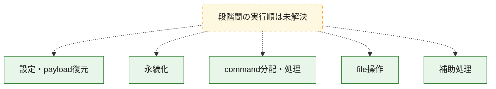
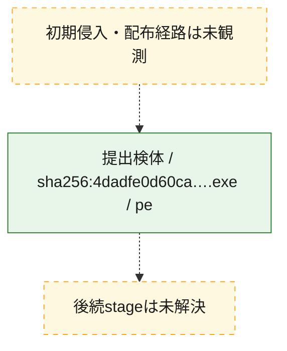
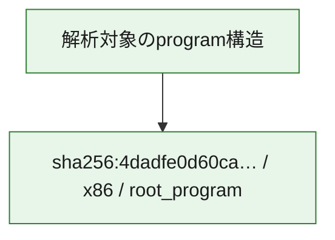

# 全体ロジック：4dadfe0d60ca295ca0a3865cccf3d47c09ffbd05f2e2d76a578e8d645ab72f6b

代表関数の静的証跡から、設定・payload復元、永続化、command分配・処理、file操作の処理群を確認しました。

## 読み方

- phaseの掲載順は解析上の整理順です。observed_call_edgesがない段階間の実行順を断定しません。
- 図の実線は静的に観測した関係、点線と黄色のノードは未観測・未解決の関係を示します。
- 図は静的な要約であり、動的実行を再現するものではありません。
- 詳細な関数解説とfingerprintは[STATIC-LOGIC.md](STATIC-LOGIC.md)を参照してください。

## 静的可視化

### 実行フロー

### 感染チェーン

### モジュール関係

## 処理段階

### 1. 設定・payload復元

設定、resource、payload、暗号化データの復元・変換を確認します。
確度: `confirmed_static_function_evidence`

- `4dadfe0d60ca295ca0a3865cccf3d47c09ffbd05f2e2d76a578e8d645ab72f6b:cil:0x0600000b` — 暗号、hash、encoding、または復号処理に関係する関数です。 状態: `succeeded`、選定理由: `large_function:instructions=560`, `reviewed_call_centrality:44`, `role:cryptographic_transform`
- `4dadfe0d60ca295ca0a3865cccf3d47c09ffbd05f2e2d76a578e8d645ab72f6b:cil:0x0600000c` — 暗号、hash、encoding、または復号処理に関係する関数です。 状態: `succeeded`、選定理由: `large_function:instructions=586`, `reviewed_call_centrality:40`, `role:cryptographic_transform`
- `4dadfe0d60ca295ca0a3865cccf3d47c09ffbd05f2e2d76a578e8d645ab72f6b:cil:0x0600003e` — 暗号、hash、encoding、または復号処理に関係する関数です。 状態: `succeeded`、選定理由: `large_function:instructions=156`, `reviewed_call_centrality:12`, `role:cryptographic_transform`
- `4dadfe0d60ca295ca0a3865cccf3d47c09ffbd05f2e2d76a578e8d645ab72f6b:cil:0x0600003f` — 設定、resource、payloadなどの解析・変換を行う関数です。 状態: `succeeded`、選定理由: `large_function:instructions=84`, `reviewed_call_centrality:20`, `role:config_or_data_transform`
- `4dadfe0d60ca295ca0a3865cccf3d47c09ffbd05f2e2d76a578e8d645ab72f6b:cil:0x06000045` — 設定、resource、payloadなどの解析・変換を行う関数です。 状態: `succeeded`、選定理由: `reviewed_call_centrality:8`, `role:config_or_data_transform`
- `4dadfe0d60ca295ca0a3865cccf3d47c09ffbd05f2e2d76a578e8d645ab72f6b:cil:0x06000046` — 設定、resource、payloadなどの解析・変換を行う関数です。 状態: `succeeded`、選定理由: `reviewed_call_centrality:8`, `role:config_or_data_transform`
- `4dadfe0d60ca295ca0a3865cccf3d47c09ffbd05f2e2d76a578e8d645ab72f6b:cil:0x06000047` — 暗号、hash、encoding、または復号処理に関係する関数です。 状態: `succeeded`、選定理由: `large_function:instructions=301`, `reviewed_call_centrality:26`, `role:cryptographic_transform`
- `4dadfe0d60ca295ca0a3865cccf3d47c09ffbd05f2e2d76a578e8d645ab72f6b:cil:0x0600004b` — 暗号、hash、encoding、または復号処理に関係する関数です。 状態: `succeeded`、選定理由: `large_function:instructions=534`, `reviewed_call_centrality:52`, `role:cryptographic_transform`
- `4dadfe0d60ca295ca0a3865cccf3d47c09ffbd05f2e2d76a578e8d645ab72f6b:cil:0x0600008c` — 暗号、hash、encoding、または復号処理に関係する関数です。 状態: `succeeded`、選定理由: `role:cryptographic_transform`
- `4dadfe0d60ca295ca0a3865cccf3d47c09ffbd05f2e2d76a578e8d645ab72f6b:cil:0x0600008d` — 暗号、hash、encoding、または復号処理に関係する関数です。 状態: `succeeded`、選定理由: `large_function:instructions=64`, `role:cryptographic_transform`

### 2. 永続化

自動起動や永続化に関係する設定変更を確認します。
確度: `confirmed_static_function_evidence`

- `4dadfe0d60ca295ca0a3865cccf3d47c09ffbd05f2e2d76a578e8d645ab72f6b:cil:0x06000050` — 自動起動または永続化に関係する処理を含む関数です。 状態: `succeeded`、選定理由: `reviewed_call_centrality:2`, `role:persistence`
- `4dadfe0d60ca295ca0a3865cccf3d47c09ffbd05f2e2d76a578e8d645ab72f6b:cil:0x0600006d` — 自動起動または永続化に関係する処理を含む関数です。 状態: `succeeded`、選定理由: `reviewed_call_centrality:2`, `role:persistence`
- `4dadfe0d60ca295ca0a3865cccf3d47c09ffbd05f2e2d76a578e8d645ab72f6b:cil:0x06000076` — 自動起動または永続化に関係する処理を含む関数です。 状態: `succeeded`、選定理由: `large_function:instructions=164`, `reviewed_call_centrality:4`, `role:persistence`

### 3. command分配・処理

受信commandやtaskの解釈、分配、個別handlerへの移行を確認します。
確度: `confirmed_static_function_evidence`

- `4dadfe0d60ca295ca0a3865cccf3d47c09ffbd05f2e2d76a578e8d645ab72f6b:cil:0x06000001` — commandの解釈、分配、または個別処理を担当する関数です。 状態: `succeeded`、選定理由: `reviewed_call_centrality:2`, `role:command_dispatch_or_handler`
- `4dadfe0d60ca295ca0a3865cccf3d47c09ffbd05f2e2d76a578e8d645ab72f6b:cil:0x06000002` — commandの解釈、分配、または個別処理を担当する関数です。 状態: `succeeded`、選定理由: `reviewed_call_centrality:16`, `role:command_dispatch_or_handler`
- `4dadfe0d60ca295ca0a3865cccf3d47c09ffbd05f2e2d76a578e8d645ab72f6b:cil:0x06000003` — commandの解釈、分配、または個別処理を担当する関数です。 状態: `succeeded`、選定理由: `large_function:instructions=134`, `reviewed_call_centrality:30`, `role:command_dispatch_or_handler`
- `4dadfe0d60ca295ca0a3865cccf3d47c09ffbd05f2e2d76a578e8d645ab72f6b:cil:0x06000004` — commandの解釈、分配、または個別処理を担当する関数です。 状態: `succeeded`、選定理由: `reviewed_call_centrality:2`, `role:command_dispatch_or_handler`

### 4. file操作

fileやdirectoryの作成、読書き、削除を確認します。
確度: `confirmed_static_function_evidence`

- `4dadfe0d60ca295ca0a3865cccf3d47c09ffbd05f2e2d76a578e8d645ab72f6b:cil:0x0600009d` — fileまたはdirectoryの読書き・管理に関係する関数です。 状態: `succeeded`、選定理由: `reviewed_call_centrality:2`, `role:file_operation`
- `4dadfe0d60ca295ca0a3865cccf3d47c09ffbd05f2e2d76a578e8d645ab72f6b:cil:0x0600009f` — fileまたはdirectoryの読書き・管理に関係する関数です。 状態: `succeeded`、選定理由: `reviewed_call_centrality:2`, `role:file_operation`
- `4dadfe0d60ca295ca0a3865cccf3d47c09ffbd05f2e2d76a578e8d645ab72f6b:cil:0x060000a1` — fileまたはdirectoryの読書き・管理に関係する関数です。 状態: `succeeded`、選定理由: `reviewed_call_centrality:2`, `role:file_operation`
- `4dadfe0d60ca295ca0a3865cccf3d47c09ffbd05f2e2d76a578e8d645ab72f6b:cil:0x060000a2` — fileまたはdirectoryの読書き・管理に関係する関数です。 状態: `succeeded`、選定理由: `reviewed_call_centrality:2`, `role:file_operation`

### 5. 補助処理

主要処理を支える一般内部関数またはlibrary処理を確認します。
確度: `confirmed_static_function_evidence`

- `4dadfe0d60ca295ca0a3865cccf3d47c09ffbd05f2e2d76a578e8d645ab72f6b:cil:0x06000006` — 検体内部の一般処理を実装する関数です。 状態: `succeeded`、選定理由: `large_function:instructions=122`, `reviewed_call_centrality:26`
- `4dadfe0d60ca295ca0a3865cccf3d47c09ffbd05f2e2d76a578e8d645ab72f6b:cil:0x06000007` — 検体内部の一般処理を実装する関数です。 状態: `succeeded`、選定理由: `reviewed_call_centrality:8`
- `4dadfe0d60ca295ca0a3865cccf3d47c09ffbd05f2e2d76a578e8d645ab72f6b:cil:0x0600004e` — 検体内部の一般処理を実装する関数です。 状態: `succeeded`、選定理由: `large_function:instructions=196`, `reviewed_call_centrality:6`
- `4dadfe0d60ca295ca0a3865cccf3d47c09ffbd05f2e2d76a578e8d645ab72f6b:cil:0x0600005d` — 検体内部の一般処理を実装する関数です。 状態: `succeeded`、選定理由: `large_function:instructions=102`, `reviewed_call_centrality:6`
- `4dadfe0d60ca295ca0a3865cccf3d47c09ffbd05f2e2d76a578e8d645ab72f6b:cil:0x06000067` — 検体内部の一般処理を実装する関数です。 状態: `succeeded`、選定理由: `large_function:instructions=298`, `reviewed_call_centrality:2`
- `4dadfe0d60ca295ca0a3865cccf3d47c09ffbd05f2e2d76a578e8d645ab72f6b:cil:0x0600006a` — 検体内部の一般処理を実装する関数です。 状態: `succeeded`、選定理由: `large_function:instructions=277`, `reviewed_call_centrality:4`
- `4dadfe0d60ca295ca0a3865cccf3d47c09ffbd05f2e2d76a578e8d645ab72f6b:cil:0x0600007e` — 検体内部の一般処理を実装する関数です。 状態: `succeeded`、選定理由: `large_function:instructions=227`, `reviewed_call_centrality:4`
- `4dadfe0d60ca295ca0a3865cccf3d47c09ffbd05f2e2d76a578e8d645ab72f6b:cil:0x06000087` — 検体内部の一般処理を実装する関数です。 状態: `succeeded`、選定理由: `large_function:instructions=412`, `reviewed_call_centrality:6`
- `4dadfe0d60ca295ca0a3865cccf3d47c09ffbd05f2e2d76a578e8d645ab72f6b:cil:0x0600008f` — 検体内部の一般処理を実装する関数です。 状態: `succeeded`、選定理由: `large_function:instructions=105`, `reviewed_call_centrality:6`
- `4dadfe0d60ca295ca0a3865cccf3d47c09ffbd05f2e2d76a578e8d645ab72f6b:cil:0x06000090` — 検体内部の一般処理を実装する関数です。 状態: `succeeded`、選定理由: `large_function:instructions=343`, `reviewed_call_centrality:4`
- `4dadfe0d60ca295ca0a3865cccf3d47c09ffbd05f2e2d76a578e8d645ab72f6b:cil:0x06000091` — 検体内部の一般処理を実装する関数です。 状態: `succeeded`、選定理由: `large_function:instructions=286`, `reviewed_call_centrality:4`

## 観測したcall関係

- 代表関数間で直接解決できた呼出関係はありません。

## 解析範囲と制約

- 選定外関数は全体inventoryへ残しますが、関数本体の個別解説対象にはしていません。
- indirect call、難読化、packer、VM、壊れたcontrol flowによりcall関係が欠落する場合があります。
- 文書は静的解析に基づき、検体実行や外部通信による動的確認は行っていません。
