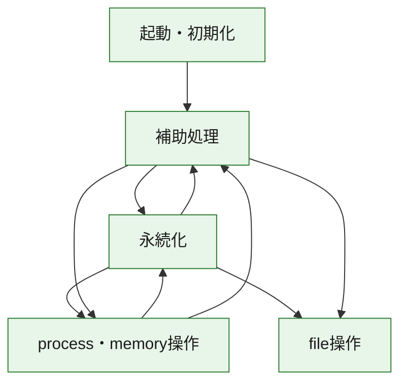
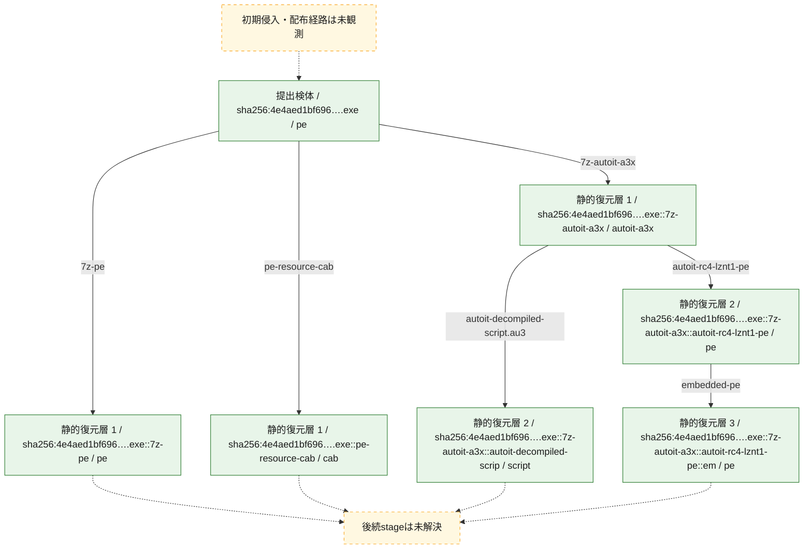
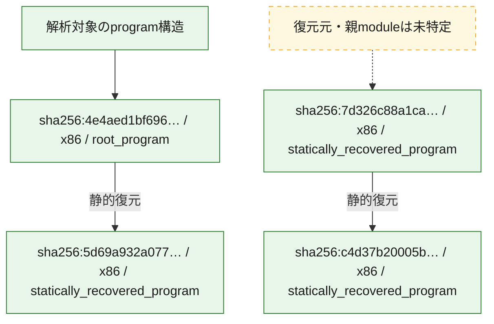

# 全体ロジック：4e4aed1bf696fda2e50e63aaa99c1995a8c2da88c2ba2eaf770189d29e6f1ec0

代表関数の静的証跡から、起動・初期化、永続化、process・memory操作、file操作の処理群を確認しました。

## 読み方

- phaseの掲載順は解析上の整理順です。observed_call_edgesがない段階間の実行順を断定しません。
- 図の実線は静的に観測した関係、点線と黄色のノードは未観測・未解決の関係を示します。
- 図は静的な要約であり、動的実行を再現するものではありません。
- 詳細な関数解説とfingerprintは[STATIC-LOGIC.md](STATIC-LOGIC.md)を参照してください。

## 静的可視化

### 実行フロー

### 感染チェーン

### モジュール関係

## 処理段階

### 1. 起動・初期化

entry pointから初期化と後続処理への移行を確認します。
確度: `confirmed_static_function_evidence`

- `c4d37b20005b55afce3748337a35dfebc31dd8a06c808849a6c5e74e6b25d03b:ghidra:140001800` — 初期化と主要処理への分岐を行う入口関数です。 状態: `succeeded`、選定理由: `entry_point`, `meaningful_symbol_name`, `reviewed_call_centrality:4`, `role:entrypoint`, `small_program_complete_context`
- `7d326c88a1ca9092966ba9c89727f46695df40639413cfa8a82671d3078c579e:ghidra:140048d20` — 初期化と主要処理への分岐を行う入口関数です。 状態: `succeeded`、選定理由: `entry_point`, `meaningful_symbol_name`, `reviewed_call_centrality:21`, `role:entrypoint`
- `5d69a932a077fee044b193c28e84564143f5c7e51079ab48e88fef74ab0b77b7:ghidra:140024750` — 初期化と主要処理への分岐を行う入口関数です。 状態: `succeeded`、選定理由: `entry_point`, `meaningful_symbol_name`, `reviewed_call_centrality:22`, `role:entrypoint`
- `4e4aed1bf696fda2e50e63aaa99c1995a8c2da88c2ba2eaf770189d29e6f1ec0:ghidra:1400079b0` — 初期化と主要処理への分岐を行う入口関数です。 状態: `succeeded`、選定理由: `entry_point`, `meaningful_symbol_name`, `reviewed_call_centrality:18`, `role:entrypoint`

### 2. 永続化

自動起動や永続化に関係する設定変更を確認します。
確度: `confirmed_static_function_evidence`

- `4e4aed1bf696fda2e50e63aaa99c1995a8c2da88c2ba2eaf770189d29e6f1ec0:ghidra:140001c38` — 自動起動または永続化に関係する処理を含む関数です。 状態: `succeeded`、選定理由: `context_representative`, `reviewed_call_centrality:28`, `role:persistence`
- `4e4aed1bf696fda2e50e63aaa99c1995a8c2da88c2ba2eaf770189d29e6f1ec0:ghidra:1400030c4` — 自動起動または永続化に関係する処理を含む関数です。 状態: `succeeded`、選定理由: `context_representative`, `reviewed_call_centrality:18`, `role:persistence`
- `4e4aed1bf696fda2e50e63aaa99c1995a8c2da88c2ba2eaf770189d29e6f1ec0:ghidra:140003e4c` — 自動起動または永続化に関係する処理を含む関数です。 状態: `succeeded`、選定理由: `context_representative`, `reviewed_call_centrality:32`, `role:persistence`

### 3. process・memory操作

process、thread、module、memory操作と実行移行を確認します。
確度: `confirmed_static_function_evidence`

- `4e4aed1bf696fda2e50e63aaa99c1995a8c2da88c2ba2eaf770189d29e6f1ec0:ghidra:1400011c0` — process、thread、module、またはmemory操作に関係する関数です。 状態: `succeeded`、選定理由: `context_representative`, `reviewed_call_centrality:13`, `role:process_or_memory_operation`
- `4e4aed1bf696fda2e50e63aaa99c1995a8c2da88c2ba2eaf770189d29e6f1ec0:ghidra:140002e28` — process、thread、module、またはmemory操作に関係する関数です。 状態: `succeeded`、選定理由: `context_representative`, `reviewed_call_centrality:31`, `role:process_or_memory_operation`
- `4e4aed1bf696fda2e50e63aaa99c1995a8c2da88c2ba2eaf770189d29e6f1ec0:ghidra:140003720` — process、thread、module、またはmemory操作に関係する関数です。 状態: `succeeded`、選定理由: `context_representative`, `reviewed_call_centrality:22`, `role:process_or_memory_operation`
- `4e4aed1bf696fda2e50e63aaa99c1995a8c2da88c2ba2eaf770189d29e6f1ec0:ghidra:140004478` — process、thread、module、またはmemory操作に関係する関数です。 状態: `succeeded`、選定理由: `context_representative`, `reviewed_call_centrality:17`, `role:process_or_memory_operation`

### 4. file操作

fileやdirectoryの作成、読書き、削除を確認します。
確度: `confirmed_static_function_evidence`

- `c4d37b20005b55afce3748337a35dfebc31dd8a06c808849a6c5e74e6b25d03b:ghidra:140001390` — fileまたはdirectoryの読書き・管理に関係する関数です。 状態: `succeeded`、選定理由: `context_representative`, `reviewed_call_centrality:13`, `role:file_operation`, `small_program_complete_context`
- `c4d37b20005b55afce3748337a35dfebc31dd8a06c808849a6c5e74e6b25d03b:ghidra:140001460` — fileまたはdirectoryの読書き・管理に関係する関数です。 状態: `succeeded`、選定理由: `context_representative`, `reviewed_call_centrality:9`, `role:file_operation`, `small_program_complete_context`
- `4e4aed1bf696fda2e50e63aaa99c1995a8c2da88c2ba2eaf770189d29e6f1ec0:ghidra:140001f00` — fileまたはdirectoryの読書き・管理に関係する関数です。 状態: `succeeded`、選定理由: `context_representative`, `reviewed_call_centrality:19`, `role:file_operation`

### 5. 補助処理

主要処理を支える一般内部関数またはlibrary処理を確認します。
確度: `confirmed_static_function_evidence_with_limits`

- `c4d37b20005b55afce3748337a35dfebc31dd8a06c808849a6c5e74e6b25d03b:ghidra:140001000` — 検体内部の一般処理を実装する関数です。 状態: `succeeded`、選定理由: `context_representative`, `reviewed_call_centrality:1`, `small_program_complete_context`
- `c4d37b20005b55afce3748337a35dfebc31dd8a06c808849a6c5e74e6b25d03b:ghidra:140001054` — 検体内部の一般処理を実装する関数です。 状態: `succeeded`、選定理由: `context_representative`, `reviewed_call_centrality:13`, `small_program_complete_context`
- `c4d37b20005b55afce3748337a35dfebc31dd8a06c808849a6c5e74e6b25d03b:ghidra:1400011a8` — 検体内部の一般処理を実装する関数です。 状態: `succeeded`、選定理由: `context_representative`, `reviewed_call_centrality:8`, `small_program_complete_context`
- `c4d37b20005b55afce3748337a35dfebc31dd8a06c808849a6c5e74e6b25d03b:ghidra:140001504` — 検体内部の一般処理を実装する関数です。 状態: `succeeded`、選定理由: `context_representative`, `reviewed_call_centrality:7`, `small_program_complete_context`
- `c4d37b20005b55afce3748337a35dfebc31dd8a06c808849a6c5e74e6b25d03b:ghidra:1400015b8` — 検体内部の一般処理を実装する関数です。 状態: `succeeded`、選定理由: `context_representative`, `reviewed_call_centrality:20`, `small_program_complete_context`
- `c4d37b20005b55afce3748337a35dfebc31dd8a06c808849a6c5e74e6b25d03b:ghidra:14000181c` — 検体内部の一般処理を実装する関数です。 状態: `succeeded`、選定理由: `context_representative`, `reviewed_call_centrality:7`, `small_program_complete_context`
- `c4d37b20005b55afce3748337a35dfebc31dd8a06c808849a6c5e74e6b25d03b:ghidra:140001a30` — 検体内部の一般処理を実装する関数です。 状態: `succeeded`、選定理由: `context_representative`, `reviewed_call_centrality:1`, `small_program_complete_context`
- `c4d37b20005b55afce3748337a35dfebc31dd8a06c808849a6c5e74e6b25d03b:ghidra:140001ad8` — 検体内部の一般処理を実装する関数です。 状態: `succeeded`、選定理由: `context_representative`, `reviewed_call_centrality:1`, `small_program_complete_context`
- `c4d37b20005b55afce3748337a35dfebc31dd8a06c808849a6c5e74e6b25d03b:ghidra:140001be0` — 検体内部の一般処理を実装する関数です。 状態: `succeeded`、選定理由: `context_representative`, `reviewed_call_centrality:3`, `small_program_complete_context`
- `7d326c88a1ca9092966ba9c89727f46695df40639413cfa8a82671d3078c579e:ghidra:140001ca0` — 検体内部の一般処理を実装する関数です。 状態: `succeeded`、選定理由: `context_representative`, `reviewed_call_centrality:5`
- `7d326c88a1ca9092966ba9c89727f46695df40639413cfa8a82671d3078c579e:ghidra:140001d20` — 検体内部の一般処理を実装する関数です。 状態: `succeeded`、選定理由: `context_representative`, `reviewed_call_centrality:3`
- `7d326c88a1ca9092966ba9c89727f46695df40639413cfa8a82671d3078c579e:ghidra:140001d40` — 検体内部の一般処理を実装する関数です。 状態: `succeeded`、選定理由: `context_representative`, `reviewed_call_centrality:1`
- `7d326c88a1ca9092966ba9c89727f46695df40639413cfa8a82671d3078c579e:ghidra:140001d90` — 検体内部の一般処理を実装する関数です。 状態: `succeeded`、選定理由: `context_representative`, `reviewed_call_centrality:2`
- `7d326c88a1ca9092966ba9c89727f46695df40639413cfa8a82671d3078c579e:ghidra:140001e20` — 検体内部の一般処理を実装する関数です。 状態: `succeeded`、選定理由: `context_representative`, `reviewed_call_centrality:4`
- `7d326c88a1ca9092966ba9c89727f46695df40639413cfa8a82671d3078c579e:ghidra:140001e40` — 検体内部の一般処理を実装する関数です。 状態: `succeeded`、選定理由: `context_representative`, `reviewed_call_centrality:1`
- `7d326c88a1ca9092966ba9c89727f46695df40639413cfa8a82671d3078c579e:ghidra:140001e7c` — 検体内部の一般処理を実装する関数です。 状態: `succeeded`、選定理由: `context_representative`, `reviewed_call_centrality:1`
- `7d326c88a1ca9092966ba9c89727f46695df40639413cfa8a82671d3078c579e:ghidra:140001eb8` — 検体内部の一般処理を実装する関数です。 状態: `succeeded`、選定理由: `context_representative`, `reviewed_call_centrality:10`
- `7d326c88a1ca9092966ba9c89727f46695df40639413cfa8a82671d3078c579e:ghidra:140001ecc` — 検体内部の一般処理を実装する関数です。 状態: `succeeded`、選定理由: `context_representative`, `reviewed_call_centrality:8`
- `7d326c88a1ca9092966ba9c89727f46695df40639413cfa8a82671d3078c579e:ghidra:140002ae0` — 検体内部の一般処理を実装する関数です。 状態: `succeeded`、選定理由: `context_representative`, `reviewed_call_centrality:9`
- `7d326c88a1ca9092966ba9c89727f46695df40639413cfa8a82671d3078c579e:ghidra:140007814` — 検体内部の一般処理を実装する関数です。 状態: `succeeded`、選定理由: `context_representative`, `reviewed_call_centrality:1`
- `7d326c88a1ca9092966ba9c89727f46695df40639413cfa8a82671d3078c579e:ghidra:1400078a8` — 検体内部の一般処理を実装する関数です。 状態: `succeeded`、選定理由: `context_representative`, `reviewed_call_centrality:7`
- `7d326c88a1ca9092966ba9c89727f46695df40639413cfa8a82671d3078c579e:ghidra:140007900` — 検体内部の一般処理を実装する関数です。 状態: `succeeded`、選定理由: `context_representative`, `reviewed_call_centrality:6`
- `7d326c88a1ca9092966ba9c89727f46695df40639413cfa8a82671d3078c579e:ghidra:1400079dc` — 検体内部の一般処理を実装する関数です。 状態: `succeeded`、選定理由: `context_representative`, `reviewed_call_centrality:3`
- `7d326c88a1ca9092966ba9c89727f46695df40639413cfa8a82671d3078c579e:ghidra:140007a40` — 検体内部の一般処理を実装する関数です。 状態: `succeeded`、選定理由: `context_representative`, `reviewed_call_centrality:3`
- `7d326c88a1ca9092966ba9c89727f46695df40639413cfa8a82671d3078c579e:ghidra:140007a8c` — 検体内部の一般処理を実装する関数です。 状態: `succeeded`、選定理由: `context_representative`, `reviewed_call_centrality:3`
- `7d326c88a1ca9092966ba9c89727f46695df40639413cfa8a82671d3078c579e:ghidra:140007ad8` — 検体内部の一般処理を実装する関数です。 状態: `succeeded`、選定理由: `context_representative`, `reviewed_call_centrality:11`
- `7d326c88a1ca9092966ba9c89727f46695df40639413cfa8a82671d3078c579e:ghidra:140007b98` — 検体内部の一般処理を実装する関数です。 状態: `succeeded`、選定理由: `context_representative`, `reviewed_call_centrality:10`
- `7d326c88a1ca9092966ba9c89727f46695df40639413cfa8a82671d3078c579e:ghidra:140007c00` — 検体内部の一般処理を実装する関数です。 状態: `succeeded`、選定理由: `context_representative`, `reviewed_call_centrality:8`
- `7d326c88a1ca9092966ba9c89727f46695df40639413cfa8a82671d3078c579e:ghidra:140007cfc` — 検体内部の一般処理を実装する関数です。 状態: `succeeded`、選定理由: `context_representative`, `reviewed_call_centrality:8`
- `7d326c88a1ca9092966ba9c89727f46695df40639413cfa8a82671d3078c579e:ghidra:140007d38` — 検体内部の一般処理を実装する関数です。 状態: `succeeded`、選定理由: `context_representative`, `reviewed_call_centrality:13`
- `7d326c88a1ca9092966ba9c89727f46695df40639413cfa8a82671d3078c579e:ghidra:140008520` — 検体内部の一般処理を実装する関数です。 状態: `failed_empty`、選定理由: `context_representative`
- `7d326c88a1ca9092966ba9c89727f46695df40639413cfa8a82671d3078c579e:ghidra:140008704` — 検体内部の一般処理を実装する関数です。 状態: `failed_empty`、選定理由: `context_representative`
- `7d326c88a1ca9092966ba9c89727f46695df40639413cfa8a82671d3078c579e:ghidra:1400087cc` — 検体内部の一般処理を実装する関数です。 状態: `succeeded`、選定理由: `context_representative`, `reviewed_call_centrality:3`
- `7d326c88a1ca9092966ba9c89727f46695df40639413cfa8a82671d3078c579e:ghidra:140008844` — 検体内部の一般処理を実装する関数です。 状態: `limited_bad_instruction_or_flow`、選定理由: `context_representative`, `reviewed_call_centrality:7`
- `7d326c88a1ca9092966ba9c89727f46695df40639413cfa8a82671d3078c579e:ghidra:1400088f4` — 検体内部の一般処理を実装する関数です。 状態: `succeeded`、選定理由: `context_representative`, `reviewed_call_centrality:7`
- `7d326c88a1ca9092966ba9c89727f46695df40639413cfa8a82671d3078c579e:ghidra:140008a38` — 検体内部の一般処理を実装する関数です。 状態: `succeeded`、選定理由: `context_representative`, `reviewed_call_centrality:17`
- `7d326c88a1ca9092966ba9c89727f46695df40639413cfa8a82671d3078c579e:ghidra:140009200` — 検体内部の一般処理を実装する関数です。 状態: `succeeded`、選定理由: `context_representative`, `reviewed_call_centrality:7`
- `7d326c88a1ca9092966ba9c89727f46695df40639413cfa8a82671d3078c579e:ghidra:140009478` — 検体内部の一般処理を実装する関数です。 状態: `succeeded`、選定理由: `context_representative`, `reviewed_call_centrality:19`
- `7d326c88a1ca9092966ba9c89727f46695df40639413cfa8a82671d3078c579e:ghidra:140009af4` — 検体内部の一般処理を実装する関数です。 状態: `failed_empty`、選定理由: `context_representative`
- `7d326c88a1ca9092966ba9c89727f46695df40639413cfa8a82671d3078c579e:ghidra:140009b5c` — 検体内部の一般処理を実装する関数です。 状態: `failed_empty`、選定理由: `context_representative`, `reviewed_call_centrality:2`
- `5d69a932a077fee044b193c28e84564143f5c7e51079ab48e88fef74ab0b77b7:ghidra:140001000` — 検体内部の一般処理を実装する関数です。 状態: `succeeded`、選定理由: `context_representative`, `reviewed_call_centrality:2`
- `5d69a932a077fee044b193c28e84564143f5c7e51079ab48e88fef74ab0b77b7:ghidra:14000102c` — 検体内部の一般処理を実装する関数です。 状態: `succeeded`、選定理由: `context_representative`, `reviewed_call_centrality:2`
- `5d69a932a077fee044b193c28e84564143f5c7e51079ab48e88fef74ab0b77b7:ghidra:140001048` — 検体内部の一般処理を実装する関数です。 状態: `succeeded`、選定理由: `context_representative`, `reviewed_call_centrality:2`
- `5d69a932a077fee044b193c28e84564143f5c7e51079ab48e88fef74ab0b77b7:ghidra:140001064` — 検体内部の一般処理を実装する関数です。 状態: `succeeded`、選定理由: `context_representative`, `reviewed_call_centrality:2`
- `5d69a932a077fee044b193c28e84564143f5c7e51079ab48e88fef74ab0b77b7:ghidra:140001080` — 検体内部の一般処理を実装する関数です。 状態: `succeeded`、選定理由: `context_representative`, `reviewed_call_centrality:2`
- `5d69a932a077fee044b193c28e84564143f5c7e51079ab48e88fef74ab0b77b7:ghidra:1400010b0` — 検体内部の一般処理を実装する関数です。 状態: `succeeded`、選定理由: `context_representative`, `reviewed_call_centrality:2`
- `5d69a932a077fee044b193c28e84564143f5c7e51079ab48e88fef74ab0b77b7:ghidra:1400010cc` — 検体内部の一般処理を実装する関数です。 状態: `succeeded`、選定理由: `context_representative`, `reviewed_call_centrality:2`
- `5d69a932a077fee044b193c28e84564143f5c7e51079ab48e88fef74ab0b77b7:ghidra:1400010e8` — 検体内部の一般処理を実装する関数です。 状態: `succeeded`、選定理由: `context_representative`, `reviewed_call_centrality:2`
- `5d69a932a077fee044b193c28e84564143f5c7e51079ab48e88fef74ab0b77b7:ghidra:140001104` — 検体内部の一般処理を実装する関数です。 状態: `succeeded`、選定理由: `context_representative`, `reviewed_call_centrality:2`
- `5d69a932a077fee044b193c28e84564143f5c7e51079ab48e88fef74ab0b77b7:ghidra:140001120` — 検体内部の一般処理を実装する関数です。 状態: `succeeded`、選定理由: `context_representative`, `reviewed_call_centrality:2`
- `5d69a932a077fee044b193c28e84564143f5c7e51079ab48e88fef74ab0b77b7:ghidra:140001140` — 検体内部の一般処理を実装する関数です。 状態: `succeeded`、選定理由: `context_representative`, `reviewed_call_centrality:9`
- `5d69a932a077fee044b193c28e84564143f5c7e51079ab48e88fef74ab0b77b7:ghidra:1400011c0` — 検体内部の一般処理を実装する関数です。 状態: `succeeded`、選定理由: `context_representative`, `reviewed_call_centrality:3`
- `5d69a932a077fee044b193c28e84564143f5c7e51079ab48e88fef74ab0b77b7:ghidra:14000120c` — 検体内部の一般処理を実装する関数です。 状態: `succeeded`、選定理由: `context_representative`, `reviewed_call_centrality:6`
- `5d69a932a077fee044b193c28e84564143f5c7e51079ab48e88fef74ab0b77b7:ghidra:140001328` — 検体内部の一般処理を実装する関数です。 状態: `succeeded`、選定理由: `context_representative`, `reviewed_call_centrality:3`
- `5d69a932a077fee044b193c28e84564143f5c7e51079ab48e88fef74ab0b77b7:ghidra:140001364` — 検体内部の一般処理を実装する関数です。 状態: `succeeded`、選定理由: `context_representative`, `reviewed_call_centrality:11`
- `5d69a932a077fee044b193c28e84564143f5c7e51079ab48e88fef74ab0b77b7:ghidra:1400014a0` — 検体内部の一般処理を実装する関数です。 状態: `limited_bad_instruction_or_flow`、選定理由: `context_representative`, `reviewed_call_centrality:4`
- `5d69a932a077fee044b193c28e84564143f5c7e51079ab48e88fef74ab0b77b7:ghidra:14000158c` — 検体内部の一般処理を実装する関数です。 状態: `succeeded`、選定理由: `context_representative`, `reviewed_call_centrality:4`
- `5d69a932a077fee044b193c28e84564143f5c7e51079ab48e88fef74ab0b77b7:ghidra:140001674` — 検体内部の一般処理を実装する関数です。 状態: `succeeded`、選定理由: `context_representative`, `reviewed_call_centrality:7`
- `5d69a932a077fee044b193c28e84564143f5c7e51079ab48e88fef74ab0b77b7:ghidra:140001750` — 検体内部の一般処理を実装する関数です。 状態: `succeeded`、選定理由: `context_representative`, `reviewed_call_centrality:4`
- `5d69a932a077fee044b193c28e84564143f5c7e51079ab48e88fef74ab0b77b7:ghidra:14000178c` — 検体内部の一般処理を実装する関数です。 状態: `succeeded`、選定理由: `context_representative`, `reviewed_call_centrality:17`
- `5d69a932a077fee044b193c28e84564143f5c7e51079ab48e88fef74ab0b77b7:ghidra:140001a18` — 検体内部の一般処理を実装する関数です。 状態: `succeeded`、選定理由: `context_representative`, `reviewed_call_centrality:3`
- `5d69a932a077fee044b193c28e84564143f5c7e51079ab48e88fef74ab0b77b7:ghidra:140001a5c` — 検体内部の一般処理を実装する関数です。 状態: `succeeded`、選定理由: `context_representative`, `reviewed_call_centrality:5`
- `5d69a932a077fee044b193c28e84564143f5c7e51079ab48e88fef74ab0b77b7:ghidra:140001b30` — 検体内部の一般処理を実装する関数です。 状態: `succeeded`、選定理由: `context_representative`, `reviewed_call_centrality:2`
- `5d69a932a077fee044b193c28e84564143f5c7e51079ab48e88fef74ab0b77b7:ghidra:140001b5c` — 検体内部の一般処理を実装する関数です。 状態: `succeeded`、選定理由: `context_representative`, `reviewed_call_centrality:3`
- `5d69a932a077fee044b193c28e84564143f5c7e51079ab48e88fef74ab0b77b7:ghidra:140001bb0` — 検体内部の一般処理を実装する関数です。 状態: `succeeded`、選定理由: `context_representative`, `reviewed_call_centrality:11`
- `5d69a932a077fee044b193c28e84564143f5c7e51079ab48e88fef74ab0b77b7:ghidra:140001bfc` — 検体内部の一般処理を実装する関数です。 状態: `succeeded`、選定理由: `context_representative`, `reviewed_call_centrality:25`
- `5d69a932a077fee044b193c28e84564143f5c7e51079ab48e88fef74ab0b77b7:ghidra:140001d9c` — 検体内部の一般処理を実装する関数です。 状態: `succeeded`、選定理由: `context_representative`, `reviewed_call_centrality:9`
- `5d69a932a077fee044b193c28e84564143f5c7e51079ab48e88fef74ab0b77b7:ghidra:140001dd0` — 検体内部の一般処理を実装する関数です。 状態: `succeeded`、選定理由: `context_representative`, `reviewed_call_centrality:5`
- `5d69a932a077fee044b193c28e84564143f5c7e51079ab48e88fef74ab0b77b7:ghidra:140001e64` — 検体内部の一般処理を実装する関数です。 状態: `succeeded`、選定理由: `context_representative`, `reviewed_call_centrality:8`
- `5d69a932a077fee044b193c28e84564143f5c7e51079ab48e88fef74ab0b77b7:ghidra:140001e8c` — 検体内部の一般処理を実装する関数です。 状態: `succeeded`、選定理由: `context_representative`, `reviewed_call_centrality:8`
- `5d69a932a077fee044b193c28e84564143f5c7e51079ab48e88fef74ab0b77b7:ghidra:140001eb4` — 検体内部の一般処理を実装する関数です。 状態: `succeeded`、選定理由: `context_representative`, `reviewed_call_centrality:20`
- `4e4aed1bf696fda2e50e63aaa99c1995a8c2da88c2ba2eaf770189d29e6f1ec0:ghidra:140001144` — 検体内部の一般処理を実装する関数です。 状態: `succeeded`、選定理由: `context_representative`, `reviewed_call_centrality:6`
- `4e4aed1bf696fda2e50e63aaa99c1995a8c2da88c2ba2eaf770189d29e6f1ec0:ghidra:1400012c0` — 検体内部の一般処理を実装する関数です。 状態: `succeeded`、選定理由: `context_representative`, `reviewed_call_centrality:23`
- `4e4aed1bf696fda2e50e63aaa99c1995a8c2da88c2ba2eaf770189d29e6f1ec0:ghidra:140001490` — 検体内部の一般処理を実装する関数です。 状態: `succeeded`、選定理由: `context_representative`, `reviewed_call_centrality:12`
- `4e4aed1bf696fda2e50e63aaa99c1995a8c2da88c2ba2eaf770189d29e6f1ec0:ghidra:14000155c` — 検体内部の一般処理を実装する関数です。 状態: `succeeded`、選定理由: `context_representative`, `reviewed_call_centrality:2`
- `4e4aed1bf696fda2e50e63aaa99c1995a8c2da88c2ba2eaf770189d29e6f1ec0:ghidra:1400015f8` — 検体内部の一般処理を実装する関数です。 状態: `succeeded`、選定理由: `context_representative`, `reviewed_call_centrality:23`
- `4e4aed1bf696fda2e50e63aaa99c1995a8c2da88c2ba2eaf770189d29e6f1ec0:ghidra:140001b44` — 検体内部の一般処理を実装する関数です。 状態: `succeeded`、選定理由: `context_representative`, `reviewed_call_centrality:16`
- `4e4aed1bf696fda2e50e63aaa99c1995a8c2da88c2ba2eaf770189d29e6f1ec0:ghidra:1400020c0` — 検体内部の一般処理を実装する関数です。 状態: `succeeded`、選定理由: `context_representative`, `reviewed_call_centrality:13`
- `4e4aed1bf696fda2e50e63aaa99c1995a8c2da88c2ba2eaf770189d29e6f1ec0:ghidra:140002174` — 検体内部の一般処理を実装する関数です。 状態: `succeeded`、選定理由: `context_representative`, `reviewed_call_centrality:12`
- `4e4aed1bf696fda2e50e63aaa99c1995a8c2da88c2ba2eaf770189d29e6f1ec0:ghidra:14000229c` — 検体内部の一般処理を実装する関数です。 状態: `succeeded`、選定理由: `context_representative`, `reviewed_call_centrality:4`
- `4e4aed1bf696fda2e50e63aaa99c1995a8c2da88c2ba2eaf770189d29e6f1ec0:ghidra:140002324` — 検体内部の一般処理を実装する関数です。 状態: `succeeded`、選定理由: `context_representative`, `reviewed_call_centrality:3`
- `4e4aed1bf696fda2e50e63aaa99c1995a8c2da88c2ba2eaf770189d29e6f1ec0:ghidra:140002448` — 検体内部の一般処理を実装する関数です。 状態: `succeeded`、選定理由: `context_representative`, `reviewed_call_centrality:20`
- `4e4aed1bf696fda2e50e63aaa99c1995a8c2da88c2ba2eaf770189d29e6f1ec0:ghidra:140002628` — 検体内部の一般処理を実装する関数です。 状態: `succeeded`、選定理由: `context_representative`, `reviewed_call_centrality:16`
- `4e4aed1bf696fda2e50e63aaa99c1995a8c2da88c2ba2eaf770189d29e6f1ec0:ghidra:140002830` — 検体内部の一般処理を実装する関数です。 状態: `succeeded`、選定理由: `context_representative`, `reviewed_call_centrality:14`
- `4e4aed1bf696fda2e50e63aaa99c1995a8c2da88c2ba2eaf770189d29e6f1ec0:ghidra:1400029e4` — 検体内部の一般処理を実装する関数です。 状態: `succeeded`、選定理由: `context_representative`, `reviewed_call_centrality:18`
- `4e4aed1bf696fda2e50e63aaa99c1995a8c2da88c2ba2eaf770189d29e6f1ec0:ghidra:140002b24` — 検体内部の一般処理を実装する関数です。 状態: `succeeded`、選定理由: `context_representative`, `reviewed_call_centrality:27`
- `4e4aed1bf696fda2e50e63aaa99c1995a8c2da88c2ba2eaf770189d29e6f1ec0:ghidra:140003260` — 検体内部の一般処理を実装する関数です。 状態: `succeeded`、選定理由: `context_representative`, `reviewed_call_centrality:2`
- `4e4aed1bf696fda2e50e63aaa99c1995a8c2da88c2ba2eaf770189d29e6f1ec0:ghidra:1400032b0` — 検体内部の一般処理を実装する関数です。 状態: `succeeded`、選定理由: `context_representative`, `reviewed_call_centrality:19`
- `4e4aed1bf696fda2e50e63aaa99c1995a8c2da88c2ba2eaf770189d29e6f1ec0:ghidra:1400033c0` — 検体内部の一般処理を実装する関数です。 状態: `succeeded`、選定理由: `context_representative`, `reviewed_call_centrality:29`
- `4e4aed1bf696fda2e50e63aaa99c1995a8c2da88c2ba2eaf770189d29e6f1ec0:ghidra:140003680` — 検体内部の一般処理を実装する関数です。 状態: `succeeded`、選定理由: `context_representative`, `reviewed_call_centrality:11`
- `4e4aed1bf696fda2e50e63aaa99c1995a8c2da88c2ba2eaf770189d29e6f1ec0:ghidra:140003908` — 検体内部の一般処理を実装する関数です。 状態: `succeeded`、選定理由: `context_representative`, `reviewed_call_centrality:7`
- `4e4aed1bf696fda2e50e63aaa99c1995a8c2da88c2ba2eaf770189d29e6f1ec0:ghidra:1400039a0` — 検体内部の一般処理を実装する関数です。 状態: `succeeded`、選定理由: `context_representative`, `reviewed_call_centrality:12`
- `4e4aed1bf696fda2e50e63aaa99c1995a8c2da88c2ba2eaf770189d29e6f1ec0:ghidra:140003d0c` — 検体内部の一般処理を実装する関数です。 状態: `succeeded`、選定理由: `context_representative`, `reviewed_call_centrality:13`
- `4e4aed1bf696fda2e50e63aaa99c1995a8c2da88c2ba2eaf770189d29e6f1ec0:ghidra:14000466c` — 検体内部の一般処理を実装する関数です。 状態: `succeeded`、選定理由: `context_representative`, `reviewed_call_centrality:9`

## 観測したcall関係

- `4e4aed1bf696fda2e50e63aaa99c1995a8c2da88c2ba2eaf770189d29e6f1ec0:ghidra:1400012c0` → `4e4aed1bf696fda2e50e63aaa99c1995a8c2da88c2ba2eaf770189d29e6f1ec0:ghidra:1400011c0` （`support` → `execution`）
- `4e4aed1bf696fda2e50e63aaa99c1995a8c2da88c2ba2eaf770189d29e6f1ec0:ghidra:1400015f8` → `4e4aed1bf696fda2e50e63aaa99c1995a8c2da88c2ba2eaf770189d29e6f1ec0:ghidra:140001144` （`support` → `support`）
- `4e4aed1bf696fda2e50e63aaa99c1995a8c2da88c2ba2eaf770189d29e6f1ec0:ghidra:1400015f8` → `4e4aed1bf696fda2e50e63aaa99c1995a8c2da88c2ba2eaf770189d29e6f1ec0:ghidra:14000155c` （`support` → `support`）
- `4e4aed1bf696fda2e50e63aaa99c1995a8c2da88c2ba2eaf770189d29e6f1ec0:ghidra:1400015f8` → `4e4aed1bf696fda2e50e63aaa99c1995a8c2da88c2ba2eaf770189d29e6f1ec0:ghidra:140002830` （`support` → `support`）
- `4e4aed1bf696fda2e50e63aaa99c1995a8c2da88c2ba2eaf770189d29e6f1ec0:ghidra:140001c38` → `4e4aed1bf696fda2e50e63aaa99c1995a8c2da88c2ba2eaf770189d29e6f1ec0:ghidra:140001144` （`persistence` → `support`）
- `4e4aed1bf696fda2e50e63aaa99c1995a8c2da88c2ba2eaf770189d29e6f1ec0:ghidra:140002174` → `4e4aed1bf696fda2e50e63aaa99c1995a8c2da88c2ba2eaf770189d29e6f1ec0:ghidra:1400020c0` （`support` → `support`）
- `4e4aed1bf696fda2e50e63aaa99c1995a8c2da88c2ba2eaf770189d29e6f1ec0:ghidra:140002324` → `4e4aed1bf696fda2e50e63aaa99c1995a8c2da88c2ba2eaf770189d29e6f1ec0:ghidra:140001144` （`support` → `support`）
- `4e4aed1bf696fda2e50e63aaa99c1995a8c2da88c2ba2eaf770189d29e6f1ec0:ghidra:140002628` → `4e4aed1bf696fda2e50e63aaa99c1995a8c2da88c2ba2eaf770189d29e6f1ec0:ghidra:140002448` （`support` → `support`）
- `4e4aed1bf696fda2e50e63aaa99c1995a8c2da88c2ba2eaf770189d29e6f1ec0:ghidra:1400029e4` → `4e4aed1bf696fda2e50e63aaa99c1995a8c2da88c2ba2eaf770189d29e6f1ec0:ghidra:140001b44` （`support` → `support`）
- `4e4aed1bf696fda2e50e63aaa99c1995a8c2da88c2ba2eaf770189d29e6f1ec0:ghidra:1400029e4` → `4e4aed1bf696fda2e50e63aaa99c1995a8c2da88c2ba2eaf770189d29e6f1ec0:ghidra:140002174` （`support` → `support`）
- `4e4aed1bf696fda2e50e63aaa99c1995a8c2da88c2ba2eaf770189d29e6f1ec0:ghidra:1400029e4` → `4e4aed1bf696fda2e50e63aaa99c1995a8c2da88c2ba2eaf770189d29e6f1ec0:ghidra:140002b24` （`support` → `support`）
- `4e4aed1bf696fda2e50e63aaa99c1995a8c2da88c2ba2eaf770189d29e6f1ec0:ghidra:1400029e4` → `4e4aed1bf696fda2e50e63aaa99c1995a8c2da88c2ba2eaf770189d29e6f1ec0:ghidra:140002e28` （`support` → `execution`）
- `4e4aed1bf696fda2e50e63aaa99c1995a8c2da88c2ba2eaf770189d29e6f1ec0:ghidra:1400029e4` → `4e4aed1bf696fda2e50e63aaa99c1995a8c2da88c2ba2eaf770189d29e6f1ec0:ghidra:1400030c4` （`support` → `persistence`）
- `4e4aed1bf696fda2e50e63aaa99c1995a8c2da88c2ba2eaf770189d29e6f1ec0:ghidra:140002b24` → `4e4aed1bf696fda2e50e63aaa99c1995a8c2da88c2ba2eaf770189d29e6f1ec0:ghidra:1400012c0` （`support` → `support`）
- `4e4aed1bf696fda2e50e63aaa99c1995a8c2da88c2ba2eaf770189d29e6f1ec0:ghidra:140002b24` → `4e4aed1bf696fda2e50e63aaa99c1995a8c2da88c2ba2eaf770189d29e6f1ec0:ghidra:140001f00` （`support` → `file_activity`）
- `4e4aed1bf696fda2e50e63aaa99c1995a8c2da88c2ba2eaf770189d29e6f1ec0:ghidra:140002b24` → `4e4aed1bf696fda2e50e63aaa99c1995a8c2da88c2ba2eaf770189d29e6f1ec0:ghidra:1400039a0` （`support` → `support`）
- `4e4aed1bf696fda2e50e63aaa99c1995a8c2da88c2ba2eaf770189d29e6f1ec0:ghidra:140002e28` → `4e4aed1bf696fda2e50e63aaa99c1995a8c2da88c2ba2eaf770189d29e6f1ec0:ghidra:140002174` （`execution` → `support`）
- `4e4aed1bf696fda2e50e63aaa99c1995a8c2da88c2ba2eaf770189d29e6f1ec0:ghidra:140002e28` → `4e4aed1bf696fda2e50e63aaa99c1995a8c2da88c2ba2eaf770189d29e6f1ec0:ghidra:140003d0c` （`execution` → `support`）
- `4e4aed1bf696fda2e50e63aaa99c1995a8c2da88c2ba2eaf770189d29e6f1ec0:ghidra:140002e28` → `4e4aed1bf696fda2e50e63aaa99c1995a8c2da88c2ba2eaf770189d29e6f1ec0:ghidra:140003e4c` （`execution` → `persistence`）
- `4e4aed1bf696fda2e50e63aaa99c1995a8c2da88c2ba2eaf770189d29e6f1ec0:ghidra:140002e28` → `4e4aed1bf696fda2e50e63aaa99c1995a8c2da88c2ba2eaf770189d29e6f1ec0:ghidra:14000466c` （`execution` → `support`）
- `4e4aed1bf696fda2e50e63aaa99c1995a8c2da88c2ba2eaf770189d29e6f1ec0:ghidra:1400030c4` → `4e4aed1bf696fda2e50e63aaa99c1995a8c2da88c2ba2eaf770189d29e6f1ec0:ghidra:140001f00` （`persistence` → `file_activity`）
- `4e4aed1bf696fda2e50e63aaa99c1995a8c2da88c2ba2eaf770189d29e6f1ec0:ghidra:140003720` → `4e4aed1bf696fda2e50e63aaa99c1995a8c2da88c2ba2eaf770189d29e6f1ec0:ghidra:140003908` （`execution` → `support`）
- `4e4aed1bf696fda2e50e63aaa99c1995a8c2da88c2ba2eaf770189d29e6f1ec0:ghidra:1400039a0` → `4e4aed1bf696fda2e50e63aaa99c1995a8c2da88c2ba2eaf770189d29e6f1ec0:ghidra:140002628` （`support` → `support`）
- `4e4aed1bf696fda2e50e63aaa99c1995a8c2da88c2ba2eaf770189d29e6f1ec0:ghidra:140003e4c` → `4e4aed1bf696fda2e50e63aaa99c1995a8c2da88c2ba2eaf770189d29e6f1ec0:ghidra:140001144` （`persistence` → `support`）
- `4e4aed1bf696fda2e50e63aaa99c1995a8c2da88c2ba2eaf770189d29e6f1ec0:ghidra:140003e4c` → `4e4aed1bf696fda2e50e63aaa99c1995a8c2da88c2ba2eaf770189d29e6f1ec0:ghidra:1400015f8` （`persistence` → `support`）
- `4e4aed1bf696fda2e50e63aaa99c1995a8c2da88c2ba2eaf770189d29e6f1ec0:ghidra:140003e4c` → `4e4aed1bf696fda2e50e63aaa99c1995a8c2da88c2ba2eaf770189d29e6f1ec0:ghidra:140004478` （`persistence` → `execution`）
- `4e4aed1bf696fda2e50e63aaa99c1995a8c2da88c2ba2eaf770189d29e6f1ec0:ghidra:140004478` → `4e4aed1bf696fda2e50e63aaa99c1995a8c2da88c2ba2eaf770189d29e6f1ec0:ghidra:140002174` （`execution` → `support`）
- `4e4aed1bf696fda2e50e63aaa99c1995a8c2da88c2ba2eaf770189d29e6f1ec0:ghidra:1400079b0` → `4e4aed1bf696fda2e50e63aaa99c1995a8c2da88c2ba2eaf770189d29e6f1ec0:ghidra:1400029e4` （`startup` → `support`）
- `5d69a932a077fee044b193c28e84564143f5c7e51079ab48e88fef74ab0b77b7:ghidra:140001080` → `5d69a932a077fee044b193c28e84564143f5c7e51079ab48e88fef74ab0b77b7:ghidra:140001bfc` （`support` → `support`）
- `5d69a932a077fee044b193c28e84564143f5c7e51079ab48e88fef74ab0b77b7:ghidra:140001140` → `5d69a932a077fee044b193c28e84564143f5c7e51079ab48e88fef74ab0b77b7:ghidra:1400011c0` （`support` → `support`）
- `5d69a932a077fee044b193c28e84564143f5c7e51079ab48e88fef74ab0b77b7:ghidra:14000120c` → `5d69a932a077fee044b193c28e84564143f5c7e51079ab48e88fef74ab0b77b7:ghidra:140001328` （`support` → `support`）
- `5d69a932a077fee044b193c28e84564143f5c7e51079ab48e88fef74ab0b77b7:ghidra:14000120c` → `5d69a932a077fee044b193c28e84564143f5c7e51079ab48e88fef74ab0b77b7:ghidra:140001eb4` （`support` → `support`）
- `5d69a932a077fee044b193c28e84564143f5c7e51079ab48e88fef74ab0b77b7:ghidra:140001750` → `5d69a932a077fee044b193c28e84564143f5c7e51079ab48e88fef74ab0b77b7:ghidra:140001d9c` （`support` → `support`）
- `5d69a932a077fee044b193c28e84564143f5c7e51079ab48e88fef74ab0b77b7:ghidra:140001750` → `5d69a932a077fee044b193c28e84564143f5c7e51079ab48e88fef74ab0b77b7:ghidra:140001dd0` （`support` → `support`）
- `5d69a932a077fee044b193c28e84564143f5c7e51079ab48e88fef74ab0b77b7:ghidra:14000178c` → `5d69a932a077fee044b193c28e84564143f5c7e51079ab48e88fef74ab0b77b7:ghidra:140001750` （`support` → `support`）
- `5d69a932a077fee044b193c28e84564143f5c7e51079ab48e88fef74ab0b77b7:ghidra:14000178c` → `5d69a932a077fee044b193c28e84564143f5c7e51079ab48e88fef74ab0b77b7:ghidra:140001a18` （`support` → `support`）
- `5d69a932a077fee044b193c28e84564143f5c7e51079ab48e88fef74ab0b77b7:ghidra:140001a5c` → `5d69a932a077fee044b193c28e84564143f5c7e51079ab48e88fef74ab0b77b7:ghidra:140001b5c` （`support` → `support`）
- `5d69a932a077fee044b193c28e84564143f5c7e51079ab48e88fef74ab0b77b7:ghidra:140001a5c` → `5d69a932a077fee044b193c28e84564143f5c7e51079ab48e88fef74ab0b77b7:ghidra:140001dd0` （`support` → `support`）
- `5d69a932a077fee044b193c28e84564143f5c7e51079ab48e88fef74ab0b77b7:ghidra:140001bb0` → `5d69a932a077fee044b193c28e84564143f5c7e51079ab48e88fef74ab0b77b7:ghidra:140001a5c` （`support` → `support`）
- `5d69a932a077fee044b193c28e84564143f5c7e51079ab48e88fef74ab0b77b7:ghidra:140001bb0` → `5d69a932a077fee044b193c28e84564143f5c7e51079ab48e88fef74ab0b77b7:ghidra:140001d9c` （`support` → `support`）
- `5d69a932a077fee044b193c28e84564143f5c7e51079ab48e88fef74ab0b77b7:ghidra:140001bb0` → `5d69a932a077fee044b193c28e84564143f5c7e51079ab48e88fef74ab0b77b7:ghidra:140001dd0` （`support` → `support`）
- `5d69a932a077fee044b193c28e84564143f5c7e51079ab48e88fef74ab0b77b7:ghidra:140001bb0` → `5d69a932a077fee044b193c28e84564143f5c7e51079ab48e88fef74ab0b77b7:ghidra:140001e64` （`support` → `support`）
- `5d69a932a077fee044b193c28e84564143f5c7e51079ab48e88fef74ab0b77b7:ghidra:140001bb0` → `5d69a932a077fee044b193c28e84564143f5c7e51079ab48e88fef74ab0b77b7:ghidra:140001e8c` （`support` → `support`）
- `5d69a932a077fee044b193c28e84564143f5c7e51079ab48e88fef74ab0b77b7:ghidra:140001bfc` → `5d69a932a077fee044b193c28e84564143f5c7e51079ab48e88fef74ab0b77b7:ghidra:140001674` （`support` → `support`）
- `5d69a932a077fee044b193c28e84564143f5c7e51079ab48e88fef74ab0b77b7:ghidra:140001d9c` → `5d69a932a077fee044b193c28e84564143f5c7e51079ab48e88fef74ab0b77b7:ghidra:140001dd0` （`support` → `support`）
- `5d69a932a077fee044b193c28e84564143f5c7e51079ab48e88fef74ab0b77b7:ghidra:140001e64` → `5d69a932a077fee044b193c28e84564143f5c7e51079ab48e88fef74ab0b77b7:ghidra:140001b5c` （`support` → `support`）
- `5d69a932a077fee044b193c28e84564143f5c7e51079ab48e88fef74ab0b77b7:ghidra:140001e8c` → `5d69a932a077fee044b193c28e84564143f5c7e51079ab48e88fef74ab0b77b7:ghidra:140001b30` （`support` → `support`）
- `5d69a932a077fee044b193c28e84564143f5c7e51079ab48e88fef74ab0b77b7:ghidra:140024750` → `5d69a932a077fee044b193c28e84564143f5c7e51079ab48e88fef74ab0b77b7:ghidra:140001140` （`startup` → `support`）
- `7d326c88a1ca9092966ba9c89727f46695df40639413cfa8a82671d3078c579e:ghidra:140001ecc` → `7d326c88a1ca9092966ba9c89727f46695df40639413cfa8a82671d3078c579e:ghidra:1400078a8` （`support` → `support`）
- `7d326c88a1ca9092966ba9c89727f46695df40639413cfa8a82671d3078c579e:ghidra:140001ecc` → `7d326c88a1ca9092966ba9c89727f46695df40639413cfa8a82671d3078c579e:ghidra:140007ad8` （`support` → `support`）
- `7d326c88a1ca9092966ba9c89727f46695df40639413cfa8a82671d3078c579e:ghidra:140001ecc` → `7d326c88a1ca9092966ba9c89727f46695df40639413cfa8a82671d3078c579e:ghidra:140007b98` （`support` → `support`）
- `7d326c88a1ca9092966ba9c89727f46695df40639413cfa8a82671d3078c579e:ghidra:140001ecc` → `7d326c88a1ca9092966ba9c89727f46695df40639413cfa8a82671d3078c579e:ghidra:140007c00` （`support` → `support`）
- `7d326c88a1ca9092966ba9c89727f46695df40639413cfa8a82671d3078c579e:ghidra:140002ae0` → `7d326c88a1ca9092966ba9c89727f46695df40639413cfa8a82671d3078c579e:ghidra:1400078a8` （`support` → `support`）
- `7d326c88a1ca9092966ba9c89727f46695df40639413cfa8a82671d3078c579e:ghidra:140002ae0` → `7d326c88a1ca9092966ba9c89727f46695df40639413cfa8a82671d3078c579e:ghidra:140007a40` （`support` → `support`）
- `7d326c88a1ca9092966ba9c89727f46695df40639413cfa8a82671d3078c579e:ghidra:140002ae0` → `7d326c88a1ca9092966ba9c89727f46695df40639413cfa8a82671d3078c579e:ghidra:140007a8c` （`support` → `support`）
- `7d326c88a1ca9092966ba9c89727f46695df40639413cfa8a82671d3078c579e:ghidra:140002ae0` → `7d326c88a1ca9092966ba9c89727f46695df40639413cfa8a82671d3078c579e:ghidra:140007ad8` （`support` → `support`）
- `7d326c88a1ca9092966ba9c89727f46695df40639413cfa8a82671d3078c579e:ghidra:140002ae0` → `7d326c88a1ca9092966ba9c89727f46695df40639413cfa8a82671d3078c579e:ghidra:140007b98` （`support` → `support`）
- `7d326c88a1ca9092966ba9c89727f46695df40639413cfa8a82671d3078c579e:ghidra:1400078a8` → `7d326c88a1ca9092966ba9c89727f46695df40639413cfa8a82671d3078c579e:ghidra:140007900` （`support` → `support`）
- `7d326c88a1ca9092966ba9c89727f46695df40639413cfa8a82671d3078c579e:ghidra:1400078a8` → `7d326c88a1ca9092966ba9c89727f46695df40639413cfa8a82671d3078c579e:ghidra:1400079dc` （`support` → `support`）
- `7d326c88a1ca9092966ba9c89727f46695df40639413cfa8a82671d3078c579e:ghidra:1400078a8` → `7d326c88a1ca9092966ba9c89727f46695df40639413cfa8a82671d3078c579e:ghidra:140007b98` （`support` → `support`）
- `7d326c88a1ca9092966ba9c89727f46695df40639413cfa8a82671d3078c579e:ghidra:140007900` → `7d326c88a1ca9092966ba9c89727f46695df40639413cfa8a82671d3078c579e:ghidra:140001eb8` （`support` → `support`）
- `7d326c88a1ca9092966ba9c89727f46695df40639413cfa8a82671d3078c579e:ghidra:140007900` → `7d326c88a1ca9092966ba9c89727f46695df40639413cfa8a82671d3078c579e:ghidra:140007cfc` （`support` → `support`）
- `7d326c88a1ca9092966ba9c89727f46695df40639413cfa8a82671d3078c579e:ghidra:140007a40` → `7d326c88a1ca9092966ba9c89727f46695df40639413cfa8a82671d3078c579e:ghidra:140007b98` （`support` → `support`）
- `7d326c88a1ca9092966ba9c89727f46695df40639413cfa8a82671d3078c579e:ghidra:140007a8c` → `7d326c88a1ca9092966ba9c89727f46695df40639413cfa8a82671d3078c579e:ghidra:140007ad8` （`support` → `support`）
- `7d326c88a1ca9092966ba9c89727f46695df40639413cfa8a82671d3078c579e:ghidra:140007ad8` → `7d326c88a1ca9092966ba9c89727f46695df40639413cfa8a82671d3078c579e:ghidra:140001eb8` （`support` → `support`）
- `7d326c88a1ca9092966ba9c89727f46695df40639413cfa8a82671d3078c579e:ghidra:140007ad8` → `7d326c88a1ca9092966ba9c89727f46695df40639413cfa8a82671d3078c579e:ghidra:140007cfc` （`support` → `support`）
- `7d326c88a1ca9092966ba9c89727f46695df40639413cfa8a82671d3078c579e:ghidra:140007c00` → `7d326c88a1ca9092966ba9c89727f46695df40639413cfa8a82671d3078c579e:ghidra:140001eb8` （`support` → `support`）
- `7d326c88a1ca9092966ba9c89727f46695df40639413cfa8a82671d3078c579e:ghidra:140007c00` → `7d326c88a1ca9092966ba9c89727f46695df40639413cfa8a82671d3078c579e:ghidra:140007cfc` （`support` → `support`）
- `7d326c88a1ca9092966ba9c89727f46695df40639413cfa8a82671d3078c579e:ghidra:140007cfc` → `7d326c88a1ca9092966ba9c89727f46695df40639413cfa8a82671d3078c579e:ghidra:140001e20` （`support` → `support`）
- `7d326c88a1ca9092966ba9c89727f46695df40639413cfa8a82671d3078c579e:ghidra:140007d38` → `7d326c88a1ca9092966ba9c89727f46695df40639413cfa8a82671d3078c579e:ghidra:140007ad8` （`support` → `support`）
- `7d326c88a1ca9092966ba9c89727f46695df40639413cfa8a82671d3078c579e:ghidra:140007d38` → `7d326c88a1ca9092966ba9c89727f46695df40639413cfa8a82671d3078c579e:ghidra:140007b98` （`support` → `support`）
- `7d326c88a1ca9092966ba9c89727f46695df40639413cfa8a82671d3078c579e:ghidra:1400087cc` → `7d326c88a1ca9092966ba9c89727f46695df40639413cfa8a82671d3078c579e:ghidra:1400088f4` （`support` → `support`）
- `7d326c88a1ca9092966ba9c89727f46695df40639413cfa8a82671d3078c579e:ghidra:140008844` → `7d326c88a1ca9092966ba9c89727f46695df40639413cfa8a82671d3078c579e:ghidra:140001eb8` （`support` → `support`）
- `7d326c88a1ca9092966ba9c89727f46695df40639413cfa8a82671d3078c579e:ghidra:140008844` → `7d326c88a1ca9092966ba9c89727f46695df40639413cfa8a82671d3078c579e:ghidra:140007cfc` （`support` → `support`）
- `7d326c88a1ca9092966ba9c89727f46695df40639413cfa8a82671d3078c579e:ghidra:1400088f4` → `7d326c88a1ca9092966ba9c89727f46695df40639413cfa8a82671d3078c579e:ghidra:140001eb8` （`support` → `support`）
- `7d326c88a1ca9092966ba9c89727f46695df40639413cfa8a82671d3078c579e:ghidra:1400088f4` → `7d326c88a1ca9092966ba9c89727f46695df40639413cfa8a82671d3078c579e:ghidra:140007cfc` （`support` → `support`）
- `7d326c88a1ca9092966ba9c89727f46695df40639413cfa8a82671d3078c579e:ghidra:140008a38` → `7d326c88a1ca9092966ba9c89727f46695df40639413cfa8a82671d3078c579e:ghidra:140001eb8` （`support` → `support`）
- `7d326c88a1ca9092966ba9c89727f46695df40639413cfa8a82671d3078c579e:ghidra:140008a38` → `7d326c88a1ca9092966ba9c89727f46695df40639413cfa8a82671d3078c579e:ghidra:140007ad8` （`support` → `support`）
- `7d326c88a1ca9092966ba9c89727f46695df40639413cfa8a82671d3078c579e:ghidra:140008a38` → `7d326c88a1ca9092966ba9c89727f46695df40639413cfa8a82671d3078c579e:ghidra:140007b98` （`support` → `support`）
- `7d326c88a1ca9092966ba9c89727f46695df40639413cfa8a82671d3078c579e:ghidra:140008a38` → `7d326c88a1ca9092966ba9c89727f46695df40639413cfa8a82671d3078c579e:ghidra:140007c00` （`support` → `support`）
- `7d326c88a1ca9092966ba9c89727f46695df40639413cfa8a82671d3078c579e:ghidra:140008a38` → `7d326c88a1ca9092966ba9c89727f46695df40639413cfa8a82671d3078c579e:ghidra:1400087cc` （`support` → `support`）
- `7d326c88a1ca9092966ba9c89727f46695df40639413cfa8a82671d3078c579e:ghidra:140008a38` → `7d326c88a1ca9092966ba9c89727f46695df40639413cfa8a82671d3078c579e:ghidra:140009b5c` （`support` → `support`）
- `7d326c88a1ca9092966ba9c89727f46695df40639413cfa8a82671d3078c579e:ghidra:140009200` → `7d326c88a1ca9092966ba9c89727f46695df40639413cfa8a82671d3078c579e:ghidra:140001eb8` （`support` → `support`）
- `7d326c88a1ca9092966ba9c89727f46695df40639413cfa8a82671d3078c579e:ghidra:140009200` → `7d326c88a1ca9092966ba9c89727f46695df40639413cfa8a82671d3078c579e:ghidra:140007b98` （`support` → `support`）
- `7d326c88a1ca9092966ba9c89727f46695df40639413cfa8a82671d3078c579e:ghidra:140009478` → `7d326c88a1ca9092966ba9c89727f46695df40639413cfa8a82671d3078c579e:ghidra:140001eb8` （`support` → `support`）
- `7d326c88a1ca9092966ba9c89727f46695df40639413cfa8a82671d3078c579e:ghidra:140009478` → `7d326c88a1ca9092966ba9c89727f46695df40639413cfa8a82671d3078c579e:ghidra:140007ad8` （`support` → `support`）
- `7d326c88a1ca9092966ba9c89727f46695df40639413cfa8a82671d3078c579e:ghidra:140009478` → `7d326c88a1ca9092966ba9c89727f46695df40639413cfa8a82671d3078c579e:ghidra:140007b98` （`support` → `support`）
- `7d326c88a1ca9092966ba9c89727f46695df40639413cfa8a82671d3078c579e:ghidra:140009478` → `7d326c88a1ca9092966ba9c89727f46695df40639413cfa8a82671d3078c579e:ghidra:140008844` （`support` → `support`）
- `7d326c88a1ca9092966ba9c89727f46695df40639413cfa8a82671d3078c579e:ghidra:140009478` → `7d326c88a1ca9092966ba9c89727f46695df40639413cfa8a82671d3078c579e:ghidra:140008a38` （`support` → `support`）
- `7d326c88a1ca9092966ba9c89727f46695df40639413cfa8a82671d3078c579e:ghidra:140009478` → `7d326c88a1ca9092966ba9c89727f46695df40639413cfa8a82671d3078c579e:ghidra:140009200` （`support` → `support`）
- `7d326c88a1ca9092966ba9c89727f46695df40639413cfa8a82671d3078c579e:ghidra:140009478` → `7d326c88a1ca9092966ba9c89727f46695df40639413cfa8a82671d3078c579e:ghidra:140009b5c` （`support` → `support`）
- `c4d37b20005b55afce3748337a35dfebc31dd8a06c808849a6c5e74e6b25d03b:ghidra:140001054` → `c4d37b20005b55afce3748337a35dfebc31dd8a06c808849a6c5e74e6b25d03b:ghidra:1400011a8` （`support` → `support`）
- `c4d37b20005b55afce3748337a35dfebc31dd8a06c808849a6c5e74e6b25d03b:ghidra:1400011a8` → `c4d37b20005b55afce3748337a35dfebc31dd8a06c808849a6c5e74e6b25d03b:ghidra:140001390` （`support` → `file_activity`）
- `c4d37b20005b55afce3748337a35dfebc31dd8a06c808849a6c5e74e6b25d03b:ghidra:1400011a8` → `c4d37b20005b55afce3748337a35dfebc31dd8a06c808849a6c5e74e6b25d03b:ghidra:140001504` （`support` → `support`）
- `c4d37b20005b55afce3748337a35dfebc31dd8a06c808849a6c5e74e6b25d03b:ghidra:1400015b8` → `c4d37b20005b55afce3748337a35dfebc31dd8a06c808849a6c5e74e6b25d03b:ghidra:140001000` （`support` → `support`）
- `c4d37b20005b55afce3748337a35dfebc31dd8a06c808849a6c5e74e6b25d03b:ghidra:1400015b8` → `c4d37b20005b55afce3748337a35dfebc31dd8a06c808849a6c5e74e6b25d03b:ghidra:140001054` （`support` → `support`）
- `c4d37b20005b55afce3748337a35dfebc31dd8a06c808849a6c5e74e6b25d03b:ghidra:1400015b8` → `c4d37b20005b55afce3748337a35dfebc31dd8a06c808849a6c5e74e6b25d03b:ghidra:140001460` （`support` → `file_activity`）
- `c4d37b20005b55afce3748337a35dfebc31dd8a06c808849a6c5e74e6b25d03b:ghidra:1400015b8` → `c4d37b20005b55afce3748337a35dfebc31dd8a06c808849a6c5e74e6b25d03b:ghidra:14000181c` （`support` → `support`）
- `c4d37b20005b55afce3748337a35dfebc31dd8a06c808849a6c5e74e6b25d03b:ghidra:1400015b8` → `c4d37b20005b55afce3748337a35dfebc31dd8a06c808849a6c5e74e6b25d03b:ghidra:140001a30` （`support` → `support`）
- `c4d37b20005b55afce3748337a35dfebc31dd8a06c808849a6c5e74e6b25d03b:ghidra:1400015b8` → `c4d37b20005b55afce3748337a35dfebc31dd8a06c808849a6c5e74e6b25d03b:ghidra:140001ad8` （`support` → `support`）
- `c4d37b20005b55afce3748337a35dfebc31dd8a06c808849a6c5e74e6b25d03b:ghidra:1400015b8` → `c4d37b20005b55afce3748337a35dfebc31dd8a06c808849a6c5e74e6b25d03b:ghidra:140001be0` （`support` → `support`）
- `c4d37b20005b55afce3748337a35dfebc31dd8a06c808849a6c5e74e6b25d03b:ghidra:140001800` → `c4d37b20005b55afce3748337a35dfebc31dd8a06c808849a6c5e74e6b25d03b:ghidra:1400015b8` （`startup` → `support`）
- `ghidra-function:082cbe67b1dc323cb043c29b` → `ghidra-function:6b8e0b949ff3aa37281c95df` （`unclassified` → `unclassified`）
- `ghidra-function:0c010f80d7b3f3f681fc56c9` → `ghidra-external:88b05a6e8f0b27162e125f49` （`unclassified` → `unclassified`）
- `ghidra-function:0c010f80d7b3f3f681fc56c9` → `ghidra-function:13dd0a1fccbf9d81156db8c1` （`unclassified` → `unclassified`）
- `ghidra-function:0c010f80d7b3f3f681fc56c9` → `ghidra-function:4c17b62700548ae9cb81ccd7` （`unclassified` → `unclassified`）
- `ghidra-function:0c010f80d7b3f3f681fc56c9` → `ghidra-function:57b53f3c138dd7601f8e4f7b` （`unclassified` → `unclassified`）
- `ghidra-function:0c010f80d7b3f3f681fc56c9` → `ghidra-function:71a8ff4a645eefdbc29b961e` （`unclassified` → `unclassified`）
- `ghidra-function:0c010f80d7b3f3f681fc56c9` → `ghidra-function:8d56c05fed1093c161636b16` （`unclassified` → `unclassified`）
- `ghidra-function:0c8a225d5b0b8b1466f6fe73` → `ghidra-external:18d84073acaf25885d02cb8c` （`unclassified` → `unclassified`）
- `ghidra-function:0c8a225d5b0b8b1466f6fe73` → `ghidra-external:71a7fd2c2c2aaf272fe577da` （`unclassified` → `unclassified`）
- `ghidra-function:0c8a225d5b0b8b1466f6fe73` → `ghidra-function:24f81a1af5deb5717e5ad107` （`unclassified` → `unclassified`）
- `ghidra-function:0c8a225d5b0b8b1466f6fe73` → `ghidra-function:27ef8e78d7d935746560be2e` （`unclassified` → `unclassified`）
- `ghidra-function:0c8a225d5b0b8b1466f6fe73` → `ghidra-function:36fbff488a232e3c6626eec7` （`unclassified` → `unclassified`）
- `ghidra-function:0c8a225d5b0b8b1466f6fe73` → `ghidra-function:3c312689f3561de976e895bc` （`unclassified` → `unclassified`）
- `ghidra-function:0c8a225d5b0b8b1466f6fe73` → `ghidra-function:3ee3e3cf5c427fceab62d559` （`unclassified` → `unclassified`）
- `ghidra-function:0c8a225d5b0b8b1466f6fe73` → `ghidra-function:488a9b02956aa923e71bd9a9` （`unclassified` → `unclassified`）
- `ghidra-function:0c8a225d5b0b8b1466f6fe73` → `ghidra-function:681e7faecb53e1d3c30cb749` （`unclassified` → `unclassified`）
- `ghidra-function:0c8a225d5b0b8b1466f6fe73` → `ghidra-function:a20753a5d7e72f47d9c8cc7f` （`unclassified` → `unclassified`）
- `ghidra-function:0c8a225d5b0b8b1466f6fe73` → `ghidra-function:a615b4624cec9321bd5c5324` （`unclassified` → `unclassified`）
- `ghidra-function:0c8a225d5b0b8b1466f6fe73` → `ghidra-function:aa0e13b8f94679c0c6380aac` （`unclassified` → `unclassified`）
- `ghidra-function:0c8a225d5b0b8b1466f6fe73` → `ghidra-function:afd96ec54624ade8faf1dfda` （`unclassified` → `unclassified`）
- `ghidra-function:0c8a225d5b0b8b1466f6fe73` → `ghidra-function:bd039dabf12bc0f1e5de1cd7` （`unclassified` → `unclassified`）
- `ghidra-function:0c8a225d5b0b8b1466f6fe73` → `ghidra-function:d4b06f1ce5a9f279496d6146` （`unclassified` → `unclassified`）
- `ghidra-function:0c8a225d5b0b8b1466f6fe73` → `ghidra-function:dbad89e4fc667d5b866d9053` （`unclassified` → `unclassified`）
- `ghidra-function:0c8a225d5b0b8b1466f6fe73` → `ghidra-function:f90f03d1f5bd83ff84d8b026` （`unclassified` → `unclassified`）
- `ghidra-function:0c8a225d5b0b8b1466f6fe73` → `ghidra-function:fa8fbe44e09684812e84ea26` （`unclassified` → `unclassified`）
- `ghidra-function:0f4c3f28a380fb557a975075` → `ghidra-function:25925910124151f0083af4dc` （`unclassified` → `unclassified`）
- `ghidra-function:0f4c3f28a380fb557a975075` → `ghidra-function:5780de1063f2752762f71485` （`unclassified` → `unclassified`）
- `ghidra-function:1953c61943179281d254dff4` → `ghidra-function:6f86474ccf9fa757636c1c36` （`unclassified` → `unclassified`）
- `ghidra-function:1953c61943179281d254dff4` → `ghidra-function:7bb36a47c4f1bf5685f1dc5c` （`unclassified` → `unclassified`）
- `ghidra-function:1953c61943179281d254dff4` → `ghidra-function:8e530667b4401138064d961d` （`unclassified` → `unclassified`）
- `ghidra-function:1953c61943179281d254dff4` → `ghidra-function:afd96ec54624ade8faf1dfda` （`unclassified` → `unclassified`）
- `ghidra-function:1953c61943179281d254dff4` → `ghidra-function:c480a47523d1f0bfe794ff18` （`unclassified` → `unclassified`）
- `ghidra-function:1953c61943179281d254dff4` → `ghidra-function:d1d9bb0d3db291d88f55b5ac` （`unclassified` → `unclassified`）
- `ghidra-function:1953c61943179281d254dff4` → `ghidra-function:fb7b693282fcfcdceb2f269b` （`unclassified` → `unclassified`）
- `ghidra-function:19ff1afe9244e0f2551925c4` → `ghidra-function:57171acafaa2978e1abd2a01` （`unclassified` → `unclassified`）
- `ghidra-function:19ff1afe9244e0f2551925c4` → `ghidra-function:b3d1cce98e17307edefd3740` （`unclassified` → `unclassified`）
- `ghidra-function:1ae1a9a65c315911f5a1741d` → `ghidra-function:475e96a180dd64198bd11187` （`unclassified` → `unclassified`）
- `ghidra-function:1ae1a9a65c315911f5a1741d` → `ghidra-function:b3d1cce98e17307edefd3740` （`unclassified` → `unclassified`）
- `ghidra-function:1bab4b485aa92901742eaf2c` → `ghidra-external:18d84073acaf25885d02cb8c` （`unclassified` → `unclassified`）
- `ghidra-function:1bab4b485aa92901742eaf2c` → `ghidra-function:09c23533e63e3780fb63b464` （`unclassified` → `unclassified`）
- `ghidra-function:1bab4b485aa92901742eaf2c` → `ghidra-function:23750c38a2927fd0b9a78a07` （`unclassified` → `unclassified`）
- `ghidra-function:1bab4b485aa92901742eaf2c` → `ghidra-function:3ee3e3cf5c427fceab62d559` （`unclassified` → `unclassified`）
- `ghidra-function:1bab4b485aa92901742eaf2c` → `ghidra-function:47c7716c2ed0e5d9ae66953e` （`unclassified` → `unclassified`）
- `ghidra-function:1bab4b485aa92901742eaf2c` → `ghidra-function:5c5dd1ec00a41b1a00ac4bed` （`unclassified` → `unclassified`）
- `ghidra-function:1bab4b485aa92901742eaf2c` → `ghidra-function:6f86474ccf9fa757636c1c36` （`unclassified` → `unclassified`）
- `ghidra-function:1bab4b485aa92901742eaf2c` → `ghidra-function:744c875442b0a37ca0268f83` （`unclassified` → `unclassified`）
- `ghidra-function:1bab4b485aa92901742eaf2c` → `ghidra-function:75821b130ecdef7d6071cb82` （`unclassified` → `unclassified`）
- `ghidra-function:1bab4b485aa92901742eaf2c` → `ghidra-function:7bb36a47c4f1bf5685f1dc5c` （`unclassified` → `unclassified`）
- `ghidra-function:1bab4b485aa92901742eaf2c` → `ghidra-function:a4e9968c221f057bec68481c` （`unclassified` → `unclassified`）
- `ghidra-function:1bab4b485aa92901742eaf2c` → `ghidra-function:af55f4618c97a396afc9caaa` （`unclassified` → `unclassified`）
- `ghidra-function:1bab4b485aa92901742eaf2c` → `ghidra-function:bd95db8d1632c5f148f9ca6b` （`unclassified` → `unclassified`）
- `ghidra-function:1bab4b485aa92901742eaf2c` → `ghidra-function:c480a47523d1f0bfe794ff18` （`unclassified` → `unclassified`）
- `ghidra-function:1bab4b485aa92901742eaf2c` → `ghidra-function:d1d9bb0d3db291d88f55b5ac` （`unclassified` → `unclassified`）
- `ghidra-function:1bab4b485aa92901742eaf2c` → `ghidra-function:eff788dd55398aceeee683b6` （`unclassified` → `unclassified`）
- `ghidra-function:1bab4b485aa92901742eaf2c` → `ghidra-function:fb4da40a108a93ddfe7c6556` （`unclassified` → `unclassified`）
- `ghidra-function:1bab4b485aa92901742eaf2c` → `ghidra-function:fb7b693282fcfcdceb2f269b` （`unclassified` → `unclassified`）
- `ghidra-function:1d20976dc58365579889a7e1` → `ghidra-function:f2b357e73c9eb75565531bfe` （`unclassified` → `unclassified`）
- `ghidra-function:241178cba7330b7f39464705` → `ghidra-function:47c7716c2ed0e5d9ae66953e` （`unclassified` → `unclassified`）
- `ghidra-function:241178cba7330b7f39464705` → `ghidra-function:53b3c55de6c623d5819f29f6` （`unclassified` → `unclassified`）
- `ghidra-function:241178cba7330b7f39464705` → `ghidra-function:5c5dd1ec00a41b1a00ac4bed` （`unclassified` → `unclassified`）
- `ghidra-function:241178cba7330b7f39464705` → `ghidra-function:6f86474ccf9fa757636c1c36` （`unclassified` → `unclassified`）
- `ghidra-function:241178cba7330b7f39464705` → `ghidra-function:75821b130ecdef7d6071cb82` （`unclassified` → `unclassified`）
- `ghidra-function:241178cba7330b7f39464705` → `ghidra-function:7bb36a47c4f1bf5685f1dc5c` （`unclassified` → `unclassified`）
- `ghidra-function:241178cba7330b7f39464705` → `ghidra-function:c480a47523d1f0bfe794ff18` （`unclassified` → `unclassified`）
- `ghidra-function:241178cba7330b7f39464705` → `ghidra-function:d456231f45b3a34e7b411dee` （`unclassified` → `unclassified`）
- `ghidra-function:241178cba7330b7f39464705` → `ghidra-function:d856722873363c7a10373f85` （`unclassified` → `unclassified`）
- `ghidra-function:241178cba7330b7f39464705` → `ghidra-function:fb7b693282fcfcdceb2f269b` （`unclassified` → `unclassified`）
- `ghidra-function:2469e6948d5c868bb2332d3f` → `ghidra-function:27623324c336fb6a3bf41307` （`unclassified` → `unclassified`）
- `ghidra-function:2469e6948d5c868bb2332d3f` → `ghidra-function:6a93da669b3ed36429dfc2e4` （`unclassified` → `unclassified`）
- `ghidra-function:2469e6948d5c868bb2332d3f` → `ghidra-function:db3f94f6cc8af718a4885ac6` （`unclassified` → `unclassified`）
- `ghidra-function:2469e6948d5c868bb2332d3f` → `ghidra-function:ed3bdd0febb7bfefaf530b29` （`unclassified` → `unclassified`）
- `ghidra-function:2469e6948d5c868bb2332d3f` → `ghidra-function:f528dc0a9551b3e9cef4d174` （`unclassified` → `unclassified`）
- `ghidra-function:2a0b7727377b3a68adfa9822` → `ghidra-external:88b05a6e8f0b27162e125f49` （`unclassified` → `unclassified`）
- `ghidra-function:2a0b7727377b3a68adfa9822` → `ghidra-external:d576e7a04ed9ae48555f8b01` （`unclassified` → `unclassified`）
- `ghidra-function:2a0b7727377b3a68adfa9822` → `ghidra-function:075328974ccaedafac58356e` （`unclassified` → `unclassified`）
- `ghidra-function:2a0b7727377b3a68adfa9822` → `ghidra-function:27632a383e2bc705b2250414` （`unclassified` → `unclassified`）
- `ghidra-function:2a0b7727377b3a68adfa9822` → `ghidra-function:387665e39155165c9f3a5191` （`unclassified` → `unclassified`）
- `ghidra-function:2a0b7727377b3a68adfa9822` → `ghidra-function:4c17b62700548ae9cb81ccd7` （`unclassified` → `unclassified`）
- `ghidra-function:2a0b7727377b3a68adfa9822` → `ghidra-function:71a8ff4a645eefdbc29b961e` （`unclassified` → `unclassified`）
- `ghidra-function:2a0b7727377b3a68adfa9822` → `ghidra-function:99f020af38532c1694346ad1` （`unclassified` → `unclassified`）
- `ghidra-function:2a0b7727377b3a68adfa9822` → `ghidra-function:b5f2ee5e2b89ff89d3ebbee4` （`unclassified` → `unclassified`）
- `ghidra-function:2a0b7727377b3a68adfa9822` → `ghidra-function:c23531034d8b004cb7683fa0` （`unclassified` → `unclassified`）
- `ghidra-function:2a0b7727377b3a68adfa9822` → `ghidra-function:e9c8e7f6087e11d00e5f7775` （`unclassified` → `unclassified`）
- `ghidra-function:2a0b7727377b3a68adfa9822` → `ghidra-function:eb3023a40785085d6006805a` （`unclassified` → `unclassified`）
- `ghidra-function:2a0b7727377b3a68adfa9822` → `ghidra-function:ee09e494b5e100f18cbc3f16` （`unclassified` → `unclassified`）
- `ghidra-function:2c785faac801d9d02a8a5aae` → `ghidra-external:d0705fbdf1832e269f43b206` （`unclassified` → `unclassified`）
- `ghidra-function:2c785faac801d9d02a8a5aae` → `ghidra-function:32a048dbe5dda10a2021dd86` （`unclassified` → `unclassified`）
- `ghidra-function:2c785faac801d9d02a8a5aae` → `ghidra-function:7de127081ab36cc39dcc0351` （`unclassified` → `unclassified`）
- `ghidra-function:2ca9b4f3124fc932f6e40d42` → `ghidra-external:88b05a6e8f0b27162e125f49` （`unclassified` → `unclassified`）
- `ghidra-function:2ca9b4f3124fc932f6e40d42` → `ghidra-external:d576e7a04ed9ae48555f8b01` （`unclassified` → `unclassified`）
- `ghidra-function:2ca9b4f3124fc932f6e40d42` → `ghidra-function:075328974ccaedafac58356e` （`unclassified` → `unclassified`）
- `ghidra-function:2ca9b4f3124fc932f6e40d42` → `ghidra-function:0c010f80d7b3f3f681fc56c9` （`unclassified` → `unclassified`）
- `ghidra-function:2ca9b4f3124fc932f6e40d42` → `ghidra-function:13dd0a1fccbf9d81156db8c1` （`unclassified` → `unclassified`）
- `ghidra-function:2ca9b4f3124fc932f6e40d42` → `ghidra-function:4812e541cdd2fd425ead16b7` （`unclassified` → `unclassified`）
- `ghidra-function:2ca9b4f3124fc932f6e40d42` → `ghidra-function:4c17b62700548ae9cb81ccd7` （`unclassified` → `unclassified`）
- `ghidra-function:2ca9b4f3124fc932f6e40d42` → `ghidra-function:50e154e477d2a34c1a3a6c5f` （`unclassified` → `unclassified`）
- `ghidra-function:2ca9b4f3124fc932f6e40d42` → `ghidra-function:56bfd9d080e064bf39dc6005` （`unclassified` → `unclassified`）
- `ghidra-function:2ca9b4f3124fc932f6e40d42` → `ghidra-function:6294037f273abdb9a26846f8` （`unclassified` → `unclassified`）
- 残り574件は`static-logic.json`に記録しています。

## 解析範囲と制約

- 選定外関数は全体inventoryへ残しますが、関数本体の個別解説対象にはしていません。
- indirect call、難読化、packer、VM、壊れたcontrol flowによりcall関係が欠落する場合があります。
- 文書は静的解析に基づき、検体実行や外部通信による動的確認は行っていません。
